# 政客都诚实起来，世界就会变好吗？

原创 有部电影 有部电影 *今天*

今天来跟大家聊一部让人笑到头掉的最新韩国喜剧——**《正直的候选人》。**

  

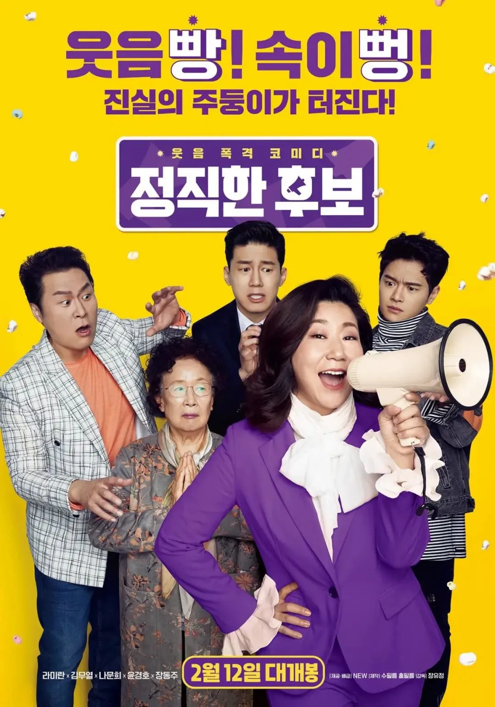

  

影片翻拍自2014年于巴西上映的同名电影。

  

顾名思义，片中的主角朱尚淑是一名国会议员候选人。

  

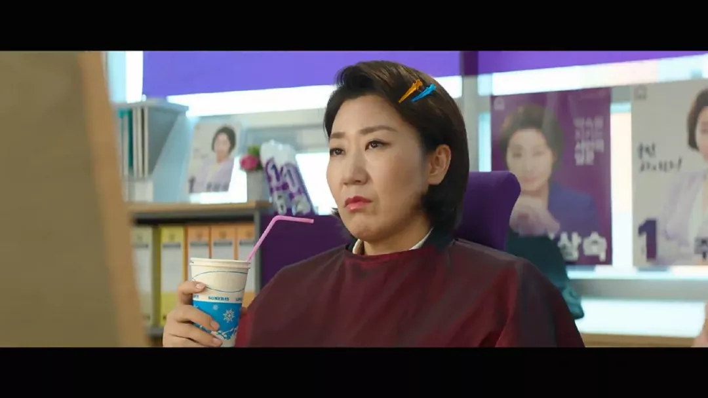

  

但在影片开头，她的行为可称不上“正直”，甚至可以说是又虚伪又缺德——

  

比如，为了博取同情票，就到处骗人说自己的奶奶早已去世；

  

  

比如，脚上的鞋看起来不太旧，就让辅佐官踩一踩，以显示自己俭省朴素；

  

  

为自己拉票的时候，看起来对待各行各业的民众很是亲热，实际上内心非常嫌弃；

  

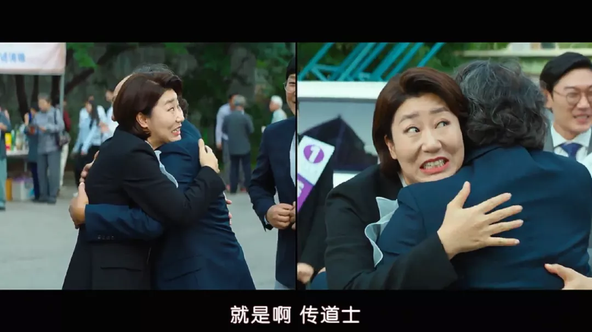

  

对外宣称自己住着20平方的老公寓，实际上每天半夜都偷偷溜进豪宅，享受菲佣的服务；

  

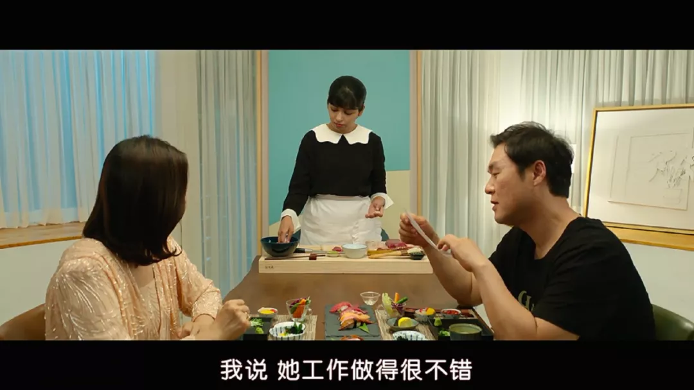

  

和其他候选人私下交易，表面上两人互揪痛处，实际上只是做做样子，议员具体谁来做早已“内定”；

  

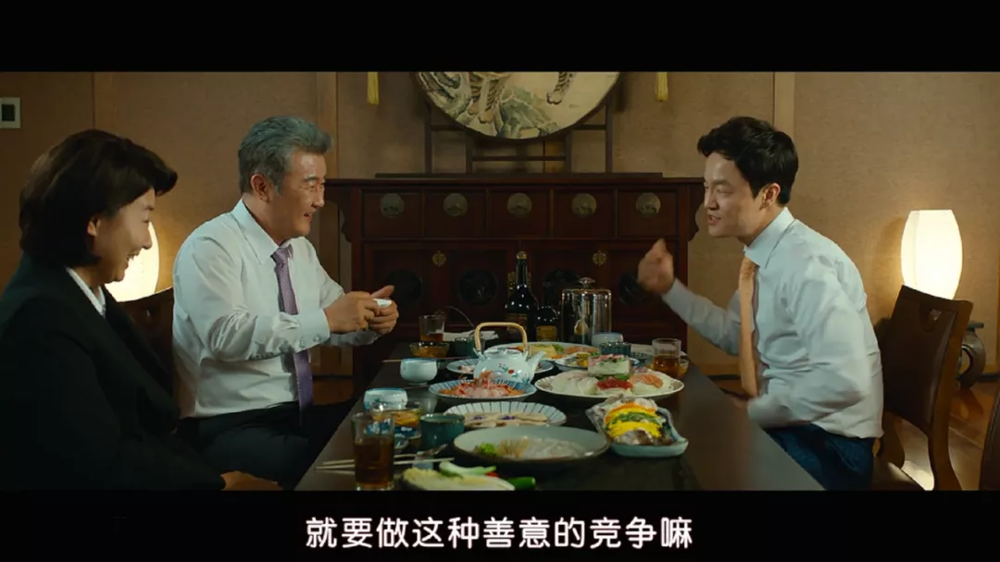

  

看似记得所有民众的苦恼，答应他们“只要当选就会改变现状”，但其实自己说过什么话全都得靠辅佐官提醒；

  

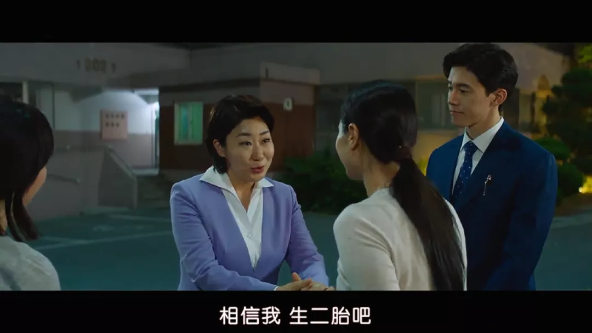

  

她甚至为了拉动羽毛球爱好协会会员的票数，强迫丈夫每晚都拿着羽毛球拍来配合自己做戏……

  

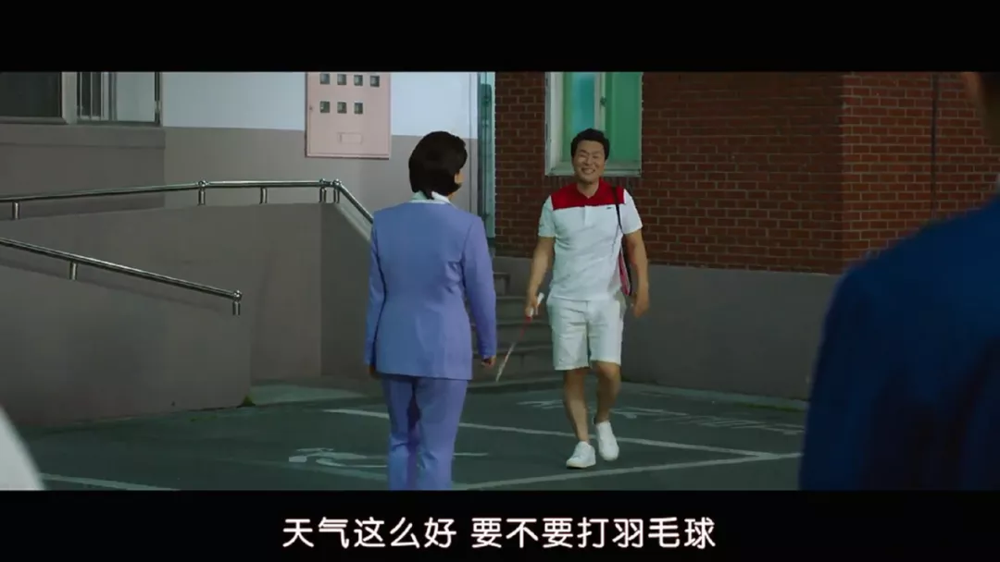

  

总之，朱尚淑是一名把“当面一套、背后一套”的原则贯彻到底的人，一切表面功夫都是为了拉票。

  

但普通民众并不知道她有两副面孔，还对她抱有极大的信心。

  

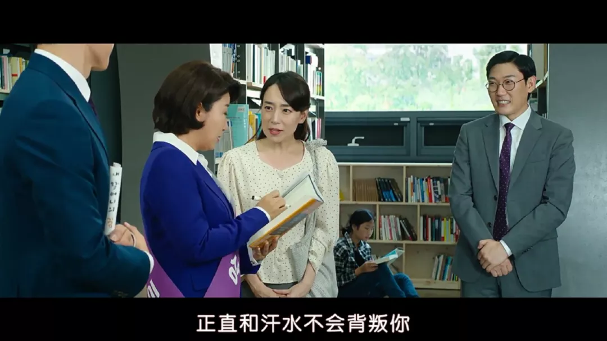

  

一直以来，朱尚淑就把百姓当傻子，只想着自己怎么做才能获利。

  

直到一个电闪雷鸣的雨夜，她偷偷去看望住在偏僻之地的奶奶，奶奶看到孙女现在这个自私又虚伪的模样，感到很痛心。

  

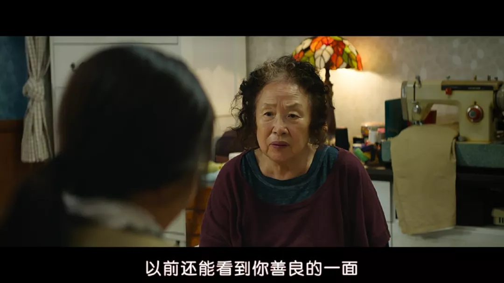

  

在朱尚淑走了之后，奶奶对着神明祈祷，祈祷孙女从此再也不会说谎，做一个正直善良的议员。

  

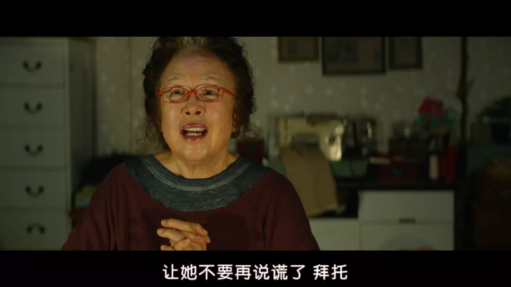

  

结果没想到，怪事发生了——第二天一早，朱尚淑居然真的不会说谎了。

  

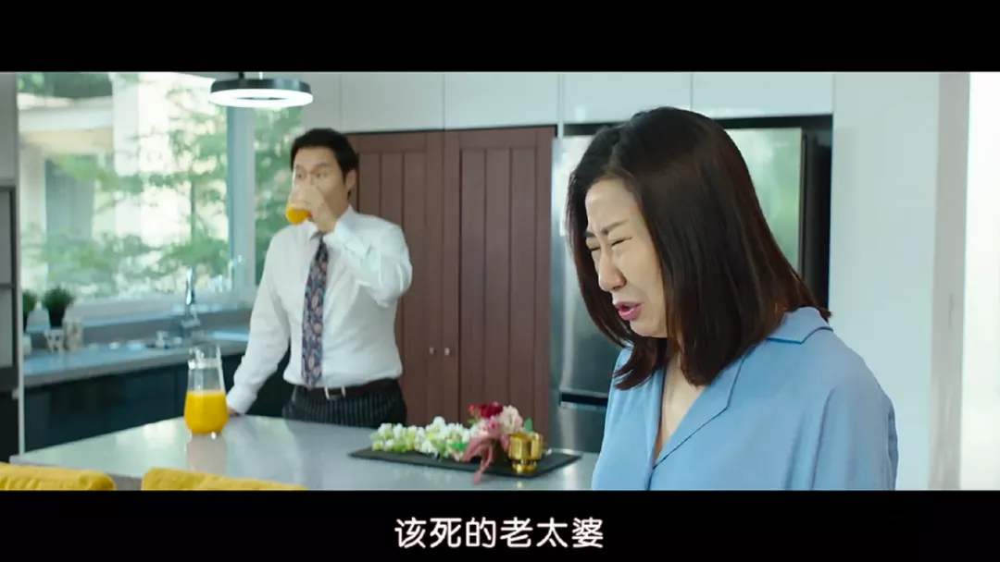

  

在家里，她不仅对着丈夫出言不逊，还大声说婆婆的坏话，这和从前表面功夫做足的她，简直判若两人。

  

等到上直播节目时，她又口无遮拦地开起了19禁玩笑，搞得观众纷纷以为她是喝了酒嗑了药。

  

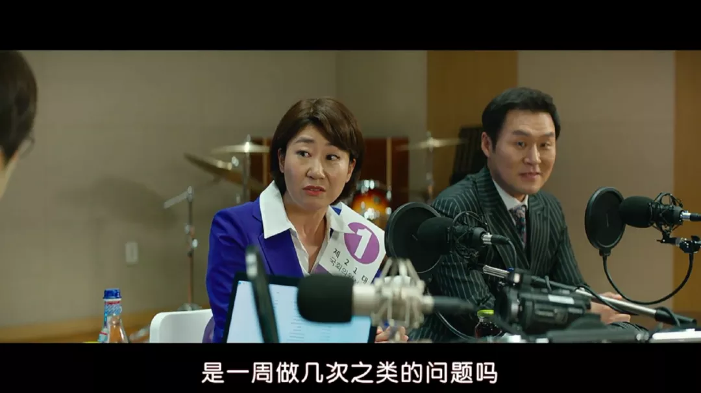

  

这还没完，后来在记者会上，她又坦言自己的自传其实是找代笔作家写的……

  

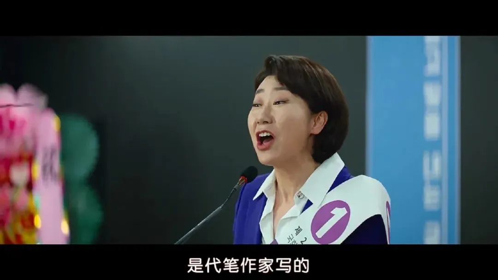

  

这一连串语不惊人死不休的操作，直接把她送上了热搜，人设崩得如此猝不及防，观众和记者们无不大感震惊。

  

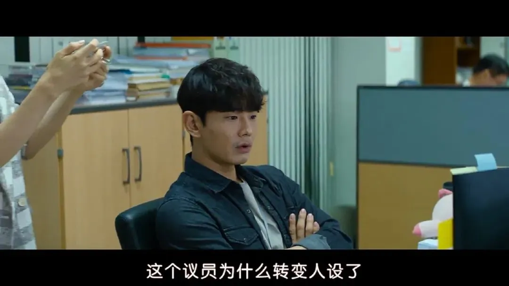

  

而另一边，朱尚淑自己也十分纳闷，她感觉那些真话好像是不受控制一样，自己往外蹦的。

  

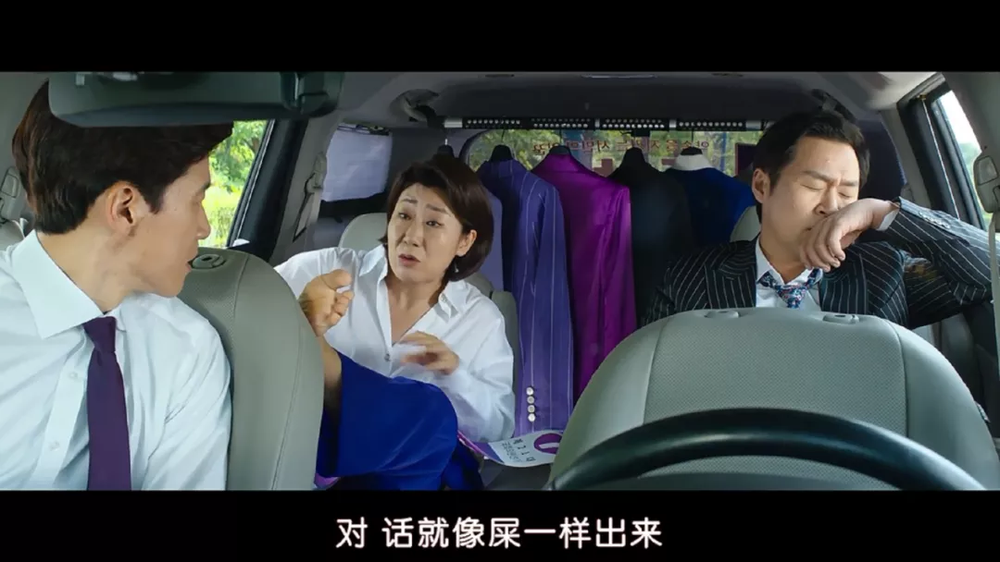

  

无奈之下，她先是偷偷去看了精神病医生，又在嘴部做了针灸，甚至还找来跳大神的给她“驱魔”，但无论哪路子的疗法，统统没用。

  

在往后的几天中，她依然“坚持”着只说真话的人设，有苦说不出。

  

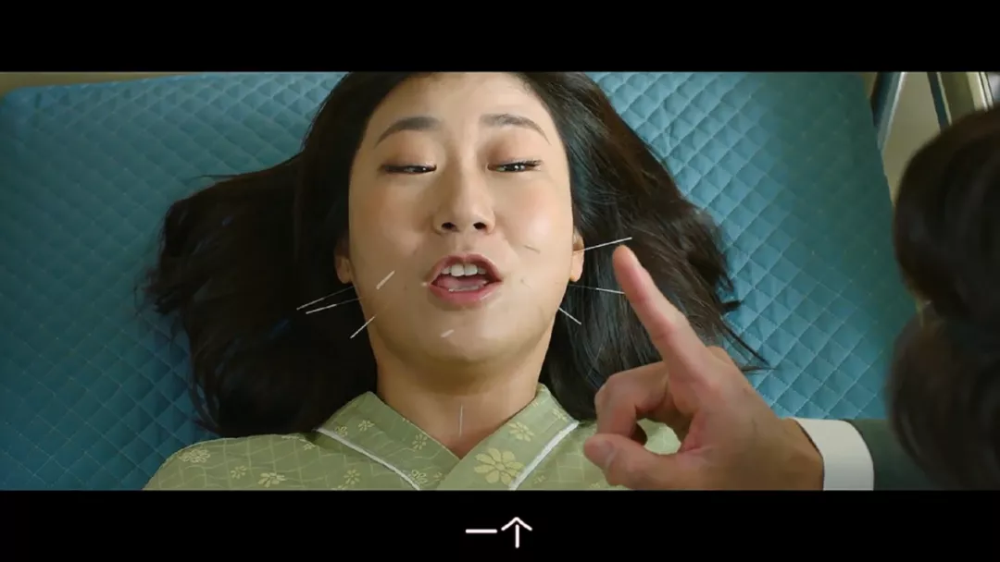

  

讲到这里，估计很多人发现了，影片的故事设定和金·凯瑞主演的喜剧《大话王》非常相似。

  

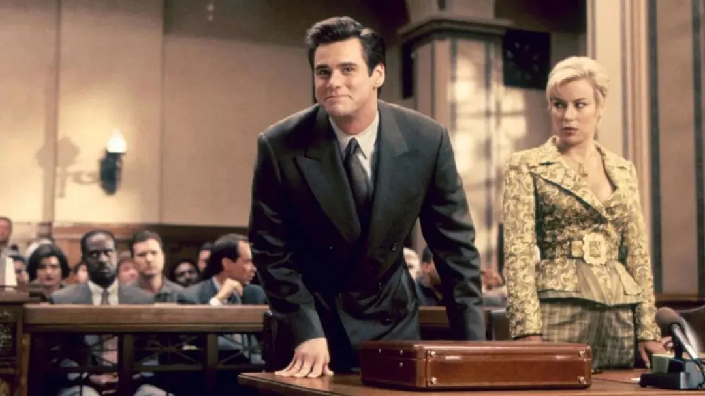

  

在那部电影中，金·凯瑞饰演的主角是个声名远播的律师，为了赢得官司，他谎话连篇，练就了一身颠倒黑白的本领，就连对待妻儿都是如此。

  

于是，对他失望不已的儿子，默默许下了希望父亲不再说谎的愿望，谁知这个愿望竟然成真了……

  

  

从剧情设定来看，这部《正直的候选人》几乎就是《大话王》的翻版。

  

但因为《正直的候选人》中主角的身份是政客，所以整体观感又带上了别样的色彩，反而会让人想到不久前刚跟大家聊过的日本喜剧《不存在于记忆中》。

  

那部电影讲的也是自私自利的政客，因为一个超现实事件而洗心革面，转变为真心为人民谋福祉的人民公仆的故事。

  

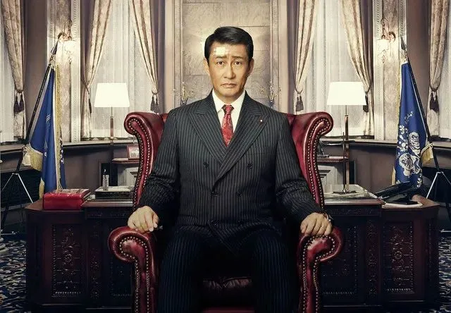

  

虽然题材不算新鲜，但影片还是因为主角“豹子女士”罗美兰的精彩演绎和不间断的笑点，在韩国一上映就夺得了周末票房冠军。

  

作为一部政治喜剧，《正直的候选人》有荒诞的设定和清奇的笑点，还对现实中一些大家心知肚明的现象进行了讽刺，很有一种黑色幽默的味道。

  

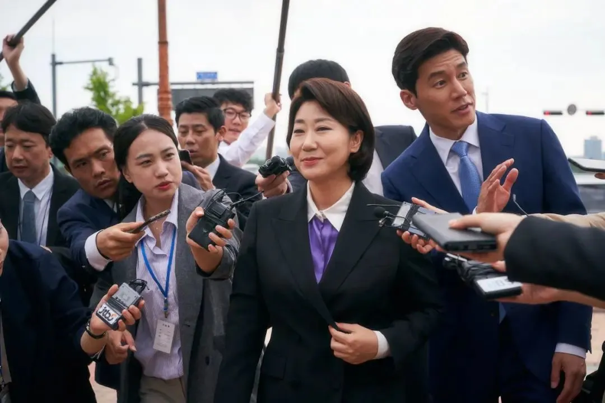

  

此外，影片还给观众抛出了这样一个值得深思的问题——没有谎言的世界就会变得更美好吗？

  

从片中的情节来看，答案明显是否定的。

  

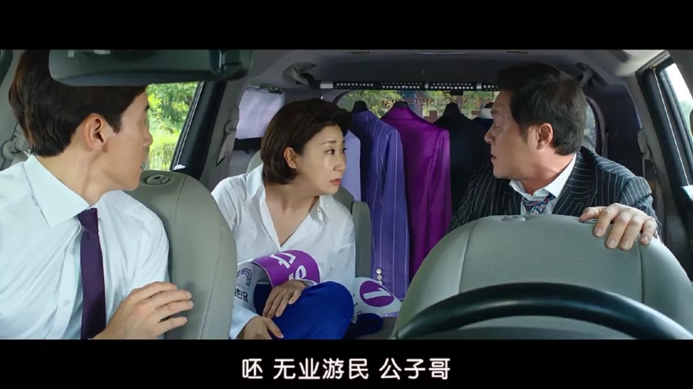

  

在不能说谎之后，朱尚淑跟丈夫和婆婆都发生了口角。

  

表面上看，这是因为她平时就对他们颇有微词，所以不能说谎之后，立刻就露出了真面目。

  

但这也从侧面反映了一个道理——我们生活的社会并不是非黑即白那样简单，一些善意的谎言对于人与人的和谐相处，是必不可少的。

  

不管是亲人、朋友还是恋人，试问谁能拍着胸脯保证，自己从未对他人产生过不满的情绪呢？

  

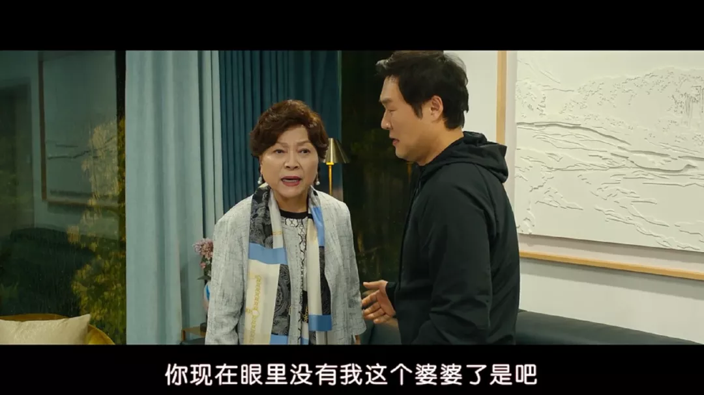

  

每个人都是不同的个体，当两个人在一起相处时，势必会发生一些摩擦。而这种摩擦如果不及时收住，就可能演变成冲突和暴力。

  

朱尚淑只能说真话后，之所以生活会忽然变得一塌糊涂，不仅仅是因为她虚假的伪装被拆穿、正直的人设崩了，更因为人与人之间那道出于尊重、关怀和包容的屏障，也崩了。

  

正是一些没有说出口的话与善意的谎言，才使得人与人之间的关系没有那么脆弱，得以继续维持下去。

  

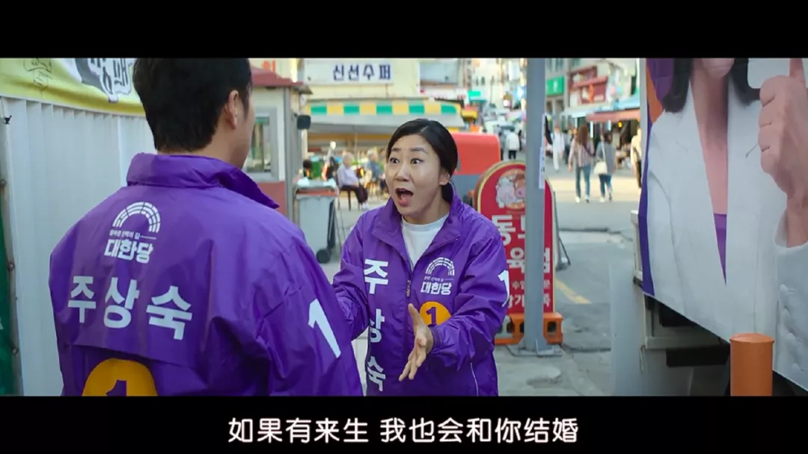

  

影片真正想要向观众传递的，其实是一种朴素的价值观，那就是做人要堂堂正正，不能以偷奸耍滑的心态去对待别人，不然最终害到的是自己。

  

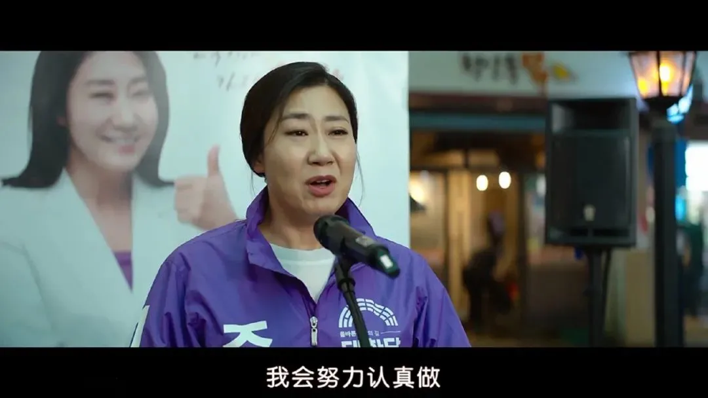

  

其实片中的朱尚淑，曾经也是一个正直又廉洁、敢于为弱小者出头的政客，还有着“国民汽水”的可爱称号。

  

一直努力维护穷人和弱势群体的利益，是她能赢得民心的关键。

  

但在政界待久了，她慢慢被环境所影响，变得伪善自私起来，凡事先考虑自己是否能得利，再也找不回自己做政治家的初心。

  

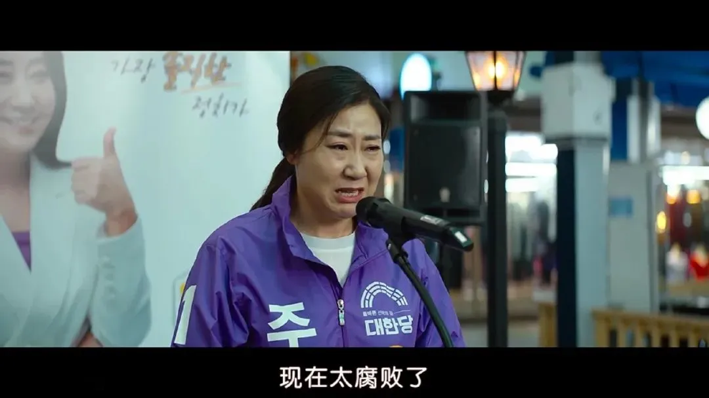

  

直到经历奶奶真的去世、腐败内幕曝光、支持者全部离她而去后，朱尚淑才幡然醒悟，发现自己已经偏离最初的期望太远了。

  

在影片结尾，她终于洗心革面，开始做一个敢于揭露腐败内幕的正直议员。

  

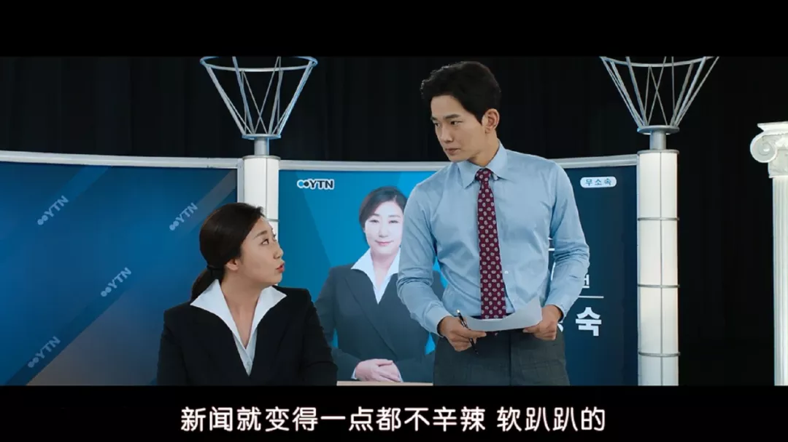

  

她的生活也由此迎来了翻天覆地的变化。

  

因为生活水准大不如前，丈夫和儿子怨声载道，反而一起向神明祈求朱尚淑能变回从前的模样……

  

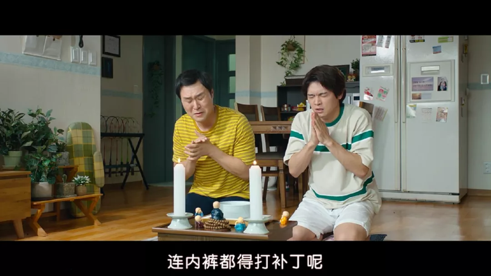

  

那么这次神明又将如何回应呢？

  

影片到这里就结束了，结尾只留下朱尚淑一抹意味深长的笑容。

  

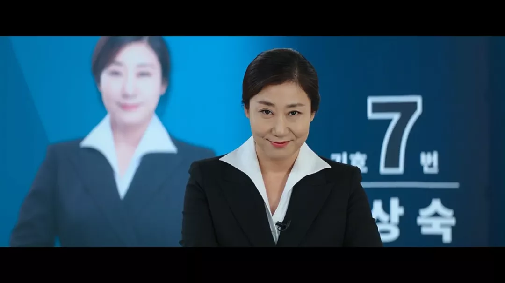

  

虽然影片并没有给出具体的交代，但我想，**如果一个人已经习惯了堂堂正正，说着不违心的话，感受着真实的快乐，用自己的坦诚和努力换取了别人的认可，那么再让她重新戴上面具、过回伪善的生活，恐怕并不容易。**

