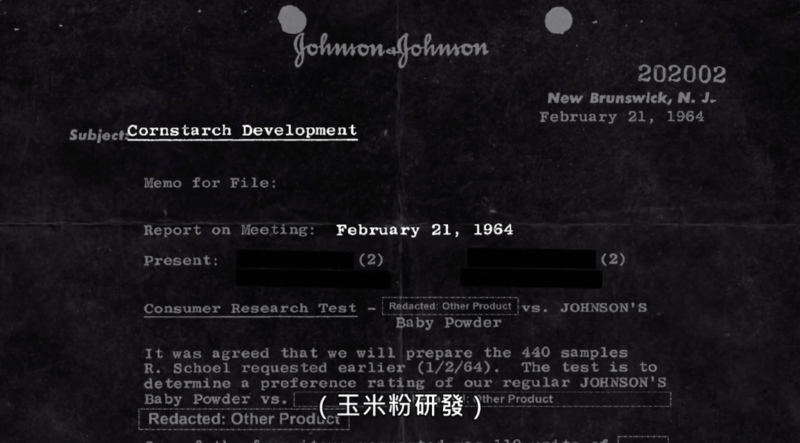
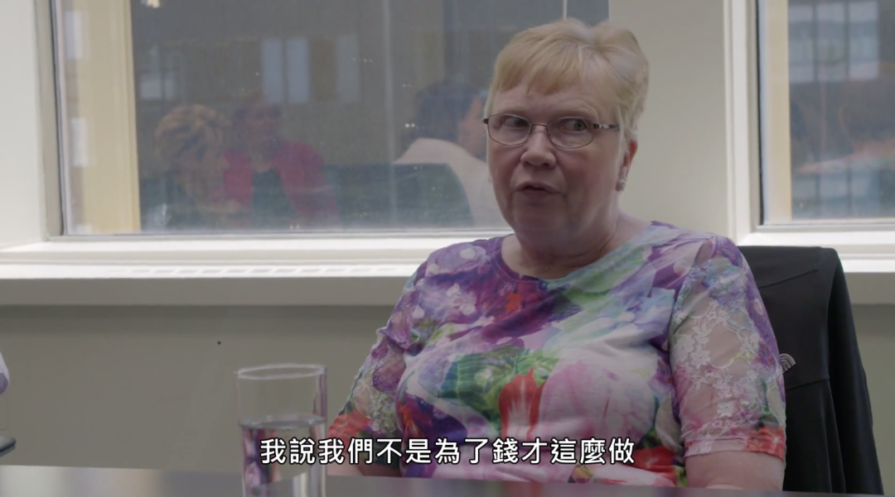

##  吓死我了，多种化妆品可以致癌，这才是真正的恐怖片

原创 有部电影 
爱美之心人皆有之，但人们对外在美的向往追求，也可能被金钱至上的无良奸商利用，转化成将你推向死亡的毒药。

今天要聊的一部消费题材纪录片，虽然在豆瓣冷门到没评分，但片中所揭露的真相却值得每个人警惕——**《毒美》。**

影片要从一起针对美国强生公司的集体诉讼说起。

诉讼原告是多位被诊断出卵巢癌的女性，她们中有的做过北约反间谍调查员，有的做过助理医师，但大多数是普通职业女性或家庭主妇。

在刚开始被告知病情时，许多人都感到震惊和无所适从，甚至第一反应是质疑自己：我到底哪里做错了？

其中最具代表性的，是一位名叫蒂安柏格的助理医师。

时年49岁的她，发现自己每次经期前都有少量出血，心中感觉不对劲，便去妇科做检查。结果证实患上卵巢癌，需要立即开始做化疗。

于是蒂安柏格开始查阅各种资料，想要找出患病原因及治疗方法。

在排除了癌症家族病史、过度肥胖、长期服药等因素后，她发现唯一可能导致自己发病的根源，竟是每天使用的爽身粉。

但问题在于，强生爽身粉的产品包装上，并没有任何致癌说明或警示。

这就让许多人在不知情的情况下，连续多年使用这款产品，却从未想过会有任何危险。

而前文提到的女性原告，也确实都是强生爽身粉的使用者。

就像广告中说的，她们为了让自己或家人感觉到清新舒爽，不光在洗澡后会使用爽身粉，还会把它当体香剂洒在床上、鞋上。

然而，经过国际癌症中心的研究，证实强生爽身粉中含有一种名为硅酸镁的矿物质，也就是滑石粉，会导致罹患卵巢癌的几率上升。

滑石经常与其他矿物质混合在一起，比如石棉、重金属、二氧化矽，同属于致癌物质的它们，无疑更会增加患病隐患。

得知这些后，蒂安柏格一边在卵巢癌研究联盟网站上，呼吁大家对滑石粉提高警觉；一边在委托律师的帮助下，向强生公司发起诉讼。

结果没想到，在搜集其他州的相关案件时，律师发现了一个难以置信的事实——

原来早在上世纪五六十年代，强生就已经察觉到滑石粉的危险性，并为此寻找它的替代品。但他们没有将此事告知大众，而是动用企业势力去规避法律责任。

比如跟食品药物监管局的人进行协商，说服对方不要对他们的产品进行管控。

比如找相关领域的科学家为企业背书，极力否认滑石粉与卵巢癌的因果关系。

美国妇科生殖学家丹尼尔·克雷莫博士，也是流行病学的祖师爷级专家，曾因为在80年代发表滑石粉与卵巢癌相关的研究报告，受到了强生公司的关注与接触。

他不仅没有理睬对方的洗白谬论，还在杂志上发表文章，呼吁医生主动将滑石的危害性告知病患。

如今，克雷莫博士也参与了这场集体诉讼，不断为其提供医学证据作为支持。

在种种铁证的面前，强生公司向蒂安柏格提出庭外和解，以130万美元作为赔偿金和封口费，但拒绝在爽身粉包装上添加警示语。

显而易见，这种和解方式违背了蒂安柏格的起诉初衷——不让更多女性沦为滑石粉的受害者。于是她果断回绝了强生。

在接下来的开庭中，强生公司派出了强大律师团，并找来医生试图反驳致癌证词。

但真相不容狡辩，经过陪审团的一致通过，法庭最终宣判强生公司罪名成立。

在这场胜诉的鼓舞与启发下，越来越多受害者懂得拿起法律武器，向无良企业讨回公道。

但与此同时，强生公司仍然不知悔改。

他们一边在爽身粉诉讼中连续败北，面临几十亿美元的赔偿金；一边却加大危机公关力度，坚称旗下产品不含致癌物质。

相信看到这里，对于强生公司的脑回路，你们一定感到匪夷所思。

但实际上，像这样的骚操作在美妆产业并非孤例，像滑石粉一样隐藏在产品中的有毒物质也比比皆是。

值得警惕的是，深受其害的不仅有成年消费者，更包括处在发育关键期的婴幼儿及孕育中的胎儿——

比如洗发精中的甲醛，可能引发过敏、情绪抑郁，甚至是癌症；

口红中的铅、煤焦油，会导致肾功能衰竭、流产、神经损害；

体香剂中的甲醛，对生育能力存在影响，也会引发肿瘤；

润肤霜中的汞、煤焦油，可能引发颤抖、失眠、认知功能障碍；

美甲产品中的甲苯、丙酮，会引发皮肤病、肺部疾病、流产；

牙膏中的三氯生、砷，可能导致细胞异常发展、生殖毒性；

香皂中的煤焦油、1,4-二氧六环，会引发过敏、不孕、心脏疾病；

美白产品中的对苯二酚、汞，会引发皮肤疾病、器官损伤、癌症；

香水中的未公开有毒化学物质，可能造成过敏、生育障碍、癌症……

现状之所以如此触目惊心，一方面是因为美妆企业的无良逐利，另一方面则跟政府的法律不完善、监管不到位，存在很大的关系。

早在1933年，就有位美国科学家揭露当时热销的一种美睫产品，含有某种柏油燃料，可能导致使用者的眼球外膜烧伤以致失明。

到了1938年，为保障消费者权益不受美容商品中的有毒物质伤害，罗斯福总统通过了一项化妆品法案，并要求报纸以头条刊载告知所有国民。

但从上世纪30年代到今天，美国政府对美妆产业的管理制度，再没有发生过改变。

直观地说，这个国家的美妆产业价值高达840亿美元，但针对该产业的法律管理规章，却仅有一页半纸之多。

这并不是说立法机构成员不够努力，而是每当有议会代表推动更严格的约束法规出台时，美妆产业就会拿出自主管理机制来搪塞，比如公开产品成分、邀请科学家做顾问、组成智库等等。

这种自导自演的管理机制显然毫无约束力，室内日光浴协会难道会提出“紫外线是否导致皮肤癌”的质疑吗？

除了缺乏严格有效的法律法规依据，本该行使行政监管权的食物药品监督局，还采取所谓的“上市后约束体制”。

也就是说，这些美妆产品不必经过检测、确保安全无虞，而是可以直接先上市，直到出现问题再启动管制。

即使企业将产品成分公开在包装上，也没有专门的人员去测验和确认这些数据是否属实。

这就导致人们往往在不知情的情况下，被暴露在成千上万种存在致病隐患的化学物质中。

片中有位名叫咪咪的亚裔受访者，即将在波士顿大学就读医学系。

由于从小被灌输化妆品和保养品是生活必需品，咪咪对自己的外观很不自信，日常生活就离不开化妆。

但没想到，年仅24岁的她有一天忽然被诊断出良性乳腺肿瘤，不得不接受手术，在胸部留下了很大的疤痕。

经过这段经历后，咪咪发现许多年轻女性都罹患乳腺癌，而且在她们的肿瘤中，都检测出了美妆化学成分的存在。

这件事让她深受触动，于是她在自己身上进行了一场实验——

通过定期停用所有美妆、护肤等日常保养品，进行分时段尿检，来检测体内的防腐剂、塑化剂等有害物质的数值。

结果发现，正常使用产品时，她体内含有的邻苯二甲酸酯，也就是我们常说的塑化剂，远远超过美国人的平均值。

为此，咪咪一度陷入了自我怀疑。

她既不知道这些塑化剂将会对自己的身体产生怎样的影响，也不知道如何弥补已经造成的伤害，甚至担心继续使用会导致自己癌症复发或失去生育能力。

**难道从此就只能与化妆断舍离了吗？**

