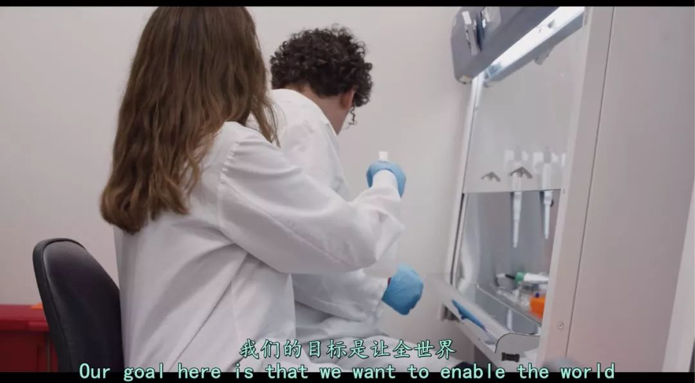

#  大预言家？疫情的事都让美国纪录片说中了

原创 有部电影 
对于大多数小伙伴来说，今年春节过得很不容易。

无论是人在湖北及其他疫情重灾区，还是全副武装往返于家乡和上班地；无论是奋战在第一线的医护工作者，还是自觉自律做好隔离的普通人。

我相信，只要每个人都为此付出努力，我们必定能度过这道难关。

但我们需要铭记的，绝不仅是举国上下共克时艰的感人瞬间，更该是这场灾难留下的惨痛教训。

最近，网飞推出了一部特别应景的纪录片，讲的是各行各业为阻击下一场全球流行病爆发，所做出的准备与努力——*《流行病：如何预防流感大爆发》。

这部纪录片一共六集，每集片长不到一小时，上线没多久就在豆瓣拿到8分好评。

这不仅是因为时机特殊，国内观众格外关注，更重要的是，它分别通过流行病专家、公立医院医生、疫苗研发公司、医疗志愿者，甚至包括反疫苗运动者等众多不同视角，揭示了人类所面临的危机与错误认知，在今天看来格外耐人寻味。

比如人们最危险的认知误区之一，就是把流行性流感与季节性流感弄混。

其中，季节性流感是由甲、乙、丙三种流感病毒引发的常见急性呼吸道疾病，冬春季节多发，人体在感染病毒或接种疫苗后会具有免疫力。

而流行性流感，则很可能来自于动物，并且是前所未见的新型病毒，比如我们熟悉的猪流感、禽流感等等。

人类对其没有天然免疫力，也缺乏有效的治疗性干预措施，很容易在感染后面临致命危险。

更可怕的是，由于病毒会变异，人类历史上每隔一段时间，就会出现威胁到物种生存的新流感变种。

比如1918年一战末期，士兵们从战场返回家乡的同时，就将一种流感病毒带到了世界各地，导致全球疫情迅速爆发。

在18个月内，死于这种流感病毒的人数多达五千万到一亿，超过了两次世界大战的死亡人数总和，占全球人口的1/18。

这场疫情被人们称为“西班牙流行性感冒”，是人类历史上第二致命的传染病，造成了当时各国参战兵力锐减，迫使第一次世界大战提早结束。

而如今，全球人口已经达到78亿，人口流动性不可同日而语，倘若再出现类似的病毒疫情，死亡人数将更加不可想象。

除此之外，这类疫情还会威胁到公共医疗服务、基础社会运作、食品市场供应等社会发展的方方面面，甚至引发地区暴乱，造成疫情外伤亡。

那么，就像片名所说的，如何才能预防流感病毒的大爆发呢？

这无疑是一件需要政府、医疗从业者和普通大众通力合作才能胜任的事情。

首先，控制疫情的关键在于变被动为主动，也就是在疫情爆发之前发现病毒，并将其扼杀在摇篮里。

美国国际开发署新兴威胁部门总监丹尼斯，就一直致力于通过联合国粮农组织，对全球家禽家畜的临床现象进行监控。

除了与人们接触密切的家禽家畜外，片中也特别关注到了堪称“病毒存储器”的动物——蝙蝠。

诸如埃博拉、非典、中东呼吸综合征等令人闻之色变的传染病，几乎都与蝙蝠脱不了干系。

为此，远在黎巴嫩的加兹卡亚力博士，曾带领团队走遍中东，并从埃及果蝠身上发现了新的流感亚种。

在他看来，通过发现和了解病毒的来源，抢在它们变异前进行研究预测，就有机会打破病毒从动物到人的传播渠道。

不过，光是监测野生动物和家畜还不够，一旦有重大的流感爆发，就需要医护人员迅速启动疫情防控应急预案，做到准确的隔离治疗。

片中展示了美国最大的市政医疗服务提供系统——纽约市健康医疗公司，如何通过培训及模拟演练，来确保各大医院为应对疫情做好准备。

比如，他们会总结中东呼吸综合征和非典留下的经验，督促医护人员在抢救诊治病人前做好自我防护，避免院内感染的大量出现；

比如，他们会定期针对季节性流感召开电话会议，请医院负责人上报病例及所受影响，并启动相关的紧急行动中心，保障医疗资源的合理分配；

当然，时刻关注着全球疫情现象，也是他们的工作之一。

因为在当今的世界，最偏远的病毒感染，距离美国也不过是一趟航班的距离。

这些日常的防控和培训活动需要资金支持，而特朗普总统却在不断削减卫生及公共服务的预算，其中单是疾控中心就被削减20%。

这让纽约市健康医疗公司的赛拉·幕达德医生，不得不到处游说争取资金，来支撑疫情防控培训工作的展开。

同样受到预算危机影响的，还有美国280家地处偏远的乡村县医院，由于缺少政府拨款，它们债台高筑，甚至面临关门的风险。

这些医院原本承担着70万人次的就诊量，一旦被迫停止运营，将导致大量居民无法及时看病，更会增加疫情隐患。

除了这些政府机构及公共医疗单位外，还有一家分布式生物技术公司，正在研发一种能够根除流感的通用疫苗，并获得了盖茨基金会的支持。

根据创始人及首席科学官杰克·格兰维尔所说，这种疫苗通过调教身体免疫系统，使其对不同病毒产生应答机制，来达到长期保护的效果。

目前他们所研发的疫苗已经在动物实验中取得效果，接下来还将继续改进、缩短接种次数，有望在2025年正式推出市场。

总体来说，这部《流行病：如何预防流感大爆发》采用了多视角、分章节的架构叙事，展现了美国、印度、黎巴嫩等国家的医疗机构及相关研究者，以及世界卫生组织的医护人员，为阻止流行病爆发，所做出的诸多预警与努力。

可惜的是，片中虽多次提到中国是疫情多发地，却没有对国内案例进行重点讨论。

但即便如此，片中仍有太多值得我们关注和反思的地方。

一方面，影片在科普流感病毒及疫情的同时，不忘聚焦那些奋战在医疗前线的白衣天使，让观众看到他们负重前行的身影。

比如美国杰佛逊县医院的唯一医生霍莉·戈拉克，由于长期处于高强度工作和72小时值班制，不得不和丈夫搬到值班室里居住。

这种压力山大的生活状态，最终导致她被季节性流感击倒，只能搬回城市，从此从事家庭诊所工作。

比如在印度遭遇H1N1袭击时，胸腔内科医生迪內什·维杰，每天都要在有限的医疗资源下，与流感病毒展开疯狂的战斗。

由于许多病患来自医疗落后的乡下，发病时并未得到诊治，甚至以为吃点蜂蜜、柠檬、姜黄就能药到病除，结果迅速发展成重症。

这让他不得不保持24小时开机，时刻将重症病患放在首位，遭到家人的埋怨。

另一方面，影片还揭示了人们出于无知而鼓吹谣言、攻击医护人员，最终在病毒来袭时一败涂地的情形。

比如，美国俄勒冈州的一些反疫苗运动者，宣称政府向孩子注射的疫苗是有毒物质，会引发各种后遗症及自闭症，并向支持疫苗的立法议员发出死亡威胁。

他们长期集会、抗议、游行，当地政府碍于舆论，被迫搁置了强制疫苗接种法案。

正是因为此举，导致早在2000年就已根除的麻疹病毒，又于2019年卷土重来，在美国引发了严重疫情。

这也是为什么，世界卫生组织会将“拒绝接种疫苗”列为“世界十大健康威胁之一”。有时候，比病毒更可怕的是无知，贪婪和自私。

像片中这样散播错误观念、阻碍疫情控制，甚至攻击医护人员的行为，在咱们国内也不算罕见。

正因为总有这样的魔幻新闻上演，我在刷微博刷到心梗之余，才想到要把这部具有科普价值的纪录片分享给大家。

**如同片中最后一集所说，疫情防控关乎全球七十多亿人的福祉，不光是一线奋战的医疗工作者，政策的制定者和规划者、全球的卫生领袖更应该严肃思考这个任重道远的问题。**

**只有在平日里居安思危，未雨绸缪地做好应对准备，我们才能真正赢得这场与病毒的战争。**

