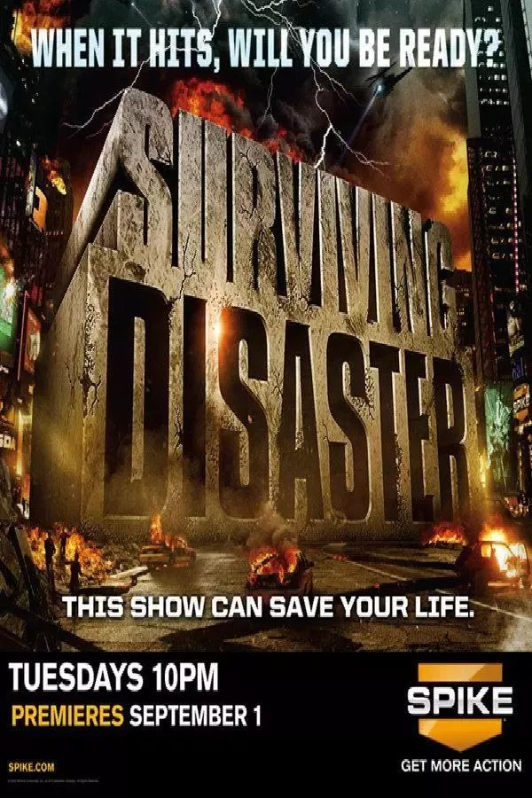
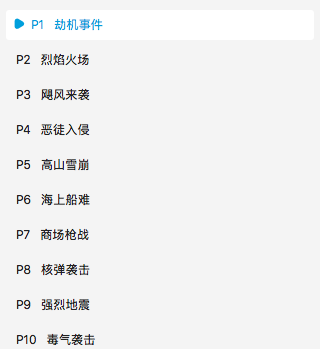
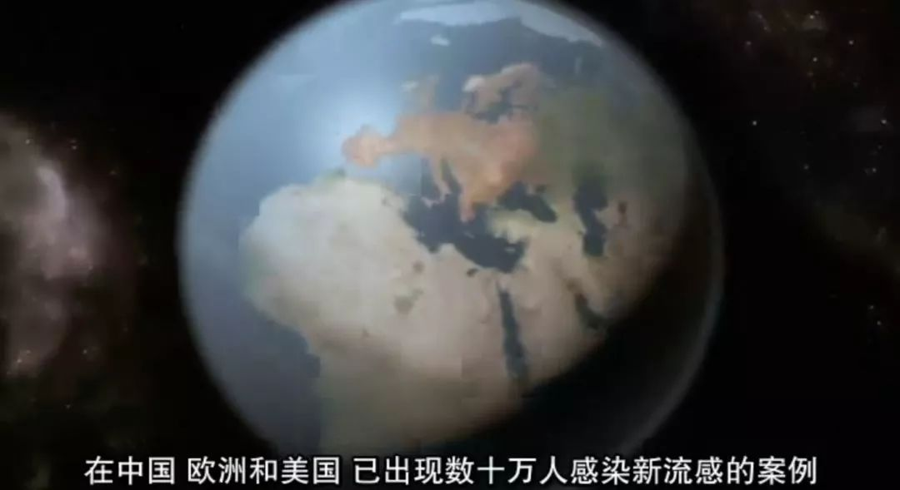

#  豆瓣9.4，灾难来临时，这片子也许能救你的命

原创 有部电影 [有部电影]()**
我们常说“新的一年是新的开始”，但2020初来乍到，就已经成功让全球人民都想把它手动重启。

除了国内的新冠疫情，还有澳大利亚山火、东非蝗灾、美国乙型流感、巴西“雅拉病毒”，以及尼日利亚爆发的不明致命疾病等等，各种天灾人祸同时上演……

东非蝗灾目前已蔓延到了亚洲

可以说，2020年才用了不到俩月时间，就证明了2019年是个弟弟。

但越是在这种时候，我们越应该意识到，人的生命既宝贵又脆弱。

很多人都说，疫情结束之后，家里一定会常年备好口罩、酒精、消毒水，不像这次一样在灾难面前表现得手足无措。

所以今天，我打算和大家推荐一部美国探索频道推出的系列教学纪录片——**《浩劫求生》。**

这部纪录片一共10集，每集以一种灾难为主题，教授求生技能。

尽管豆瓣上看过的人不算多，但评分高达9.4，评论区里也是一水儿的五星好评。

这一来是因为片中采用模拟真实生活情景的方式，并请到前海豹突击队员凯德·科特立做讲解演示，全程干货，内容非常实用。

二来是片中所讲到的地震、瘟疫、火灾、劫机、恶徒入侵等等天灾人祸，在我们的生活中确实称得上触手可及。

尤其是讲述“全球传染病大爆发”的第十集，特别适合这个时候拿出来看看。

在这一集中，纪录片设定的情况是全球爆发了一种新型致命流感，三周内造成数十万人感染、数千人死亡。各国政府下令取消公开活动，并要求大家待在家里自我隔离。

这时我们的首要工作，就是确保物资充足。

由于传染病爆发时会造成食品供应短缺，疫苗研制又需要四到六个月时间，我们在进入隔离状态前，应该储备相应量的食物补给。

在极端情况下，如果超市里的生鲜被抢光，也不要过度慌张。只要屯够含有蛋白质、油脂和碳水化合物的食物，例如大米、肉类罐头、植物油等，便可以满足人体所需，安然度过这段时间。

为了必要时采取进一步的自我隔离，我们还需要采购口罩、手电筒、电池、垃圾袋、雨衣、胶带、保鲜膜等物品。

如果超市、药店的医用口罩售罄，可以去五金店购买，那些用来阻绝漆料气体的防护口罩，同样可以阻断流感和细菌粒子。

但在采购过程中要注意，病毒通常以三种方式传播：接触、飞沫和空气传播。

所以在接触物品前，要尽量做好隔离或清洁，不要用手触摸眼睛和口鼻；尽量避免与他人靠近或交谈，因为每谈话五秒钟，就会接触到三千个飞沫粒子，每打出一个喷嚏，更会将十万飞沫粒子推入空气中。

而采购回来后不仅要及时洗手，条件允许时还可将所有物品放到阳光下暴晒，借助紫外线来破坏病毒的DNA，起到杀毒作用。

倘若其间有家人可能接触到病毒，即便尚未出现感染症状，也仍需与其保持距离。

这时我们可以制造一间“负压病房”，将疑似感染者与其他人隔离开——

首先用胶带将一间卧室的窗户、空调管路密封住，并将抽风扇固定在窗户上，确保空气只能由室内流向室外；

随后用塑料布制作半密封门帘，这样既方便进入病房看护病人，又可防止病毒在开门时一起流出。

而负责进出病房照顾感染者的人选，本身不能患有慢性病或免疫系统疾病，最好近期内注射过流感疫苗。

在进入病房前，还要穿上长衣长裤，用雨衣、口罩、浴帽等物品做好防护，不要将任何身体部位暴露在外。

在隔离过程中，如果我们无法取得抗病毒药物，病人又开始出现发烧等感染症状，就给他服用布洛芬退热镇痛，并喂水喂食确保免疫系统的运作。

不过话说回来，在这样的极端情境中，我们也只能尽最大的努力求生。万一病人症状恶化没能幸存，我们则需要用塑料膜包裹好遗体，并尽快将其送去殡葬或掩埋。

整体来看，这部《浩劫求生》虽然根据美国国情拍摄，有一些情节在国内不太适用，比如遇上劫机要临时学开飞机、遇上商场枪战可以拿AK47对干之类的……但作为一部灾难教学纪录片，它的场景模拟细致逼真、求生干货硬核实用，许多网友都是一边看得心惊胆战，一边还不忘掏出小本本做笔记。

比如讲述高层火灾的第二集，内容也是既实用又刺激。

由于高层建筑一旦发生火灾，蔓延极快，最初几分钟的反应，往往就是求生关键。所以我们要把所有警报都当成真实情况，立刻拨打火警电话，并按照安保人员的指挥从疏散梯逃生。

但要注意的是，疏散梯虽然有加压处理，防止浓烟进入，却未必能够抵挡爆炸。

如果其中有一层楼的消防门炸开并截断出口，我们就要赶紧爬回到火灾楼层的上方，并尽快离开楼梯间，避免被其他人群踩踏或推回浓烟中。

离开疏散梯并不代表暂时安全，因为高层建筑的大火和浓烟，会通过中央空调管道四处蔓延，甚至引发更危险的爆炸。

这时我们需要一边寻找其他疏散梯，一边在逃生过程中收集应急物品，比如瓶装水、记号笔、照明工具等等。

如果途中需要穿越危险的高温环境，切记摘掉一切导热的金属物品，并将衣物、头发浸湿，遮住裸露皮肤及口鼻；如果遇到浓烟，则要弯腰贴近地面爬行。

如果途中需要穿越房间，记得不要轻易推门，而是先用手背沿Z字形测试温度，确保安全后再用脚抵住门，慢慢拉开把手，以免发生爆炸。

如果绕了一大圈后发现，第二个疏散通道也被烧着截断，而消防车虽然及时赶到，却无法抵达我们所在楼层（大多数云梯只能到30米左右），那些此时最好的办法就是砸碎大楼玻璃，并通过绳索或用六根网线拧结成绳，依照下图缠绕在腰部和腿部，慢慢垂降到合适楼层。

最后用手电筒提示楼下的消防员，准备好云梯或者紧急气囊。倘若迫不得已需要用到气囊，则双腿伸向前方、背跟屁股朝下，直接跳进去便可逃生。

其实说到灾难求生的题材，许多外国纪实频道都拍摄过类似作品，指导大家如何应对生活中的各种危险状况。

比如美国国家地理频道推出过一档真人秀节目《末日生存者》，详述了数十个美国家庭为重大灾难所做的准备，并邀请生存专家给出评估和建议。

英国BBC频道播出过一部纪录片《如何在车祸中生存》，通过前沿技术，对车祸的发生及救护措施进行分析研究。

还比如美国探索频道的《日常生存自救手册》，邀请贝尔来讲述各种日常危急状况的正确应对方法，比如刹车失灵、汽车落水、电梯失控等等。

但相比上面提到的这些，《浩劫求生》不仅更加硬核逼真，针对的是生活中最极端、最致命的危急情况，更难得的是，它还找来各种专业人士和灾难幸存者，给观众提供实战中的求生经验，绝对堪称真·救命片。

尽管很多灾难发生在我们身上的概率不大，这些技能和经验只有在最危急时才用得上，可一旦发生了，就是百分之百。

人们经常说，明天和意外不知道哪个先来。灾难之所以让人感到恐慌，很大程度上便在于它的不可预见。而在遇到诸如地震、火灾或飞机失事等各种突如其来的天灾人祸时，可能一个下意识的行为，就决定了你是生是死。

**这部《浩劫求生》通过模拟现场和讲述各种求生技能，其实是让你学会在日常生活中就培养可能救你一命的下意识。****正如主持人在每集片头所说，“要成为存活者还是统计数据，选择权在你”。**

**我们只有平日里作最坏的打算，在关键时刻尽最大的努力，才能在灾难面前真正做到有备而来。**

