#  深海版《异形》，全程紧张到窒息

原创 有部电影 [有部电影]()**
开门见山，今天来讲一部号称“深海版《异形》”的高能惊悚片——**《深海异兽》。**

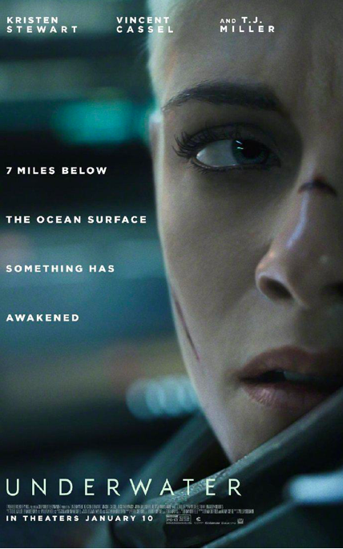

这是20世纪福斯在被迪士尼收购前，发行的最后一部电影。由于收购事件，影片的上线日期一再跳票，可谓千呼万唤始出来。

不过，大多数国内影迷关注到这部电影，还是因为主演克里斯汀·斯图尔特。

虽然直到如今，很多人一想到她，脱口而出的还是“暮光女”，但其实这些年来她尝试过的角色类型不在少数，选片也基本是商业、文艺两手抓。

既有和伍迪·艾伦、李安等名导的合作，也有诸如《霹雳娇娃》一类的纯爆米花商业片。

《咖啡公社》

而今天要聊的这部怪兽惊悚片，则是她又一次突破形象的转型之作。

片中的故事，起源于马里亚纳海沟的钻井站“开普勒”经历的一次海底地震。

女主诺拉，是钻井站内的一名机械工程师。

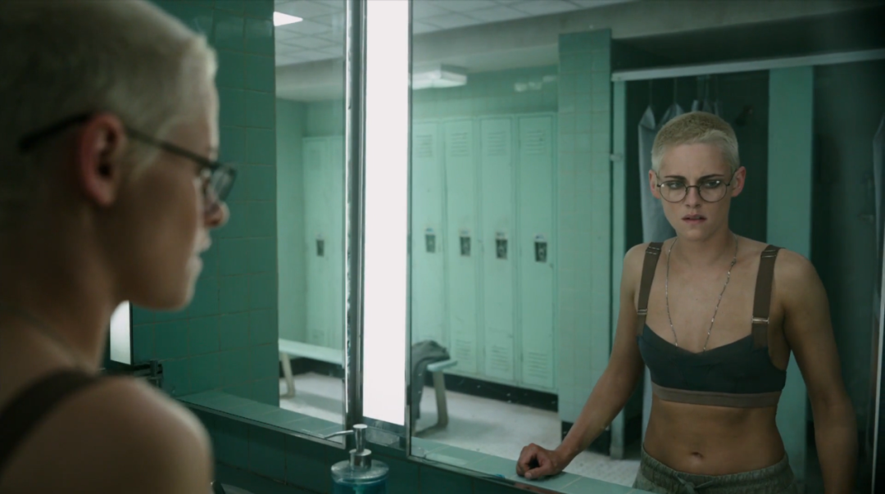

影片开场就通过她的独白，给观众讲述了长期在深海环境工作是怎样一种状态——

因为常年不见阳光，你会渐渐失去时间的概念；因为四周都是混沌黑暗，你会失去方向感；因为与世隔绝，免不了感到孤独抑郁……

然而就在这种语调平静的讲述中，海震灾难突然爆发，基地建筑瞬间崩塌，水流以排山倒海的气势涌入，并频频引发爆炸。

在一片混乱之中，诺拉经过艰难的自救和搜索，最终和另外5名幸存者汇合，其中包括文森特·卡索饰演的队长老卢。

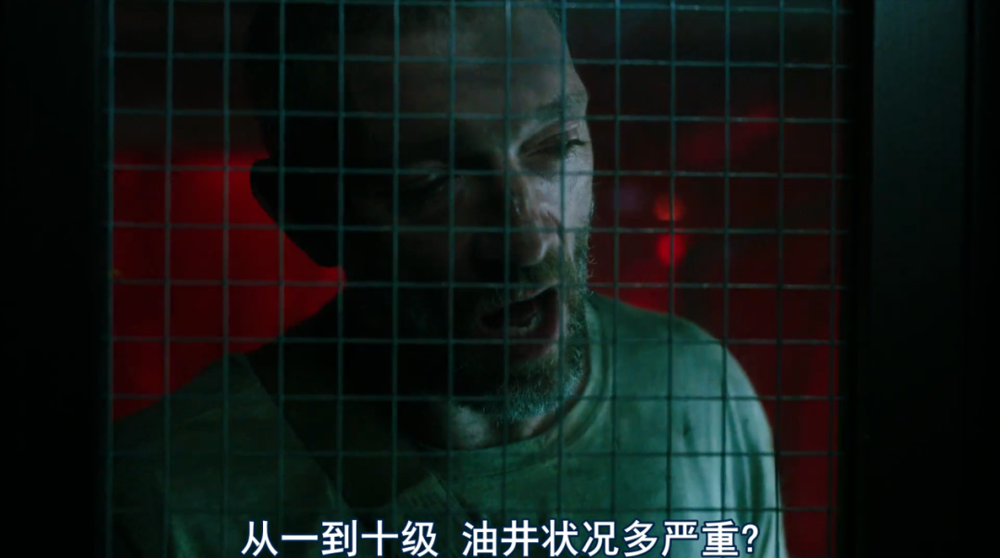
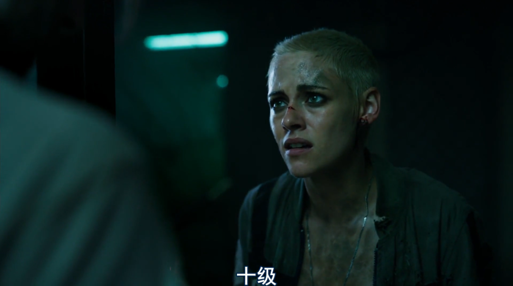

几个人迅速得出结论——必须尽快离开“开普勒”站。

这里的冷却塔已经失效，如果大家想要活命，就必须在核心熔毁、引发爆炸前回到海面。

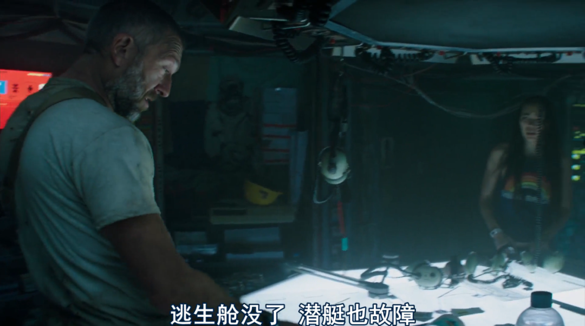

但站内的潜艇和逃生舱都已被海震摧毁，怎么办呢？

队长想到了一个万不得已的办法——所有人穿上深潜装，顺着隧道走到1.6公里以外的“罗巴克”站，然后乘坐那里的逃生舱返回。

在隧道中间，他们还会经过一个中转站，如果遇到意外，可以在那里补充氧气或是调整策略。

.jpg)

于是，一场浩浩荡荡的“海底徒步”就这样开始了。

只不过他们谁也想不到，这一路上真正危险的，不是时不时到来的余震，而是某种隐藏在黑暗深渊中的恐怖生物……

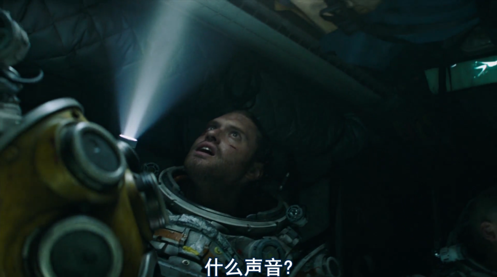

影片将背景设置在马里亚纳海沟，是一个意图明显的选择。

这是地球目前已知最深的海沟，深度约为海平面以下11034米，海底压强为标准大气压的1000多倍。在地球表面，能登顶珠峰的探险者不在少数，但能潜入马里亚纳海沟的人类却屈指可数。

值得一提的是，世界上第一个独自下潜到海沟底部的人，我们并不陌生，他就是《阿凡达》导演詹姆斯·卡梅隆。

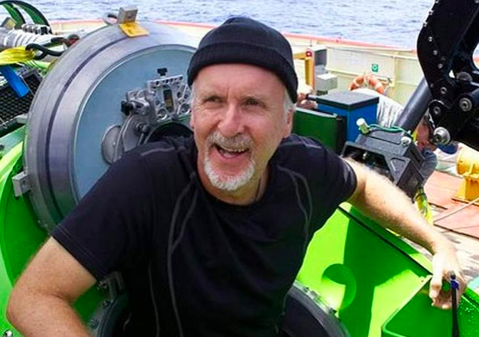

2012年时，卡神驾驶单人深潜艇下潜到了10898米的海渊，不仅为科学研究搜集了样本，还拍摄到了珍贵的影像素材。

而马里亚纳海沟，作为地球上对人类而言最陌生的一片领域，可以看作是黑暗神秘、恐怖深邃的代名词。

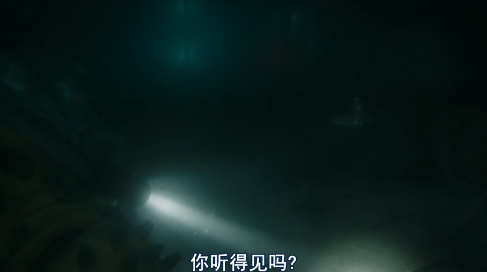

然而，在片中设定的未来，人类已经将能源产业开发到了最深的海底。

所以当海震发生后，主角们说出了这样的台词——

.jpg)

讲到这里不难看出，本片不论是深入海底、遇到未知怪兽的情节，还是反思人类过度夺取资源、引发自然报复的主题，都算不上新颖。

这也是影片在上映后，口碑和票房都不甚理想的原因之一。

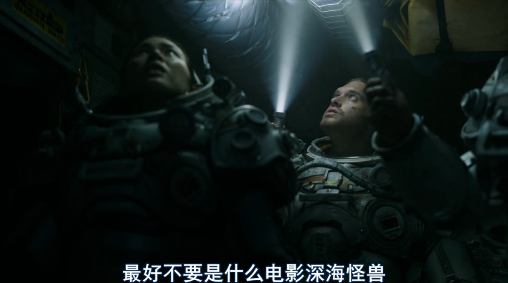

另一方面，影片前后两部分的风格有明显脱节。

前半段是灾难片画风，比如主角们在海震中自救的场景，比如他们如何穿上深潜服开始海底徒步，这些情节给人感觉都非常硬核。

.jpg)

而与之匹配的，也是极尽写实的拍摄方式。

影片极少使用特效，绝大部分镜头都采取水下实拍，通过纪录片一般的粗粝镜头，给观众营造那种身临其境的“深海恐惧”。

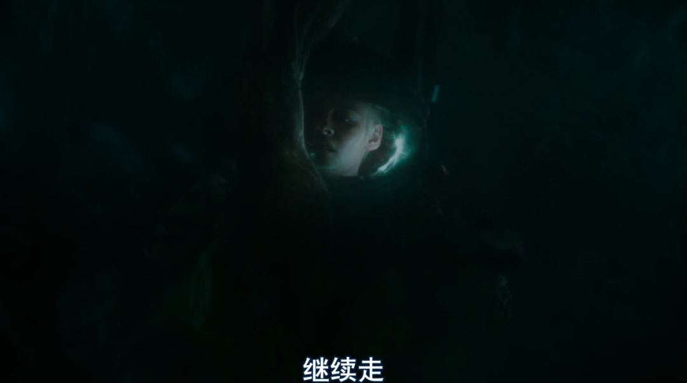

但到了后半段，它却忽然变成了一部B级恐怖片，海兽经常通过鬼片中的惯用伎俩一惊一乍地出现。

比如当主角身处伸手不见五指的海域时，一开灯，忽然发现身旁就有个若隐若现的鬼影；

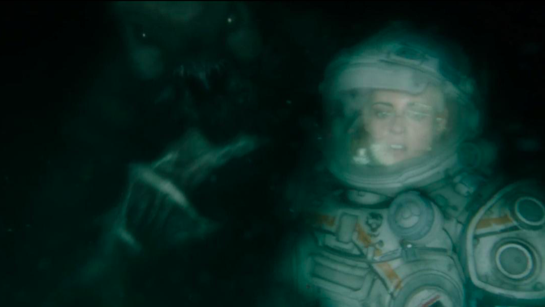

比如当他们历尽艰险、终于抵达“罗巴克”站时，却发现站内早已成了海兽的老巢……

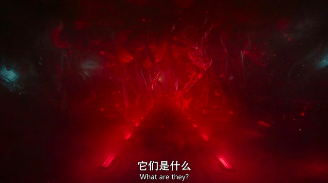

总之，抱着看硬核灾难片的期待而来的观众，看到后面会质疑怎么不明不白就开始打怪兽了……而那些想看怪兽片的人，又可能会对本片摇晃而写实的镜头感到不满，觉得“特效差钱”。

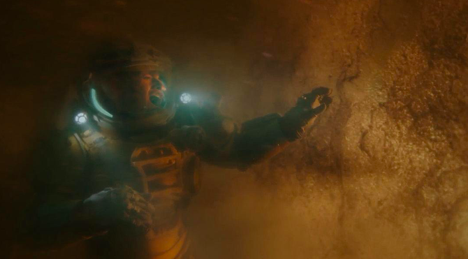

但话说回来，也必须看到本片不乏亮点，它的整体气质非常复古，会让人联想到诸如《异形》、《怪形》，甚至《天外魔花》这样的古早科幻惊悚片。

事实上，片中女主与“海兽之母”单打独斗的剧情，以及人类被海兽吞食、而后破体而出的画面，都带有明显的向《异形》致敬的意味。

.jpg)

另外，虽说故事发生在海下，但本片所营造的恐怖氛围，与我们熟悉的那类“深空恐惧”其实非常相似——

同样是一望无际的黑暗空间，高压缺氧的密闭环境，不知隐藏在何处的神秘生物，以及危机面前无处可逃的绝望感。

有趣的是，片中提到的几个海底钻井站“开普勒”、“谢泼德”和“罗巴克”，无一例外都是以天文学家或宇航员的名字命名的。

这应该不是巧合，而是创作者也意识到了**“深海”与“深空”本就享有相近的本质，它们都因为深邃与未知而让人心生畏惧。**

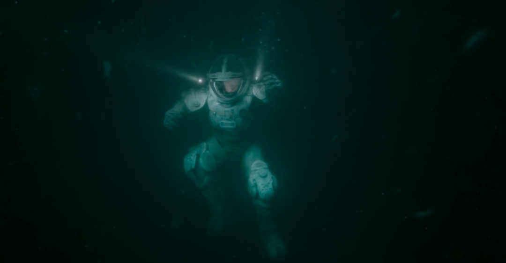

这种压抑窒息的恐怖氛围，也通过影片结尾的一个反转被推到极致——

当女主一行人费劲九牛二虎之力，终于战胜海兽之母时，他们发现真正的boss其实才刚刚从睡梦中醒来。

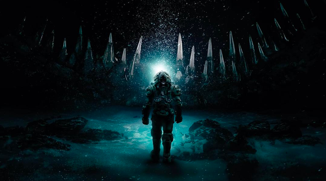

它是一个克苏鲁式的沉默巨兽，动一动身子就能翻江倒海。

它醒来并不是为了杀死人类，或许它根本没有意识到主角们的存在，但它像山峰一样的恐怖身型已经是种赤裸裸的威胁，站在它面前就让人感觉如陷深渊。

.jpg)

所以在影片的最后，女主将两个队友送上仅有的逃生舱后，自己留了下来。

她决定引爆站内的反应堆，与这个未知的巨兽同归于尽。

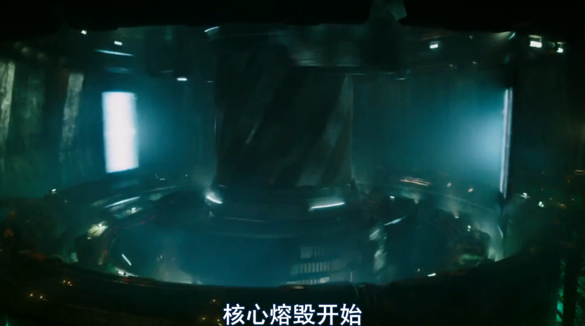

在爆炸发生前的倒计时10秒，女主站在玻璃前与巨兽对视的镜头，也成为了全片最惊悚的一个画面。

她对眼前的庞然大物一无所知，而正是这种无知，让她真切感受到自我的渺小。因为与她对视的，并不是一个恐怖的怪兽，而是整个自然的神秘广阔。

.jpg)

因此，从某种程度上说，这部《深海异兽》并不是一个爆米花式的怪兽片，也不是一部带有说教意味的环保片，而是纯粹的克苏鲁式恐怖片。

片中的人物与剧情都并非所要描述的重点，影片只是通过它们揭示出一个模糊暧昧的未知世界图景，营造一种感官上的惊悚体验。

在最后的寂静之中，女主再次重复起了片头的那段独白：**在黑暗中，你会失去时间的概念……**

**我想，“恐惧”这种最为原始的人类情感，永远都不会从我们的心头消失。正如这世上的黑暗与未知，我们永远也探索不尽。**

