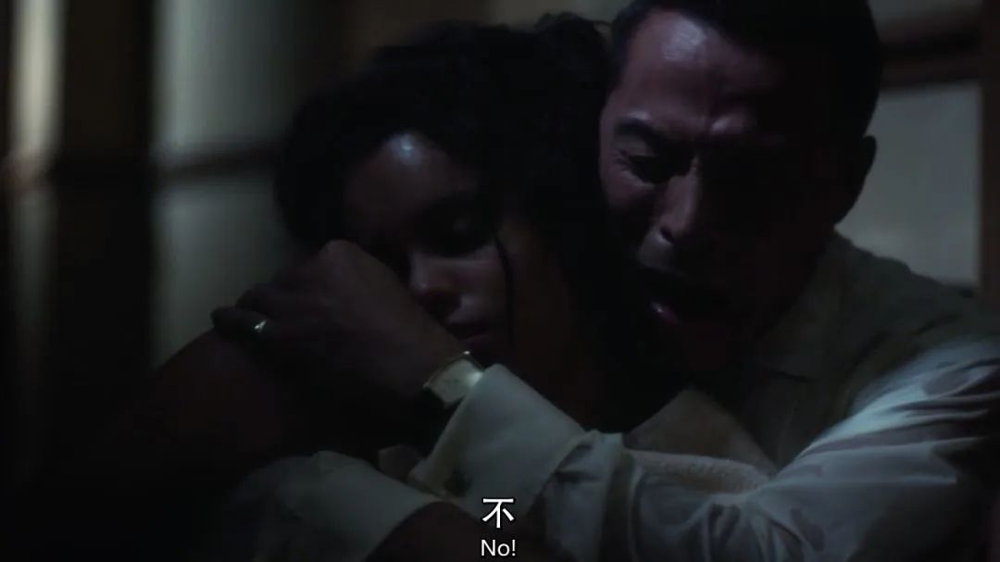

#  这部阿婆侦探片，活生生被BBC拍成惊悚片

原创 有部电影 [有部电影]()**
提到“阿婆”阿加莎·克里斯蒂，小伙伴们不会感到陌生。

她是英国侦探推理小说家、剧作家，人类历史上最畅销的著书作家，也是世界三大推理文学宗师之一。

她笔下的80多部推理小说不仅受到各国读者喜爱，诸如《东方快车谋杀案》和《尼罗河上的惨案》等代表作品，更是多次被搬上大小荧幕，成为影视经典。

2015年，阿婆诞辰125年时，BBC推出了电视剧版《无人生还》，也收获无数好评。

尝到甜头后，BBC宣布将续订七部阿婆小说的影视改编作品，包括《无妄之灾》、《死亡终局》、《ABC谋杀案》等等。

而咱们今天要聊的新剧，就是其中之一。

它由新版《无人生还》编剧莎拉·菲尔普斯执笔，BBC和亚马逊联合出品——**《灰马酒店》（又名《白马酒店》）。**

故事始于1960年，剧集开场就透着惊悚高能——

一位名叫黛尔芬的黑人贵妇，去找三位女巫占卜婚姻生活，但回家没多久，就在浴室内触电身亡。

时隔一年，又有一位名叫杰茜的五金店女工，在见过相同的女巫后，离奇死于街头。

她在临死前写下了一份神秘名单，藏在鞋里，直到尸检时才被法医官发现。

马克的名字后面还有个问号

这份名单上，除了“马克·伊斯特布鲁克”和五金店老板“奥斯本”外，剩余八个很难查出来具体指谁。

于是，警方只好从现有线索入手，先将名单上的两人叫来问话。

其中，马克·伊斯特布鲁克，就是本剧的男主。

他是一位家世显赫的古董商，去年刚刚痛失爱妻黛尔芬（片头触电身亡的贵妇），如今又迎娶了年轻貌美的赫米娅。

马克虽然表面故作镇定，内心却已经慌得一批。

因为他发现不止自己在名单上，他的教子大卫，还有秘密包养的情妇托马辛娜·塔克顿，也在其中。

更要命的是，昨天他才刚和托马辛娜一夜风流，今早一睁眼就发现对方诡异地死在了床上，吓得他连滚带爬逃出公寓。

难道说，这份名单上的人都有生命危险吗？

随后，马克在杰茜的家里，发现了一张去往马奇迪平镇的车票。他想起前妻黛尔芬在临死前，也曾搭车去过这里。

于是，他立马将名单的事情告诉了教子大卫。

就在这时，五金店老板奥斯本也找上了门来。他翻遍报刊讣告，发现名单上的人除了他们三个，全部都已经死了。

难道这件事跟传说中的女巫有关，是她们在利用巫术收钱杀人？

马克来到马奇迪平，果然在镇上的灰马酒店，碰到了三位女巫。

在得知马克的身份后，她们不仅承认接待过他的前妻，还暗示男主也身陷麻烦，早应该来寻求帮助。

而马克前脚刚离开小镇，后脚就听到两个噩耗——

先是与大卫同姓的姑妈心脏病发去世，后是情妇托马辛娜尸体被发现。

这让马克将调查焦点放在了女巫身上。

他谎称自己也是灰马酒店的忠诚客户，去找情妇的继母套近乎，没想到当场就套出了女巫杀人的内幕——原来，这位继母是怕托马辛娜争夺家产，便去求助女巫，并向指定账户汇去一大笔报酬。

随后马克故技重施，找来教子大卫进行对质。果然又诈出他也是为了争夺财产，才“买巫杀人”谋害姑妈。

可是马克百思不得其解，究竟是谁想杀自己呢？

他首先想到了新婚妻子赫米娅，对方不仅患有狂躁症，还因为怀疑马克搞外遇，动不动就神经紧张，举止过激。

此外，他自己也向警方隐瞒了秘密。

当天他的前妻黛尔芬从灰马酒店回家后，并没有透露占卜婚姻的事情，而是谎称出去逛街。

可马克却意外发现了去马奇迪平的车票，怀疑妻子红杏出墙，怒不可遏地掀翻了浴缸旁的录音机，这才造成黛尔芬触电身亡。

事后，为了掩盖杀人罪行，他慌忙逃出公寓并佯装外出未归，让大家误以为妻子死于意外。

目前，这部一共两集的《灰马酒店》，已经更新完毕。虽然改编自阿加莎的同名小说，但本剧从故事情节到人物设定都进行了较大改动，推理成分也大大削弱。

因此，一大波奔着阿婆原著来追剧的观众，纷纷吐槽编剧“毁经典”，也让《灰马酒店》在豆瓣上跌到了6.7分。

其实，说到原著《灰马酒店》，这已经不是它第一次被拿来做影视化改编，1997年就曾经出过一部电影版：

在经典探案英剧《马普尔小姐》中，第五季第一集改编的也是《灰马酒店》的故事：

尽管这两部作品，一个把故事背景挪到了当代，一个将原著中的侦探改成了马普尔小姐，但整体剧情和推理过程都比较尊重原著，因此得到了原著粉的普遍认可。

而今天分享的剧版《灰马酒店》，虽然改动较大，导致口碑大不如前，但对于普通观众而言，仍然是部值得一看的迷你英剧。

一方面，作为悬疑剧，它的惊悚氛围渲染到位、摄影构图精美考究，一如既往保持了BBC的制作水准。

比如第一集中，导演就利用蒙太奇剪辑和男主视角带节奏，将案件焦点锁在灰马酒店和女巫身上，让观众们误以为真的是巫术杀人。

另一方面，它通过融入家庭伦理元素，让故事变得更加错综复杂，也为后续解谜增加了看点和深度。

剧中的男主长期在婚姻中物化女性，一边在外面包养情妇，一边又因为善妒多疑而误杀了前妻。新婚之后就把妻子当保姆，继续肆意出轨的情节很容易让人想到《致命女人》。

两个故事还都发生在1960年代

正因为亏心事做得太多，马克总是在午夜梦回犯罪现场，一度被噩梦吓出精分症状。如今他又是担心被警察定罪，又是害怕被新婚妻子报复，也算是自作自受。

为了自保，马克连夜带着钱赶往灰马酒店，想借助女巫的力量铲除这俩隐患。

结果没过多久，赫米娅居然真的染上急症，昏迷不醒，那位警察也七窍流血身亡。

就在马克觉得整个事情玄乎得不行的时候，他忽然发现了一个疑点：早在自己情妇的尸体被警方发现前，奥斯本就曾说漏嘴提到过她的死亡，这是怎么回事？

经过潜入五金店调查，马克终于揭开了整个骇人阴谋——原来，奥斯本才是通过给有钱人写信、替他们扫清“障碍”的幕后主使。

他一边在信中佯装成灰马酒店的女巫，让每位客户都去算命提需求；一边让杰茜定期去酒店收集信息，利用无色无味的铊下毒杀人，再让客户把报酬打入指定账户。

直到女巫逐渐察觉到真相，杰茜因为良心不安想要自首，奥斯本才对她痛下毒手。

但没想到，杰茜临死前将女巫告知的暗杀名单写了下来，还误把黛尔芬的丈夫，也就是男主马克也囊括进去，迫使奥斯本将计就计利用他误导调查。

在阴谋被揭穿后，奥斯本非但不知悔改，还威胁要再次给马克下毒。男主在一怒之下杀死了他，还顺手点燃了五金店，将所有罪证一起燃为灰烬。

耐人寻味的是，剧集留下了一个开放式的结尾——

当马克最后独自回到家里时，不仅再次梦回杀妻现场，还在报纸上看到了自己的死讯……

至于这究竟指的是马克早已死于铊毒，还是他旧病复发彻底精分，抑或是因为罪孽深重陷入了永恒的时间轮回，其实都已经不重要了。

就像奥斯本临死前说的，“总有一天我也能解决掉你，但你无从知道会是什么时候，每次你往嘴里塞进任何东西，你都会想我有没有给你下毒，直到你把自己饿死……”

**罪人终将下地狱，这个戏剧化的结尾再次告诉我们——无论在魔幻现实还是影视作品中，最恐怖的往往不是致命巫术或疾病，而是贪婪扭曲的人性。**

