#  这部华语师生禁忌恋之作，大尺度背后是人生的救赎

原创 有部电影 [有部电影]()**
开门见山，今天为大家推荐一部禁忌题材的华语佳片。

现在来看，它依然是近两年华语影坛最顶格的作品之一——**《热带雨》。**

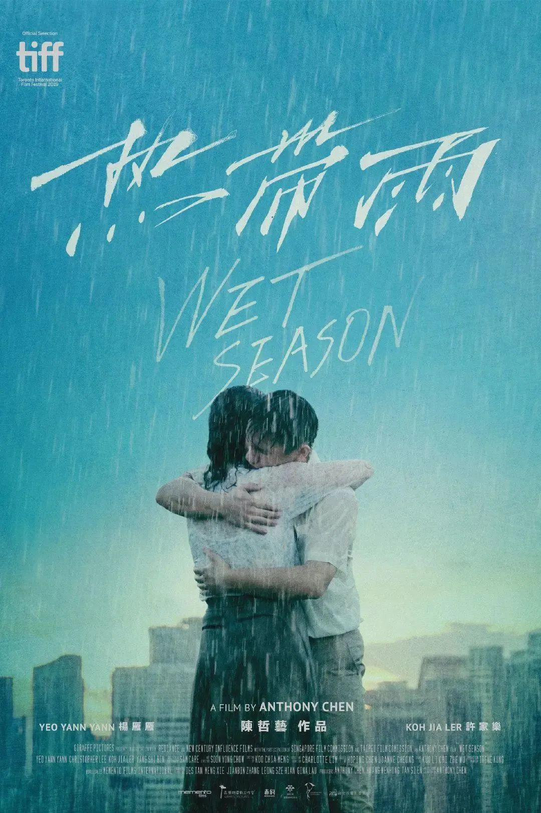

这部作品从去年开始就备受影迷关注。

因为它在2019年各大电影节的成绩，实在太亮眼——

不仅入围多伦多国际电影节主竞赛单元、拿下平遥国际影展最佳影片，还斩获金马奖六项大奖提名，摘得最佳女主桂冠。

自编自导的陈哲艺，是有“李安钦定接班人”之称的新加坡新锐导演。

在2013年的金马奖上，王家卫的《一代宗师》、贾樟柯的《天注定》和蔡明亮的《郊游》，一度为最佳影片争得热闹非凡。

但最终摘得这个奖项的，却是名不见经传的陈哲艺，而且获奖影片《爸妈不在家》还是他的处女作。

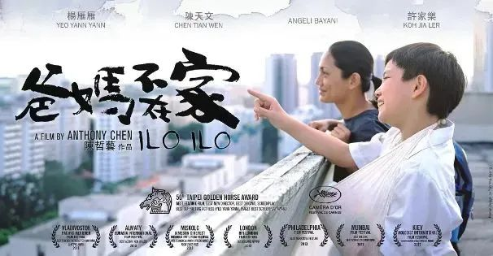

当时评审团主席李安给出的评价是：“没有人不喜欢”。

而今天这部《热带雨》，正是陈哲艺继《爸妈不在家》后，蛰伏六年带来的第二部电影长片，同样获得了安叔的力捧。

片中的女主角林淑玲，是一个从马来西亚嫁到新加坡的高中语文老师。

由于这所学校以英语教学著称，全校上下都不注重语文成绩，所以淑玲在学校的地位并不高。

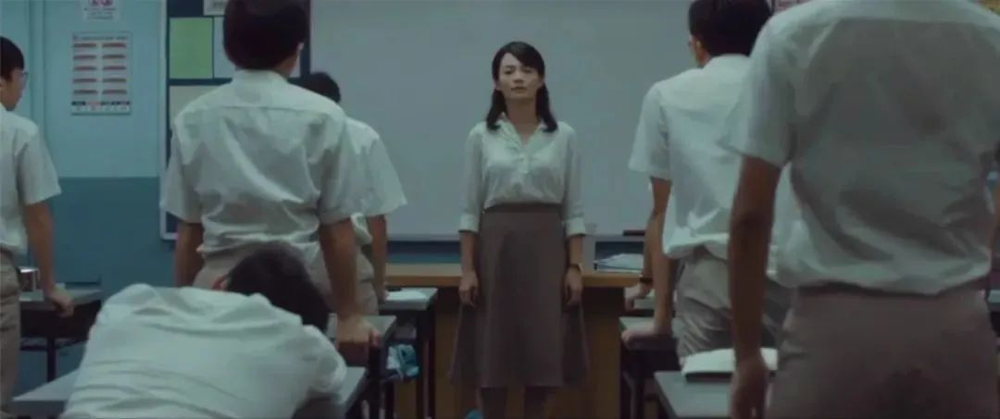

有的学生公然在她的课堂睡觉，还有人故意在语文作业上写英文名字。

对此，淑玲从未发过脾气，依然耐心地教导学生，为学生们的成绩忧心。

而回到家里后，淑玲是一个细心孝顺的儿媳。

她的公公身体瘫痪，她便从头到脚、无微不至地照顾他的吃喝拉撒睡，有时候忙碌到只能在夜里批改作业。

她每天都是这样辛苦、忙碌，仿佛丧偶式养家。

这是因为她有个难以倾诉的苦衷：和丈夫结婚十多年，一直没有生孩子。

因为这个，丈夫对她越来越冷淡，总是以工作太忙为借口很晚才回家，还经常喝得酩酊大醉。

对于淑玲提议的“再试一次”，丈夫也是嗤之以鼻。

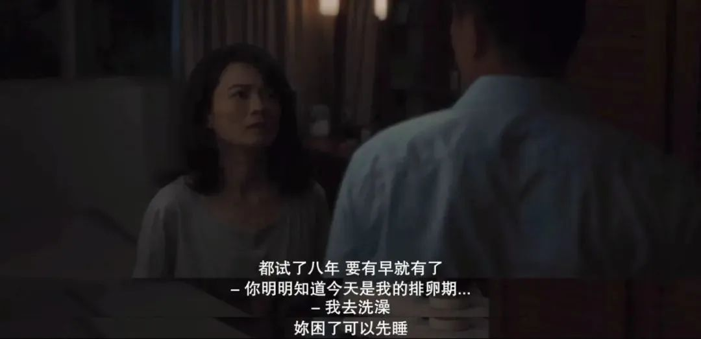

无奈之下，淑玲只能独自一人，一次又一次地跑医院做检查。

寄希望于用丈夫的冷冻精子人工受孕。

有一次，她还在医院里碰到了班上那个整天睡觉的男生郭伟伦。

正值青春期的坏小子，不经意的提问，就会让淑玲感觉有些尴尬。

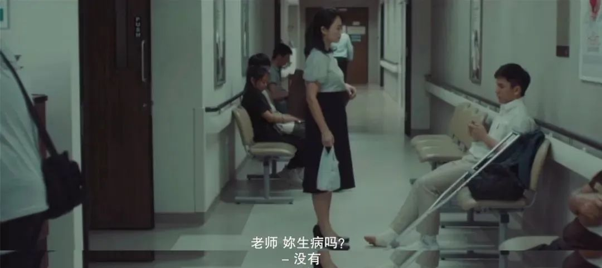

此外，淑玲还有个拖油瓶的弟弟，老大不小没有正经工作，常常跑来跟淑玲借钱。

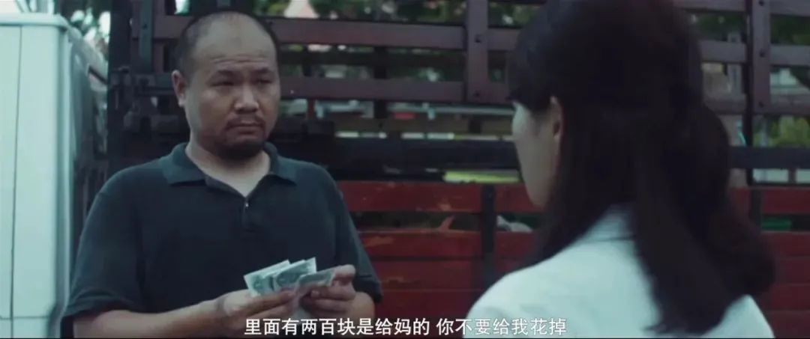

种种生活琐碎，已经足够让人焦头烂额了，而班上的学生还即将面临毕业会考，这让她又不得不一心扑到工作上来。

为此，淑玲决定，放学后为差生留堂补课。

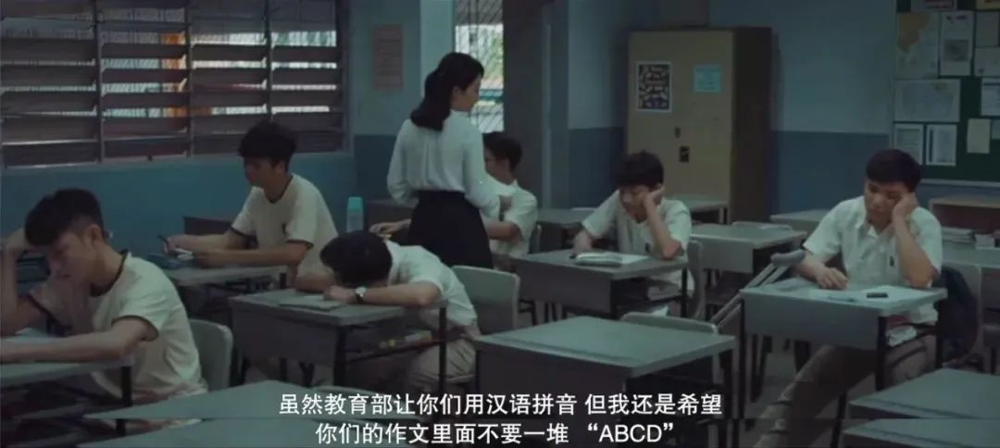

而这些差生中，就有之前在医院碰到的郭伟伦。

他还是那副老样子，不好好写作业，趁机偷拍淑玲的背影，不知不觉中，他好像对自己的老师产生了特殊的情愫。

没过多久，其他学生一放学就立马溜走，坚持留下来补课的，就只有郭伟伦一人。

无奈又好气的淑玲，仿佛在伟伦身上看到了少有的上进心，也给自己找到了一丝安慰。

就这样，放学补课变成了两人单独相处的时间，他们渐渐就不再那么拘谨。

在聊天中，淑玲了解到，伟伦的父母常年在中国做生意，没时间管他，才让他养成贪玩懒散的个性。

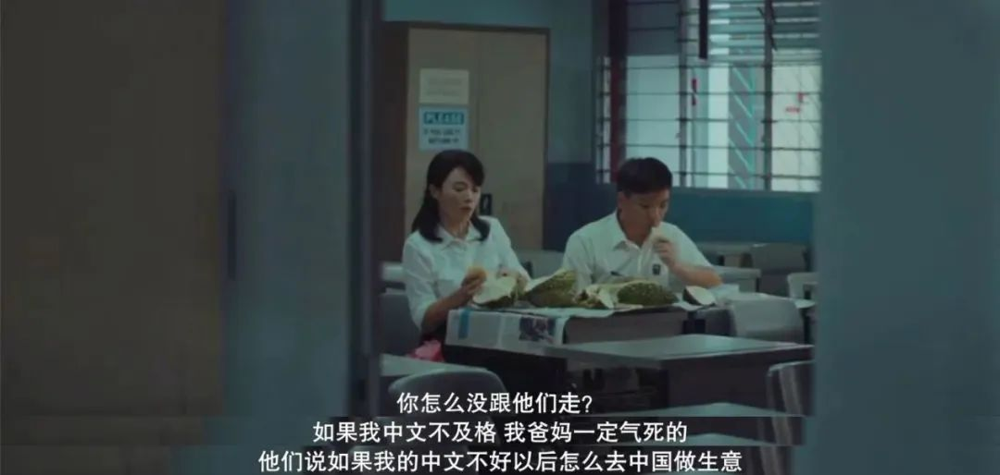

于是，每次补完课，她都会开车送伟伦回家。

有时候，因为照顾公公的保姆阿姨走得早，淑玲只好把伟伦带到家里补习，然后再一起吃晚饭。

慢慢地，他们在师生之上又多了一层朋友关系，就连公公也跟伟伦混熟了。

久而久之，淑玲也对伟伦产生了好感，被这孩子身上的阳光质朴所吸引。

她会在课余时间观看伟伦的武术训练；

也会在伟伦获得校际武术大赛冠军后，和公公一起帮他庆祝。

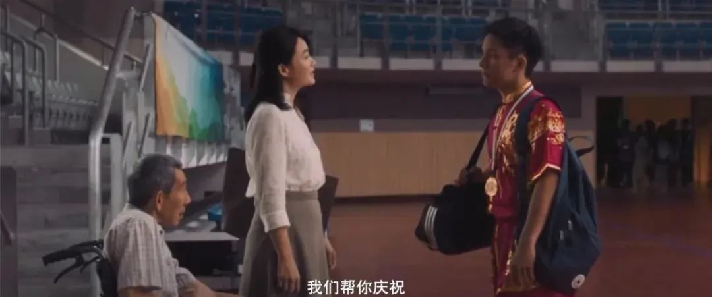

随着伟伦越来越多地参与到淑玲的生活当中，淑玲的心情渐渐好了起来。甚至在批改作业时想到伟伦，也会不由自主地笑忘了神。

不难看出，这位女老师陷入到了爱情当中。

但淑玲还未想好怎样处理这突如其来的禁忌之恋，就遭遇了接踵而至的三连击——

先是从医生那儿得知，人工受孕再次失败；

接着就发现丈夫有了外遇；

没过多久公公又猝然去世。

在公公的葬礼上，丈夫还带着小三和孩子一起出现在她面前。

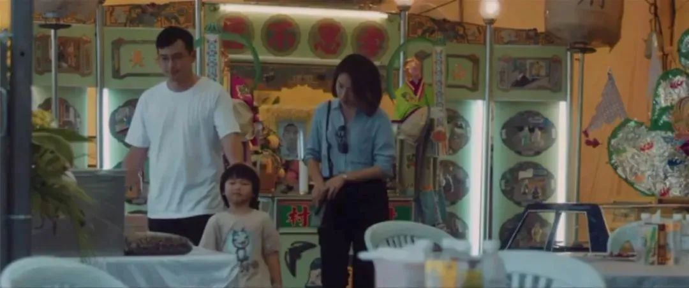

至此，淑玲终于明白，她为这个家庭所做的一切努力，都彻底失去了意义。

当晚，在送伟伦回家后，淑玲半推半就地与他发生了关系。

看到这里我们不难发现，本片并不是那种以禁忌畸恋作为噱头的奇情故事。

影片在剧作层面非常成熟，在细致入微的层层铺垫下，两名主角最终跨出那打破禁忌的一步，是一种可以预见的必然。

其剧本细腻扎实的程度，以及对女性在婚姻、工作中丰富微妙的心理刻画，都让人想起《婚姻故事》和《82年生的金智英》。

不同的是，相比于那两部影片呈现的双向视角和试图不偏不倚的讨好态度，《热带雨》更主观也更明确的女性视角，为观众带来了不一样的触动。

而“热带雨”这个贯穿全片的标志性意向，也从一开始就给影片定下了**清冷、压抑、疏离**的基调。

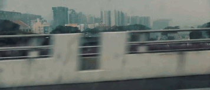

雨雾笼罩下的狮城，给人一种难以适应的陌生感，也给人物情绪蒙上一层厚厚的阴影。

最令我惊叹的是，就连雨的大小变化和洒落时刻，都跟剧情的起承转合，以及女主的心理起伏相得益彰。

不得不说，导演在叙事技巧和节奏把控上，让人看到了一种匠心独到的功力。

精巧的视觉语言和微妙的细节设计，让本片脱离了同类题材容易误入的廉价烂俗的悲情展示，让观感变得更加丰富具体，看完不会觉得压抑难受，反而会让人沉入其中。

比如，当医生打电话告诉淑玲人工受孕失败的消息时，碍于旁边有伟伦在，淑玲不得不跟医生对暗号似地快问快答。

略显轻松的问答，甚至有点让人忍俊不禁，但在淑玲竭力掩饰的冷静中，我们知道她此时的内心，就像摇摆不定的雨刮器一样在剧烈颤抖。

比如，有次淑玲盯着窗外的大雨默默流泪，公公提醒她看看墙上那一副写着大大的“笑”字。

等淑玲反应过来回头微笑时，我们知道她的付出并不是徒劳，身体瘫痪、口不能言的公公看在眼里，其实记在了心上。

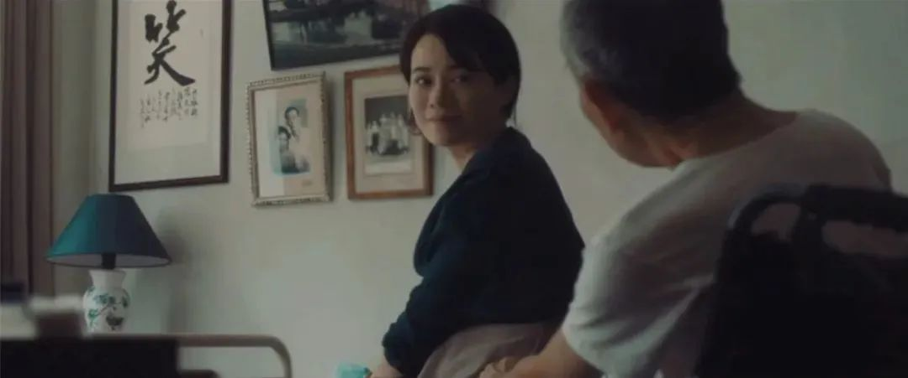

还比如，淑玲在家除了看新闻外，就爱看早期的香港武侠片，电影里多次出现了胡金铨《侠女》的镜头。

其实，在家庭和工作中奋力周旋、力求做到完满的淑玲，不正像一位被四面围困的侠女吗？

**她憧憬武侠江湖里的刀光剑影和快意恩仇，却又无奈于现实的困顿羁绊。**

不过，当与伟伦的禁恋被曝光后，淑玲终于冲破一切束缚，拿出了“侠女”风范——她快刀斩乱麻似地完成了**分手、辞职、离婚**，一气呵成，办得干干净净。

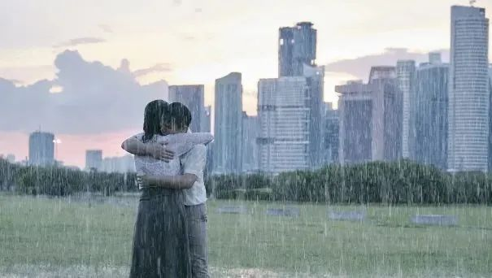

那场与伟伦在暴雨中拥抱分手的场景，拍得非常有意境。

**于伟伦而言，是少年意气的浪漫和青春伤痕的铭记；**

**但对淑玲来说，则是不期而至的意外和放开一切的重生。**

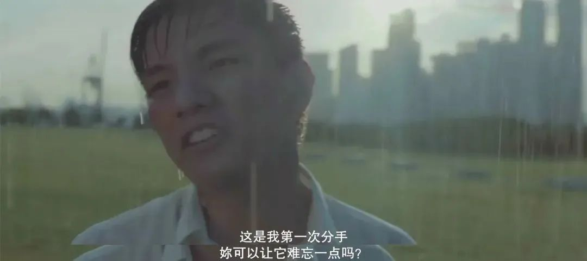

二人既是情侣，又像母子。

**伟伦是淑玲心猿意马的小情人，也是她从未出生的孩子；淑玲是伟伦青春萌动的初恋，也是他从未到场的父母。**

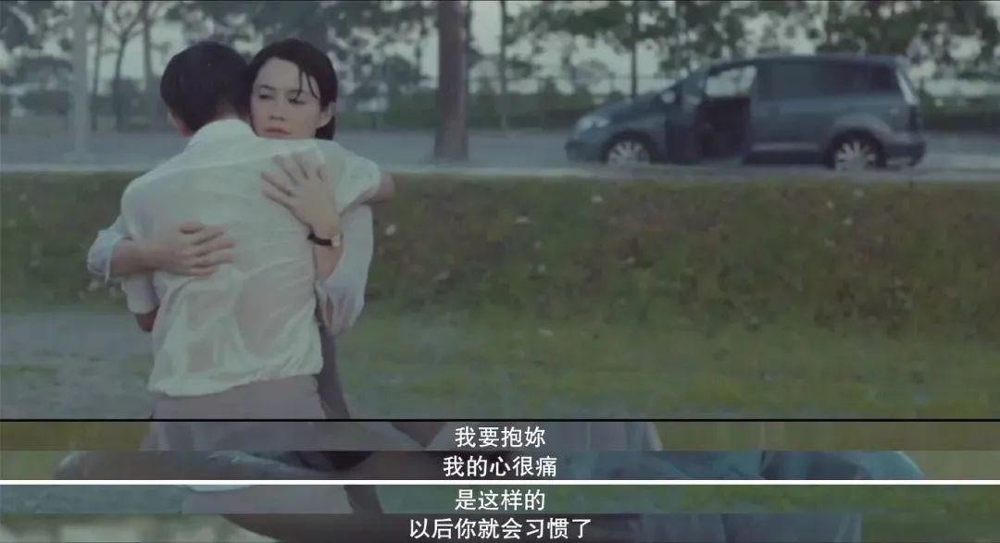

**从世俗眼光来看，这场注定无法成全的禁忌之恋，让他们失去了很多，但我想，只有他们自己才知道，他们如何救赎了彼此。**

**如果把眼光从小小的狮城抽离，投向更高更远的天空，也许就能看到这两人各自身陷的囹圄不止在短暂的雨季，也属于整个社会和整个时代。**

**诚如鲁迅先生所说，“人类的悲喜并不相通”，世间的感同身受太过珍贵。如果可以选择，愿大家都能不辜负自己、亦不辜负他人地活着。**

