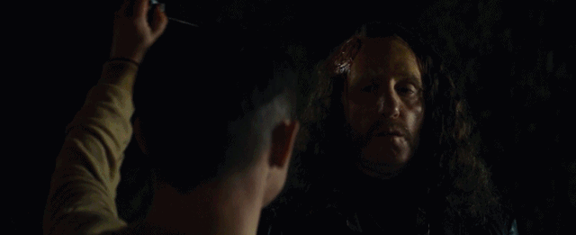

#  低俗趣味、暴力美学之下，竟是感人至深的父子情

原创 有部电影 [有部电影]()**
在刚刚过去的春节，因为疫情原因，周围少了上门拜年、走亲访友等现象，大家纷纷死宅在家保平安。

巧的是，最近有部新片讲的就是一个儿子去拜访父亲，结果差点被坑死的故事——**《爹来靠》。**

.jpg)

没错，海报上这位锅盖头男主，就是“弗罗多”的扮演者伊利亚·伍德。

.jpg)
《指环王》

伊利亚·伍德演完《指环王3》（2003年）的时候才22岁，很多人好奇后来这十几年他跑哪儿去了。

其实，他一直都没有淡出大银幕，只是作为成为B级片和R级片的重度爱好者，在成名之后便一头扎进了邪典电影。

比如，2012年他就在《杀人狂魔》里饰演了一个喜欢剥人头皮的变态杀人狂：

.jpg)

这样的画风，跟我们印象里的弗罗多比起来，是不是太颠覆了？

事实上，伊利亚·伍德演过的变态杀人狂不止这一个，而与之形成巨大反差的，是他在此类影片里看起来人畜无害的娃娃脸蠢萌形象。

今天这部《爹来靠》也不例外，他扮演的男主诺费尔是个妈宝男，30多岁一事无成，还跟妈妈住在一起。

.jpg)

一天，男主收到从小抛弃他的“陌生”父亲的来信，邀请他上门做客。

男主欣喜若狂，拖着行李箱，带上地图，穿过丛林，终于在一处海边的老宅子里见到了父亲。

然而，父亲第一眼看到他的表情却非常懵逼，就好像压根儿没有他这个儿子，更没有给他写过信一样……

.jpg)

尽管如此，男主还是住了下来，试图重拾遗失20多年的父子情。

可经过几日相处，男主发现，父亲的态度并没有丝毫好转。

他会借自拍合影之机，故意把男主心爱的黄金限量版手机“掉进”海里；

.jpg)

会毫不留情地拆穿男主伪装成知名音乐家的谎言，不让他为自己的loser形象挽尊。

.jpg)

更令人不解的是，父亲不仅各种冷嘲热讽，还经常用不堪入耳的言辞羞辱男主和他的母亲，仿佛和他们有什么深仇大恨一样。

.jpg)

起初，男主以为父亲是由于多年独处，对他们母子心怀愧疚而变得脾气古怪。

特别是当晚睡觉后，他听到父亲在发狂似地自言自语，就更加印证了这种猜测。

.jpg)

但后来，他发觉这只是他一厢情愿的想法，父亲变得越来越暴力。

有一次趁他在海里游泳时，父亲突然发狂扔过来一块大石头，差点砸中他的脑袋。

.jpg)

回想起信里所写的一切，男主百思不得其解。他决定静下心跟父亲好好谈谈，问清楚情况缘由。

没成想这番沟通再次激怒了父亲，他不仅劈头盖脸又把男主一顿痛骂，还随手抄起一把菜刀，眼看就要闹出人命。

.jpg)

但谁也没想到，就在手起刀落之间，父亲忽然心脏病发，猝死在了男主面前。

对此男主也瞬间凌乱，心里万马奔腾不知所措……

.jpg)

看到这里，可能小伙伴们已经猜到，剧情这样急转直下，后面必有高能情节。

没错，接下来影片画风一转，突然变成了恐怖片。

父亲死后，男主每晚都会被房间里的莫名声响给弄醒，他吓得夜不能寐，生怕是父亲诈尸回来继续谋害自己……

.jpg)

直到几天之后，他在家里找到一本相册才恍然大悟：原来死去的那个老头，根本不是自己亲爹！

.jpg)

与此同时，房间里的异响越来越频繁、越来越大声。

他循着声音顺腾摸瓜，终于发现了事情的真相——这处海景老宅里别有洞天，地下室里竟然囚禁了一个人！而这个人，才是男主真正的父亲。

.jpg)

据“亲爹”所说，他年轻时是个行骗天下的鸡鸣狗盗之徒，曾伙同三位好朋友杰斯、戈登和胖子丹迪，一起绑架了泰国首富的女儿。

但得到的一笔巨额赎金，全部被他独吞了。后来他把钱给了男主母亲，才让男主能够和母亲一起住在比弗利山庄的豪宅里，过着富裕生活。

.jpg)

最近，他因为想念男主写了那封信，没想到刚发出信件，就被当年的三个老友找上门来，还被囚禁在了自家地下室里。

为了逼问当年那笔赎金的下落，三人轮流住在这里，把他打得遍体鳞伤……

.jpg)

故事至此，前面所有的反常和疑惑都迎刃而解：

猝死的暴脾气老头，其实是三人之一的戈登；男主睡觉时听到他发狂似的自言自语，是他在“审讯”男主的父亲。

在得知这些情况后，男主把父亲救了出去，但他们依然得对付另外两人——杰斯和胖子丹迪的威胁。

.jpg)

就这样，影片再次转变画风，从惊悚直接变成了恶趣味满满的血浆Cult片。

从地下室出来后，男主先遇到的是胖子丹迪。他遭到了一顿暴揍，丹迪就像绿巨人一样把他抓在手上各种狂摔乱打。

.jpg)

但就在男主被按在地上摩擦时，意外上演了一出绝地反杀，他在慌乱之中捡起一把餐叉对着丹迪一顿猛戳……

痛感扑面而来

随后，男主又与终极boss杰斯进行了一番大战。

他先是被杰斯猛揍一顿，嘴上还被插上一支冰锥，直到最后才在杰斯出车祸的情况下，把冰锥插进了他的脑袋里，完成了惊险反杀。

这两段虐杀戏，在动作设计上充满想象力，且带有明显的恶趣味，整体上给影片增加了一种暴力美学的观赏性。

.jpg)

不过从故事来看，影片本质上讲的还是西方文化中影响深远的俄狄浦斯情结。

**这个词汇原指男孩恋母反父的复合情绪，后来引申为男孩在成长过程中，在情感或心理意义上“弑父”以取而代之，作为其真正成熟的标志。**

.jpg)

当然，俄狄浦斯情结的终极表现，就是真正意义上的轼父。

这种极端行为在西方影视作品中经常出现，比如《权游》里的小恶魔把他爹射杀在马桶上，还有《星战》里的凯洛·伦用光剑把父亲韩·索罗给捅死……

而本片中稍稍不同的是，男主对父亲的情感比一般情况要复杂得多。

从小被父亲抛弃的他，对父亲除了憎恨，更多的其实是未知与好奇。他来找父亲就是想知道父亲到底长什么样，为人如何，当年为什么抛弃他们母子，现在又过得怎么样，为什么给他写那封信……

他带着种种疑问来到这里，又差点带着失望离开，却没想到因为父辈当年的恩怨，让他阴差阳错地认了个假父亲，才有了后来的两次“轼父”。

第一次是被动的——戈登在他面前心脏病发，暴毙而亡；

.jpg)

第二次是主动的——亲手杀死了曾经羞辱过母亲的杰斯。

.jpg)

某种意义上，本片中男主出现了三个父亲，他杀死两个假父，找到并拯救了真正的父亲。

因而也可以说，影片最终呈现的其实是反俄狄浦斯情节，从弑父到救父，恰好表达了男主这次“致命”拜访的心路历程：从憎恨到好奇，再到最终宽恕、原谅，与父亲和解。

这同样是一个男人真正成熟的表现。

.jpg)

总体而言，本片是一部风格新奇、杂糅，具有独特表达，也颇值得玩味的成长小品。想必片中描述的这种父子情，也会让一些特殊家庭的孩子有所触动。

**不管是父爱还是母爱，缺了哪一样都会让孩子失去健康快乐的童年，这也是男主一开始满怀期待、苦苦找寻父亲的原因。****正如有句话所说，幸福的童年，可以治愈一生；****不幸的童年，则需要一生去治愈。**

