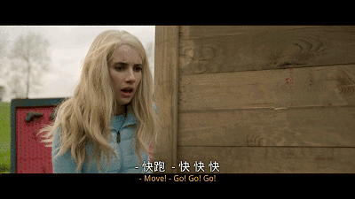

速读摘要

结果因为疫情原因，上映一周就下线走了流媒体——《狩猎》。金发女跟着大家一起走到空地中央，那里放着一个大木箱。影片的黑色幽默还体现在疯狂开嘲讽的台词上。而在影片结尾，还设置了一重讽刺性十足的反转——其实压根就没有什么"庄园门事件"，一切都只是一场误会。海报上那只猪的名字就叫"奥威尔"，女主的"雪球"代号，也是出自《动物庄园》。

原文约 2276  字  | 图片 38 张 | 建议阅读 5 分钟 | [评价反馈](https://static.app.yinxiang.com/embedded-web/clipper/#/Evaluating?d=2020-03-30&nu=be1d5931-a454-4b5b-a596-72c4f38670ef&fr=myyxbj&ud=58b471&v=2&sig=C1FF5342E713C45F09E3715F772CF5E6)

##  真人版吃鸡，大尺度禁片爽上天

原创 有部电影 [有部电影]()**
最近，有一部争议极大的美国新片放出了资源。

这部电影原本定档去年七月，一度被雪藏，直到这个月初才成功上映。结果因为疫情原因，上映一周就下线走了流媒体——**《狩猎》。**

从海报就能看出一种不明觉厉、来者不善之感。

除了一头醒目的猪，海报背景上的文字，都是人们对这部影片的差评，比如说它“旨在煽动国家分裂”、“展示了什么是真正的疯狂与邪恶”等等。

特朗普看完预告后就下场怒怼《狩猎》，说主创是种族主义者，妄图引起动乱。

一部预告片就能引起声讨浪潮，那么《狩猎》到底讲了什么呢？

事实上，影片的开场就极其高能——

在一趟飞往未知目的地的航班上，一位头等舱的乘客正跟空姐讨论食物的话题，气氛显得愉悦又悠闲。

突然，一名壮汉从经济舱跌跌撞撞走了过来，所有人都在瞬间被吓得面如土色。

壮汉自己好像还不知道发生了什么，一个劲儿地在问这是什么地方。

慌乱中，另一名头等舱乘客站了起来，拿起空姐的钢笔就二话不说刺进了壮汉的脖颈，鲜血顿时喷涌而出。

他这么做的原因，是壮汉“在不该醒来的时候醒了”。

这到底是怎么回事呢？

影片并没有紧接着揭开谜底，而是镜头一转，来到一片空地上——

一个金发碧眼的美女忽然醒来，摸着固定在头上的嘴套一脸懵逼。

四处看看，周围还有不少和她一样戴着嘴套的人。

金发女跟着大家一起走到空地中央，那里放着一个大木箱。

其中一人不顾众人反对，用撬棍打开了木箱，找到了一把钥匙。

除此之外，箱子里还有一只穿着衣服的小猪和一架子的武器：

搞不清状况的众人，只好先用钥匙解开嘴套，然后每人拿了一把武器防身。

就在这时，一颗子弹“嗖”地一声从人群中穿过，吓得金发女赶紧蹲了下来。

她前一秒还在庆幸子弹没打中自己，后一秒就被一枪爆了头……

看到这里的我也是懵的：怎么回事，难道她不是主角吗？

没错，不仅如此，那个和她眉来眼去的帅哥，也很快就踩到地雷被炸飞了……

在开场的十几分钟内，影片不带喘气地送出了一打便当，通过不断转换主视角的方式，展现出反套路的特点，让人完全猜不到接下来的剧情走向。

不过，它确实片如其名，讲的是一个大逃杀的故事。

真正的女主“雪球”，直到进度条进行到三分之一处才出场，一出场就干掉了一对在商店卖货的老夫妇。

因为她从两人的话中发现了破绽，推断出他们不是普通NPC，而是这场大逃杀中的“猎人”。

她的猜测也确实没错，两人在她进来之前，才刚刚干掉三个“猎物”。

在这之后，女主便联合其他“猎物”，小心翼翼地走上了对抗“猎人”的求生之路。

影片到此才慢慢说明了这场猎杀游戏的原委——

**原来，有一批“精英人士”每年都要绑架一群“下等人士”，将他们迷晕后运到一个荒无人烟的地方，猎杀他们来取乐。**

影片开场，在飞机上无辜被杀的壮汉，就是一个被“精英们”绑架的“下等人”。

这种行为被称为“庄园门事件”，不少人都听说过，但没人真正见识过。

因为参与猎杀的“精英”不会没事就将此事挂在嘴边炫耀，而被捕猎的“下等人”也从来没有能活着回来的。

那么，势单力薄的女主，要怎样才能险中求胜呢？

说起这类大逃杀电影，其实大家都看过不少，套路早就摸得一清二楚了。

但这部《狩猎》却和同类型影片有很大不同，它不仅剧情各种反套路，而且还有一丝黑色幽默的味道。

它的动作戏非常带有暴力美学的快感，而整体故事设定和台词细节上，又可以看出明显的讽刺意味。

而影片之所以会遭到各路人士的抵制，我想，大概就是因为它撕开了一些伪善之人的真面目吧。

片中借女主之口，导演给观众讲了一个龟兔赛跑的故事——

故事的前一半和我们听过的一样，讲的是兔子因为盲目自大，赛跑时输给了乌龟；

但输了比赛的兔子并没有善罢甘休，而是拎着一把大锤子闯进了乌龟家，直接砸死了乌龟一家。

**为什么寓言变成了暗黑童话？因为在阶层固化的现实社会中，“兔子永远会赢”。**

结合猎杀游戏中“精英人士”和“下等人士”的设定，令人细思恐极。

此外，影片的黑色幽默还体现在疯狂开嘲讽的台词上。

比如，“不要拿艾滋病来开玩笑，艾滋病是件非常严肃的事情”；

比如，不要将“非裔美国人”称为“黑人”，不然就是种族歧视；

还比如，性别平等应体现在所有时刻，所以看到男同伴全都被杀后，女猎手也没有求女主放条生路。

总之，你能想到的所有关于“政治正确”的话题，《狩猎》全部嘲讽了个遍。

当然，影片讽刺的其实是因“政治正确”而变得草木皆兵、因言获罪的社会环境，而不是那些政治正确的普世价值。

而在影片结尾，还设置了一重讽刺性十足的反转——其实压根就没有什么“庄园门事件”，一切都只是一场误会。

事情要追溯到一年前，女CEO雅典娜有一次和几个好友在聊天，开了个“庄园门事件”的玩笑。不久后，他们的账户遭到了黑客攻击。

当聊天记录公开后，雅典娜迅速遭到了网络键盘侠的围攻，被当成“猎杀游戏”的操控者，一时之间百口莫辩。

公司很快遭遇公关危机，雅典娜被迫离职，一同卷入丑闻的好友们也纷纷受到牵连。

为了报复这些不分青红皂白的键盘侠，他们决定不如就真的搞一出“庄园门”，让键盘侠们求锤得锤。

他们花了一年时间来为计划作准备，并挑选出了合适的“猎物”——当初言论最激烈的12个键盘侠。

也就是说，**这起事件最开始的起因其实并非阶层对立，而是人们的偏见、愚昧和对他人的敌意。**

值得一提的是，影片还多次提到乔治·奥威尔的名作《动物庄园》。

海报上那只猪的名字就叫“奥威尔”，女主的“雪球”代号，也是出自《动物庄园》。

但打脸的是，雅典娜给女主起名“雪球”，一开始就是错的。

在书中，雪球是个理想主义者，它希望这个世界变得更好，于是带领动物们战胜了庄园主人。

但此时，一只名叫拿破仑的猪却开始诋毁污蔑雪球，并破坏雪球辛辛苦苦经营的庄园，最终把雪球赶出了庄园，自己翻身变成了庄园主人。

结合《动物庄园》的剧情，其实雅典娜才是“雪球”，而最终打败雅典娜的女主是“拿破仑”……

更加讽刺的是，雅典娜还抓错了人——女主并不是当初在网上大喷特喷的键盘侠，她只是和那人同名罢了……

原来，自诩精英的上流人物，表面附庸风雅，实际上可能就是个“文盲”啊。

总之，你要是用心来看，会发现片中简直到处都是政治隐喻和内涵笑点，既能完全满足人的吃瓜心态，对照现实又耐人回味。

而即便当成一部无脑爆米花片来看，本片反套路的剧情和干脆利落的动作场面，也绝不会让你失望。特别是最后女主和雅典娜的撕X和对决，两人不管唇枪舌剑还是拳拳到肉，都一点不含糊。

喜欢这类虐杀爽片的小伙伴，千万不要错过这部！

