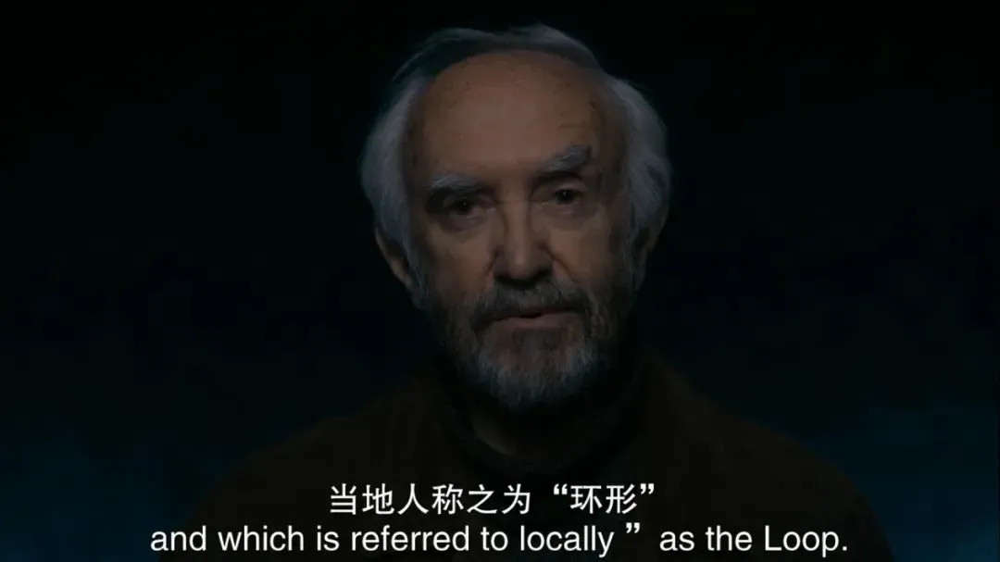
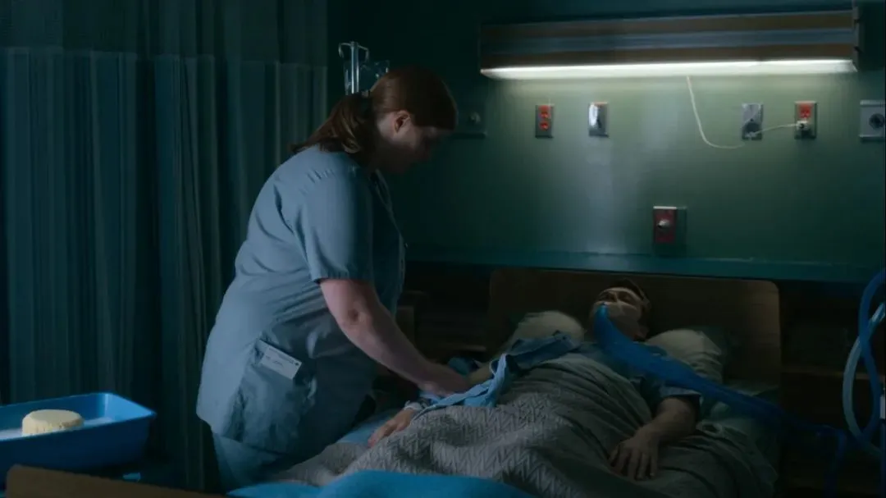

## 真人版“爱死机”，除了尺度还有温度！赞爆了！

原创 有部电影 有部电影 *前天*

最近几年，优质的人气科幻剧慢慢多了起来。

  

某种程度上，这说明科幻影视的受众群体在不断扩大。

  

随着现实科技的进步，科幻这一幻想金字塔尖的类型，正变得像我们的生活一样平常，就像今天这部科幻剧集——**《环形物语》。**

  

  

本剧基于瑞典艺术家西蒙·斯坦伦哈的同名漫画改编，由亚马逊流媒体频道推出。

  

全剧一共8集，每集一位导演，其中执导最后一集的，是我们熟悉的好莱坞才女朱迪·福斯特。

  

  

故事发生在俄亥俄州美世镇，科学家拉斯在这里创立了一个名叫“环形”的公司。

  

该公司致力于探索和解开宇宙奥秘，为此，他们造了很多机器人，还用奇异材料制作了可以影响地球生态和物理定律的“环形”系统。

  

  

随着“环形”的运转，小镇上发生了一系列充满神秘色彩的事件。

  

第一集的故事，就很好地给本剧定下了基调。

  

洛蕾塔是个敏感细腻的女孩，她对周围环境的细小变化拥有敏锐的洞察力。

  

比如，她会贴到地上，感知环形运转带来的地面震动。

  

  

比如，每天放学路上，她都会跟森林里害羞的机器人远远地打招呼，保持着友好的默契。

  

  

一天晚上，她发现在环形公司上班的妈妈拿了一块石头回来，在家里做实验。

  

  

可第二天放学后，家里的房子却忽然变成了废弃多年的破屋。

  

妈妈也消失不见了，只剩下那块可以悬浮在空中的神奇石头。

  

 

  

洛蕾塔在寻母过程中，一开始把一个陌生男孩科尔的妈妈，错认成了自己妈妈。

  

但后来，她惊奇地发现，科尔的妈妈竟然就是多年后的自己。

  

  

原来，她在捡起那块石头的时候，就穿越到了未来，见到了自己的儿子科尔。

  

  

为了解开谜团，她找到科尔的妈妈，也就是长大后的自己，来到环形基地，把那块石头放回环形的心脏。

  

 

  

刹那间，小洛蕾塔变成了成年洛蕾塔，而成年的洛蕾塔则回到过去，变成了刚“捡到”石头时的小洛蕾塔……

  

  

这是因为，洛蕾塔几十年来一直在带着那块石头寻找妈妈，为此她还加入环形公司，嫁给了创始人拉斯的儿子，试图解开妈妈消失的谜团。

  

但这个谜团多年来都未能解开，洛蕾塔也因此被困在了这个时间循环里。

  

  

看到这里，就会发现《环形物语》的整个气质如同剧名一样，在高概念软科幻的外壳下，包裹着一个个凄美、迷离、温暖而又令人心碎的故事。

  

整部剧拍得非常诗意动人，虽然节奏舒缓，却有击中人心的力量。

  

  

后面的每一集也与此类似，是相对独立的故事，但又彼此有所关联，挖掘着一些细腻的人类情感。

  

比如第二集，主角是洛蕾塔的大儿子、科尔的哥哥雅各布。

  

  

作为环形公司未来的继承人，同学们都羡慕他家境优渥，成绩又好，未来一片光明。

  

但雅各布热爱艺术和绘画，根本不想进环形公司。

  

而且，他暗恋的女孩对他没感觉，让他非常苦恼。

  

  

而雅各布的死党丹尼，则刚好跟他相反。

  

丹尼家里比较穷困，成绩也不好，考试全靠抄雅各布的作业。

  

但他高大帅气又热情开朗，备受女孩们的追捧，还梦想着去环形公司上班。

  

  

一天，他们俩在森林闲逛，发现了一个大圆球似的机器罐子。

  

二人非常好奇，丹尼就撺掇雅各布钻了进去。

  

  

等他出来后，神奇的事情发生了——他俩互换了身体。

  

  

二人反复试了几次，发现这种转换还是可逆的。

  

于是，丹尼说服了雅各布，二人互换身份一天。

  

  

一开始，他俩都适应的不错。

  

丹尼不仅体验到雅各布家的富裕生活，还成功帮他泡到了暗恋的女孩。

  

  

而雅各布也碰巧遇到了一个表白的女孩，一向内敛的他献出了自己的初吻。

  

  

回到家里后，雅各布又惊奇地发现，活泼自信的丹尼还有着不为人知的一面。

  

比如他经常为自己的将来忧心忡忡，因为成绩不好，很可能根本没机会进环形公司，父母为此经常吵架，母亲逼着他去采石场工作；

  

  

比如丹尼有一个跟他非常亲近的聋哑妹妹，雅各布因为不懂手语，无法跟妹妹交流，一度让他感到不安。

  

  

第二天下午，雅各布找到丹尼，但没想到此时的丹尼根本不想换回去。

  

争执之间，二人还大打出手。

  

  

无奈之下，雅各布只好独自跑去森林，钻进铁罐子里。

  

而等丹尼找到他时，他已经变成了毫无知觉的植物人。

  

  

后悔的丹尼回到森林，想找办法治好自己的朋友。

  

但这时，那个铁罐子已经被工人拆毁，他们再也换不回去了。

  

  

丹尼只能借用雅各布的身体继续活着，在自责、不适和悔恨中度过余生。

  

但更令人悲伤的是，雅各布变成了树林里那个害羞的机器人！

  

  

原来，当时雅各布独自跑到铁罐子里时，机器人刚好在外面，他其实是和机器人交换了身体。

  

正因为机器人住进了他的体内，所以他才会变成没有知觉的植物人。

  

  

不难看出，《环形物语》是一部着眼点细小，但蕴含着宏大哲学母题的科幻小品。

  

它有精巧的戏剧构思，有诗意的情绪表达，这在很大程度上使得他它注定成为小众和异类。

  

但另一方面，也意味着它会受到一小波忠实粉丝的拥戴，豆瓣8.3的评分足以让人对它充满期待。

  

  

有人说，它像是《黑镜》的反面“《白镜》”。

  

但看完全部8集后，我觉得它更像���真人版《爱，死亡和机器人》与科幻版《生命之树》的结合体。

  

  

这两部作品的风格反差极大，但却在《环形物语》里达到了高度和谐的统一。

  

单看每一集的主题可能略显松散，但作为一个整体而言，本剧是在反乌托邦的语境下，用一个“环形”的概念去探讨机器、人类、生命、死亡和爱的复杂关系。

  

  

其最大的特色，就是每一集都紧紧围绕片名，讲述了一个环形、对称和轮回的故事。

  

比如第一集，就是洛蕾塔在时间循环里寻找母亲，这既让人无比心疼，也让人被她为了母亲而永不停止追寻的步伐所深深震撼；

  

  

第二集两个身份迥异的男孩互换身体的悲剧，既是一种简单的因果轮转，也让人看到梦想、事业的背后，是对亲情、友情的割舍和背叛。

  

在这个故事结尾，丹尼实现了去环形工作的梦想，但往往这种轻松获取的利益，最后都会以某种我们看不见的巨大代价还回来。

  

这些故事引申出来的哲思，值得我们去细细品味。

  

  

此外，网友们还根据每集的主旨，直接把一些经典科幻片的名字，拿来作为《环形物语》的分集命名，竟然莫名的很贴合——

  

第一集叫《穿越时空的少女》，第二集是《你的名字。》，后面更有《地球停转之日》《你一生的故事》《铁甲钢拳》《科学怪人》等等……

  

  

而后面这些，也同样充满了奇思妙想。

  

比如《地球停转之日》讲的是家教严厉的痴情男女，因母亲反对而不能在一起。

  

当女孩捡到一个机器按下暂停键，把全世界定格之后，他们大胆地放纵着打破禁锢的快感，当着全世界的面当街嘿咻起来。

  

  

然而，当他们意识到可能会被永远困在定格世界后，女孩又发现，他们其实并没有那么爱彼此……

  

**总的来说，在《环形物语》里，人类的伟大渺小、美丑善恶等既普遍又私人化的情感体验，都被赤裸裸地摆在我们面前。**

  

**从中，我们能够看到世界，也能看到自己，甚至能在这个虚构的世界中，解锁一个你之前都没发现过的自己。**

