速读摘要

故事发生在十九世纪末的巴黎，诺米·梅兰特饰演的女主名叫玛丽。女主结婚后，皮埃尔还是像往常一样继续着花花公子的生活。亨利也只能尽力讨好女主，给宝宝起的名字都是皮埃尔。在皮埃尔看来，爱是感官的欢愉，道德不能成为猎艳路上的拦路虎。即便你无法接受片中人物对待爱情的态度，这部影片也仍然值得一看。

原文约 2426  字  | 图片 44 张 | 建议阅读 5 分钟 | [评价反馈](https://static.app.yinxiang.com/embedded-web/clipper/#/Evaluating?d=2020-03-20&nu=6d9865fc-fc2d-4a61-b9c5-eed9e2572e70&fr=myyxbj&ud=58b471&v=2&sig=3F456E5FB8B0B38C51DC0EA73473170C)

##  情人百人斩、老公绿帽奴，这片三观尽毁却又美不胜收

原创 有部电影 [有部电影]()**
去年，一部《燃烧女子的肖像》，让不少人记住了演员诺米·梅兰特。

在片中，她饰演了一名才华洋溢的女画家，在给富家小姐完成肖像画的过程中，与之萌生了禁忌而又热烈的爱情。

凭借片中出色的表现，诺米·梅兰特获得了法国凯撒电影奖和欧洲电影奖的最佳女主角提名。

今天咱们要聊的，就是她的另一部新片。

影片同《燃烧女子的肖像》一样古典精致，片中的爱意也同样汹涌如火——**《珍品》。**

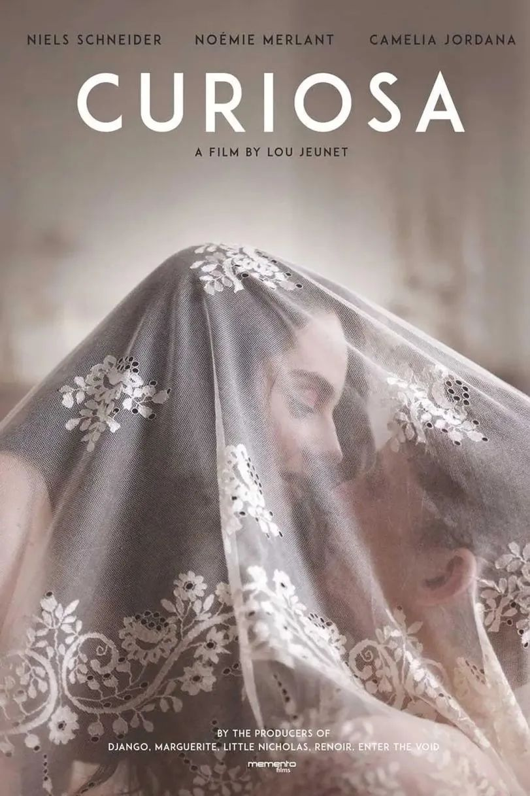

故事发生在十九世纪末的巴黎，诺米·梅兰特饰演的女主名叫玛丽。

她是一位导师的女儿，爸爸的两名学生皮埃尔和亨利，都疯狂地爱上了她。

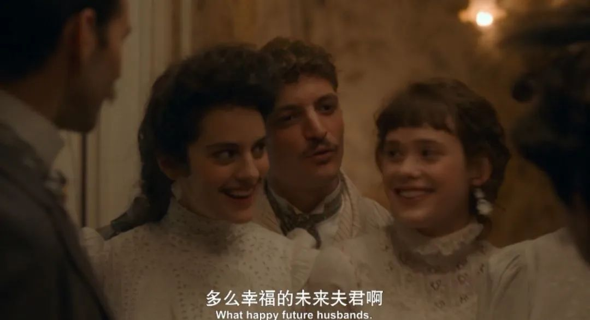

虽然在两人之中，女主更喜欢的是皮埃尔，但机会却降临到了亨利身上。

由于导师欠下债务，亨利就此向导师提亲，而为了让爸爸可以还债，女主只能顺理成章地同意这门亲事。

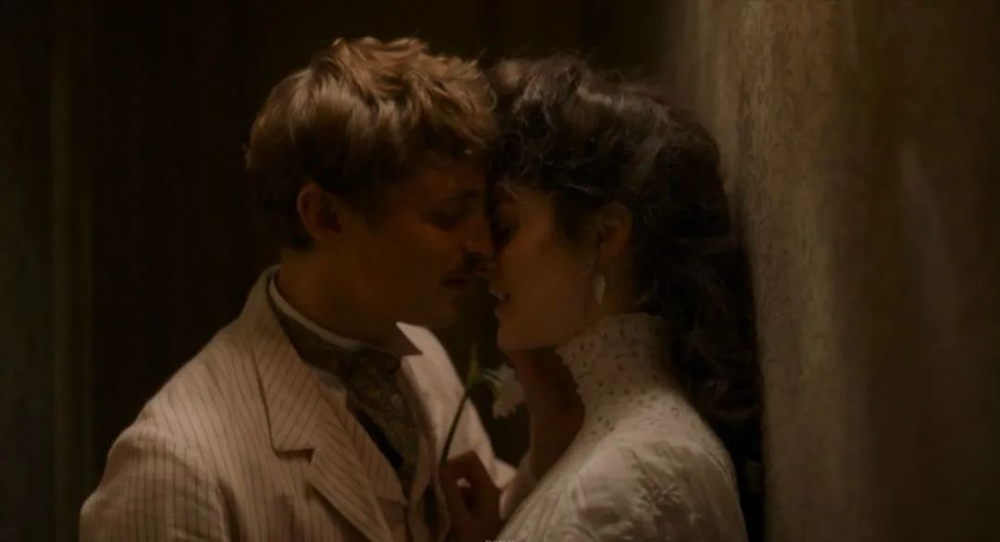

对此，皮埃尔尽管不悦，但也没有做出什么出格的举动。

因为在他看来，爱就是感官上的满足，他从来没有考虑过结婚的事。

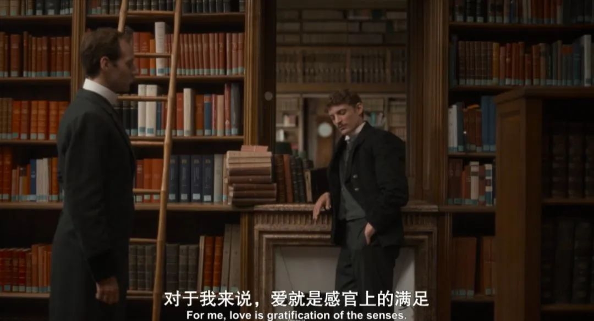

女主结婚后，皮埃尔还是像往常一样继续着花花公子的生活。没事就和朋友找来女模特轰趴作乐，聊聊诗词歌赋，拍拍前卫照片。

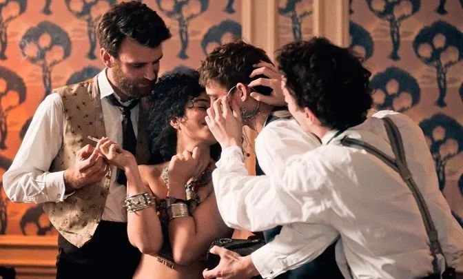

但女主却始终未能把他忘记。

没过多久，她就上门与皮埃尔做起了爱做的事，并迅速确定了情人关系。

紧接着，女主也成为了皮埃尔的模特之一，为他拍摄了大量私密艳照。

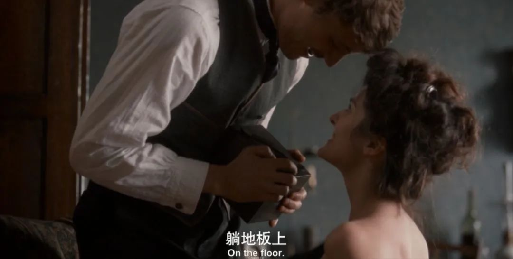

两人的关系亲密到什么程度呢？

他们可以借助报纸上的广告来传递爱意，可以看着照片写下令人羞耻的字句，甚至当着亨利的面，都忍不住找机会调情一番。

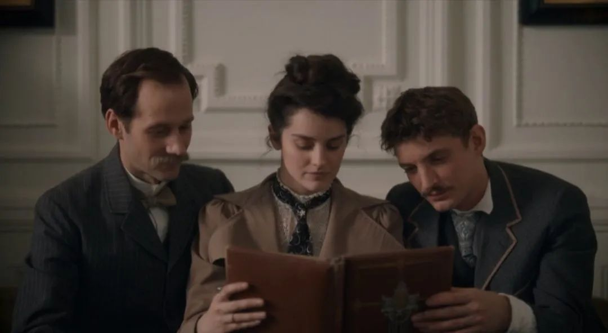

然而，纸毕竟是包不住火。没过多久，亨利就发现了女主的异常。

先是在一个趴体上，他察觉出女主看到皮埃尔与女模特一起出现时，过于敏感的反应；

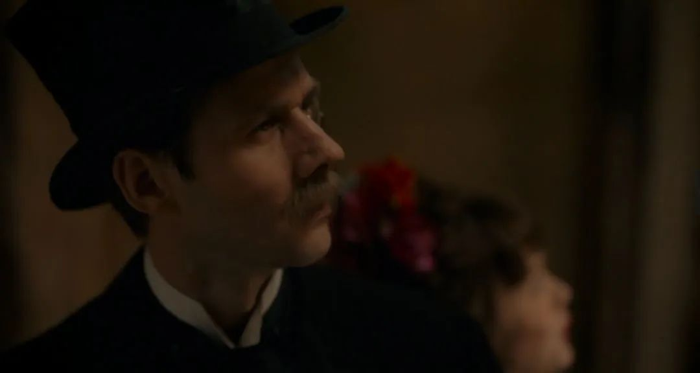

回到家后，他撬开女主的柜子，找到了尺度惊人的照片和两人写下的文字。

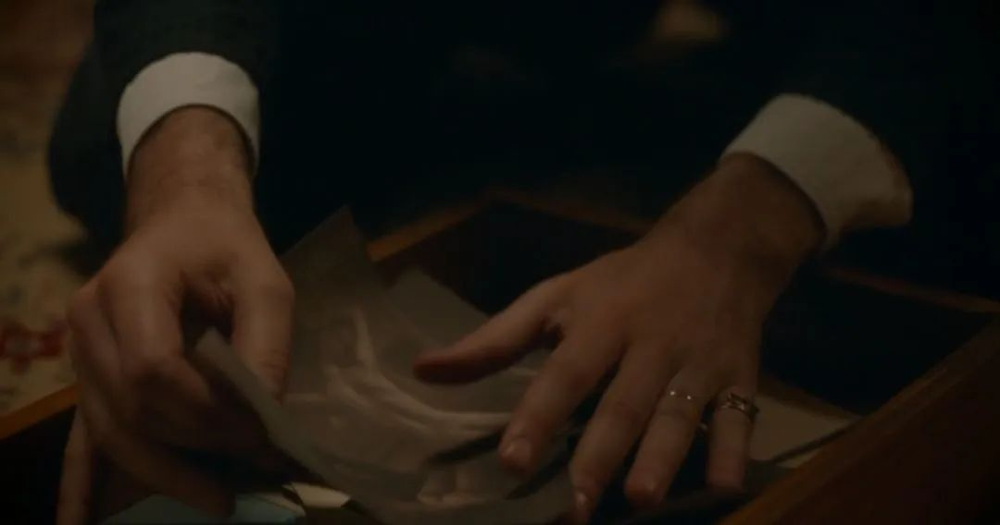

这气得他当场要强暴女主作为宣泄，然而却换来了更大的打击——女主明明白白地告诉亨利，自己并不爱他。

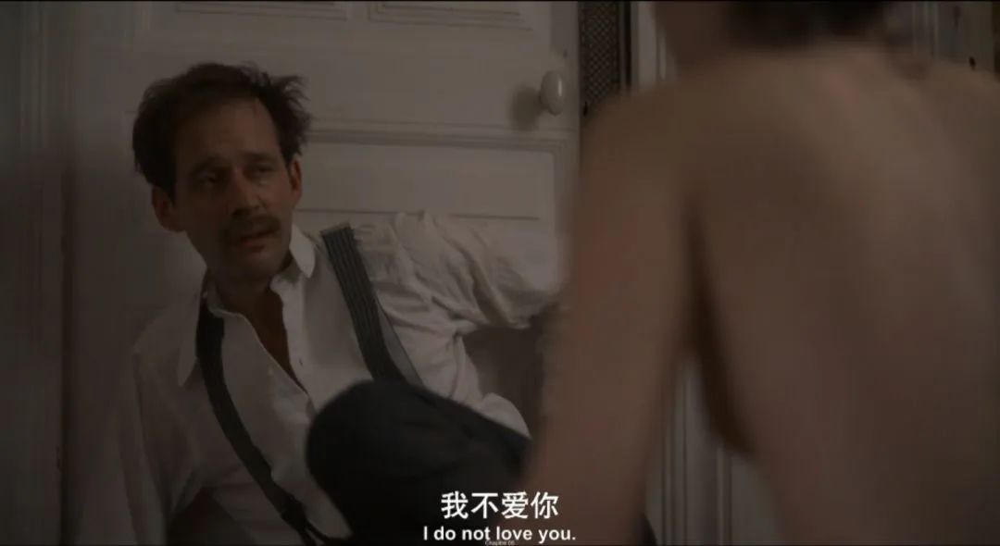

但即便如此，亨利仍然舍不得女主，继续和她维持着婚姻。

女主则一有时间就往皮埃尔那跑，继续着出轨的生活。

直到有一天，女主发现皮埃尔在和另一个女模特鬼混。

她决定登门拜访，亲自会一会这个情敌。

结果没想到，女主一进屋，整个画风就变了——两人聊着聊着不由自主地为爱鼓起掌来，女模特就这样被女主搞定。

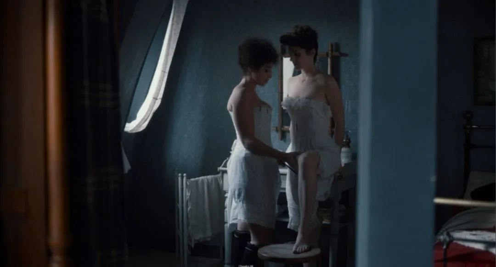

而亨利这边，他以退为进，决定从皮埃尔身上下手。

当得知皮埃尔为了女模特的事困扰时，他建议皮埃尔到阿尔及利亚去平复一下心情。

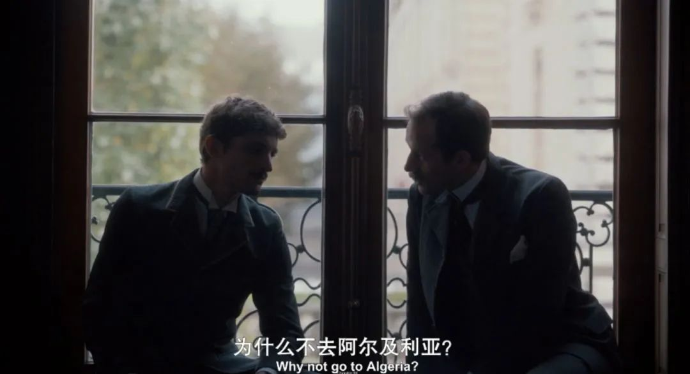

可惜的是，即便皮埃尔走了，他也未能得尝所愿。

对于女主失去情人后整日的郁郁寡欢，亨利完全束手无策。

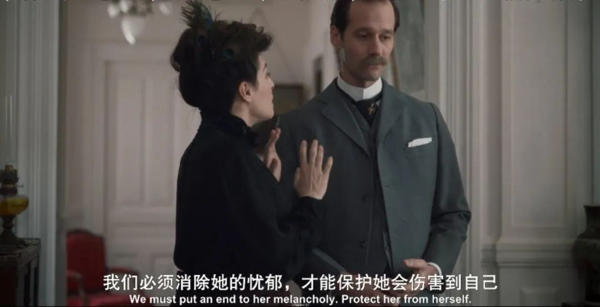

后来，女主和他生了个宝宝，但仍然对皮埃尔念念不忘。

亨利也只能尽力讨好女主，给宝宝起的名字都是皮埃尔。

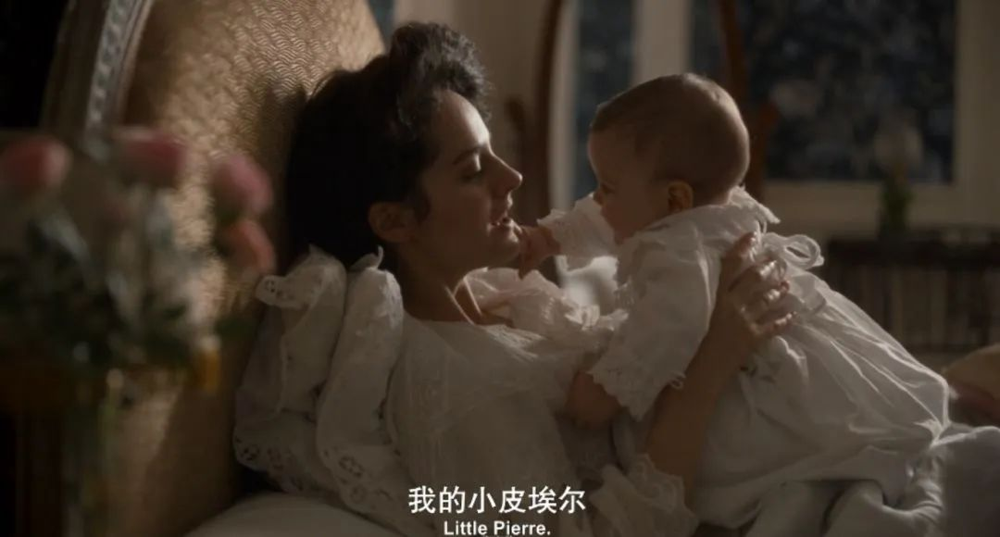

本来，亨利以为事情这样也就算过去了，日子还能正常过。

但偏偏有一天，夫妻俩在带着宝宝闲逛时，偶遇了回国的皮埃尔。

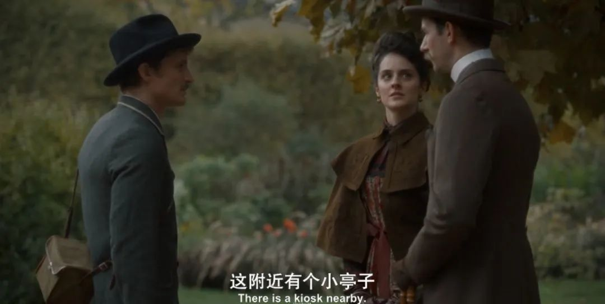

于是，女主与皮埃尔的爱迅速死灰复燃。

而亨利，为了友谊和体面，也为了对女主的爱，只能继续心甘情愿地当着绿帽奴。

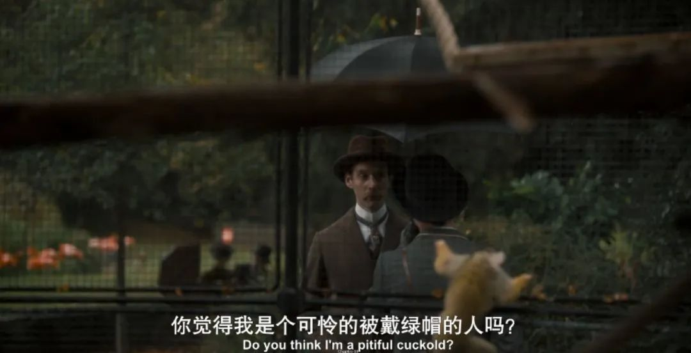

更惊人的是，没过多久，女主的妹妹到了适婚之际。

女主灵机一动，想出一个令人三观震碎的点子：她希望皮埃尔娶了妹妹，为此还特意给两人制造了滚床单的机会。

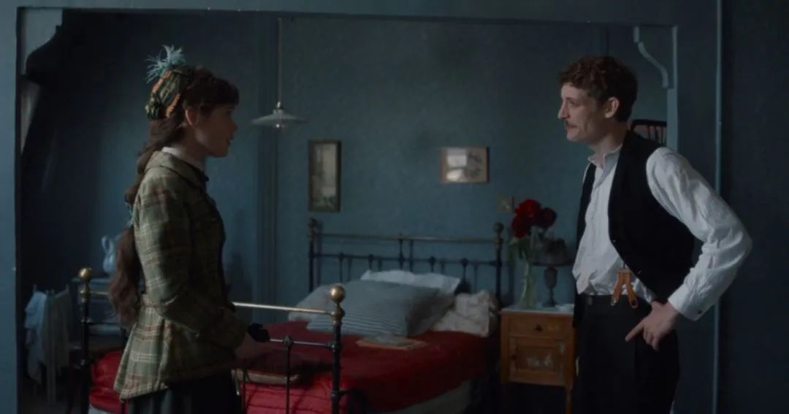

在女主看来，如果皮埃尔娶了别人，可能会像自己一样陷入不幸的婚姻，但娶了妹妹则可以时时想起自己，还可以对比姐妹俩的异同……

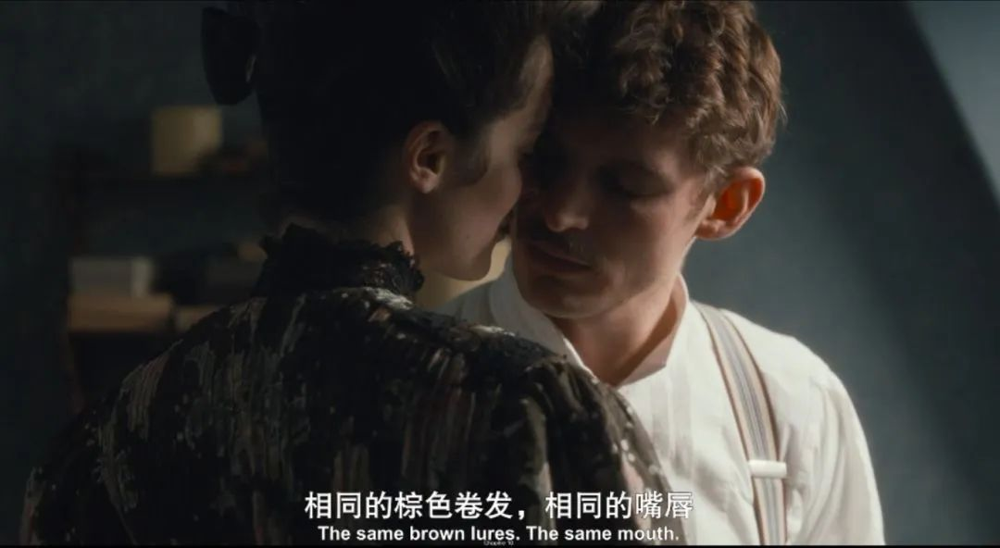

总之，法国人民的爱情观就是这么难以理解。

而这番匪夷所思的说辞，还真的打动了一直不想结婚的皮埃尔，使他从此拥有了齐人之福的生活，并拍摄出了更多惊世骇俗的作品。

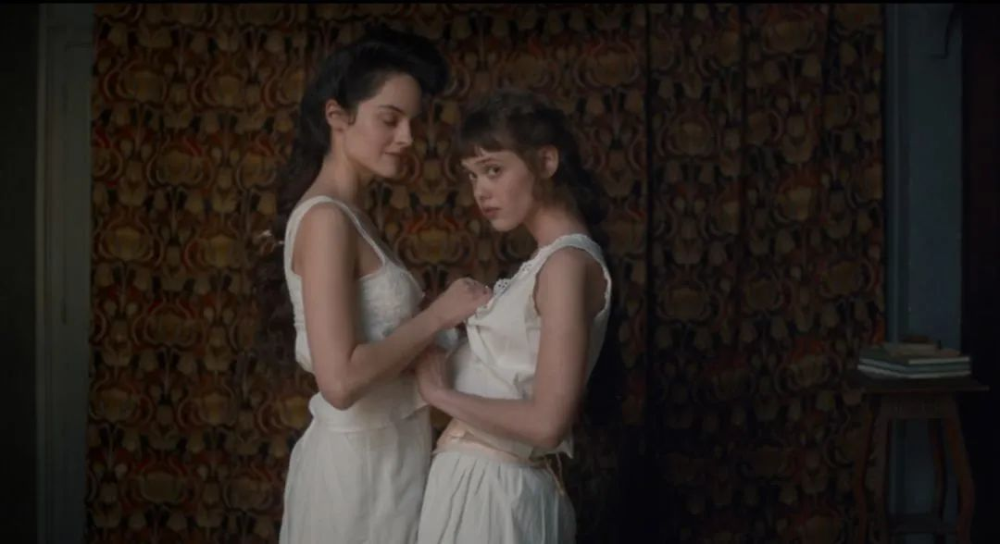

在影片的最后，亨利对女主的出轨已经习以为常。

尽管没能得到女主的爱，但能维持着婚姻关系对他而言也已是一种幸福。

而女主则把自己的感悟，以一个男性作者的身份写成了一本书，一经出版就成了爆款。

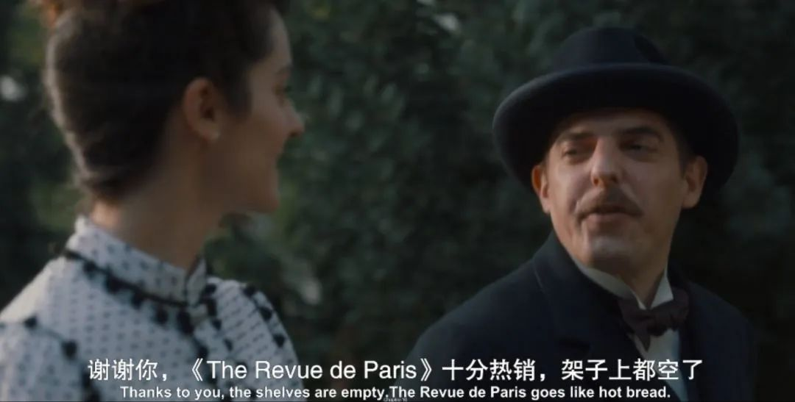

总的来说，这并不是一部能够用“三观”进行审视的作品。

如果从主流的两性道德来看，影片不外乎讲述了一个令人三观尽毁的离奇故事，其狗血程度恐怕只有一些泰剧能够一较高低。

**但影片并非来自杜撰，而是根据玛丽与皮埃尔的真实照片和信件改编，带有传记性质。**

这两人都是19世纪末法国文艺界响当当的人物，他们的真实生活，更加让人大跌眼镜。

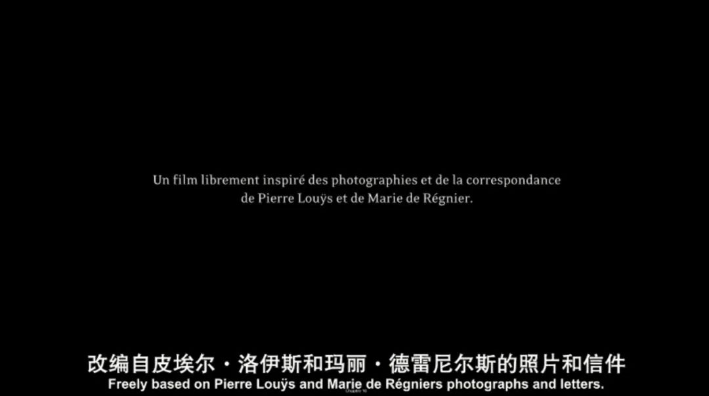

玛丽不仅是著名的小说家和诗人，还是一名公开的双性恋者。

她的感情生活十分丰富，除了片中所聚焦的皮埃尔和亨利以外，还有很多情人。

皮埃尔兼具诗人和作家的身份，在文学领域，他擅长色情文学，特别是女同题材，在私生活方面同样放浪形骸。

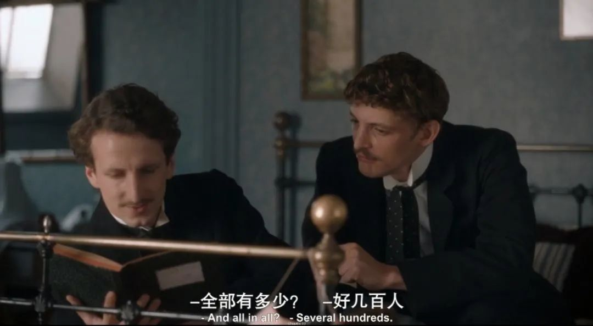

两人的种种行为，即便放在今天来看仍然是离经叛道的，更不要说在19世纪末了。

而相比现实，电影算是做了一定的简化处理，抛弃道德审查的视角来看，我们会发现导演将重点放在了对三人情爱观的解读。

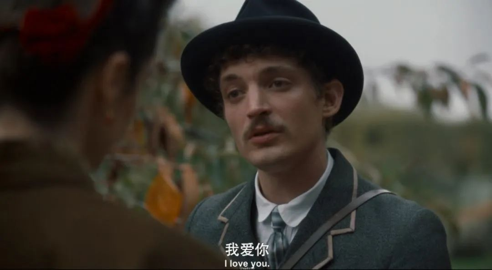

**在女主玛丽看来，爱是肆意澎湃的渴望，也是近乎信仰的执着。**

为此，世俗的伦理与界限都不能成为阻碍，即便与人分享爱人也不是问题。

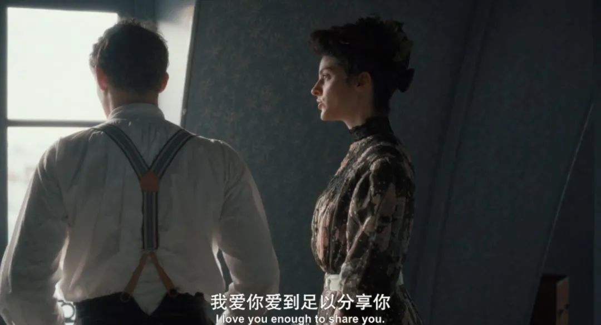

在皮埃尔看来，爱是感官的欢愉，道德不能成为猎艳路上的拦路虎。

他就像集邮一样流连于美好的肉体之间，从不觉得有任何不妥。

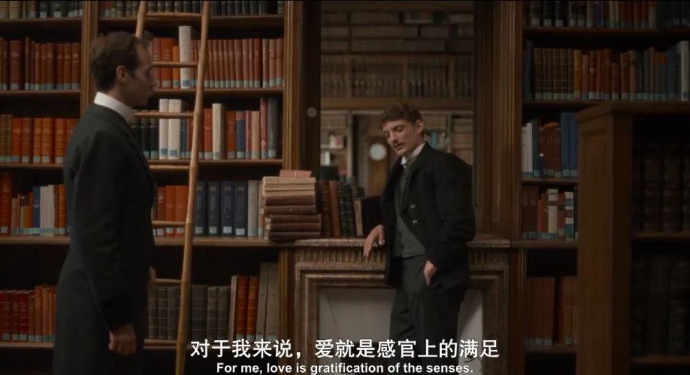

这两人的观念尽管有所区别，但指向的却都是同一个关键词：**激情。**

他们都愿意听从于本能的召唤，在追随情与欲的道路上无视一切。

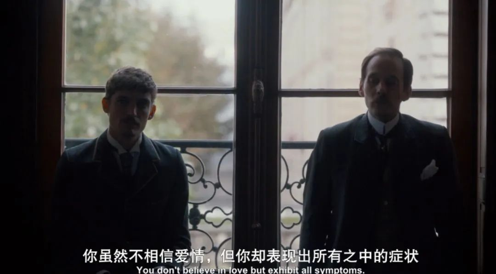

从某种程度上说，正是因为玛丽与皮埃尔是同一类人，所以他们才会彼此相爱。

而相比之下，亨利的爱情观却迥然不同，他选择背负更多的枷锁和顾及。

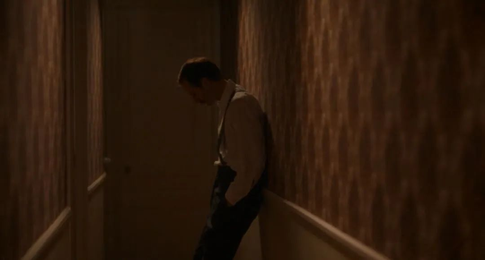

片中有这样一个情节，说当时的社会，女人不能单独去咖啡厅，可玛丽却喜欢和女性朋友们去咖啡厅约会。

亨利得知这事后，立马告诫玛丽不要再去；可皮埃尔却觉得，这不是什么大不了的事儿。

从这个生活细节中，就不难看出玛丽与亨利的观念差距。

然而，即便知道玛丽爱的不是自己，亨利也舍不得同她分开；即便知道皮埃尔绿了自己，他也不愿摊牌。

片中最能够体现亨利之爱的，是这样一幕——

在一墙之隔的两端，一边是与皮埃尔为爱鼓掌的女主，一边是贴墙倾听、眼眶湿润，选择接受这一切的亨利。

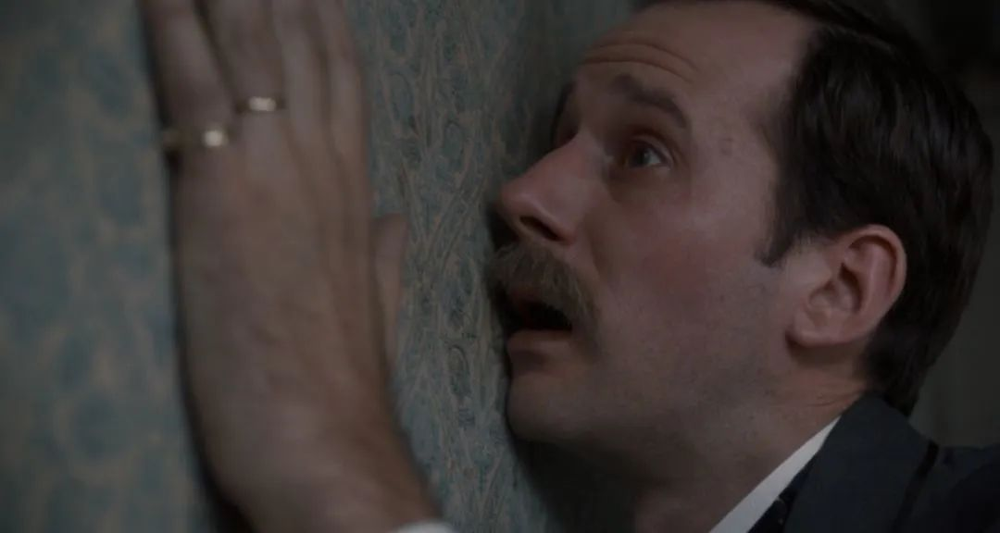

如此隐忍的爱，相信一般人都难以企及。

作为旁观者，你可以说这种爱过于卑微，但它同样也是爱情的一种形态。

即便你无法接受片中人物对待爱情的态度，这部影片也仍然值得一看。

它高度还原了19世纪末法国社会的人物面貌，构图、摄影精美至极，服化道、打光、布景等方面都非常讲究，具有极强的古典气息。

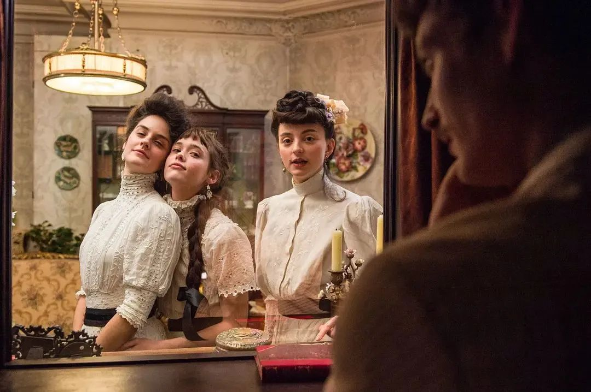

**即便是情欲和裸露的片段，影片也进行过精心设计，不仅没有半点色情意味，反而极具形式美感，绝对是一部集艺术性和观赏性于一身的范本。**

正是在这种油画般唯美的光影交错中，影片讲述了三人之间激烈而绵长的爱情纠缠。

在结尾处，玛丽的内心独白说道：**“这是上帝赐予我们的。生命中纯粹的乐趣，犹如时间过隙一般短暂。”**

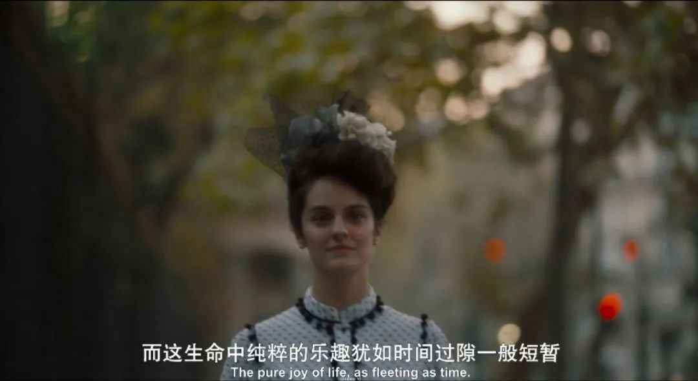

**片名中的“珍品”，或许指代的正是爱情这种“纯粹的乐趣”。**

**无论它呈现出什么形态，令人欢欣鼓舞还是伤心流泪，都是如珍品一般稀有的存在。**

正如《名利场》的作者萨克雷的名言——

**“爱而得其人，乃最佳之事；爱而失其人，仅次之。”**

