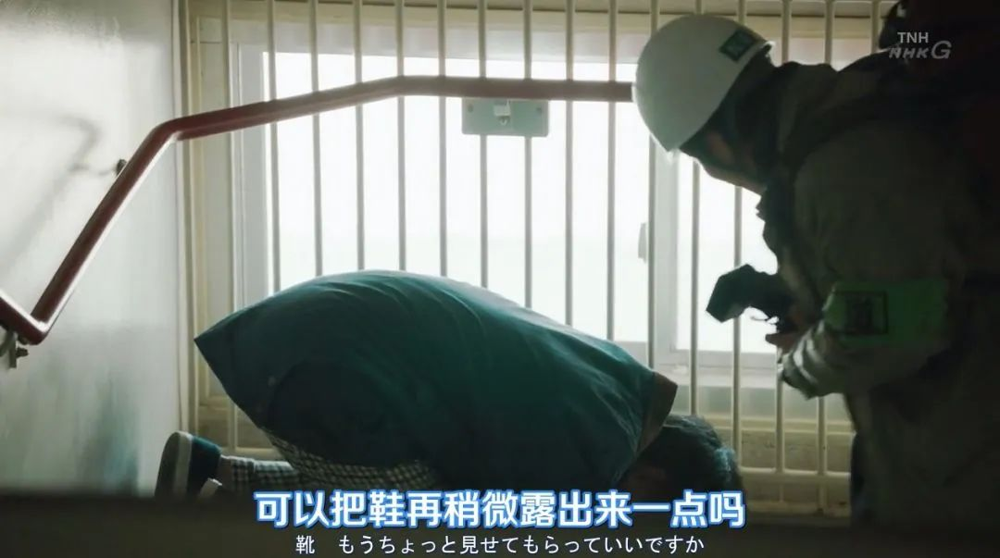
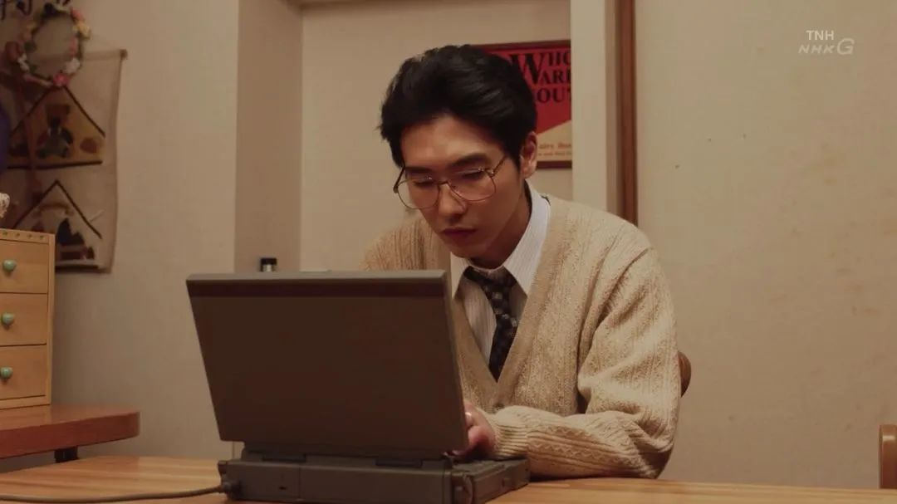

速读摘要

难过的是孩子小小年纪就亲历死亡，担心的是他因为这段经历，留下心理阴影。由于韩裔在日本受尽不公正待遇，他们不得不冠上日本姓氏来遮掩身份。剧中有位校长，因为在地震中失去妻子，患上了严重的创伤后应激障碍。尤其是后半段，当男主得知自己患上癌症，却又不敢告诉怀孕的妻子时，那种独自洞察死亡的恐惧与孤独，让很多观众都抑制不住地流下泪来。他的同事们则继承了他的遗志，推进中小学心理辅导室的建立，让孩子们在更健康的环境中成长。

原文约 2438  字  | 图片 42 张 | 建议阅读 5 分钟 | [评价反馈](https://static.app.yinxiang.com/embedded-web/clipper/#/Evaluating?d=2020-03-20&nu=98ac8c5e-9af0-4651-8972-aa23c84baa16&fr=myyxbj&ud=58b471&v=2&sig=0621B799D3F362E073827DAFC7A1CF59)

##  正在经历疫情的我们，都该看看这部岛国剧

原创 有部电影 [有部电影]()**
这两天，我刷到一条让人揪心的新闻——

24日，湖北十堰社区志愿者上门排查时，发现70岁老人谭某华在家中去世，只留下六岁大的孙子靠吃饼干充饥度日。

官方消息发布后，许多网友都感到既难过又担心：难过的是孩子小小年纪就亲历死亡，担心的是他因为这段经历，留下心理阴影。

在这场灾难中，有人经历了慌乱、恐惧，逐渐平静，有人目睹了亲友的离去，也有人无端遭受了排挤与歧视。

在疫情解除后，社会情绪和公众心理的平复，都需要一个愈疗过程。

这让我想到最近新出的一部医疗日剧，虽然是为纪念阪神大地震25周年所作，但讲的恰好就是灾后心理重建的故事——**《疗愈心中的伤口》。**

剧中的男主安田和隆，生于上世纪六十年代，跟父母兄弟住在日本关西。

直到10岁那年，他意外在家里翻出了外国人登记证，才知道原来自己本名叫安和隆，全家都是韩裔侨民。

当时，由于韩裔在日本受尽不公正待遇，他们不得不冠上日本姓氏来遮掩身份。

也正因为这个特殊状况，父亲创业经商、努力打拼，立志干出一番事业；还要求三个儿子也发愤图强，早日成为对社会有贡献的人。

这件事作为秘密，虽然再也没有被提起过，但却像巨石般压在男主心底，让原本就敏感细腻的他，在身份认同的困扰中度过了青葱岁月。

后来，他考上医科大学，搬去神户，也逐渐走出了成长阴影。

他决定恢复本姓，以真实的身份示人，还在导师永野良夫的引导下，选择了不被父亲认可的精神科。

再后来，男主遇到了志趣相投又同为韩裔的女孩终子，与她结为夫妇，组建了自己的家庭。

正是在终子的鼓励与支持下，他全身心投入到了病症治疗与研究中。

在34岁那年，男主成为了最年轻的精神科主任，全国各地的疑难杂症病患，纷纷慕名而来排队求诊。

至此，本剧虽然对男主的成长经历着墨不多，但却勾勒出了一个丰满鲜明的人物形象——

他是父亲眼中胆小又坚定的叛逆儿子，是给予妻子无限柔情的暖男丈夫，更是对病患竭尽所能、充满关爱的一位良医。

在1995年的阪神大地震发生后，男主身为受灾者却将妻女送回老家，然后第一时间赶到医院，随时待命。

当他看到那些被死亡阴影笼罩着的灾民时，立刻就想到了创伤后应激障碍，并决定去往各大庇护所开展治疗。

在他见到的人群中，有的是无法走出地震打击，靠逃避现实来调节情绪的孩子；

有的是在采访中见证了太多悲剧，一时间对人生产生怀疑的记者；

有的是为了逃生而对他人见死不救，事后受到良心谴责，无法摆脱幻听痛苦的普通人；

还有本身就患有多重人格障碍，在地震中经历过死里逃生后，变得更加敏感脆弱的精神病患。

在男主细心的观察与诊治下，这些灾难亲历者的伤痛，都得到了暂时的缓解。

他还通过精神科医生的独特视角，将所见所闻写成文章在报纸上连载，让更多人对灾区的真实情况有所了解。

正如我在开头所说，这部《疗愈心中的伤口》是为纪念阪神地震25周年制作，剧中的男主安和隆，也是以日本精神病理学家、PTSD研究的先驱者安克昌为原型。

虽然整部剧篇幅不长，一共只有4集，对于中国观众来说，“安克昌”这个名字应该也相当陌生，但这都不妨碍剧集在豆瓣上拿到8.8的高分。

这是因为，虽然剧中讲的是日本地震灾难，但对咱们眼下的疫情救援与心理重建，也具有一定的现实参考意义。

剧中出现的许多场景都逼真而写实，仿佛新闻中的乱象重现。

比如地震发生后，各地医护人员赶来支援神户，但却有个别灾民不仅不知感恩，还高高在上地辱骂护士不打扫卫生间；

比如相比地震造成的经济及生命损失，人们经常对心理创伤十分轻视，甚至抱有污名化的看法，宁愿忍受痛苦也不肯看精神科医生。

但事实上，经历了突发灾难或悲剧的人们，持续存在或延迟出现心理障碍的情况很常见。如果得不到及时干预治疗，很容易引发长期抑郁或酒精依赖等症状。

还比如，有些人不仅对灾区的居民没有同情，反而认为是他们“做坏事受天谴”，才会导致地震发生……

正是通过这些现象，以及与灾区民众的长时间接触，男主对灾后心理重建做出了反思。

他认为，除了医生们专业的心理疏导和情绪干预，人与人之间的相互陪伴，社会大众所营造的包容环境，同样是治愈心灵创伤的重要力量。

剧中有位校长，因为在地震中失去妻子，患上了严重的创伤后应激障碍。

他既不愿求助医生，也不想给女儿添麻烦，一度想通过自杀来结束痛苦，但最终从邻居那里感受到了人情温暖，重拾了活下去的勇气。

正如剧名“疗愈心中的伤口”所描绘，这部剧的基调有如春风拂面，无处不透着温情与治愈。

一方面，剧中大量鼓舞人心的对白，放到任何时候都能让人产生共鸣。

比如男主看到患者陷入自卑时，告诉她“能够在无法忍受的痛苦与悲伤中，仍然寻找活下去的方法，这本身就是生命力的强大”；

比如他在得知病人的悲惨遭遇后，感慨“仅仅是活着就会有这么多伤心的事，为什么还有人要故意做些伤害别人的事情呢？”

这些看似平实朴素却极具生活哲理的台词，看完后不仅让人感到内心一颤，也会随之陷入深思。

另一方面，剧中演员们不着痕迹的细腻演技，也为剧情增添了真实动人的力量。

尤其是后半段，当男主得知自己患上癌症，却又不敢告诉怀孕的妻子时，那种独自洞察死亡的恐惧与孤独，让很多观众都抑制不住地流下泪来。

但恐惧之后，他立刻意识到自己还有许多计划没有完成，于是擦干眼泪拿出纸笔，将它们一一列举记录下来。

为了不浪费剩余的时间，他放弃了缓解疼痛的药物化疗，争取时间做好工作交接，也为妻子和孩子留下最后一段宝贵的共处时光。

男主在弥留之际意识到，无论是灾难受害者还是精神病患，他们最大的苦难都不是忍受病痛折磨，而是被其他人排挤孤立在世界之外。

而所谓“心灵的治愈”，就是不让任何人感到“落单”，让每个有需要的人都能找到机会倾诉，让每个人都活在被尊重和被关怀的世界里，这才是他倾尽一生为之努力的事情。

在故事的结尾，男主安和隆在39岁时英年早逝。但他的著作《疗愈心中的伤口》，至今还在帮助人们走出伤痛，他的精神追求也鼓舞了许多后来者。

有的高中生在看到他的故事后，立志投身医学，成为一名精神科医生；

他的同事们则继承了他的遗志，推进中小学心理辅导室的建立，让孩子们在更健康的环境中成长。

他的大哥作为原子力学教授，在福岛核电站发生爆炸后，也从美国返回了日本，决定为核泄漏事故的后续处理出谋划策。

就像男主在剧中所说的，“真正治愈人们心灵创伤的不是医生，医生能够做到的，也只是陪伴在那些想要恢复健康的人们身边。”

**如果你也曾因为疫情而陷入沮丧，无法走出不好的心理状态，不妨现在就点开这部温情脉脉的医疗剧，获得一些心灵抚慰。****在被治愈的同时明白：****不止有医生在竭尽所能地帮助病患，作为普通人，我们也可以随时随地伸出援手，成为治愈他人的力量。**

