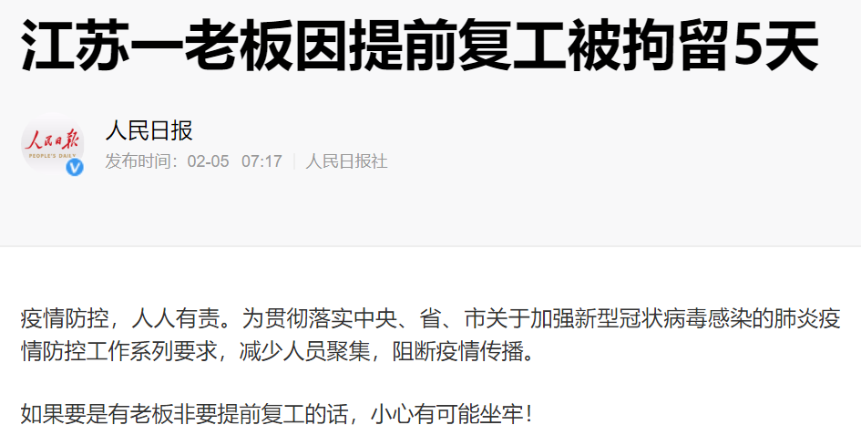

速读摘要

同肯·洛奇的大多数作品一样，本片聚焦的仍然是英国社会里失意的小人物。男主这边，他像其他司机一样吃苦耐劳，一天工作14个小时，每周工作6天，所有的快递都准时准点送达。像男主这种快递司机，送了多少件、走的什么路线、每个件送达是否超时，都会被全面监控。比如像男主这种不具备资源和资本的社会底层，并没有选择工作的自由。而即便是那些有幸获得工作的人，也会被糟糕的工作状态影响到健康、家庭生活和情感关系。

原文约 2580  字  | 图片 59 张 | 建议阅读 6 分钟 | [评价反馈](https://static.app.yinxiang.com/embedded-web/clipper/#/Evaluating?d=2020-03-20&nu=620e64d3-639d-4deb-85a1-00e01624fa47&fr=myyxbj&ud=58b471&v=2&sig=17139B3ED2925C96B03C5EC6D250EED7)

##  贫贱家庭百事哀，底层人民的生活究竟有多惨？

原创 有部电影 [有部电影]()**
今天来聊一部去年戛纳电影节的遗珠。

其实，说到去年的戛纳电影节，我们已经聊过其中的不少作品。

比如，让安东尼奥·班德拉斯摘得影帝桂冠的阿莫多瓦电影《痛苦与荣耀》：

.jpg)

比如让艾米丽·比查姆夺得影后殊荣的科幻惊悚片《小小乔》：

.jpg)

还有为韩国电影拿下首个金棕榈的《寄生虫》：

.jpg)

而今天要聊的这部作品，热度或许远没有上面那几部高，但质量同样令人惊喜。

它同样将视角对准了底层人民，基调比《寄生虫》更加现实而残酷——**《对不起，我们错过了你》。**

.jpg)

影片出自英国名导肯·洛奇之手，他出身于工人家庭，自从事影视行业开始，就一直致力于反映社会现实，坚持现实主义的创作思路，用镜头为底层呐喊。

.jpg)

几十年来，肯·洛奇拍摄了一部又一部抨击社会弊病、为底层代言的经典佳作。

此前，他曾凭借《风吹麦浪》《我是布莱克》捧得两座金棕榈大奖，这部《对不起，我们错过了你》在戛纳首映后，更是出现了“三封金棕榈”的呼声。

.jpg)
《我是布莱克》

虽然影片最终败给了奉俊昊的《寄生虫》，但就品质而言，本片绝对不在其下，豆瓣8.2的高分，也足见国内影迷对它的认可。

.jpg)

同肯·洛奇的大多数作品一样，本片聚焦的仍然是英国社会里失意的小人物。

故事发生在一个四口之家中。

因为遭遇次贷危机，身为男主的爸爸失去了工作，负债累累。为了养家，他做过各种各样的工作，最近正打算去做快递司机。

.jpg)
.jpg)

在中介的诱导下，他卖掉了家里的车，通过按揭的方式买了一辆货车，正式成为自己的老板，投身到送快递的行当之中。

.jpg)
.jpg)

他信心十足地以为，只要自己放手一搏，日复一日地努力工作，就会带领这个家从此走出困境。

但未曾想，这却是他们更大苦难的开始。

.jpg)
.jpg)
.jpg)

起初，一切的进展还算顺利。

男主这边，他像其他司机一样吃苦耐劳，一天工作14个小时，每周工作6天，所有的快递都准时准点送达。

.jpg)

而妻子这边，尽管没有了车很不方便，但她也尽心尽力完成护理工作，坐着公交奔波于老弱病残的客户间。

.jpg)

只可惜，没过多久，他们的困境就渐渐浮出了水面。

首先是叛逆的儿子总是逃学玩涂鸦，男主本来就因为工作身心俱疲，看到儿子这么不争气更是愤怒，父子俩很快就陷入了相互指责和争吵中。

.jpg)

接着是妻子在照顾客户时，明明尽职尽责，结果却没有加班费，还被公司安排更多的活，就连一家人一起吃晚饭时，都会突然被叫走去工作。

.jpg)
.jpg)
.jpg)

很快，因为儿子的问题，男主在工作上也备受困扰。

比如儿子打架，学校叫家长，男主要送快递去不了，憋了一肚子火，最后和一个不配合的收件人争吵了起来：

.jpg)

比如儿子因为偷窃被警察带走，男主不得不为此请假，结果被主管记了一次警告，罚了一天工资。

.jpg)

后来，女儿看到了男主和哥哥的争吵，私自偷了货车的钥匙，想着这样爸爸就可以不上班多陪陪家里人，结果这导致男主再次被罚，收到“开除警告”。

.jpg)
.jpg)

好不容易，男主找到了钥匙回去工作，又遇到了歹徒，快递被抢，男主被揍了一顿不说，主管还要求他再赔偿1000磅……

.jpg)

这一切都让男主感到心力交瘁，他和家庭根本无力承担。

于是，刚一出院，他就不顾妻子和孩子的反对，带着伤开车去工作。因为他知道，自己如果这时再失业，整个家就彻底完了。

.jpg)

就这样，整部影片在男主满脸挣扎与痛苦的开车镜头中结束。就像苦难的生活没有尽头一样，他拼尽了全力，也只能苟延残喘地前行。

.jpg)

从表面上看这个故事，我们很容易得出“熊孩子坑爹”和“贫贱夫妻百事哀”的结论，但这显然不是导演想要传递给观众的呐喊和思考。

.jpg)

马克思曾经说过，资本来到世间，从头到脚每个毛孔都滴着血。

通过平实的镜头语言，肯·洛奇借助这一家四口的悲剧，所反映的正是在生产力高度发达、科技带来巨变的今天，由于资本的主导，底层人民“更加贫贱更加哀”的问题。

.jpg)

由于权力和资源的不对等，资本裹挟着技术对工人阶层呈现出越来越强势的的碾压姿态。

.jpg)

在片中，快递公司以“合作加盟”、“自雇”的美好说辞做掩盖，成功实现了合法压榨，规避了企业应该缴纳的保险和加班费，将责任全部推到了快递司机身上。

.jpg)
.jpg)
.jpg)
.jpg)
.jpg)

而快递司机们想要获得服务费，不仅需要兢兢业业工作，还必须长期透支体力，牺牲个人和家庭的一切，无论出于什么原因请假，都会面临着罚款和被开除的威胁。

.jpg)

同男主的悲惨遭遇一样，那些被老婆赶出门的、女儿企图自杀的、姐姐中风的、需要做手术的司机们，主管也通通不会批假。

因为他只为绩效服务，身上体现的是资本的意志。

.jpg)

更悲剧的是，大数据、互联网等新技术，为资本对员工的剥削，提供了更加精确而缜密的工具。

像男主这种快递司机，送了多少件、走的什么路线、每个件送达是否超时，都会被全面监控。

.jpg)

平心而论，这些技术的确将效率发挥到了极致，让企业的效益大大提高，可以有效防止员工浑水摸鱼等行为。但与此同时，却也无视了人本身的感受和外界的不确定因素，将人彻底矮化为一件工具。

.jpg)

虽然说站在资本背后的，是一个个具体的人，但出于竞争和利益的需要，公司管理层做出“铁板一块、冷漠无情”的行为，却并不罕见。

.jpg)

去年，马云有过“996福报”的言论；南京环卫工人曾被要求戴上实时定位跟踪的智能手环，原地停留超过20分钟，就会被“加油”。

.jpg)

即便是最近，为了防控新冠肺炎的传播，1月27日国务院办公厅发布通知，延长春节假期至2月2日，有网友把通知转发到公司群里，还遭到了副总的无理谩骂……

.jpg)

还有的企业，甚至无视社会影响和政府规定，罔顾员工和他人的生命安全提前复工，造成人员聚集。

客观来讲，面对疫情，企业和员工都有巨大的难处，很多企业还可能面临倒闭的风险。这个时候需要大家互相理解、共克时艰，但在大是大非和生命安危面前，无论企业还是个人都应该坚守底线。

回到电影中来看，新自由主义的价值观认为，工作是自由和自我实现的一个途径，一个工作如果压力太大太繁重，人们完全可以选择辞职另谋出路。

.jpg)

只是，这种思维忽视了芸芸众生的差别和现实世界的复杂。

比如像男主这种不具备资源和资本的社会底层，并没有选择工作的自由。他们终日所担心的，是如何不丢掉饭碗，不让生活陷入绝境。

.jpg)

咱们聊过的纪录片《美国工厂》中，也提到过科技的发展反而使底层更加无力，甚至会被机器代替，他们现在面临的是“想要被剥削而不得”的无望。

.jpg)

而即便是那些有幸获得工作的人，也会被糟糕的工作状态影响到健康、家庭生活和情感关系。

片中的男主含辛茹苦地工作，结果就没有了时间和精力陪伴家人。

.jpg)

他也想做一个好丈夫、好爸爸，可是面对叛逆的儿子，他没有办法给予足够的陪伴和引导，对于儿子一次次做出错事，他束手无策，只能与之争吵，随后又陷入自责。

.jpg)

片中有这样一个短暂的温馨时刻——因为妻子临时被叫去工作，男主听了儿子的建议，开货车送妻子过去。一家人在车上开心地唱着歌，仿佛一场短暂的逃离。

.jpg)

除此之外，在女儿偷钥匙、儿子劝爸爸不要去上班的背后，也存在着这样一句潜台词——一切回到从前。

.jpg)

从前什么样呢？

至少男主和妻子的工作没有远超负荷，他们有足够的时间去休息和享受亲情。如果回到从前，一家人不会有那么多争吵，儿子也不会做出那么多错事。

.jpg)
.jpg)

**人们常说，要处理好工作和生活的平衡，不能顾此失彼。**

**只是对于很多人而言，这像是一个奢侈的梦。虽然影片看得令人唏嘘，但转过身还是要继续好好工作，努力赚钱。没有人的生活是容易的，唯愿你我认清了这个真相后，仍然愿意认认真真地生活。**

