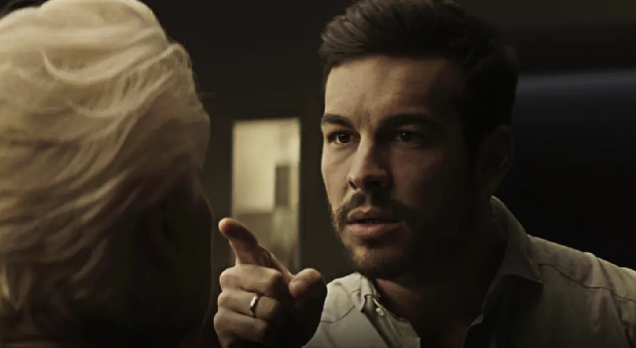

速读摘要

男主哈维尔在广告界打拼多年，曾创作出不少经典的广告作品，人到中年已经成为公司高管，住在一套能看到城市美景的高档公寓。他打量着熟悉又陌生的房间，到处查看新主人的情况，发现这家主人有一个喜欢艺术体操的女儿，拿过的奖杯都摆满了书架。为了进一步激怒托马斯，哈维尔带着托马斯的妻子女儿去参观了体操运动员训练，实现了小女孩的偶像梦，还把合影发给了托马斯。托马斯看到照片，当晚就气急败坏地回到家找妻子对峙，妻子慌忙中拿起那瓶防狼喷雾一通猛喷，没想到没几秒钟后，托马斯就窒息倒地。

原文约 2453  字  | 图片 39 张 | 建议阅读 5 分钟 | [评价反馈](https://static.app.yinxiang.com/embedded-web/clipper/#/Evaluating?d=2020-04-06&nu=e532e6f3-cc87-4cdb-ba8f-f336568b09e5&fr=myyxbj&ud=58b471&v=2&sig=20DD105DE119F2828E238835457B43E7)

##  杀夫夺妻占房子，这个心机男太可怕了

原创 有部电影 [有部电影]()**
今天给大家聊的这部西班牙电影，两个男主大家都很熟悉。

一个是马里奥·卡萨斯，《看不见的客人》里那个深藏不露装无辜的企业家；

另一个是哈维尔·古铁雷斯，《作家》里为了寻找写作灵感肆意操纵别人生活的作家。

这两个都扮演过究极心机男的演员，这次在惊悚片**《家怨》**里相遇，并展开了一场特别的较量。

男主哈维尔在广告界打拼多年，曾创作出不少经典的广告作品，人到中年已经成为公司高管，住在一套能看到城市美景的高档公寓。

.jpg)

但就在事业家庭两全的人生阶段，他突然被公司裁员，不得不像职场小白一样从头再来，到处投简历、跑面试。

.jpg)

理论上说，像哈维尔这样经验丰富的老手，找到工作并不困难。

但实际上，在竞争激烈、人才辈出的广告界，他这种对薪资要求偏高的资深人士，反而不容易找新工作，很多公司都更喜欢聘用廉价的职场小白。

而且哈维尔已经有一年没有拿出像样的作品，所以经常因“创新精神不足”被拒绝。

.jpg)

就这样，失业的哈维尔生活也受到影响。

由于交不起房租，一家三口不得不搬离高档公寓，儿子被迫转学去公立学校，妻子找了份夜班兼职，保姆也被辞退了。

.jpg)

好不容易凭借过去的人脉，在一家公司拿到了录用通知，结果哈维尔又发现要签零报酬的实习生合同……

.jpg)

这等羞辱让哈维尔气不打一处来，晚上开着车跑出去散心。

恍惚间他来到了以前住的那栋高级公寓，发现那里已经有了新主人，也是一个幸福的三口之家。

.jpg)

在那一瞬间，哈维尔产生了一个诡异的念头——拿着保姆交还的那套公寓钥匙，再次回到原来的家。

.jpg)

第二天，他在确认新房主人离开后，通过公寓地库悄悄进入了公寓。

.jpg)

他打量着熟悉又陌生的房间，到处查看新主人的情况，发现这家主人有一个喜欢艺术体操的女儿，拿过的奖杯都摆满了书架。

这让哈维尔意识到，自己平时只顾着工作，连自己儿子的爱好都不清楚，想到儿子在学校里被同学嘲笑是个胖墩，他更是内疚不已。

.jpg)

回到家里，哈维尔就拉着儿子出去跑步，用实际行动表达自己的父爱。但没想到练得太猛，儿子直接累到当街呕吐。

.jpg)

妻子心疼儿子，责备哈维尔把找工作的压力转嫁给了孩子。这下搞得哈维尔更加闷闷不乐，又鬼使神差地想起了原来的住处……

没过几天，他再次登堂入室，开始随意翻看主人的电话记录、电脑资料等等。

.jpg)

哈维尔发现，这家人曾经遭遇过一次严重的车祸，男主人酒后开车，导致同车的妻子和女儿受伤严重。

.jpg)

从那以后，男主人就加入了戒瘾互助会，但每次坚持不了多久就又被酒精诱惑。

通过电脑里的行程计划，哈维尔发现，男主人即将再次参加教堂主办的互助会。

.jpg)

于是，他也按行程里的时间去了教堂，见到了公寓的男主人托马斯。

.jpg)

为了接近对方，哈维尔假装自己是刚开始戒瘾的患者，在分享时故意说自己与酒瘾战斗了一年，为此搞得妻离子散，如今希望尽快摆脱瘾症，变成更好的自己。

.jpg)

这话立刻让在场的托马斯百感交集，神不知鬼不觉地掉入了哈维尔的“交友陷阱”。

通过这番往来，哈维尔发现托马斯是个大公司老板的入赘女婿，为了在岳父面前证明自己的能力，他总是忙于工作，渐渐忽略了妻子和女儿。

.jpg)

为了赢得对方好感，哈维尔就以“过来人”的身份开导托马斯，还把自己塑造成正在与酒精作斗争的可怜离异男人，劝他不要重蹈自己的覆辙。

善良的托马斯轻信了哈维尔，开始对他无话不谈，连自己对花生过敏都告诉了他，还热情邀请他到家里吃饭。

就这样，哈维尔第一次以光明正大的方式，重新回到了原来的住处。

.jpg)

看到这里，估计小伙伴们都有点疑惑，哈维尔干嘛不赶紧找工作，反而开始纠结住处的事？

实际上，那栋能看的见城市全貌的公寓，正是哈维尔心中最完美的家。

在从业经历中，他最得意的作品是一则家电广告——男主人忙碌一天回到家中，拥抱孩子亲吻妻子，享受高档家电带来的精致生活，在家人的欢声笑语中结束这一天。

.jpg)

从哈维尔写下的广告语“不虚此生”就能看出，他对于精致生活的向往。

然而精致生活太过脆弱，当他无法再为公司提供源源不断的利益时，之前所拥有的一切，也瞬间变为泡影。

.jpg)

心里想着曾经拥有的城景房，身体却住着水龙头漏水的低档民宅。

这样的落差，让哈维尔内心产生了变化，觉得只要再次成为房子的主人，他就可以重新拥有原来的生活。

.jpg)

正是在这种念头的趋势下，他才开始接近托马斯，暗中展开一个邪恶的计划。

他假装自己酒后发生车祸，请求托马斯的帮助。结果当晚，托马斯浑身沾了酒气回家，被妻子怀疑戒瘾失败。

.jpg)

随后，他又拿托马斯的手机给自己发了一条短信，让夫妻俩的误解更深，搞得托马斯被妻子赶出家门。

.jpg)

这时，托马斯才意识到自己交友不慎，对哈维尔大打出手。

但他没想到，哈维尔转头就顶着一脸伤去找他妻子，继续编造谎言挑拨离间，还假装好心地送了她一瓶防狼喷雾防身。

.jpg)

为了进一步激怒托马斯，哈维尔带着托马斯的妻子女儿去参观了体操运动员训练，实现了小女孩的偶像梦，还把合影发给了托马斯。

.jpg)

托马斯看到照片，当晚就气急败坏地回到家找妻子对峙，妻子慌忙中拿起那瓶防狼喷雾一通猛喷，没想到没几秒钟后，托马斯就窒息倒地。

原来，防狼喷雾早就被哈维尔注入了花生油。

.jpg)

随后，哈维尔如同救兵一般赶到现场，一边让托马斯的妻女进屋躲避，一边掉包做了手脚的喷雾，并悄悄闷死了奄奄一息的托马斯。

.jpg)

更离谱的是，这场风波之后，哈维尔索性与妻子离婚，娶了托马斯的妻子，不仅重新拥有了豪宅，还做了大老板的女婿，重新成为公司高管、社会精英。

.jpg)

在影片结尾，他就像自己广告里的男主一样，下班回到家拥抱妻子女儿，欣赏着自己拥有的一切……

.jpg)

这个结局看上去是坏人得逞了，但影片最后一个水龙头漏水的镜头，正暗示着精致的生活背后，正潜伏着未知的危机。

.jpg)

对于这样一个鸠占鹊巢、坏人得逞的故事，很多人都不太能接受，有人还认为它的情节有漏洞。

但在我看来，这部《家怨》其实和去年大火的《寄生虫》一样，重点不在逻辑，而是故事背后对于人性的刻画。

整部电影讲的，就是男主在长期失业的状态下，如何一步步任由自己被邪念异化，最终演变成杀人凶手的过程。

.jpg)

片中最具惊悚意味的镜头，就是画面多次对准男主的背面，让你看不到任何表情，也无法从肢体动作猜出他的心理活动，但却能逐步感受到他令人不安的气场。

.jpg)

换个角度看，这个惊悚故事也带有一定的讽刺意味。

片中的哈维尔之所以会被公司裁员，其实是因为他成为高管后，就开始满足于现状，不再设立目标挑战自我，慢慢变成行业内的异类。

但他并没意识到这点，嘴上强调自己不惧挑战，但作品里体现出的却是因循守旧，就连对“家”的概念，也停留在几十年前“豪宅生活”的水平。

.jpg)

**可以说，正是这种停滞不前又不自知的状态，渐渐让哈维尔走向了死路。他不择手段地想让自己的生活回到原貌，但殊不知，这样只会让自己被淘汰得更快。**

**不论身处高位还是低谷，如何不让自己停留在自我幻想中、逐渐走向迷失，才是这部电影为我们留下的问题。**

也许是国内最认真的电影自媒体
长按扫描二维码关注

在看