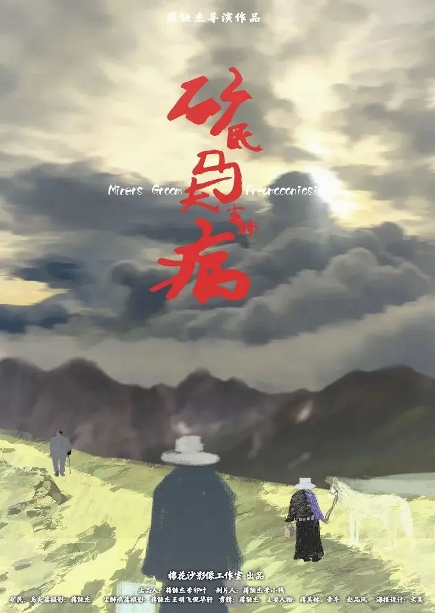

速读摘要

内容敏感，这部电影从来没上映过，也没有任何平台肯播出，为了人们能够看到它，导演只能亲自放出资源。我们都知道，挖矿是很危险的，当地很多矿都没有足够的安全保障，好的炸药又搞不到，有时还会使用有毒的假炸药，矿难总是不断发生。挖矿的时候，他们也没有足够的劳保和防护意识，以至于纷纷患上了职业病。因为拥有的资源和知识所限，他们没有更好的选择。导演们不拍，这些社会问题就会凭空消失吗?

原文约 2780  字  | 图片 52 张 | 建议阅读 6 分钟 | [评价反馈](https://static.app.yinxiang.com/embedded-web/clipper/#/Evaluating?d=2020-04-01&nu=c6f38bc6-46dc-40a4-8080-6903daa780a8&fr=myyxbj&ud=58b471&v=2&sig=9D9623F0CF8638EF586E16E7F9045B05)

##  豆瓣8.7，必看的国产电影，真正的现实主义

原创 有部电影 [有部电影]()**
最近，有一部国产纪录片火了，在一天之内就冲上了豆瓣实时热门电影第一名。

但由于内容敏感，这部电影从来没上映过，也没有任何平台肯播出，为了人们能够看到它，导演只能亲自放出资源。

为此，导演蹲守在影片的豆瓣词条下，但凡有人标注想看，就会关注对方，给对方私信发去资源链接。

就这样，经过导演一遍遍分享，网友们自发的口口相传后，影片才硬生生地意外走红，并获得了8.7分的好评。

**可以说，从来没有一部电影是以这样一种魔幻而讽刺的方式走红的。**

它到底讲了些什么，逼得导演如此走投无路？

今天咱们就一块来看看这部——**《矿民、马夫、尘肺病》。**

这并不是一部来自大公司、大制作的影片，它的背后是一群心怀理想和信念的独立电影人。

导演蒋能杰，是名湖南的85后，多年以来，他的作品始终关注留守儿童、工人、老兵等弱势群体，这部《矿民、马夫、尘肺病》也不例外。

片名中的三个关键词，不仅直接表明了影片聚焦的群体所在，也暗示了它不言自明的沉重底色。

片中记录的故事，发生在湖南湘西南的山村。

那里矿藏丰富，从清末就有人开采矿石。由于经济不发达，当地老百姓没有别的门路，如果不出去打工，能做的也就是上山挖矿。

矿民的意思，自然指的就是这些挖矿的人。

而所谓的马夫，则是那些使用马匹运送炸药、矿物和非法开采物资的人。

影片一开头，就是2010年冬天，马夫蒋美林等人天还没亮就起身，运送物资到矿洞的情景。

我们都知道，挖矿是很危险的，当地很多矿都没有足够的安全保障，好的炸药又搞不到，有时还会使用有毒的假炸药，矿难总是不断发生。

尽管政府一直在做整顿，但不少人还是愿意去非法开采，他们对矿难已经习以为常，对于整顿反而有些牢骚，成为日常的调侃。

这不仅仅是因为整顿意味着不能开工、没有收入，还因为有些时候，非但没实现改善的作用，还带来一些灰色地带。

蒋美林他们的矿，也是因为整顿的人来同他们喝酒，几个矿民喝完后晕晕乎乎下了矿，致使爆破出了问题，炸药中毒，倒下了三个人。

矿难发生后，他们停工了一段时间，等风波平息后，又继续复工。

直到2012年矿价下跌，开矿成本增高，再加上整顿力度的加强，包括他们矿在内的非法开采矿洞纷纷倒闭。

在那之后，蒋美林失了业，回到老家务农种地，用做马夫赚来的辛苦钱，给儿子们盖了娶媳妇的新房子。

而他们的矿洞老板小刘，在矿洞倒闭后只有举债赔偿，在2013年选择了进城务工，成了一名快递员。

到了2016年，蒋美林查出由于在矿洞的工作，患上了包括肺结核在内的多种疾病，已经不能再从事体力劳动，只能在家休息。

期间，他去探望了同样由于防护问题患上尘肺病的工友赵品凤。

影片的叙事重心，也由此转向了赵品凤的身上。

赵品凤15岁就开始下矿，陆续挖煤20年，2015年被检测出尘肺病晚期。

2016年时，他已经离不开吸氧机，时常呼吸困难、咳嗽，走几个台阶都喘不过气来。

他36岁才结婚，妻子患有智力障碍。

如今，母亲年迈，孩子们还在上学，作为家里顶梁柱的他，有着巨大的压力。

虽然他可以获得一年900元左右的低保，但终究杯水车薪。

弟弟寄钱给他治病、供孩子上学，又让他心里过意不去。

所以，对于生死，赵品凤已经看淡，他清楚自己的病已到晚期，并不幻想自己能痊愈，只是放心不下家人和孩子，希望能够多活些日子，陪伴在他们身边。

孩子入学时，他连呼带喘、一楼一停地来到宿舍，爬上床铺，给孩子铺被。

不幸的是，2017年10月，儿子也被诊断出胸膜炎、高血压、肾炎和糖尿病。

考虑到他和妻子都无力照料，只有让弟弟把儿子接到广东治疗。

经过半年的时光，儿子终于得以康复。

但好景不长，2018年5月的一天，由于突然停电，吸氧机无法使用，当赵品凤被送到医院时，已经来不及了。

其实早在2016年，弟弟就曾说过这样一句话：我就担心我哥家停电。

没想到，竟然一语成谶。

在影片的最后，家人为赵品凤举行了葬礼。

他就这样离开了人世，留下年迈的母亲、年幼的子女和智力障碍的妻子。

谁也不知道，他们的生活将何去何从。

平心而论，这并不是一部技法成熟老道的影片。

但关于它，品质好与不好是不能完全用技术来衡量的，因为它用最直接的镜头，展示了底层矿民群体的切身困境。

这种真实的镜头拥有刺痛人心的巨大力量，让人自然而然地产生共情，为片中人物的苦难唏嘘不已，万分揪心。

影片对于矿民的呈现是完全原生态的。在他们的生活里，没有什么岁月静好，只有生存的压力，只能苦中作乐。

无论是矿民、马夫，还是分拣碎石、做杂活的女人，都坦然接受了艰苦的工作环境，谁也不会发出“脏累苦”的抱怨。

平日里，除了挖矿，他们也和所有人一样，会讲荤段子，会唱歌，会看奥运会，会讨论国庆大阅兵。

面对频发的矿难，他们因为见过太多已经麻木，并不会感到震惊，不仅可以绘声绘色地描述情况，还可以无关痛痒地讨论起抬尸体的收入。

遇到整顿，他们不觉得是件好事；

没有真炸药，他们明知是假炸药也会去开工；

挖矿的时候，他们也没有足够的劳保和防护意识，以至于纷纷患上了职业病。

根据结尾的字幕显示，中国累计的尘肺病患者高达600万，是全国职业病人数的首位。

可即便如此，我们也没有资格质问他们：为什么不去做其他工作，哪怕非法也要挖矿？为什么不在意身体的健康与安全，连基本的防护意识都没有？

因为拥有的资源和知识所限，他们没有更好的选择。为了生存，只能如此。

就如同《芙蓉镇》中的台词所说：**活下去，像牲口一样活下去。**

对他们而言，这就是无法挣脱的残酷命运。

而造成这些悲剧的原因，在影片中也有所呈现。因为众所周知的原因，我就不展开说了。

可以说，这样的故事，这样的难题，都是我们社会发展过程中的真实状况，不是大家不去触碰，它们就不存在。

导演蒋能杰回到老家湖南，历时十年，拍摄出这部电影，就是想将这些被主流媒体遗忘的弱势群体、被人们选择性回避的社会问题，重新带回到我们的视野。

这也是为什么在找不到发行渠道之后，他选择自己放出资源的原因。

他表示，公益题材，只有传播才有价值，才能更好发声。片子也没版权纠纷，授权大家传播，希望更多去关注尘肺病群体，多重视职业病预防。

现在，在豆瓣的本片讨论区里，话题已经达到200多条，其中“导演加油”四个字的话题，更是如同声援浪潮一般地刷了屏。

然而，在这些鼓舞人心的话语之外，也出现了一些嘈杂的声音，资源链接也经常会因为被恶意举报而消失，变成了一部**“随时可能看不到”**的电影。

甚至有人发帖称导演专拍负能量，居心不良，给他扣上了“抹黑中国”的帽子，扬言应该把他抓起来。

为此，导演本人在豆瓣和微博上都进行了说明和反驳。现在，原帖已经被删除。

不得不说，这样动辄挥起“爱国”大棒，对他人进行诋毁和污蔑的恶意，我们已经见过太多。

它们不仅会发生在为弱势群体发声的独立电影人身上，曾几何时，贾樟柯也被指责过“一天到晚拍中国阴暗面”，张艺谋也被批过“丑化中国人取媚于洋人”……**仿佛只要拍出中国不够好的地方，就是不爱国。**

**可是，导演们不拍，这些社会问题就会凭空消失吗？**

做一个自欺欺人的鸵鸟，甚至把他人的眼睛也捂住，一切就会变得更好吗？

显然不是。

周国平曾经写过，爱国主义，是源自于对土地和人民的感情。伟大的爱国者往往是本民族历史和现状的深刻批评者。

直面人们生活中的真实困境，而非回避，也是一种爱国，其目的不是抹黑，不是诋毁，而是希望问题得到关注和重视。

相反，动不动就给别人扣上卖国帽子、喊打喊杀的人，反而正应了那句话——**爱国主义是流氓最后的避难所。**

在我看来，导演亲自分享资源的背后，既是独立电影人的艰辛，也是他们悲天悯人的情怀信仰和赤诚的爱国之心。

**有这样的电影人和这样的影片存在，对于生活在这片土地上的每个人来说，都是一种幸运。**

**最后，感谢导演拍下它，并努力让我们看见了它。**

