速读摘要

作为全球最高产的游戏开发商之一，育碧不仅手握《刺客信条》《看门狗》《孤岛惊魂》等经典3A大作，也是最早推出汉化游戏、主动压低售价的外国游戏公司，对国内玩家是出了名的友好。而本剧的主角，就是"神话任务"的研发团队，一个育碧旗下的游戏工作室。这部剧藉由一帮天才程序猿在硅谷的创业历程，对技术宅们高智商低情商、严重社恐等各种geek属性进行了一番恶搞吐槽，同时也对科技圈所面临的创业困境有所透射。

原文约 2157  字  | 图片 30 张 | 建议阅读 5 分钟 | [评价反馈](https://static.app.yinxiang.com/embedded-web/clipper/#/Evaluating?d=2020-03-20&nu=27432642-d3ae-499c-bea5-a442bb364a24&fr=myyxbj&ud=58b471&v=2&sig=D419AB7E81D473079BC28996B0778D98)

##  这片子扒光了游戏圈的那些事儿

原创 有部电影 
不知不觉，已经在家里宅了一个月。相信很多人除了刷剧和做饭，还有一个消磨时间的好方式：**肝游戏。**

所以，我今天特地挑选了一部苹果TV+和电玩大厂育碧联合制作的喜剧，讲的是一家游戏公司的创业故事《神话任务：群鸦盛宴》。

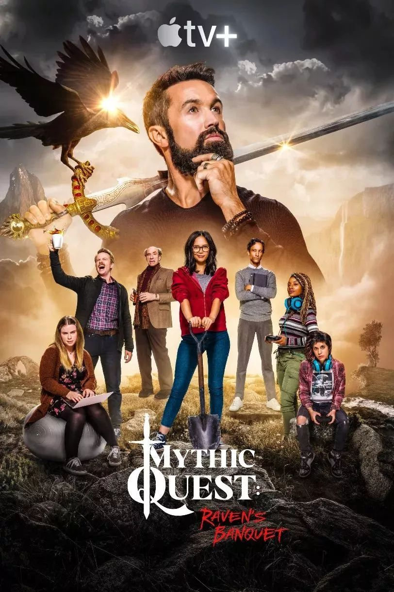

苹果TV+是苹果公司的流媒体平台，去年已推出《看见》《早间新闻》《灵异女仆》等多部口碑不俗的原创剧。

而电玩大厂育碧（Ubisoft）更不用多说，即使你不玩游戏，也一定对育碧的代表作品有所耳闻，比如《刺客信条》。

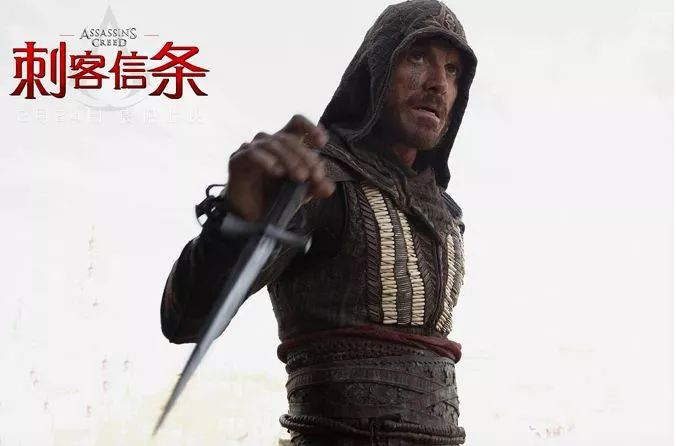

除了被多次进行影视化改编，这款游戏还因为重现时代建筑原貌而备受称赞。去年巴黎圣母院突发大火后，有外媒宣称“《刺客信条：大革命》或能为修复工作提供指导”。

作为全球最高产的游戏开发商之一，育碧不仅手握《刺客信条》《看门狗》《孤岛惊魂》等经典3A大作，也是最早推出汉化游戏、主动压低售价的外国游戏公司，对国内玩家是出了名的友好。

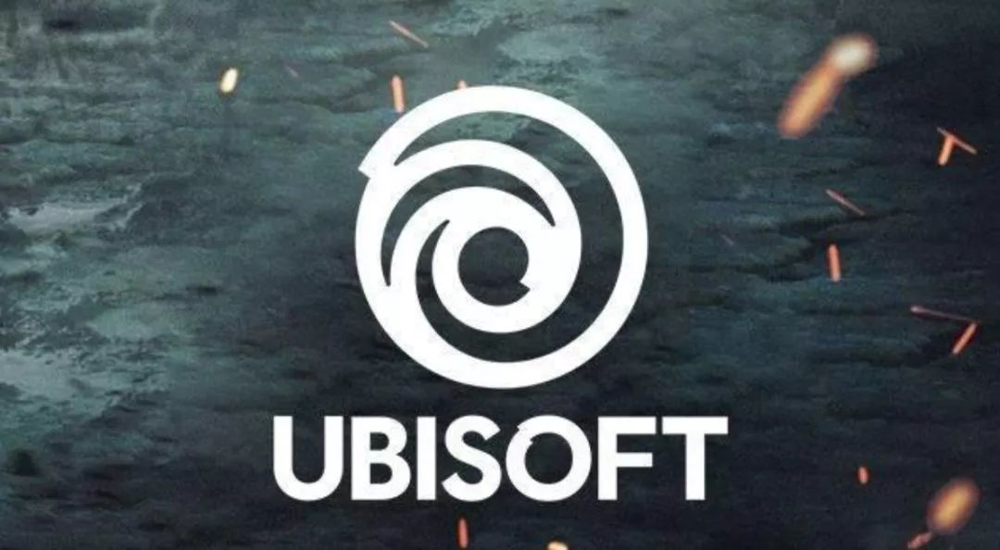

总而言之，苹果与育碧两大巨头强强联手，可谓给剧集上了“双保险”。

为了呈现游戏研发与运营维护的真实日常，创作团队还专门制作了一款假游戏，也就是剧名提到的“神话任务”。

在剧中，这款游戏号称拥有遍布六个大陆、20多个国家的忠实玩家，是有史以来最受欢迎的大型多人角色扮演类杰作。

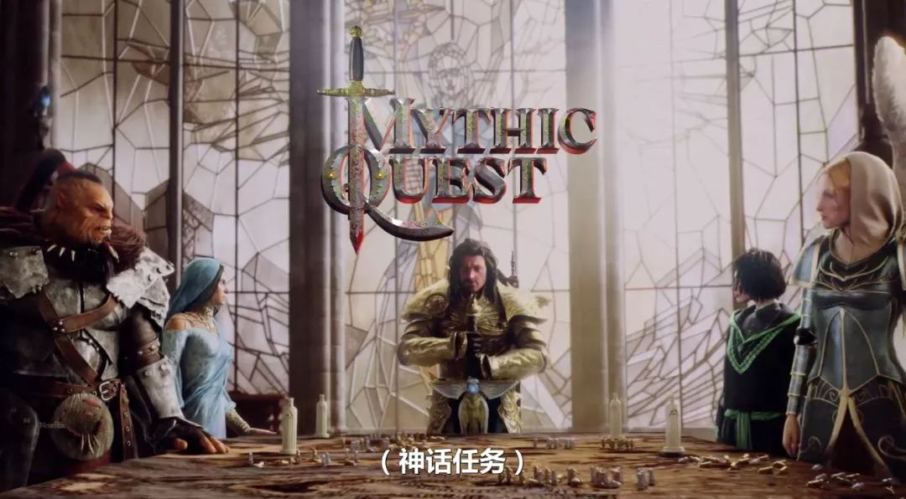

而本剧的主角，就是“神话任务”的研发团队，一个育碧旗下的游戏工作室。

其中包括傲娇自恋的创意总监艾恩，耿直强势的首席工程师波比，妈宝男执行制作人大卫，一心赚钱的营收主管布莱德，以及拿过星云奖的首席编剧C.W等等。

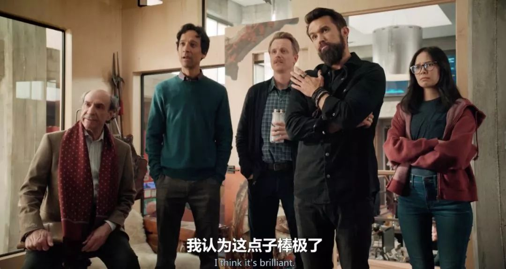
从左到右：C.W、布莱德、大卫、艾恩、波比

即使你对电玩游戏并不感冒，但光看这帮中二技术宅撕逼，也足以撑起一部精彩的办公室职场大戏。

在第一集中，首席工程师波比打算推出一款全新道具“铲子”，可以通过挖掘来改变游戏地形，却被创意总监艾恩批评太鸡肋。

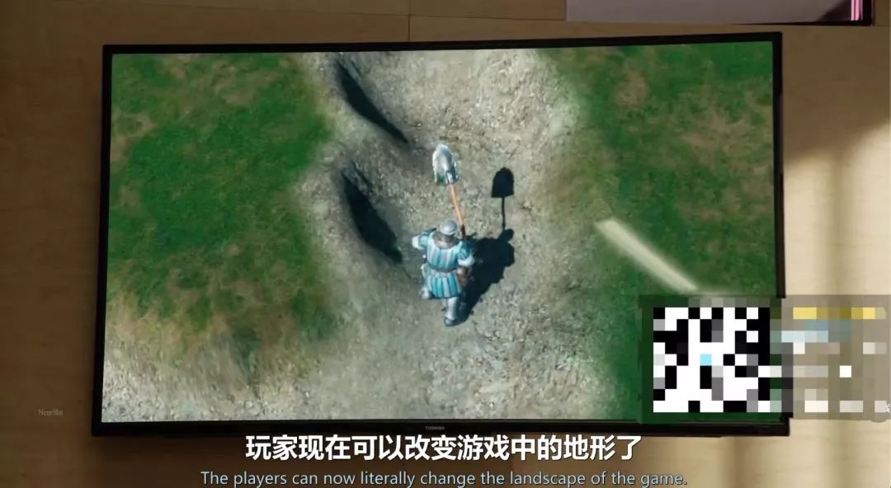

为了证明自己没错，波比又是找来游戏主播试玩，又是想说服其他同事站队，结果执行制片人大卫夹在中间左右为难，一度触发了父母离婚要选边的童年阴影。

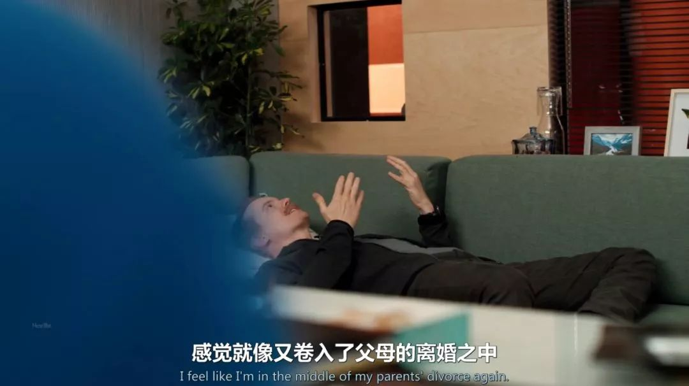

而营收主管布莱德和编剧C.W“狼狈为奸”，把铲子包装成色情宝箱来吸引氪金玩家，完全违背了波比的设计初衷。

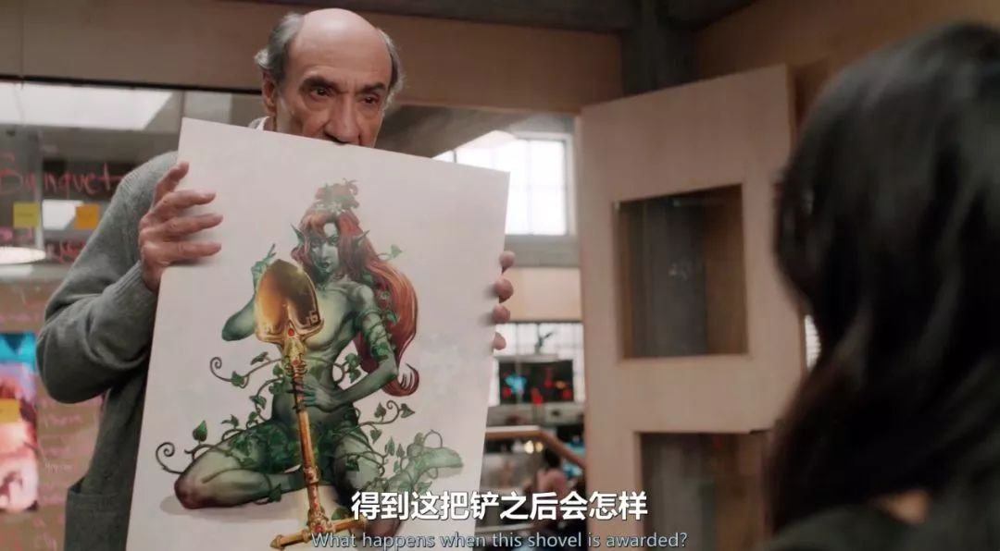

最后还是艾恩突发联想，让波比连夜改代码，将铲子改造成既能挖掘地形，又能爆头击杀的武器。

结果这款铲子在上线后，受到一位游戏主播“臭臭鞋”的赞赏，摇身一变成为了游戏中最火爆热卖的道具。

臭臭鞋虽然只是个14岁的熊孩子，但却一呼百应坐拥上千万粉丝，在游戏圈里非常有话语权。

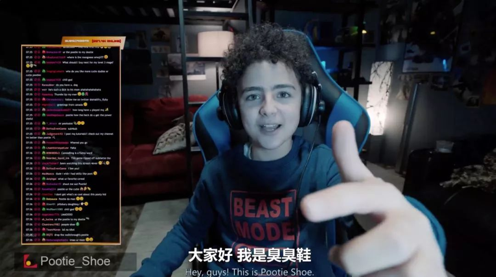

在“神话任务”中，有个负责向玩家发放道具的NPC，因为始终头戴面具保持神秘而备受关注，还以此为卖点出了不少周边。

后来臭臭鞋代表广大玩家向工作室发问，要求他们尽快揭秘面具人的身份，否则就要在粉丝中发起一场抵制行动。

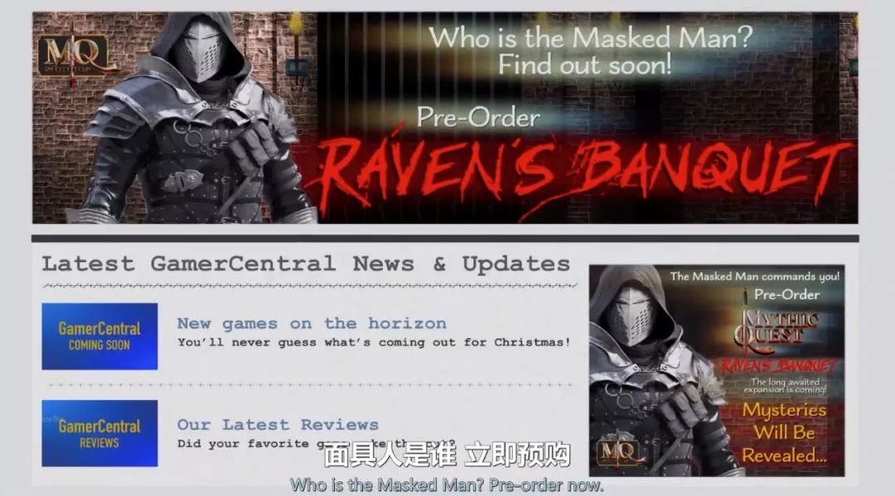

但玩家们不知道的是，其实研发团队也没想过NPC是谁，而且一时半会想不出什么有意思的答案，已经急得像一群热锅上的蚂蚁。

更麻烦的是，营收主管布莱德还擅自在游戏中加入了线上赌场，打算借由揭秘活动赚一笔：

这个行为遭到了队友们的集体反对和嘲讽，布莱德吵架吵不过，开始罢工抗议，还秀出了各种报复性“小学生操作”。

比如自暴自弃，把商店道具改成免费，引来大量玩家薅羊毛；

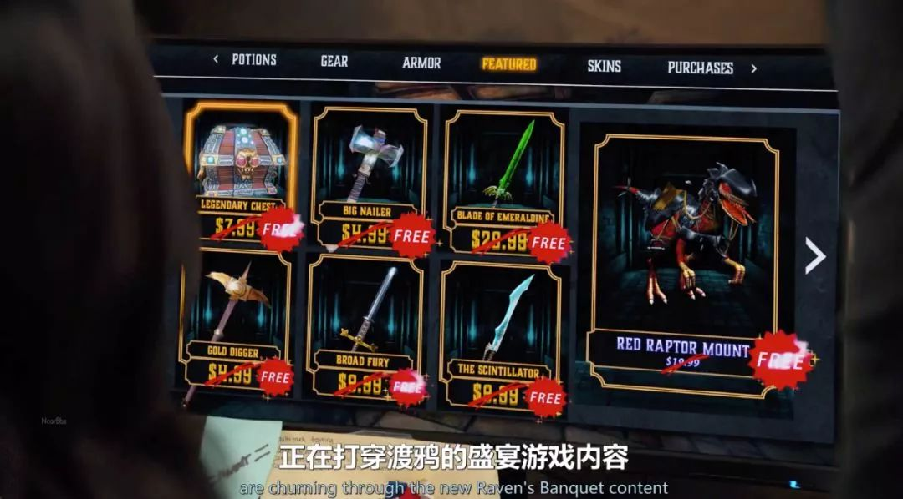

比如谎称资金中断，打发所有程序猿回家，结果工作室想救急改bug都找不到人。

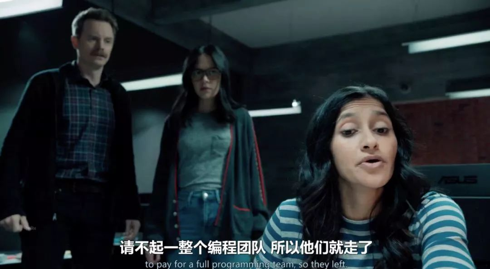

他甚至冻结了工作室名下的所有信用卡，让大家断食断粮寸步难行……

幸好，最后是编剧C.W机智借鉴《星球大战》的“父子梗”，将神秘面具人打造成了藏身赌场的大反派，同时创造出与他既是父子又是宿敌的白骑士角色。

这样一来，玩家可以通过扮演白骑士，去赌场氪金，揭穿真相；工作室也可以借机赚钱，达到一石二鸟的双赢局面。

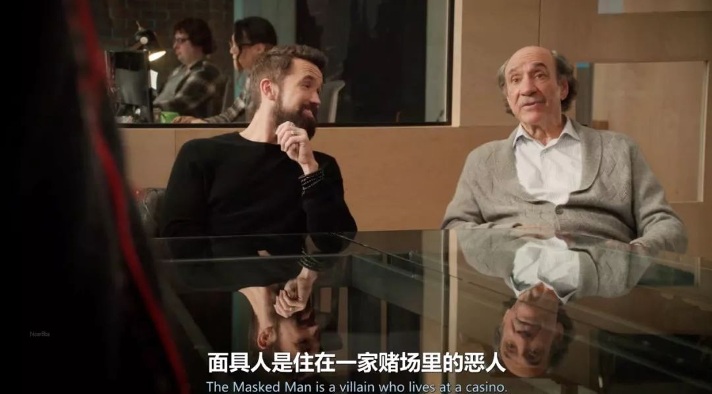

其实说到以技术宅为主角的创业题材，很容易让人想起去年刚完结的HBO高分剧《硅谷》。

这部剧藉由一帮天才程序猿在硅谷的创业历程，对技术宅们高智商低情商、严重社恐等各种geek属性进行了一番恶搞吐槽，同时也对科技圈所面临的创业困境有所透射。

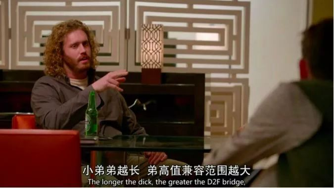

而今天聊到的《神话任务：群鸦盛宴》，同样是在自黑恶搞的喜剧底色下，对行业现实有所关照。

它一方面围绕剧中的“神话任务”工作室，揭示了一款游戏从策划执行到运营维护，所面临的众多挑战和行业乱象，能够让普通观众感到耳目一新。

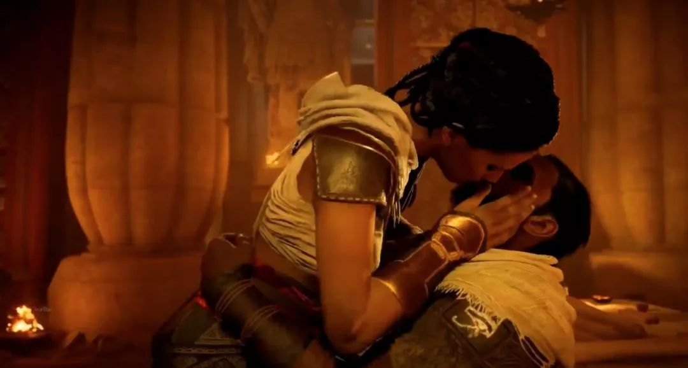

比如波比之所以开发铲子道具，是为了让大家自由改变地形，带来创意性游戏机制。

但玩家们又是挖出男性器官形状取乐，又是制造纳粹万字符宣扬种族主义，分分钟让工作室受到媒体指责和舆论抗议。

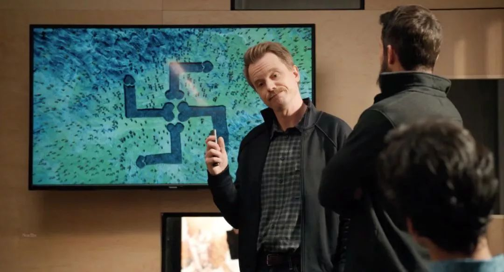

比如原本支持“神话任务”的臭臭鞋，突然被竞争对手挖了墙脚，他们只能找别的主播帮忙带货，结果找来的不是粉丝太少，就是漫天要价。

最后，工作室只好把一名测试员训练成主播，好不容易吸粉成功又被扒出了真实身份，引来一波网络暴力。

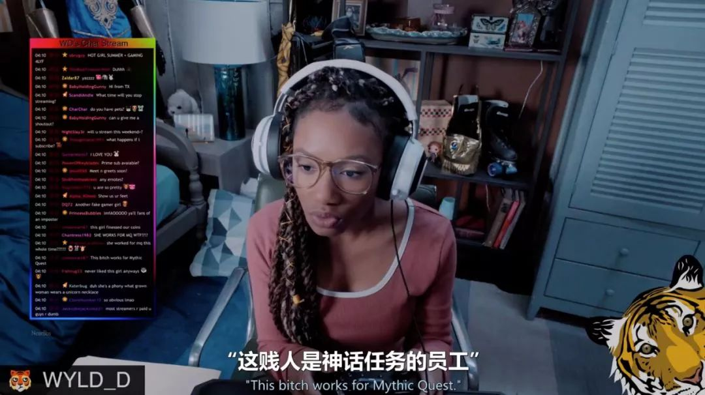

另一方面，这部剧深入浅出地对游戏行业内诸如女性话语权缺失、创意与营收部门冲突不断、电影化与游戏性之争等问题进行了探讨，相信也能让游戏从业者感同身受。

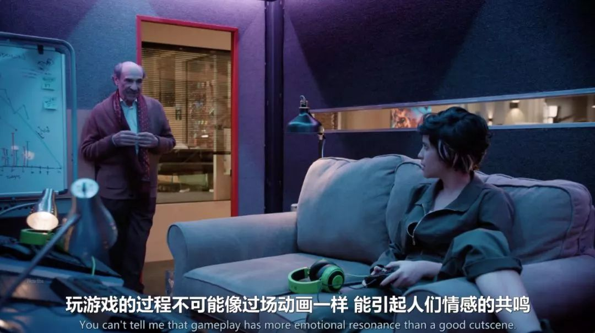

比如工作室中的大部分女员工，不是负责查找bug的游戏测试员，就是收集处理玩家投诉的社区经理，很难跻身于男性主导的核心研发团队。波比即便身为首席工程师，也经常遭到男同事的无视。

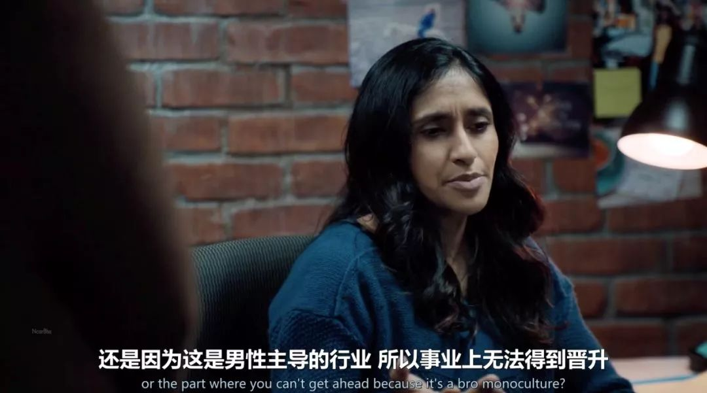

还比如第五集中，单独用一集的时长，呈现了一家独立游戏工作室在上世纪90年代的辉煌与没落，既展示出小游戏公司面临的商业化与跨国公司的双重冲击，也对游戏史上的黄金时代表达了致敬之意。

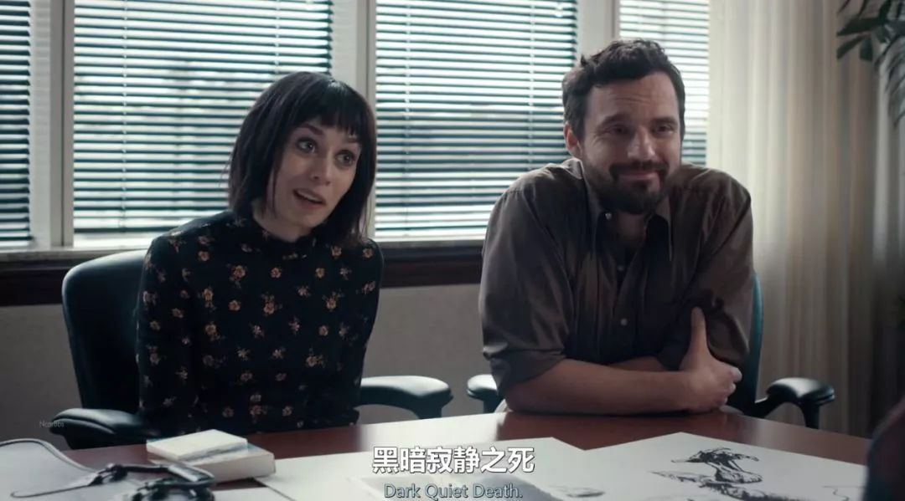

除此之外，剧中还多次引用《刺客信条》《荒野大镖客2》《最后生还者》等经典游戏的画面和桥段，给游戏爱好者们留下不少彩蛋。

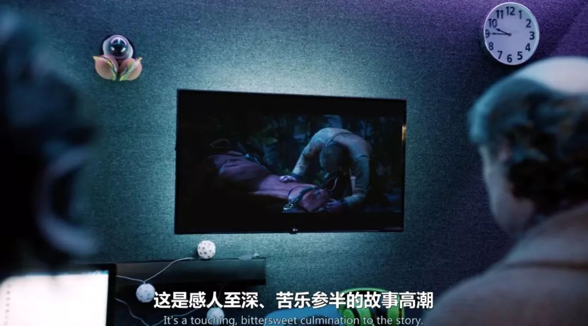

不少网友在看完这部剧后，都称它是给广大玩家、游戏工作者的一封情书。

**这不仅是因为剧中充满情怀致敬与对现实的反思，更因为咱们国内的游戏产业同样命运多舛，既孕育过优秀作品，也经历过行业寒冬，甚至还被不少人认为是“洪水猛兽”。**

**所以，对于游戏爱好者和从业者来说，这部剧都不容错过。****喜欢办公室喜剧的小伙伴们，也可以赶紧入坑。****尤其在当下特殊时期，几乎每天都要被过载信息影响心情，这部轻松搞笑的作品会是个不错选择～**

