## 结婚就要剃头，唱歌就是淫荡，这都是什么玩意儿！

原创 有部电影 有部电影 *今天*

上周，咱们聊了好几部回归的爆款美剧，每一部上线后都立马成了热门。  

  

而今天要聊的这部新剧则非常冷门，网友们给出的评分高达8.8——**《离经叛道》。**

  

  

剧集改编自德波拉·菲尔德曼的半自传体畅销书。

  

听名字也知道，它所讲述的主题与反叛有关。

  

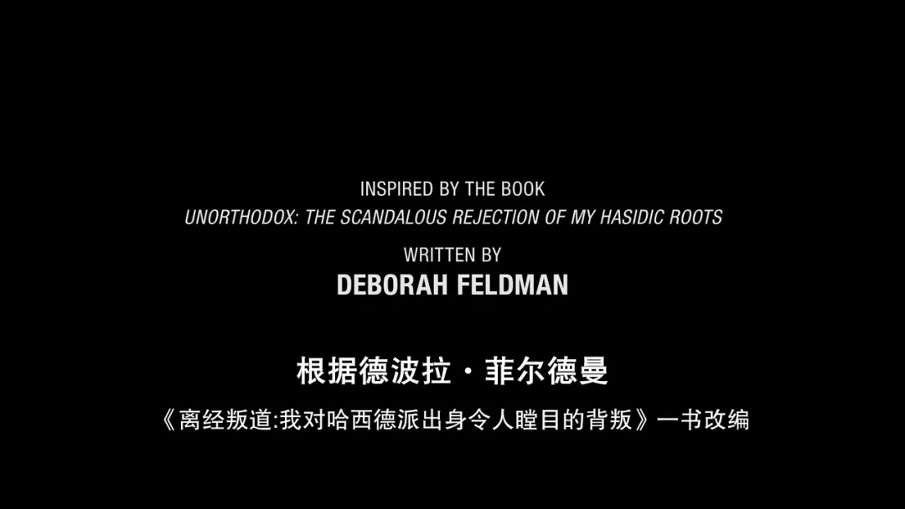

  

故事的女主名叫艾丝蒂，是一个居住在纽约布鲁克林的19岁女孩。

  

她所要背叛的，不是爱人也不是父母，而是整个她所属的宗教与族群——哈西德派。

  

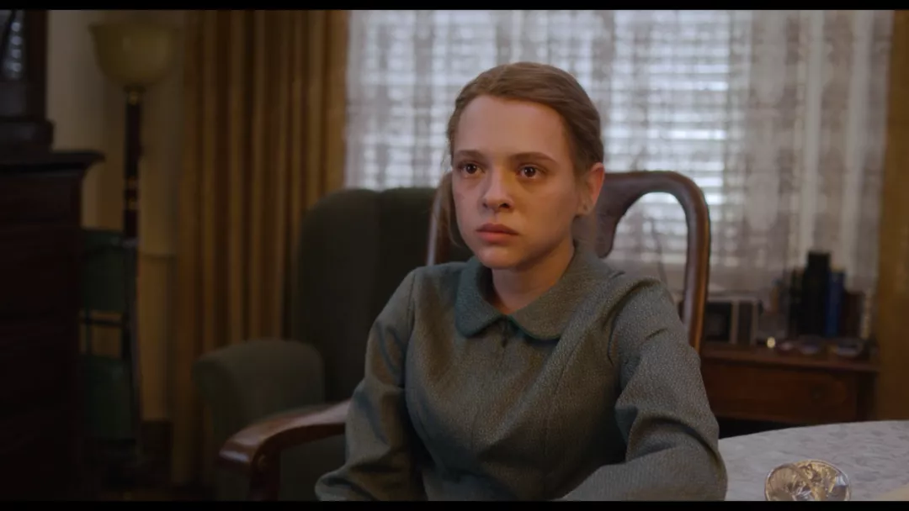

  

哈西德派是犹太教五个主要的教派之一，又被称为极端正统派，是保守中的保守者。

  

虽然身处美国，但教徒们也并没有因此而变得开放包容。

  

他们严格遵守教规和礼俗，混居于现代社会却保持着高度的封闭。

  

若非得到特许，普通人连智能手机和互联网都没有机会使用。

  

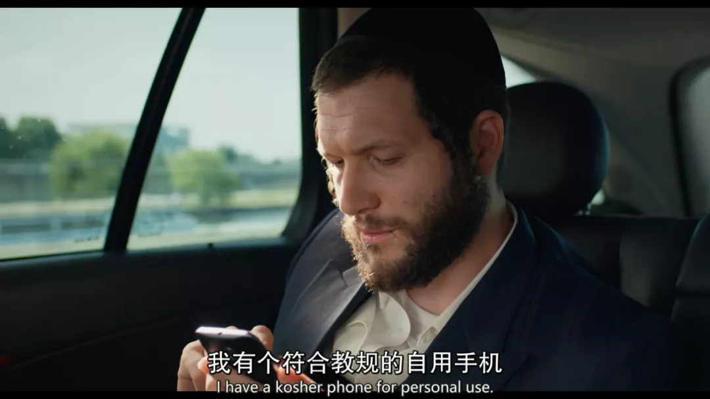

  

男性方面，束缚少一些，身穿黑色礼服，头戴黑色高帽，内配白色衬衫，脸颊两侧留出螺旋式的鬓角，是他们统一的标志性形象。

  

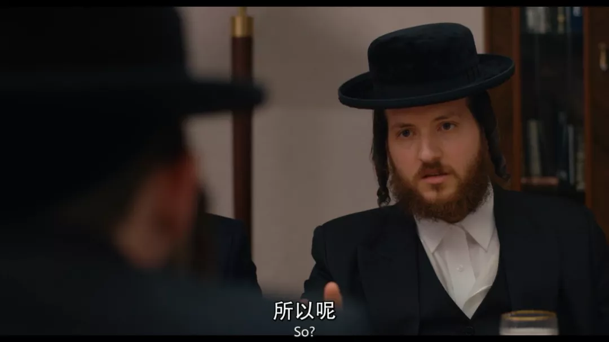

  

而女性方面，整体状况则要凄惨太多。

  

她们不能唱歌，不能表演，不能出风头，头发也不能露出来，因为这些行为在教徒看来都是勾引男人的淫荡行为。

  

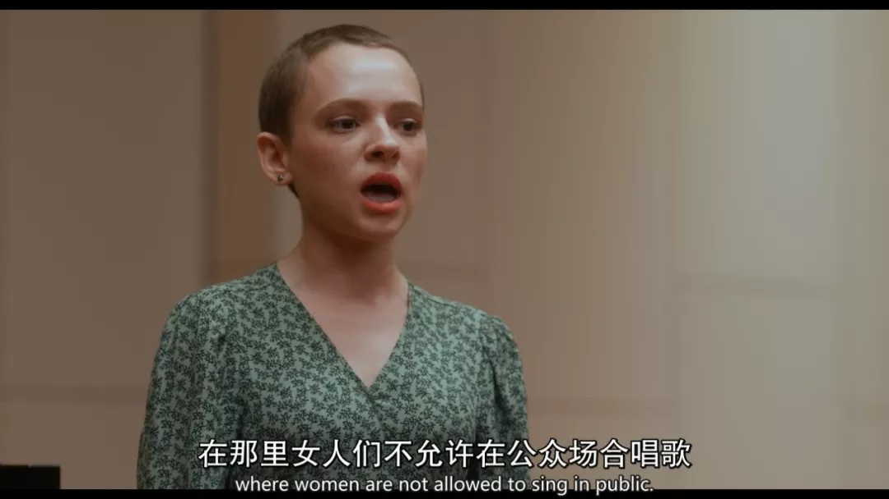

  

关于婚姻，她们也没有自己的选择，必须听从父母之命、媒妁之言。

  

在婚礼上，还必须按照传统将自己的头发剃光，作为成为人妻的标志。

  

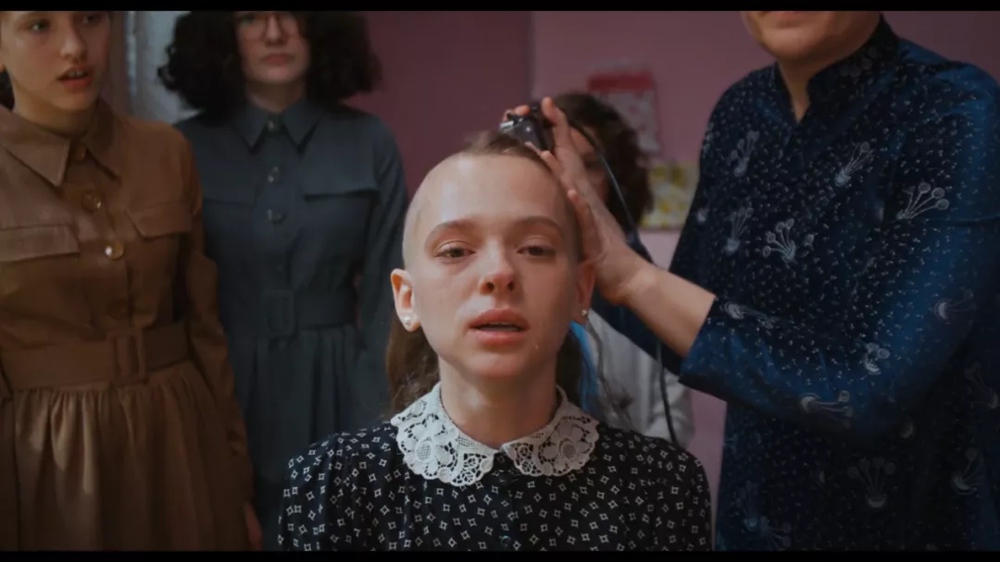

  

婚后，她们则必须以“服务好丈夫”为自己的责任，能否生儿育女是衡量她们存在的唯一价值。

  

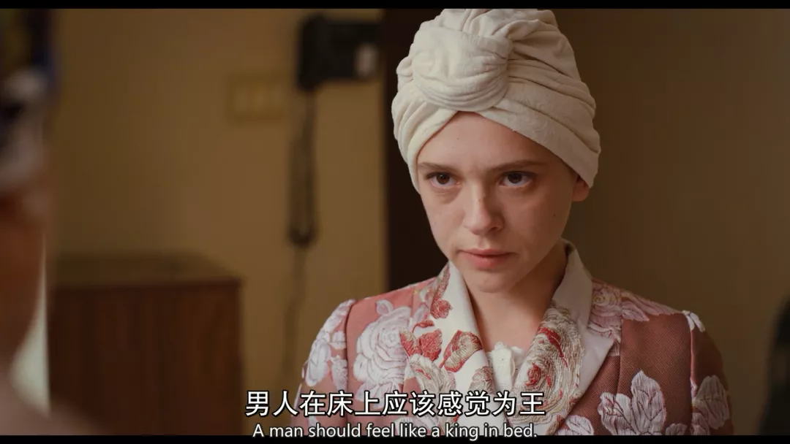

  

这背后的动机，除了维护高高在上的宗教权威，还有一个特别冠冕堂皇的理由——**延续犹太族的神圣使命。**

  

因为二战时有六百万犹太人被迫害，所以女人要负责生回来……

  

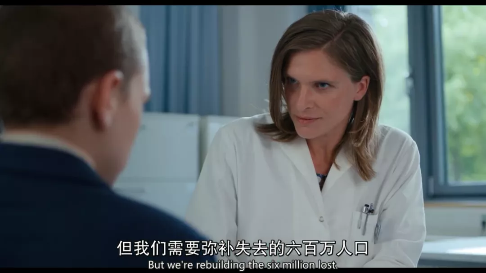

  

对一般人来说，面对这样一系列令人匪夷所思的压迫，选择背叛几乎是必然的。

  

但这个族群的女性因为环境、教育等各种因素，大多都选择了接受并习以为常。

  

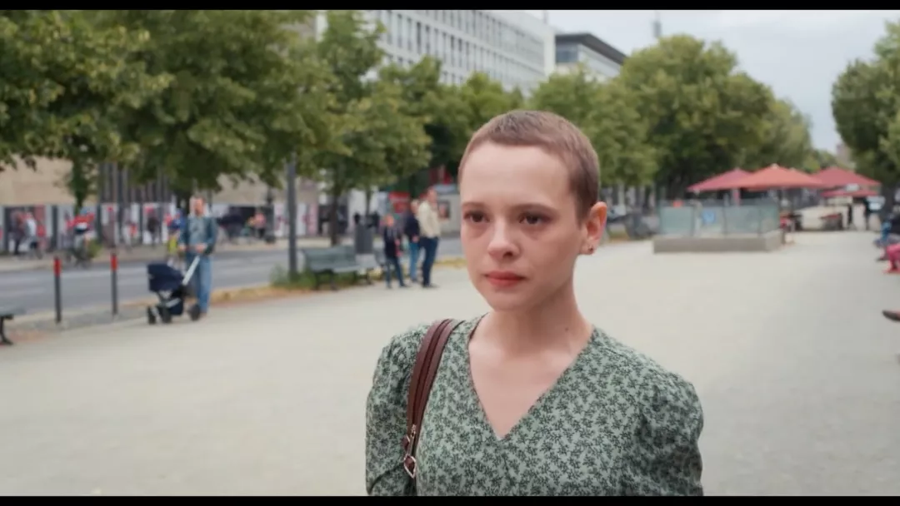

  

那么，女主又为什么会与自己的族群走向决裂呢？

  

一切的一切，还要从两年前开始讲起。

  

当时，女主17岁，虽然有着独立的想法，但还谈不上叛逆。

  

在家人的安排下，她同一个名叫阳基的犹太男孩结了婚。

  

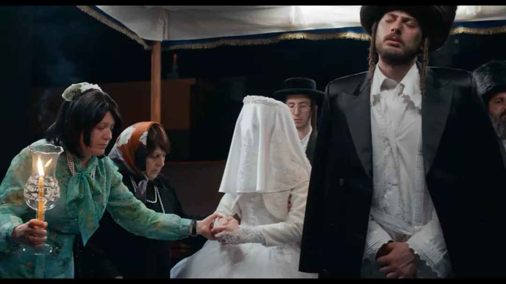

  

阳基为人羞涩，性格柔软还有点可爱，虽然是盲婚哑嫁，没有感情基础，但女主对他并不讨厌，对婚后的生活也充满期待。

  

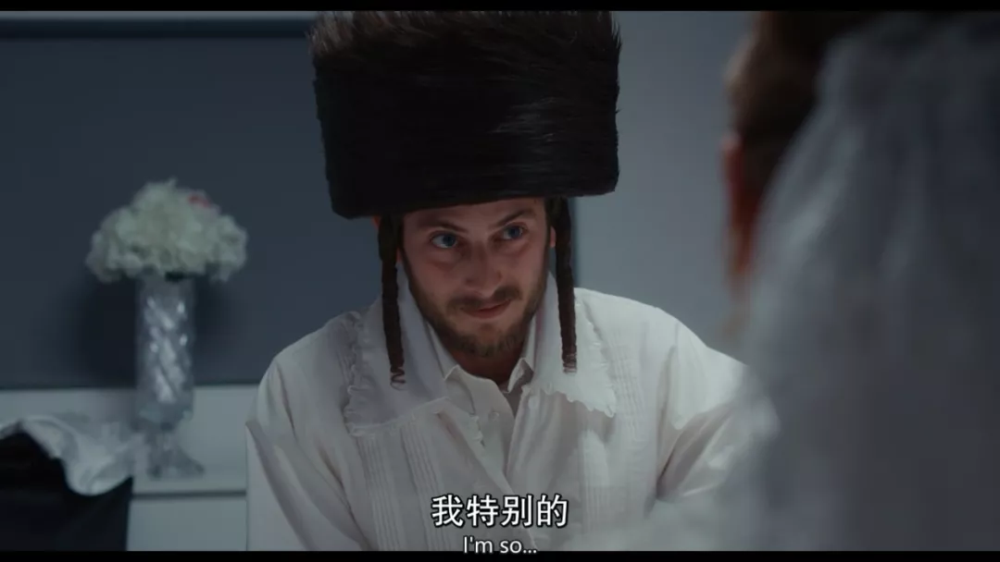

  

然而，事情的发展却和她想象的并不一样。

  

因为族群里并没有正统的性教育，阳基对性一窍不通，几个月过去，两人仍然没能完成第一次为爱鼓掌。

  

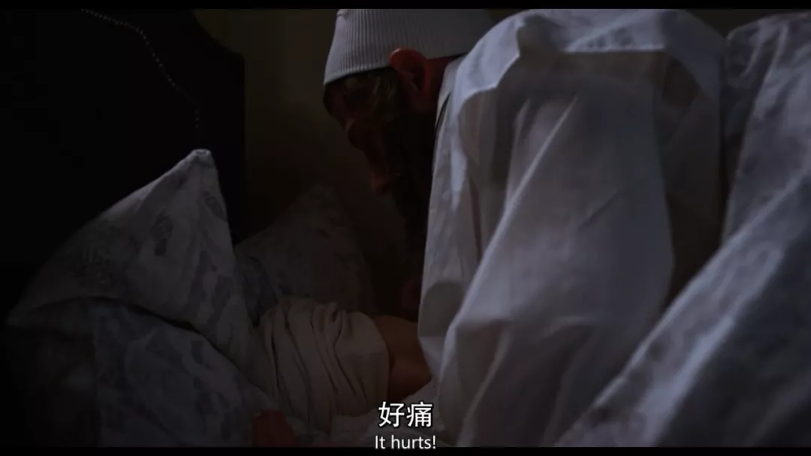

  

为此，两人都非常焦虑。

  

阳基把事情一五一十地告诉了母亲，结果母亲便跑来谴责女主没有做好妻子的责任。

  

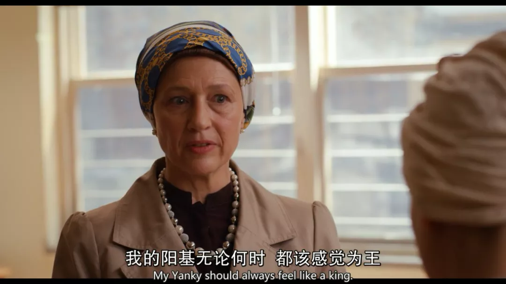

  

女主一开始还是听取了过来人的建议，去咨询了取悦丈夫的办法。

  

只可惜，几番练习后两人还是失败了，这个过程也让她失去了对男欢女爱的渴望。

  

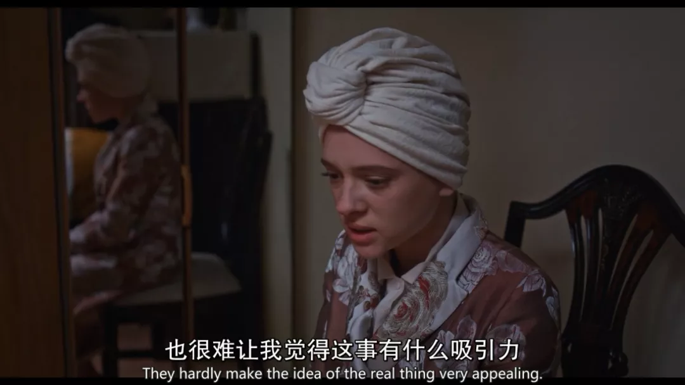

  

最后，在一次赌气之下，她忍受着剧烈疼痛，让阳基成功进入了自己的身体。

  

可即便如此，他们的婚姻生活状态也没有好转。

  

  

因为女主迟迟未能怀孕，婆婆看不上她，逢人就说她是个残次品。

  

这件事很快就成了人尽皆知的笑柄，给女主带来了巨大的心理压力。

  

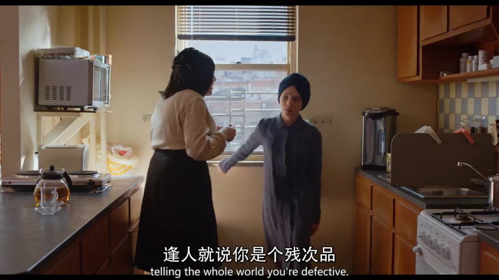

  

后来，好不容易等女主发现自己怀孕了，还没来得及说出这个喜讯，阳基就忽然在母亲的建议下，和她提出了离婚。

  

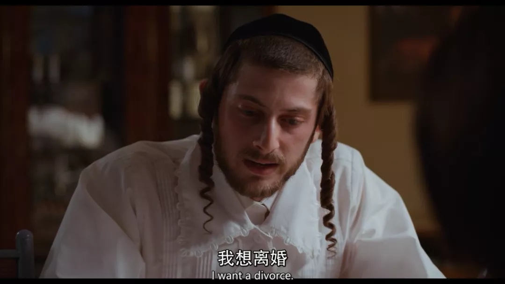

  

这让女主意识到，自己一直以来幻想的幸福如此可笑。

  

她终于下定决心离开，并偷偷逃去了柏林。

  

  

在那里，她认识了一群搞音乐的人，见到了自由的同性情侣，第一次去了酒吧，涂了口红，还和一个男生真正体验到了鱼水之欢……可以说，她重新展开了自己的生活。

  

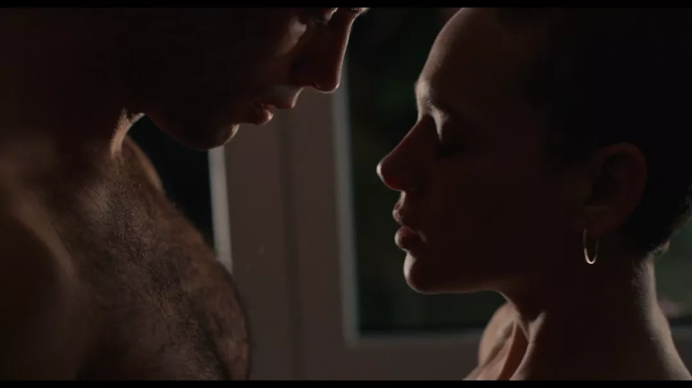

  

可与此同时，她也面临着许多困境。

  

一方面，她一没学历，二没技能，只偷偷学过一些钢琴，怎样才能在人生地不熟的地方立足，找到属于自己的位置？

  

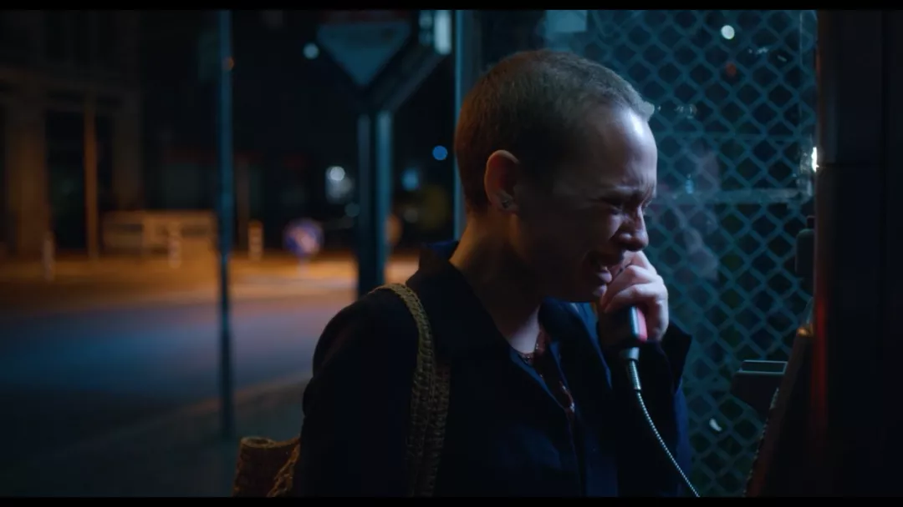

  

另一方面，阳基在得知了她怀有身孕的事实后，火速和堂弟一起追到了柏林，女主又该如何应对才好？

  

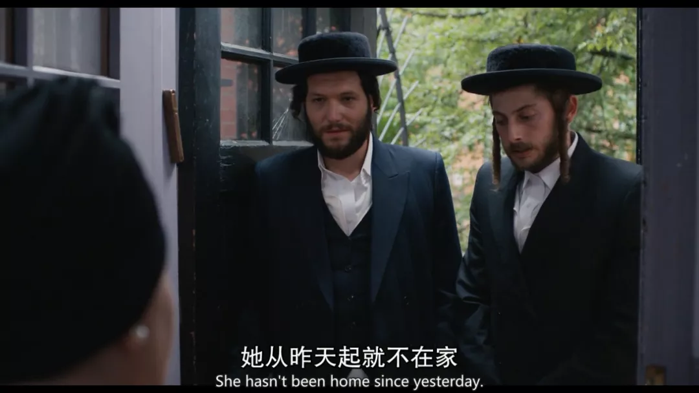

  

这部剧一共只有4集，短小精悍，想知道结局的小伙伴，可以到剧中去寻找答案。

  

总的来说，剧集在有原著半自传属性做基底的情况下，虽然以宗教为背景，却不乏戏剧性，既可以充分满足观众的猎奇心理，也呈现出强烈的现实底色。

  

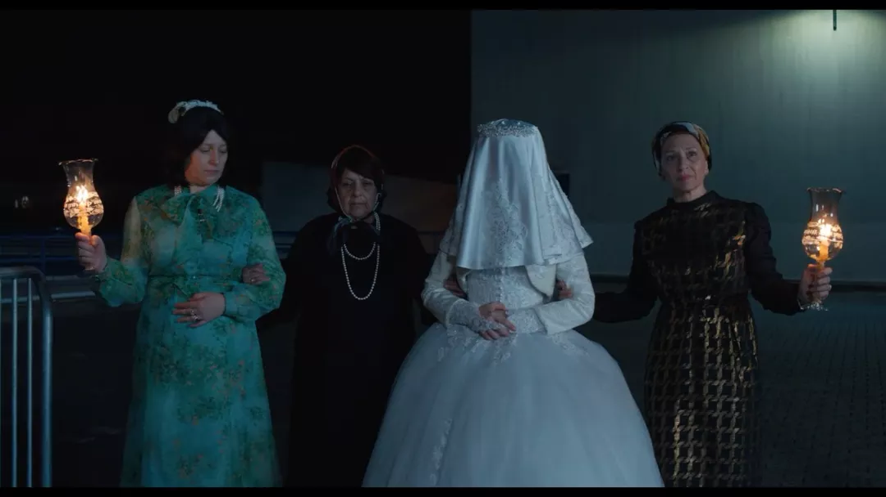

  

值得一提的是，这种现实底色具有广泛的社会意义，即便剥离宗教叙事，仍然能够给人以强烈的共鸣。

  

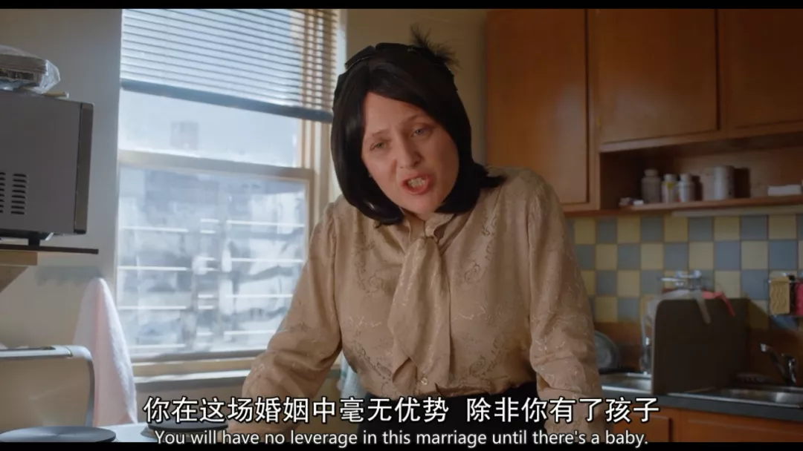

  

比如把女性视为生育工具这一点，剧中的哈西德派对女性的规训，是贬低她们的价值，引导女性自我物化，使之成为服务男性的附庸。

  

  

而类似的言论和变体，在我们周围其实也并不少见。

  

每隔一段时间都会出现“女德天后”丁璇、情感教主Ayawawa这样的存在。

  

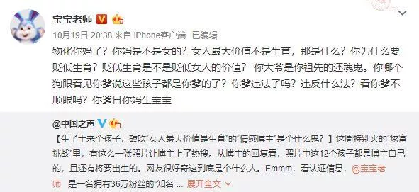

  

再比如女性结婚时被剃光头发、结婚后不能露出头发这类情节，也反映出一个普遍的事实——**社会常以宗法、传统、习俗为掩护，用使命、光荣、崇高等欺骗性的词汇，对女性身体自主权进行剥夺。**

  

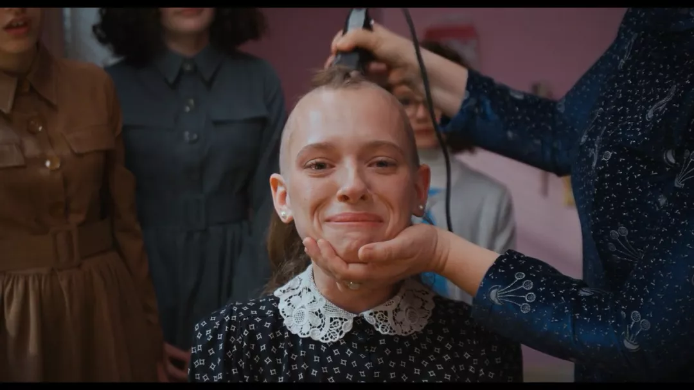

  

但值得一提的是，本剧并没有局限在讲述女主的个人苦难本身，而是运用丰富的群像，刻画出了在这种系统性、结构性的社会顽疾下，形形色色的芸芸众生。

  

在男性角色方面，剧中的阳基也非常值得玩味。

  

他并不是一个大男子主义式渣男，他能够倾听女主的感受，也发自内心地希望女主幸福快乐。

  

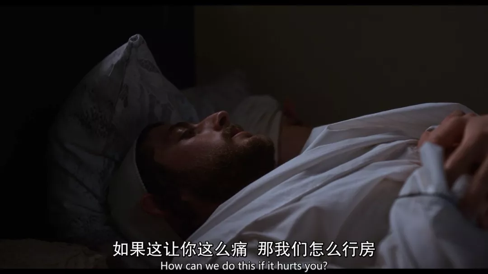

  

然而，即便他对现实有过疑惑和不满心理，也没有想过反抗，反而始终对代表权威的家人言听计从，对族群里的规则深信不疑，无法与女主面对的痛苦产生共情。

  

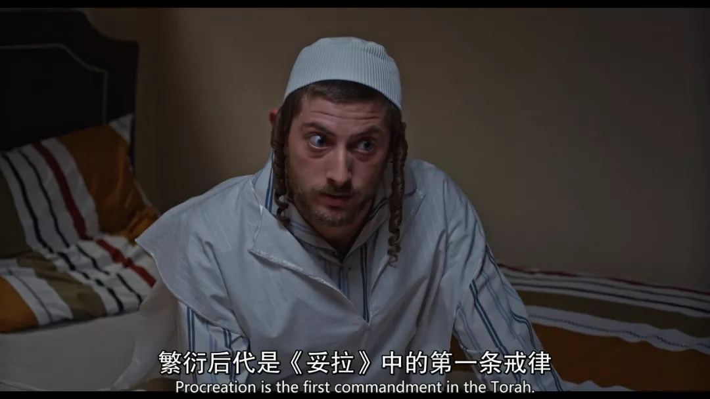

  

直到来到柏林后，阳基见到了不一样的世界，才开始反思自己对两性的认知。

  

为了追回女主，他最终同样做出了一个象征“背叛”的行为——剪掉了自己的鬓角。

  

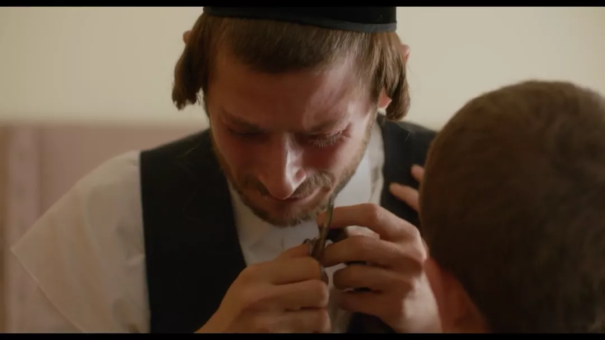

  

在女性角色方面，剧中大多数女性都不是正面角色，而是整套腐朽价值观的维护者。

  

比如阳基的母亲，她完全认同这种文化，明明是在迫害女主而不自知，还自诩正义。

  

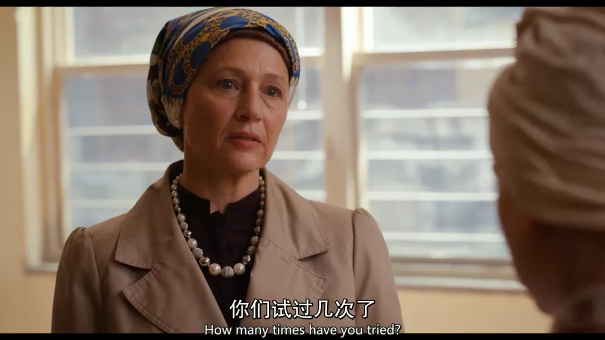

  

这之中唯一的例外，就是女主的母亲。

  

在女主三岁时，她就因无法承受族内生活选择了逃离。

  

结果，她自己虽然成功了，但族人却把女主从她身边夺走。

  

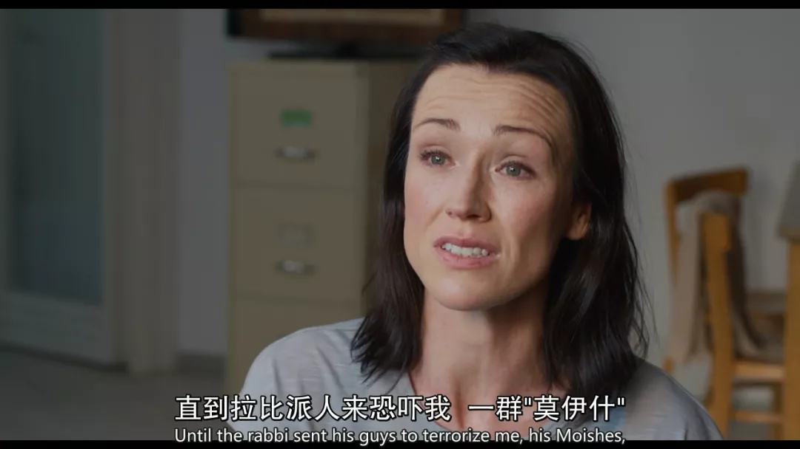

  

后来，她在柏林做了家庭护理，始终没有忘记女儿，还在女主婚前给她带去了加入德籍的材料。

  

女主起初对此不解，后来才终于明白了母亲的苦心。

  

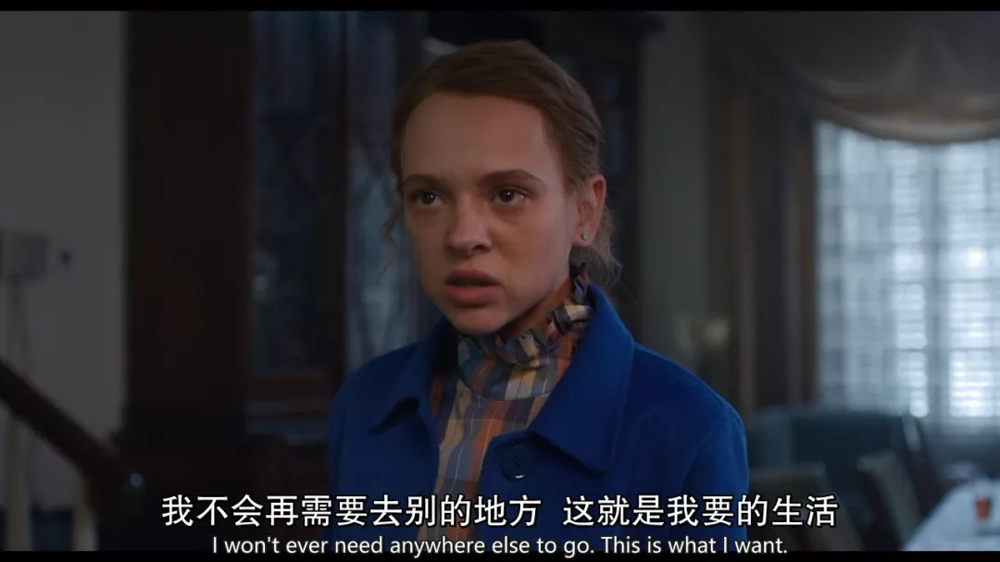

  

由此可见，这对母女所代表的，其实是一种反叛精神的传承。

  

在剧中，妈妈曾对女主说过这样一句话：规矩都是虚构的，他们的权威只存在于你的脑海之中。

  

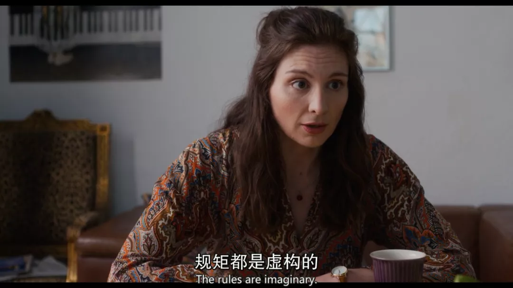

  

可以说，这话戳破了权威的建构本质。

  

实际上，世上所有的文化和传统都并非天经地义，它们只是在人类进化和历史演变中，被占有统治地位的群体不断构建和强化而来的概念。

  

  

正如男性在成为政治、文化、经济等领域权威的同时，也将对女性的控制实现了全方位的渗透，以各种极具迷惑性的文明面貌来呈现，进而遮蔽了实质上的剥削与倾轧。

  

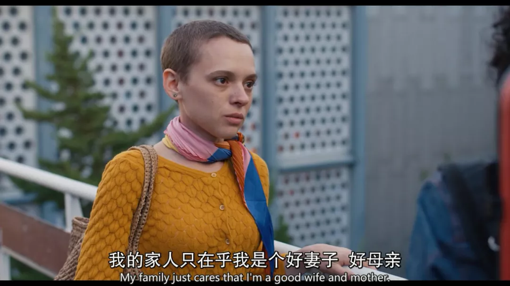

  

所以，女主和妈妈的行为，其实就是一出现代版的“娜拉出走”。

  

但正如鲁迅在《娜拉走后怎样》中“不是堕落，就是回来”的叹息一样，成长于系统性压迫环境下的女性，要如何才能拥有足够的竞争力实现自我独立？

  

  

这个问题，值得每一个人去认真思考。

  

而回过头来看，出走的女主和失意的阳基，其实是整个悲剧的两面。

  

他们寓意的是一个没人可以回避的真相——**那些加诸于女性身上的桎梏，对于男性而言，同样是沉重不堪的镣铐枷锁。**

  

**如今，舆论场上男女双方的对战动辄甚嚣尘上，仿佛两性之间到了无法调和的境地。但实际上，男人与女人，本来就是休戚与共的。只有不断尝试去理解彼此，才能避免陷入到无休止的相互伤害中。**

  

也许是国内最认真的电影自媒体
