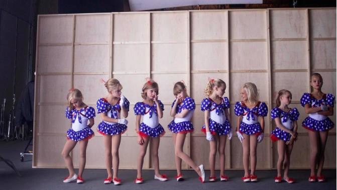
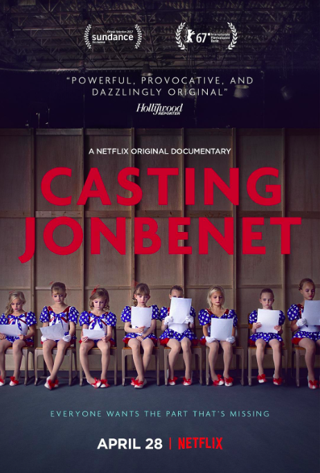

##  美国6岁选美皇后谋杀案，凶手难道是她亲生父母？

原创 有部电影 [有部电影]()
大家好，我是凌辰。

自从上期的《凌辰罪案电影》讲了一桩密室谋杀案，就有不少小伙伴留言说希望能多讲一些现实中的密室杀人案件。

所以今天就满足大家的要求，这期要聊的是轰动全美的“琼贝妮特谋杀案”，点击下方音频，即可收听**今天的节目时间超过了1小时，因此分成了两个音频条，请从上到下依次收听**：

**为什么值得听：**

“琼贝妮特谋杀案”被众多媒体认为是世界上最轰动的杀人案。受害者琼贝妮特是一名年仅6岁的美国儿童选美冠军，在当选“美国小小姐”的同年于家中遇害。

琼贝妮特的尸体在自家地下室中被发现，父母一度成为重点嫌疑人，经过十余年调查后又被排除嫌疑，凶手至今未知。

调查过程一波三折，几经反转，始终无法形成定论。网飞专门拍摄了一部纪录片，记录人们对此案的各种猜测。

琼贝妮特·拉姆西

**本期能听到什么：**

真实案件发生的经过，以及目前对于凶手的最主流推测。

案件至今遗留的争议与疑点，关键性的DNA证据如何改变了调查结果的走向？

2016年网飞为此案拍摄的“半纪录片”电影《童心无归处》，形式上有哪些创新之处？

**本期提到的内容：**

童心无归处（纪录片）

编剧:基蒂·格林
主演:Hannah Cagwin/Aeona Cruz/Liv Bagley/Shylee Sagle/Danika Toolson
类型:纪录片
制片国家/地区:美国 / 澳大利亚 / 中国大陆
语言:英语
上映日期:2017-01-22(圣丹斯电影节)/2017-04-28(美国)
片长:80分钟
又名:试镜琼贝妮特

***本期内容重点回顾：（下面的文字内容建议听完音频节目再看）***

1996年，年仅6岁的琼贝妮特在儿童选美比赛中胜出，拿下“美国小小姐”桂冠。同年圣诞节后的清晨，母亲发现女儿失踪，并在家中找到了长达两页的勒索信。报案后不久，父亲在地下室里找到了女儿的尸体，死前有疑似遭受性侵痕迹。警察在勘查现场后，迅速将调查焦点放在了父母两人身上……

在警方没有结案的情况下，媒体掀起了“琼贝妮特如何遭父母杀害”的虚构写作狂潮，“母亲因嫉生恨”、“父亲性侵女儿”等虚假报道一度使琼贝妮特父母备受折磨。当案件无铁证时，即便推理合乎逻辑，谁有资格给嫌疑人定罪？

在长达20多年的调查中，技术进步一度推动案件进展，关键性DNA证据的发现为多人洗清嫌疑；但随着这一证据存疑，所有被排除的嫌疑人又重新回到了案件当中，这也是纪录片中人们对于真凶猜想众说纷纭的原因。

***本期互动话题：***
***听完整期节目，******你认为这起“琼贝妮特谋杀案”的凶手究竟是谁呢？***
***欢迎在评论区中和我留言讨论。***

