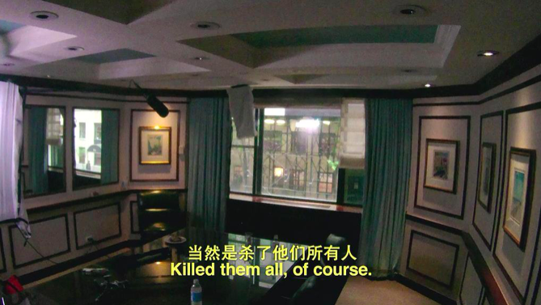
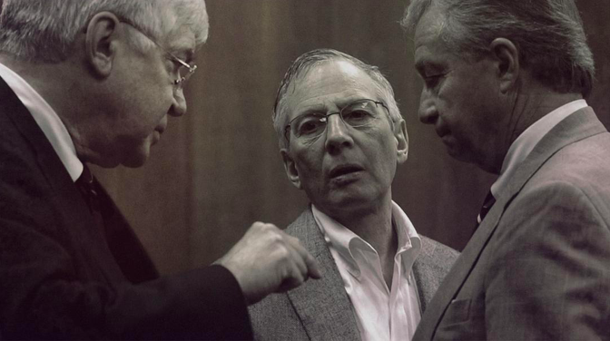

速读摘要

上期的《凌辰罪案电影》讲了"琼贝妮特谋杀案"，年仅6岁的儿童选美冠军被杀背后，媒体对于案件侦破起到了推波助澜的作用。嫌犯罗伯特·德斯特是纽约地产大亨的长子，因为身上背负前妻失踪、密友被杀等离奇谜案，长年隐姓埋名、男扮女装生活在德州小镇。2001年，德州小镇发生一起碎尸案，警方迅速查获凶手，发现他是纽约地产大亨的长子罗伯特·德斯特，还由此追溯到罗伯特身上背负的三起离奇悬案。尽管罗伯特承认杀人碎尸，但由于家境富裕请到天价律师团，成功逃脱了牢狱之灾。

原文约 918  字  | 图片 8 张 | 建议阅读 2 分钟 | [评价反馈](https://static.app.yinxiang.com/embedded-web/clipper/#/Evaluating?d=2020-04-03&nu=ddad581b-0cd4-46fc-b1b4-4918b9f97d98&fr=myyxbj&ud=58b471&v=2&sig=A7E1172958941B16849B006C5345A4AB)

##  纽约亿万富豪，竟然是连环杀人犯？

原创 有部电影 [有部电影]()**
大家好，我是凌辰。

上期的《凌辰罪案电影》讲了“琼贝妮特谋杀案”，年仅6岁的儿童选美冠军被杀背后，媒体对于案件侦破起到了推波助澜的作用。

而今天要聊的这个案件更加惊人，可以说媒体几乎决定了案件的最终走向。

**点击下方音频，即可收听：**

**为什么值得听：**

本案是纽约历史上最声名狼藉的杀人悬案。嫌犯罗伯特·德斯特是纽约地产大亨的长子，因为身上背负前妻失踪、密友被杀等离奇谜案，长年隐姓埋名、男扮女装生活在德州小镇。

案件剧情比小说更奇异，罗伯特被警方跨州抓捕、被指控杀人的理由和经过，都令人匪夷所思。

在拍摄本案纪录片的过程中，罗伯特意外说漏嘴承认杀人，警方重启案件调查，至今仍未结案。

**本期能听到什么：**

真实案件发生的经过，纽约富豪罗伯特身上到底背负几条人命？

案件至今遗留的疑点，以及美国司法的财富特权。

HBO纪录片**《纽约灾星》**对于案件走向，如何起到了决定性的作用。

**本期提到的内容：**

**所有美好的东西（电影）**

导演:安德鲁·杰瑞克奇
编剧:安德鲁·杰瑞克奇/马克·斯默林
主演:瑞恩·高斯林/克斯汀·邓斯特/克里斯汀·韦格/弗兰克·兰格拉/莉莉·拉贝
类型:剧情/悬疑/惊悚
制片国家/地区:美国
语言:英语
上映日期:2010-12-03(美国部分上映)
片长:101 分钟
又名:美丽破绽(台) / 好事不断

**纽约灾星（纪录片）**

导演:安德鲁·杰瑞克奇
编剧:安德鲁·杰瑞克奇/Marc Smerling/扎克利·斯图尔特-庞提尔
主演:Chelsea Gonzalez/Jeszenia Jimenez/Dillon Mathews/Robert Durst/珍妮·皮洛
类型:纪录片/犯罪
制片国家/地区:美国
语言:英语
首播:2015-02-08(美国)
集数:6
单集片长:45分钟
又名:天煞克星：德斯特的生与死 / 谋杀悬案(港) / 黑色豪门疑案(台) / 厄运

***本期内容重点回顾：（下面的文字内容建议听完音频节目再看）***

2001年，德州小镇发生一起碎尸案，警方迅速查获凶手，发现他是纽约地产大亨的长子罗伯特·德斯特，还由此追溯到罗伯特身上背负的三起离奇悬案。原来30年来，罗伯特一直为了躲避检察官纠缠，才隐姓埋名、男扮女装地隐居于此。

尽管罗伯特承认杀人碎尸，但由于家境富裕请到天价律师团，成功逃脱了牢狱之灾。虽身负命案却能无罪脱身，富人在美国的司法体系面前究竟拥有怎样的特权？

罗伯特虽在纪录片中不慎承认罪行，但关于案件的真相至今仍未有定论，影片导演对此事的看法如何？媒体在推动案件侦破上究竟能发挥多大的影响力？

