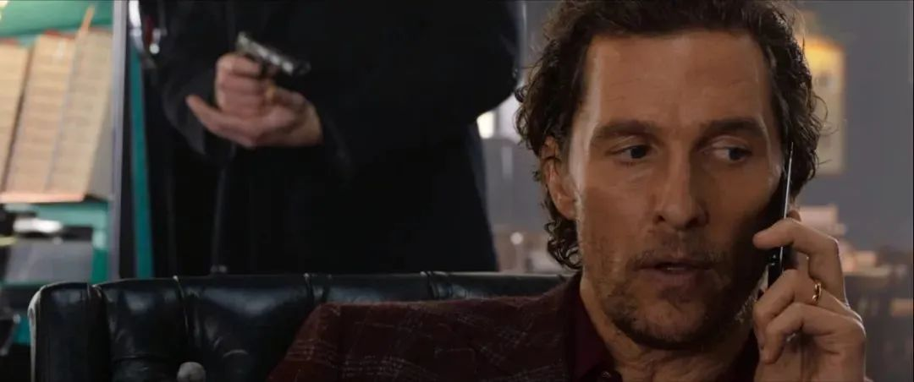

速读摘要

开门见山，今天跟大家聊聊鬼才导演盖·里奇的新片《绅士们》。经过十几年拼杀，迈克在英国建立了一个毒品帝国。迈克算是一石多鸟，把基地曝光、马修压价、公爵女儿和弗莱彻敲诈的事儿，都摆平得差不多了。影片借由弗莱彻"挤牙膏"似的爆料，让整个故事也像是一个不断曝黑料的过程，愣是把黑色幽默喜剧片拍成了逼格满满的悬疑片。而《绅士们》最不盖·里奇也最不绅士的地方，就是对于阶级问题和上流社会的辛辣讽刺。

原文约 2436  字  | 图片 36 张 | 建议阅读 5 分钟 | [评价反馈](https://static.app.yinxiang.com/embedded-web/clipper/#/Evaluating?d=2020-03-31&nu=82af38d2-5dae-41f9-80c2-469e190f7dbb&fr=myyxbj&ud=58b471&v=2&sig=44452383360E4FD3A5AFDB1196E2F08E)

##  鬼才导演的炸裂新片，绅士必看，爽到飞起

原创 有部电影 
开门见山，今天跟大家聊聊鬼才导演盖·里奇的新片《**绅士们**》。

本片可谓众星云集，囊括了马修·麦康纳、休·格兰特、查理·汉纳姆、科林·法瑞尔和亨利·戈尔丁等一众男神，还有《唐顿庄园》“大表姐”米歇尔·道克瑞出演女主。

盖·里奇跟昆汀一样，总能吸引到各路明星大咖，这大概就是才华的魅力吧。

今天这部《绅士们》也是盖导在《摇滚黑帮》之后，时隔12年再度回归纯正英伦黑色幽默，豆瓣8.4的高分，让人非常期待。

本片是一部群像戏，故事从休·格兰特饰演的私家侦探弗莱彻，和查理·汉纳姆饰演的贩毒集团二哥雷讲起。

一天晚上，弗莱彻找到雷，说报社想花15万买他们的黑料，但只要雷和老大迈克花2000万就能消灾。

究竟啥样的黑料，花15万就能买，却要用2000万来赎？这分明就是异想天开的敲诈。

于是，雷不屑一顾地把弗莱彻臭骂一顿，让他滚蛋。

但弗莱彻既然敢敲诈毒枭，自是有备而来。

他不慌不忙地把手上掌握的黑料，像讲故事一样说给雷听，剧情也在二人的讲述中铺陈开来——

话说迈克之前在英国上学时，就在学校里贩毒，后来干脆辍学，带着小弟雷一起创业。

经过十几年拼杀，迈克在英国建立了一个毒品帝国。

他通过强大的资本和社交头脑，结识了大批王公贵族，跻身上流社会，连英女王的继承人都是他的私交好友。

奇怪的是，没人知道迈克的毒品基地在哪。

许多竞争对手绞尽脑汁也想不通，迈克怎么能在英国这种弹丸之地，每年种出50吨大麻还不被政府发现。

不过，迈克虽然在事业上是一头残暴雄狮，在家庭上却是名副其实的宠妻男。

为了娇妻和未来的孩子，他决定卖掉毒品帝国，彻底洗白，从此过清闲日子。

于是，他找到了曾经的竞争对手——美国富商马修，让他做接盘侠。

在迈克带领马修参观时，我们才终于得知他的毒品帝国是怎样建立起来的。

原来，这跟英国的王公贵族有关系。

因为贵族的资产都是继承而来，遗产税又高得离谱，所以世袭贵族其实并不富裕。为了维持奢华的生活，他们就把大量闲置土地租给迈克种大麻。

而且迈克不是种在地上，而是种在地底下——

毒贩也玩生态栽培和科技种植

马修见此情景惊呆了，当即拍板，决定以4亿英镑的价格买下来。

不难理解，弗莱彻所说的黑料，就是迈克毒品帝国的秘密，以及这4亿英镑的交易。

如此看来，他敲诈2000万也不算多。

但没想到，交易还没完成，迈克就接连遭遇了两个意外——

先是野心勃勃的华人黑帮二把手“干眼”，想要横插一脚，以低价竞购他的毒品生意；

接着，又有一群作死小青年闯入了毒品基地，不仅打伤工人、抢走一批货，还拍下视频上传油管。

这时，迈克不禁纳闷了：连行业大佬都不知道的秘密基地，怎么在带马修参观之后，就搞得人尽皆知了呢？

不难猜到，其实这一堆破事的幕后黑手，就是马修。

他嫌迈克开价太高，于是找到“干眼”从中作梗，试图压价。

“干眼”被迈克拒绝后，又找了一群作死小青年去毒品基地捣乱和曝光。

这样一来，迈克想不降价都不行。

更悲催的是，这边迈克已经骑虎难下，另一边，还有一个人要搞他。

这个人就是故事开始，花15万请弗莱彻弄黑料的报社老板——大卫哥。

大卫哥是专靠曝名人黑料起家的，在业内臭名昭著，王公贵族对他恨之入骨。

一次，大卫哥想请迈克牵线搭桥，让自己打入上流社会，但却直接被迈克无视羞辱。

正是这次结怨，让大卫哥想方设法要扳倒迈克。

他先找到弗莱彻，但弗莱彻是个投机取巧的两面派，想互相倒卖，两边搞钱。

于是他只好亲自出手，去挖跟迈克私交甚好的王位继承人——普莱斯公爵的黑料。

结果一查就发现，公爵的女儿热爱摇滚，被迈克捧成了歌星，但却吸毒滥交，跟圈内各种瘾君子鬼混，已经离家出走多日未归。

可惜这个料还没来得及曝出去，迈克就赶紧让雷找到公爵女儿，把她带回了家。

先前跑去毒品基地捣乱的那帮小青年，也发现了迈克是“惹不起的人”，不仅交还货物和视频，还主动帮他做事赎罪。

在迈克的指派下，他们把大卫哥脱光衣服关进猪圈，还给他们下药，然后录下了大卫哥与母猪不可描述的视频……

就这样，迈克算是一石多鸟，把基地曝光、马修压价、公爵女儿和弗莱彻敲诈的事儿，都摆平得差不多了。

但即便如此，弗莱彻还是敢坐地起价，跑来敲诈他，这又作何解释呢？

这是因为，他手上还有别的猛料——

比如，雷在带公爵女儿回家的时候，手下不小心把一个俄国政客的儿子推出窗外摔死，还有迈克在报复马修时，把他逼进冷冻室冻死的事情等等。

聊到这里，大家应该已经看出来了，这部片子完全是盖·里奇最拿手的那种黑色幽默风格，多线叙事、交叉剪辑、环环相扣、连锁反应……

影片借由弗莱彻“挤牙膏”似的爆料，让整个故事也像是一个不断曝黑料的过程，愣是把黑色幽默喜剧片拍成了逼格满满的悬疑片。

所以最后的结果，我就不剧透了，这种解谜的快感就留给大家自行体验。

可以透露的是，影片后半段在各种线索汇合后，节奏突然加快，不仅有精彩刺激的飙车枪战，还有智商压制的层层反转，可谓爽到飞起。

总的来说，这是一部典型的盖·里奇电影，水准大概回到了《两杆大烟枪》的九成功力，要是黑帮犯罪片和黑色电影的影迷，一定会看得一本满足。

而且，看盖·里奇的片，有个好处就是能让观众代入角色一起装逼一起嗨，这跟另一位鬼才昆汀有很大区别——

没有人能在昆汀的电影里安全地装逼，主角爆头、爆蛋都是常有的事；而盖·里奇则更偏爱那种一爽到底的装逼，往往最聪明最能装的家伙，也能够笑到最后，成为通吃大赢家。

猜猜谁笑到了最后？

此外，本片也不是那种单纯博人一笑的空洞爽片。

故事虽然有些无厘头，但很多情节都扎根于英国当下的社会现实，批判讽刺的力度非常犀利精准。

比如，制毒贩毒在英国虽然非法，但王公贵族利用特权私种大麻，早已是公开的秘密；

比如，以大卫哥为代表的无良媒体大行其道，用窥探隐私、爆料八卦的方式赚黑心钱；

还有那些作死小青年，整日游手好闲，只知道拿着手机、DV到处偷拍的油管达人，以及惹是生非、偷拐抢骗，像狗皮膏药一样甩不掉的少年流氓（Teenage Gangster），更是当今英国泛滥成灾的一大社会难题。

而《绅士们》最不盖·里奇也最不绅士的地方，就是对于阶级问题和上流社会的辛辣讽刺。

在片中，王公贵族堕落到好吃懒做、吸毒滥交，靠继承土地跟黑帮打交道，才能维持表面光鲜的虚伪生活。

而底层起家的大毒枭和行业大佬们，仍在想方设法洗白自己，试图跻身上流社会。

就像华尔街的至理名言“金钱永不眠”，同样地，金钱权力永远都与罪恶相伴，而可悲的事实却是，这也正是资本社会生生不息、“良”性运转的本质。

连手染鲜血的迈克都忍不住吐槽，有钱人永远很难搞！**所谓绅士，只不过是更难搞的一种权贵流氓罢了。**

或许很多人看盖·里奇的电影，都没指望过在里面看到什么深刻的东西，但这部《绅士们》却着实让人意外。

看来这位英国鬼才在出片率低下的这十多年来，一直在潜心观察社会，坚守住了一个电影人的良心。

