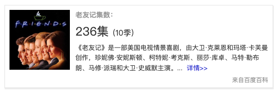
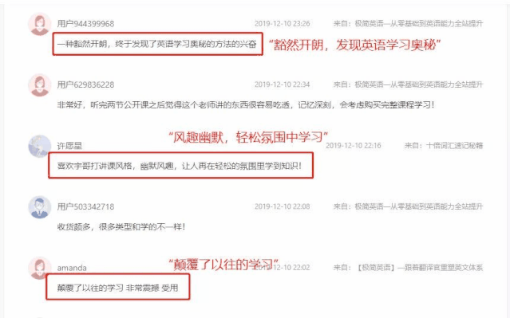
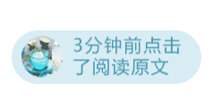

速读摘要

大名鼎鼎《老友记》是一部超级适合学英语的美剧。不经思考就能反应英文句子，像native speaker(英语母语者)一样大胆表达。这个方法还被称为"英语极简公式"，因为它还能让你的阅读、写作、翻译能力大得到提升，达到英语"说写译"的目的。学完全套课程，你不经思考就能反应英文句子，像native speaker(英语母语者)一样流利表达。更让人兴奋的是，这次课程特别邀请英语专业八级的助教老师，来辅助课后学习，打消你的学习顾虑。

原文约 1369  字  | 图片 17 张 | 建议阅读 3 分钟 | [评价反馈](https://static.app.yinxiang.com/embedded-web/clipper/#/Evaluating?d=2020-04-03&nu=d1819a07-5e24-475f-a0aa-d3a875d82067&fr=myyxbj&ud=58b471&v=2&sig=4A9EAF265E4E3D8983E257F52BC28246)

##  他刷了10遍《老友记》，总结出一套万能口语公式，请自取！

极简英语 [有部电影]()**
大名鼎鼎《老友记》是一部超级适合学英语的美剧。

里面有高达90%的英语日常词汇，还有众多对话场景，有利于口语的快速突破。

**刷了10遍《老友记》**
**研究出一套公式 **

有这样一位老师，他反复刷了10遍《老友记》，又研究了N本专业英语理论教材，历经数年提炼出来的一套**完善、详尽、清晰**的英语口语公式。

▼老师曾泡在图书馆里孜孜不倦
.jpg)

值得一提，这套公式非常**简洁易懂**。

无论你是零基础小白，还是中学、大学生，亦或是职场精英，学完这套方法可以做到：
**> 不经思考就能反应英文句子，像native speaker（英语母语者）一样大胆表达。**

另外，这个方法还被称为“**英语极简公式**”，因为它还能让你的**阅读、****写作**、**翻译能力大得到提升**，达到英语“说写译”的目的。

今天我们特别邀请到这位老师，将**公开这套英语极简公式**的核心方法！

如果你想学习这个“神奇”的方法，提升“说”英语能力，不妨扫描下方二维码加入学习群，助你能力突飞猛进！

**《4天逆袭“哑巴英语”》**
课程原价899元** 现在0元**
4月5日-4月8日
全程直播授课，请尽快扫码加入
 长按扫码  入群听课

**  以下为****老师自述  **

**扔掉英文教材书**
**和我一起快速“说”口语**

大家好，我就是上述英语老师韩宇。

从事英语教学6年，我教过的学生人数能填满3个鸟巢体育场。

他们听课的理由只有一个：“**跟我用极简公式‘说’英语**”。

.jpg)

**学这套方法，有3大好处：**
1、不需要传统的英文教材书。
2、不需要死记硬背，不需要背词组和句型
3、不需要再担心遇到英语长难句。

学完全套课程，你**不经思考就能反应英文句子，像native speaker（英语母语者）一样流利表达。**

▼像韩雪一样流利说英语

英语不仅要会“说”，还有“听、写、译”的能力，所以课程还会针对性训练**英语阅读能力**、**写作能力****及****翻译能力**。

**一套英语极简公式**
**=**
**会“说”口语**
**+**
**会“看”阅读**
**+**
**会“写”写作**

怪不得听完课的学员都惊呼：“**像刘谦老师变魔术一样的感觉！”“有种被点亮的感觉！”**

▼学生课程反馈

本次课程设置了4节课，课程内容是连续的，想直接实战使用，必须完整上完4天课程，才能有明显提升。

**  课程内容一览：**

.jpg)

课程满满的干货，让你屏蔽口语学习上90%时间的无意义消耗，将精力都花在最有价值的地方。

**打破学习瓶颈**
**实现英语指数级上涨**

有人说，学英语遇到一个好老师，很可能让你少走3年弯路。

那这次，很可能就是一个让你**实现英语突破、少走弯路的契机**！

英语万能公式推出市场至今，已经成功帮助数十万名学员提升英语水平，90%的人将英语能力转化为**过级、升职、加薪。**

****对于90%的英语学习者来说，一旦打破“英语结构”这个瓶颈，英语水平将呈现指数型的上涨！****

更让人兴奋的是，这次课程特别邀请**英语专业八级的助教老师**，来辅助课后学习，打消你的学习顾虑。

 ▼助教老师的专业证书
.jpg)

加入后，请安心学习——

**不用担心不能“说”：**4天的课程设计循序渐进，由易到难。我会将精心提炼的知识点，深入浅出的分享，只要跟着我的节奏来，你就可以学会。

.jpg)

**不用担心“开口难”：**每节课结束后都配有语音作业，完成作业后，专业助教老师会给予反馈。如果在学习过程中遇到任何问题，老师会1V1为你详细解答。

▼助教老师每天都会细心批改作业
.jpg)

**不用害怕难坚持：**每次开课前班主任老师都会一对一提醒你按时上课，而且学习社群内同学们相互提醒。

▼每天开课前老师都会发送上课提醒
.jpg)

通过**新颖的学习方法、专业的助教解答**，我坚信：4天后你会有收获。

**《4天逆袭“哑巴英语”》**
课程原价899元** 现在0元**
4月5日-4月8日
全程直播授课，请尽快扫码加入
 长按扫码  入群听课

Q.扫二维码进不去群怎么办？
A：由于网络问题，扫码进不去群的同学可以加老师的微信号，手动搜索微信号：********whyy9499** **和 **gsx087777**

Q.**真的是免费吗？**什么时候开始呢？
A：全程免费，**4****月5日（周日）****晚7:30**正式上课。

* * *

**↙点击**** 阅读原文 ****，也可直接加入学习哦~**

[阅读原文](https://mp.weixin.qq.com/s?__biz=MzI3ODM3MDAzMQ==&mid=2247499837&idx=1&sn=d77369e95036cb8bfeeba90ec45f800c&chksm=eb5a83bddc2d0aabf13d635a81c23c032277944e605f426d4d8dbe07d37c4aadf492d990311a&mpshare=1&scene=1&srcid=&sharer_sharetime=1585944219973&sharer_shareid=badd687b22e02cbea2bccedfd5f757de##)

在看