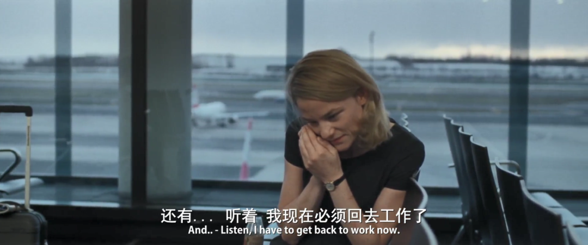

速读摘要

一天晚上，女主在外地工作时，突然接到姐姐的电话，说是自己在医院里遭受虐待，被绑14个小时，还表示医务人员要下毒害她，让女主来救自己。医院的人果然表示——姐姐不可能打电话，因为他们没有允许过。所以深入来看，本片的核心其实并非对男权的讨伐和批判，精神病姐姐也只是一个幌子，真正致使女主一次又一次走向崩溃的，是现代性对个人的深层异化。当"成为精英"变成一个人行为主导的意识形态，生活和工作的界限便很容易会模糊掉，进而带来生活空间的挤压和缩小。

原文约 2248  字  | 图片 41 张 | 建议阅读 5 分钟 | [评价反馈](https://static.app.yinxiang.com/embedded-web/clipper/#/Evaluating?d=2020-03-29&nu=89dca868-194a-4300-90df-f5cb4b0a6c49&fr=myyxbj&ud=58b471&v=2&sig=B5C13F0B218BB8F8F662ED54ABA3F72A)

##  现代社会把人逼成什么样，看完这部电影你就知道了

原创 有部电影 [有部电影]()**
今天继续来聊一部柏林电影节的入围作品——**《脚下的土地》。**

这是一部以职场女性为主角的心理惊悚片。

片中女主名叫罗拉，在一家外企做管理顾问。在工作上，她从不松懈，总是马不停蹄地出差、开会、见客户。

.jpg)

如此出类拔萃的表现，使她深得女上司的青睐，两人不仅在工作上配合默契，还发展成了地下情侣的关系。

电影开场不久，就是女上司在出差间隙与女主偷欢的场景。

在生活上，女主也同样对自己保持着高标准的要求。

她十分注重身材管理，即使工作繁忙，也几乎每天都会抽出时间去跑步和健身。

整体来说，女主对自己的生活状态非常满意。唯一让她糟心的，是得了精神病的姐姐。

自打姐姐住院之后，女主的整个节奏就被打乱，她不得不频繁来看姐姐，有时还得匆忙从外地赶回来。

.jpg)

同时，姐姐病发时歇斯底里的状态，也让她感觉压力山大，整个人难免不受影响，精神开始变得恍惚。

一天晚上，女主在外地工作时，突然接到姐姐的电话，说是自己在医院里遭受虐待，被绑14个小时，还表示医务人员要下毒害她，让女主来救自己。

女主猜测姐姐是精神状况出了问题，于是给医院打了个电话。

医院的人果然表示——姐姐不可能打电话，因为他们没有允许过。

.jpg)

然而惊悚的是，后来在女主和上司亲热时，又一次接到了姐姐的电话，对方居然清楚她此时的一举一动。

女主吓得当即四周找了一圈，也没看见姐姐的影子，只好再次打电话给医院询问情况。

而对方的回答也和上次一样——姐姐不可能打电话，人也没出去，此刻正在床上睡觉。

看到这里，估计不少人猜到了——是女主自己产生了幻觉。

她自己也意识到了，为此，第二天还特意去看了医生。

可是，当医生问她有没有家族精神病史的时候，她却犹豫了一下，隐瞒了姐姐的发病情况。

.jpg)

等医生要对她进行检查时，她又搪塞说自己有事，匆忙离开了医院。

.jpg)

这是因为，女主担心如果自己被确诊有精神病，会失去现在的工作。

但人算不如天算，即便她隐瞒了病情，残忍的现实仍然向她扑来——

先是女上司察觉到了她的精神状况有问题，导致两人的关系变得疏离；

接着因为病情，女主在工作上接连出错，手中的项目被转交给别人去做。

随后，她一直力图保住的一个员工，也因为她的过错成了背锅侠，被上司辞退，搞得女主痛心不已。

而等女主好不容易熬过这些，自己也被提拔成了副总经理，眼看就要柳暗花明的时候，姐姐却突然跳楼自杀了……

.jpg)

原来，之前因为姐姐的状态有所好转，女主便无视医生的建议，把姐姐从医院接了出来，给她找了个公寓。

考虑到工作，女主只能一个月看一次姐姐，所以还特别请了个朋友帮忙照看。

她本以为自己能够在平衡工作与生活的同时，照顾好家人，但没想到悲剧还是发生了。

一时之间，女主的情绪走向失控，差点也跟着跳下楼去，幸好警察及时赶到，把她送到了医院。

.jpg)

在影片的结尾，出院后的女主像以往一样努力地工作、自律地健身。

没有人知道，失去了姐姐这个拖油瓶般的羁绊，她的生活是不是就会变得更好。

.jpg)

作为一部以职场女性为主角的德语电影，本片很容易让人想到《托尼·厄德曼》。

那部电影讲的也是女性在处理职场与亲情时，遭遇的困顿和反思。

但是，有别于《托尼·厄德曼》充满温馨的喜剧策略，本片却从头到尾都散发着冰冷而可怕的绝望气息。

影片的色调冷淡，没有任何配乐，环境中的噪音，人物的喘息、物品间摩擦声由此异常刺耳，在人物压抑的遭遇和情绪中，营造出一种令人窒息的极致冷清。

.jpg)

我们都知道，在当今的社会里，女性想要谋取事业上的成功，常常需要花费比男性更多的努力。

在片中，导演一方面展示了女性特有的职场困境，比如在工作和应酬中被男性挑逗、排挤等等；

但另一方面，又没有将重点放在女性主义上，把当代职场女性的不幸，完全归咎于性别不平等的现状。

相反，本片把精神病姐姐这样一个女性角色，作为消耗女主的核心要素，并为女主自身也埋下遗传了家族精神病的可能，让苦痛拥有了如影随形、代际传递的象征意义。

所以深入来看，本片的核心其实并非对男权的讨伐和批判，精神病姐姐也只是一个幌子，真正致使女主一次又一次走向崩溃的，是现代性对个人的深层异化。

虽然说现代社会强调尊重多元的生活方式，但客观来讲，主流社会所传播和推崇的，始终是一套高度统一的标准样本。

像片中的女主一样，实现财务自由，成为社会中的上流人士，时刻注意身材管理，就是一套当下十分常见的模板。

**只是，要达成和维持精英状态，并不是像人们所想象的那样，只有光鲜亮丽的高级与优雅。相反，也很有可能给个人的身体和心灵造成巨大戕害。**

一方面，当“成为精英”变成一个人行为主导的意识形态，那么，生活和工作的界限便很容易会模糊掉，进而带来生活空间的挤压和缩小。

.jpg)

另一方面，个人自身在追随这套价值观的同时，还可能会不自觉地进行自我剥削，无形中把自己变成一个效益至上的工具人。

片中的女主因为怕影响事业，不仅拒绝体检，长期工作几十个小时精神恍惚也不肯休息，这些行为其实已经不能单纯地用“事业心强”四个字来解释，其背后正是自我异化所带来的非理性执念。

.jpg)

而在整部影片中，有一个最能展示异化所带来的窒息感的场景，那就是健身房。

在健身房里，背景一片冷清空荡，女主的表情麻木、动作机械，整个人给人的感觉，犹如一个没有灵魂的劳作机器。

.jpg)

事实上，一个人选择什么样的生活方式、以什么为自己的追求和目标，很大程度上并非源自于所谓的自由意志，而是受掌握资源和话语权的主流社会影响所致。

.jpg)

而如今的世界，已经构成了一个现代化的系统，覆盖的领域方方面面。

在人们的物质生活和精神文明得到显著提高的同时，现代性也产生了严重的副作用。

**其中之一，就是整个世界趋于同化，人们的追求和自我认同变得单一向度，失去了设想另一种生活状态的可能，继而生活在非此即彼、必要竞争的巨大压力中。**

影片借助女主的痛苦与麻木，所要引起我们反思的，正是在这种单向度精英主义的背后，现代性给个人带来的精神消亡和惨痛代价。

不可否认，影片流露出的情绪晦暗而沉重，但它所讨论的话题却足够引起我们重视。

**俗话说，人往高处走，水往低处流，想要成为精英从来都不是一件错事。**

**只是，无论到了什么时候，我们都不能放弃思考。如何不让自己沦落为失去灵魂的工具，是每个人都必须时常进行的自省。**

也许是国内最认真的电影自媒体

在看