速读摘要

她的爆料其实也只是冰山一角，因为在我们看不见的角落，还有无数遭遇咸猪手的受害女性在承受着巨大的精神压力。而今天聊的这部《被忽视的痴汉问题》，也将深入挖掘的态度进行到底，试图解答为什么公共场所的性骚扰问题在日本屡见不鲜、屡禁不止。另一方面，由于便利店靠近居住场所，会让人不知不觉放松警惕，痴汉就是利用这种心理，伺机尾随女性进入店中，并在她们专注挑选商品时下手。从以上两个例子就能看出，女性在公共场所遭遇骚扰时，如果旁人没有及时伸出援手，受害者遭受的心理打击会更大，甚至需要至少8年的时间，才能彻底从专业治疗中恢复过来。

原文约 2256  字  | 图片 28 张 | 建议阅读 5 分钟 | [评价反馈](https://static.app.yinxiang.com/embedded-web/clipper/#/Evaluating?d=2020-03-20&nu=94f42c1a-bb02-4084-8946-abfa974c9739&fr=myyxbj&ud=58b471&v=2&sig=73865A02DEEDE8B5C7B1A22F0E04BBCF)

##  岛国痴汉现身说法，亲自告诉你为什么咸猪手那么多？

原创 有部电影 
在刚刚过去的国际劳动妇女节当天，国内一位男性配音演员龙吟，以极其不光彩的行为突然上了热搜——

他被人爆出4年前曾伸出咸猪手骚扰女性，给受害者造成了严重的心理阴影。

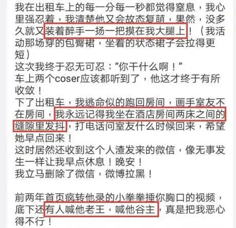

这篇爆料发布3小时后，龙吟所在的公司官微立刻发表严正声明：查证属实，解除合约，永不续用。雷厉风行的处理结果，获得了网友的一致好评。

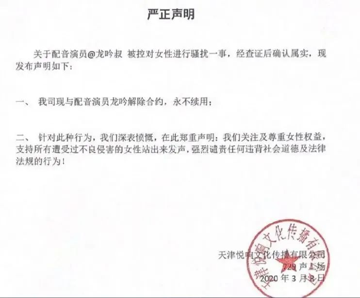

这份声明发布后，当事人龙吟随后也更新了自己的微博，主动承认错误，接受网友批评，看上去十分有诚意。

但实际上，这件事绝非在第一时间道歉就可以平息一切。

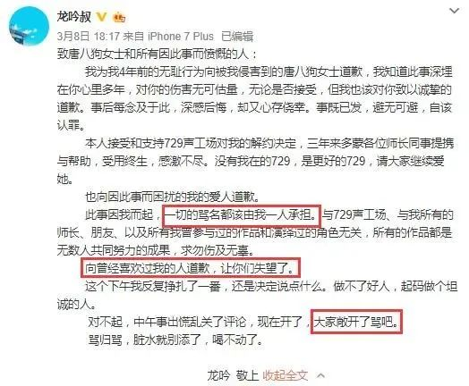

当事人时隔4年才选择爆料，足可见这期间她经历了多少挣扎和纠结。

而她的爆料其实也只是冰山一角，因为在我们看不见的角落，还有无数遭遇咸猪手的受害女性在承受着巨大的精神压力。

说到这里，就不得不给大家聊聊日本NHK电视台最近播出的一档纪录片——**《让数据说话！被忽视的痴汉问题》。**

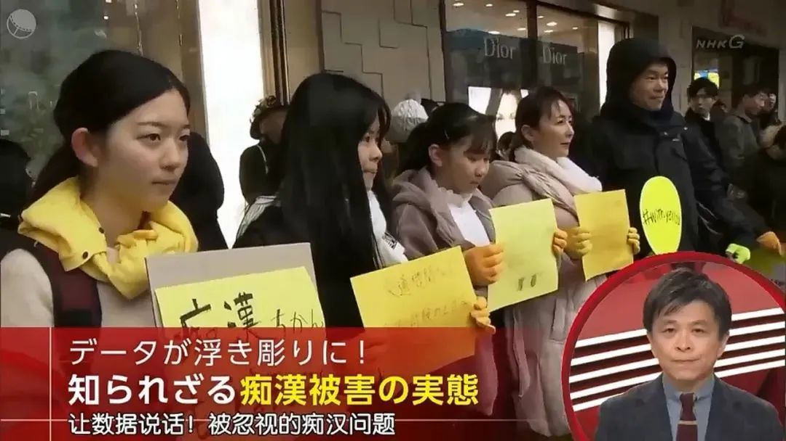

这部纪录片是NHK新闻节目《现代大特写》中的一期，聚焦日本公共场所的性骚扰问题。

提到这档节目，很多网友都会称它为“日版《焦点访谈》”，因为它每期都会聚焦一个观众最关切的社会问题，并通过详实的调查和采访进行深入挖掘，话题涉及全球各个国家。

比如今年国内疫情爆发不久后，《现代大特写》就陆续播出了几期有关新型冠状病毒的报道，内容详实，立场客观，干货满满。

而今天聊的这部《被忽视的痴汉问题》，也将深入挖掘的态度进行到底，试图解答为什么公共场所的性骚扰问题在日本屡见不鲜、屡禁不止。

片中不仅请到了心理学家、社会工作者、犯罪研究专家，从专业的角度进行理论分析，而且还找到一位曾6次作案被捕、之后良心发现的“前痴汉”，现场还原性骚扰的作案流程。

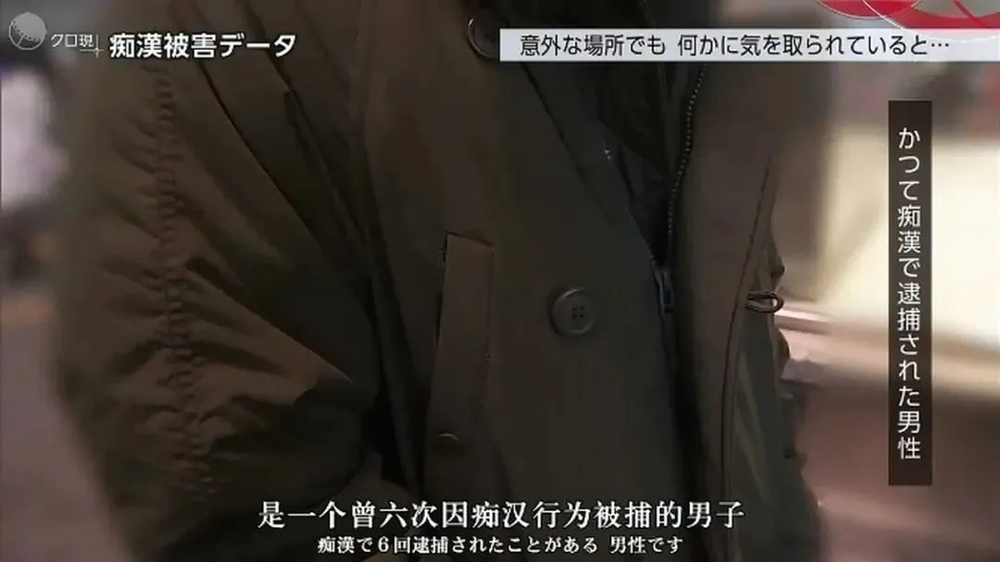

片中调查的基础，是一款名叫“痴汉雷达”的app。在这款app上，用户可以上报自己遭遇或目击的各类性骚扰事件。

通过分析2300起有效举报的数据，人们可以更直观地找出“痴汉问题”的根源所在。

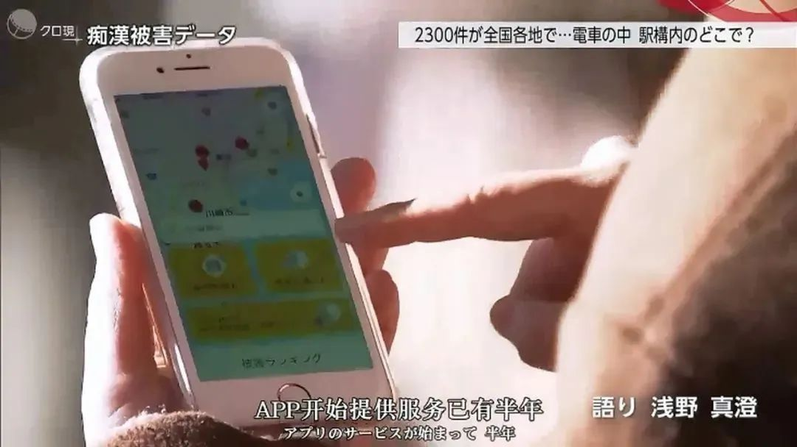

从犯案地点来看，数据中有超过半数的骚扰事件发生在最繁华的城市东京，并且集中在人群密集的电车上。

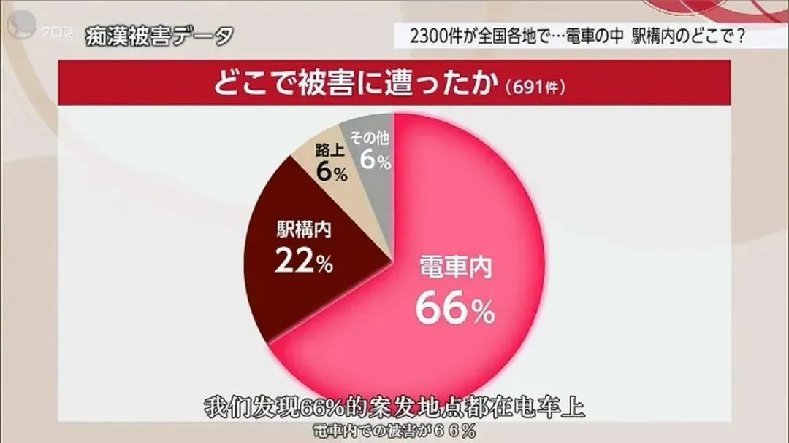

在这种需要被迫与陌生人近距离接触的空间内，很多受害者经常是不经意间就遭到痴汉的骚扰，站着、坐着、上下车、进出站时，都有可能被突如其来的脏手触碰，可谓防不胜防。

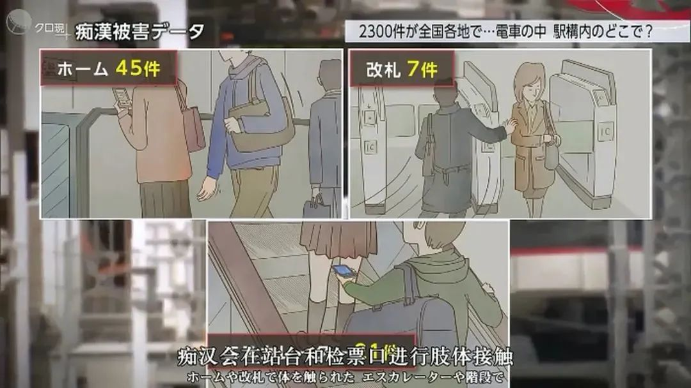

不过值得注意的是，痴汉们选择的作案地点，也不光是电车这种容易遮掩的空间。便利店也是他们疯狂作案的场所之一。

在普通人看来，便利店里光线明亮，人员密集程度也远低于地铁、公交，理论上不会有人在光天化日之下如此大胆。

但实际上，在痴汉们的视角看来，便利店里明亮的光线，反而给他们物色目标提供了有利条件，有的作案者甚至专门开车停在便利店附近，在暗处“挑选猎物”、伺机作案。

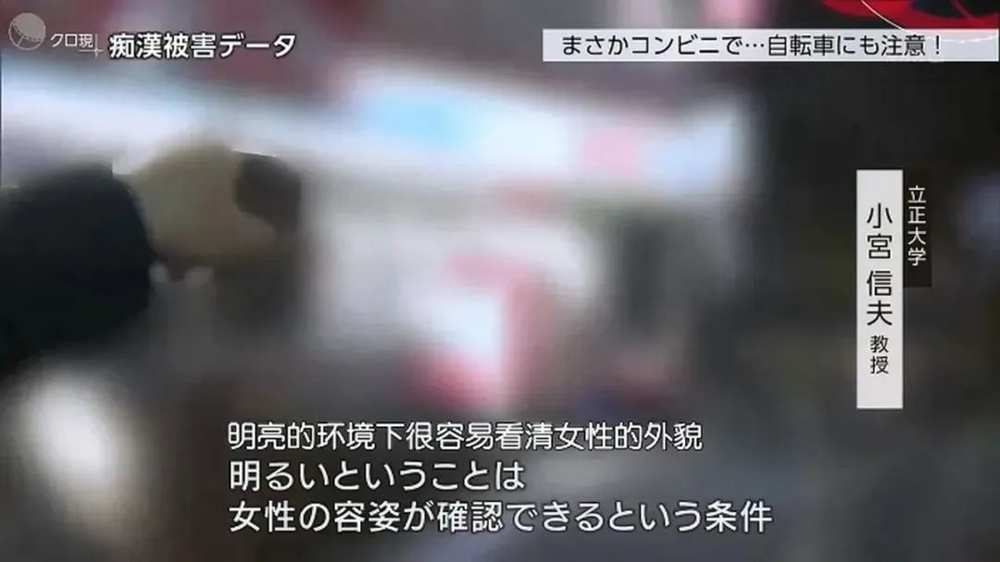

另一方面，由于便利店靠近居住场所，会让人不知不觉放松警惕，痴汉就是利用这种心理，伺机尾随女性进入店中，并在她们专注挑选商品时下手。

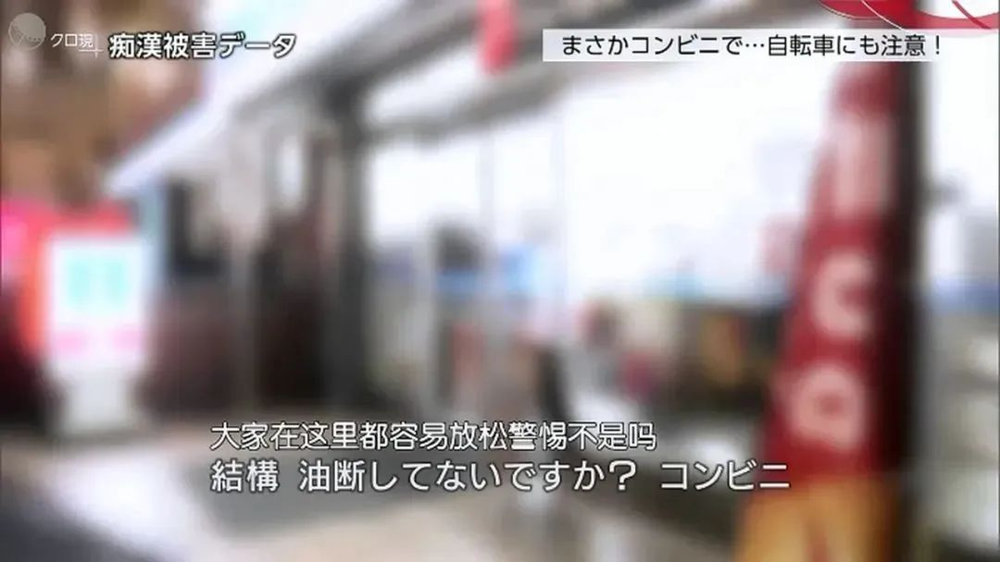

通过数据分析，虽然我们能够总结出性骚扰案件频发的场所，但即便对这些地方加强治安力度，骚扰事件还是无法被彻底杜绝。

因为这其中涉及了一个更深层的问题——**旁观者效应。**

在app搜集到的举报中，有这么一起案例：一位女性在电车上被痴汉触摸了臀部，反手就将对方抓住不放，然而对方却死活不承认，反而在车上大声喊叫、百般抵赖，女孩只能死抓着他不放。

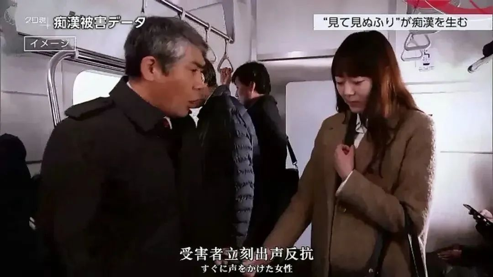

而就在双方僵持时，车上的乘客纷纷对此视而不见，装着没事一样。大家都觉得反正这里这么多人，就算我不站出来，早晚也会有人挺身而出。

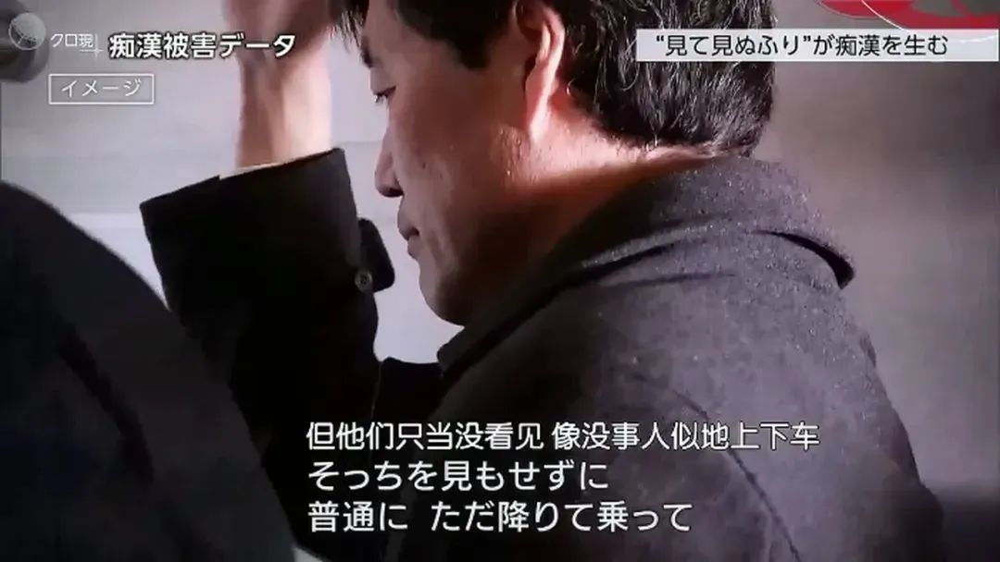

但实际上，正是这种心理，让周围的目击者很难产生为受害者发声的责任感，最终没有人站出来，痴汉也侥幸逃脱惩罚。

这样的情况并非少数，在app收集的举报数据中，有相当一部分受害者都对旁人的漠视表现出极度失望。

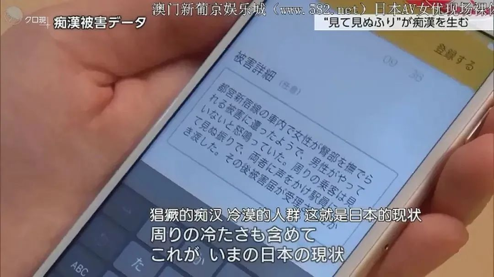

就像我在开头说的，很多女性在遭遇骚扰后，其实都要承受巨大的心理压力。

片中采访到的一位女孩，曾在初中时遭到电车痴汉的骚扰，当时她立刻向身边的大人求助，但却没人愿意理睬。

这个遭遇让女孩感觉个人尊严被践踏，之后每天出门上学前，都会想起自己在车上被骚扰的经历，甚至开始讨厌自己的身体。

虽然这个女孩后来没有走向情绪的极端，但那次被骚扰的经历无疑给她造成了心理影响。一直到十年后，她在电车上再次遭遇痴汉，才终于鼓起勇气通过app举报。

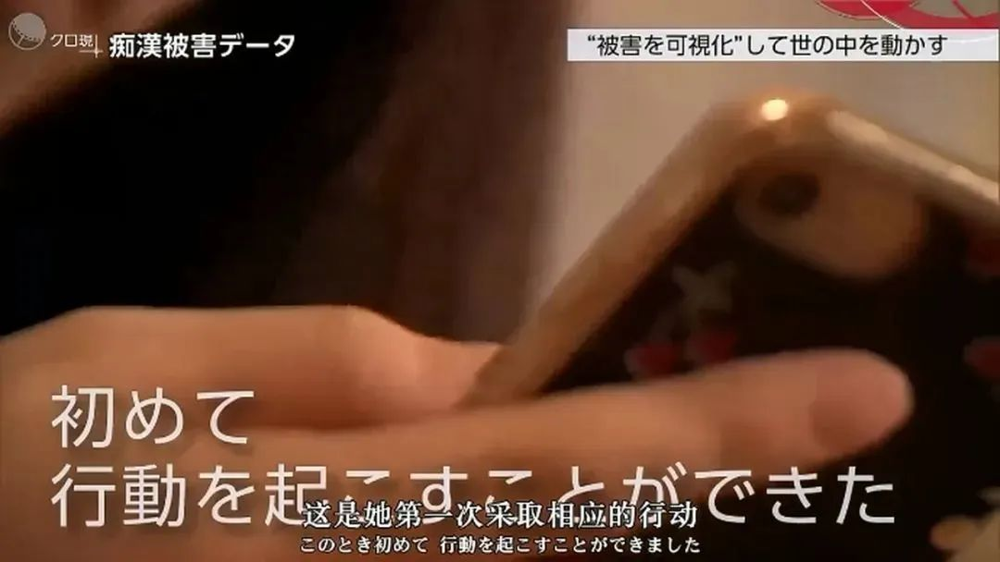

从以上两个例子就能看出，女性在公共场所遭遇骚扰时，如果旁人没有及时伸出援手，受害者遭受的心理打击会更大，甚至需要至少8年的时间，才能彻底从专业治疗中恢复过来。

从这个角度来看，电车痴汉之所以横行霸道，罪魁祸首正是那些视若无睹的旁观者。

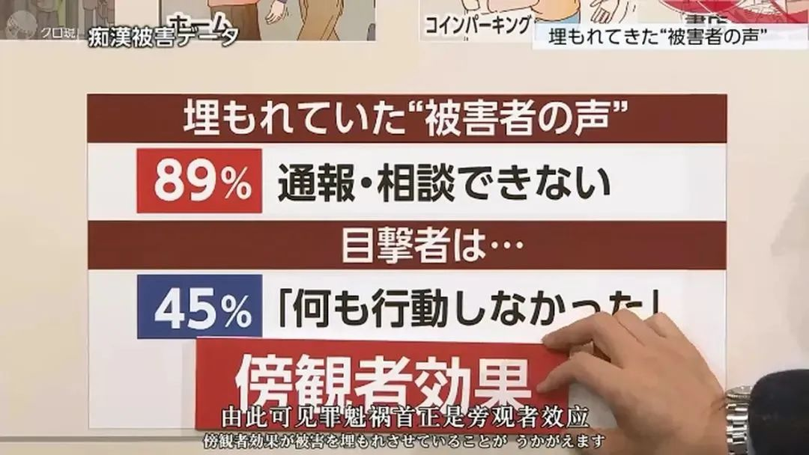

对于日本痴汉频出的问题，片中也邀请专家提出了各种解决方案。

比如从源头上解决问题，对未成年人开展科学的性教育；比如采用二次预防手段，对于初次遭遇骚扰的受害者，进行完善的心理辅导；比如对作案者实施强制治疗，防止其再犯。

虽然这部纪录片呈现的是日本社会的性骚扰问题，但值得我们每个人观看。

因为公共场所性骚扰行为，本质上是对人权的侵犯，只有每个人在发现时及时出手制止、遭遇骚扰时勇敢取证曝光，那些肮脏的咸猪手才会无处遁形。

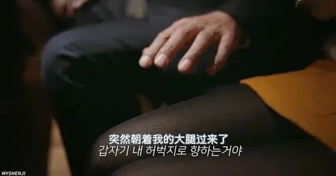

令人欣喜的是，最近几年有越来越多的人开始关注这个问题，我们的法律也随之越加完善。

比如2019年10月，首例地铁内强制猥亵案在上海开庭审理，被告人王某某因在轨道交通八号线列车车厢内猥亵两名女子（其中一名为未成年人），被判处有期徒刑六个月。

比如2019年12月，北京首例校门口咸猪手案件，被告人因多次在小学门口故意偷摸女童胸部、臀部，性质极其恶劣，最终获刑三年。

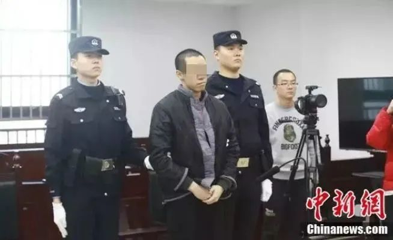

最值得肯定的是，有越来越多的人面对性骚扰事件，开始拒绝做沉默的旁观者——

银川女子夜路遭遇咸猪手，外卖小哥协助连追8条街将其拦下，作案者最终被处以行政拘留5日的处罚。

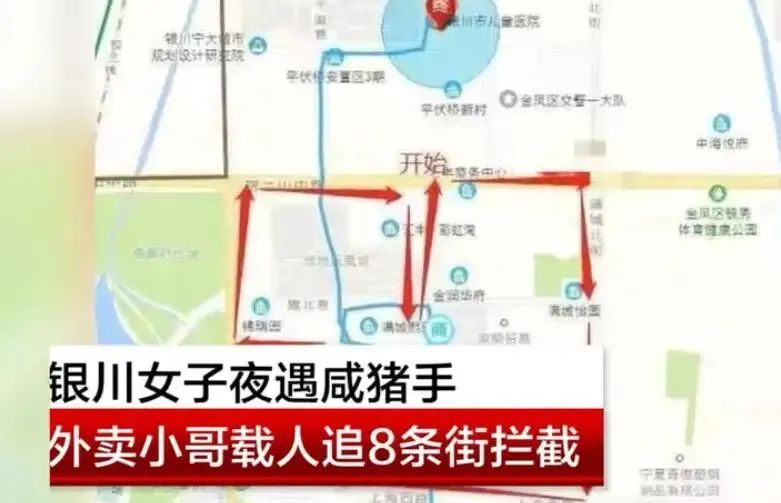

青岛女乘客乘坐公交时遭遇咸猪手，大声呼救后，车上多名乘客与驾驶员联手抓色狼。

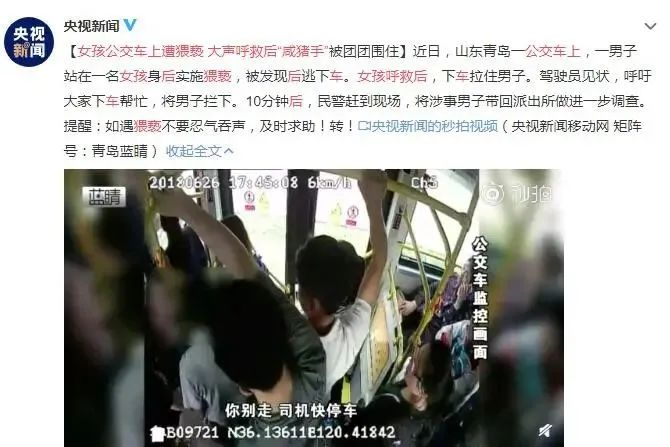

深圳地铁一黑衣男子猥亵女乘客，被热心网友拍下取证，并厉声质问阻拦……

这些新闻也许在你的手机里只是一闪而过，但那些热心人的挺身而出，对于受害的女性来说却是莫大的帮助。

**因为每个人的主动发声，拥有最强大的震慑威力，也只有当我们每个人都愿意主动阻止性骚扰行为，拒绝做沉默的旁观者时，那些经历内心挣扎的受害者们，才能更勇敢地站出来，让罪恶之手逃无可逃。**

