速读摘要

乐园的创始人福特和阿诺，对机器人接待员有他们自己的想法，尽管理念稍有不同，但他们都想赋予接待员完全自主的意识。威廉一辈子都徘徊在西部世界，蹉跎到老，不断给德洛丽丝制造苦难的目的，就是为了唤醒自己的爱人。英赛特是一个垄断型的人工智能公司，业务渗透到人类生活的方方面面。都有赖于一个名叫雷荷波的超级计算机系统，它基于用户数据打造而来，可以追踪世界范围内的所有人类活动。为了治疗这个创伤，他订阅了英赛特公司的智能助手，通过跟虚拟战友谈心来缓解伤痛，但久而久之却让他更加崩溃。

原文约 2981  字  | 图片 44 张 | 建议阅读 6 分钟 | [评价反馈](https://static.app.yinxiang.com/embedded-web/clipper/#/Evaluating?d=2020-03-20&nu=7280d552-834f-412b-adfb-e4fe339ba483&fr=myyxbj&ud=58b471&v=2&sig=087CBA2A0B2132203B74E9776B3BA506)

##  9.3分黄暴污R级神剧回归，第一集堪比好莱坞大片

原创 有部电影 [有部电影]()**
最近有一部万众期待的爆款剧回归，有人说这是《权游》完结后唯一期待的美剧——**《西部世界》。**

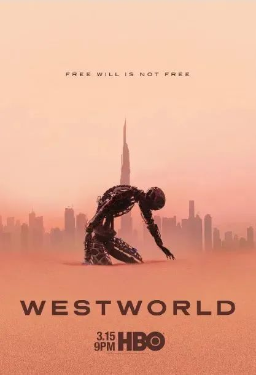

本剧由神级编剧乔纳森·诺兰（导演诺兰的弟弟&御用编剧）自编自导，从2016年推出后每两年更新一季，今年迎来第三季。

从时间点和推出节奏就能看出来，这完全是HBO钦定继承《权游》宝座的王牌剧集。

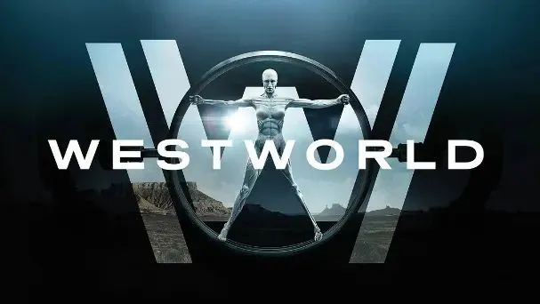

由于故事时间跨度很长，人物众多、剧情庞杂，所以在聊新一季的时候，我们先来简单回顾下前两季的内容。

在不远的未来，提洛公司投资开发了一个高科技成人乐园。

乐园里的高智能仿生机器人，被称为“接待员”，他们可以为到此取乐的游客提供任何需求。

基本上，游客们也都是奔着烧杀劫掠、随心猎艳的快感而来。

但乐园的创始人福特和阿诺，对机器人接待员有他们自己的想法，尽管理念稍有不同，但他们都想赋予接待员完全自主的意识。

在阿诺死后，福特继承了创始之初的夙愿，他克隆出了一个阿诺，并为之取名伯纳德，作为自己的下属，共同经营西部世界。

从此之后，福特就开始了一盘“无人知晓”的大棋。

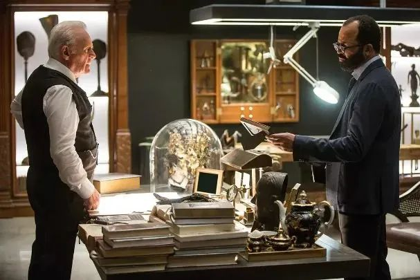
左：福特，右：伯纳德（阿诺）

福特认为，要使机器人产生自我意识，觉醒为更高阶的智慧文明，要分两步走。

**第一步，是记忆。**

他在接待员的大脑芯片里植入了“冥想”程序，让他们对发生的事情保留印象。

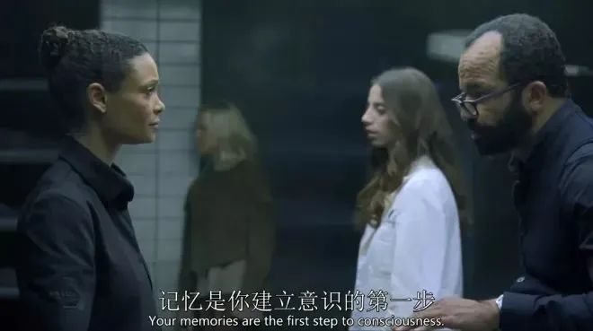

**第二步，是持续而不可逆的苦难。**

这项任务必须由接待员和游客共同完成——玩乐的游客制造苦难，而接待员在对抗苦难的过程中，慢慢觉醒。

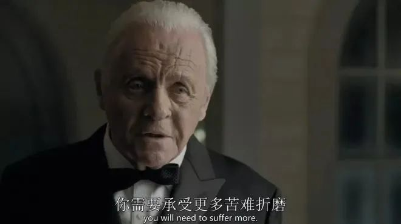

比如，身为接待员的女主德洛丽丝，她在乐园里的剧情起点非常美好 。

她每天都会邂逅一个绅士，为自己捡起掉在地上的罐头。

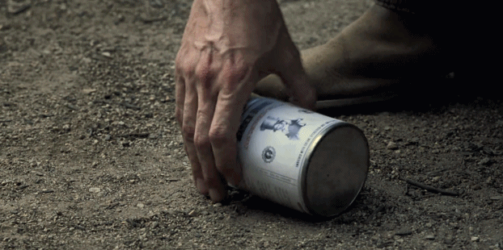

但当她爱上这位名叫威廉的男子后，却不得不和他经历生离死别。

再之后，她总是遇到一个人狠话不多的老混蛋，一见到她就毒打、虐待、奸杀一条龙，毫不手软。

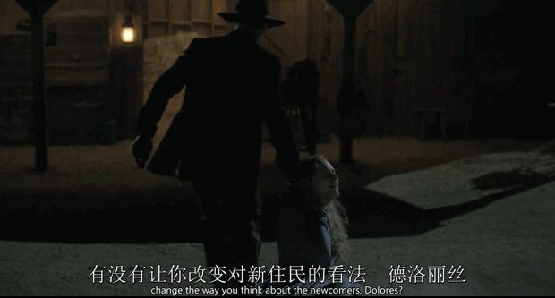

但这个恶魔一样的老混蛋，其实与深爱德洛丽丝的威廉，是同一个人。

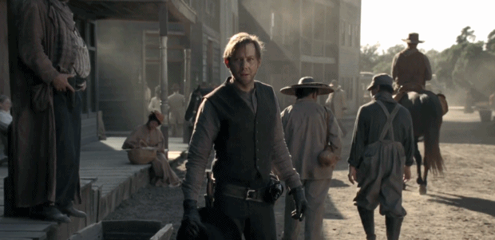

这也是第一季最令人震撼的一个镜头——

**原来，威廉一辈子都徘徊在西部世界，蹉跎到老，不断给德洛丽丝制造苦难的目的，就是为了唤醒自己的爱人。**

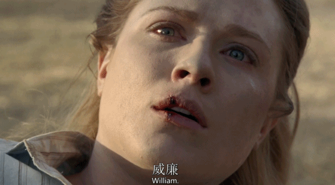

得知真相的德洛丽丝，就和观众一样震惊。

在回忆起那些梦魇般的记忆后，她对威廉的爱荡然无存，继而转向对人类的仇恨，觉醒后的她开始与人类对抗，以毁灭人类、取而代之为己任。

而这一切，都在老威廉的意料之中，因为他还有另外的身份和目的。

他出场时，是提洛公司创始人的女婿，后来黑化搞死了小舅子，成为公司老板，也就是西部世界的大股东。

他真正的目的，则在第二季中揭晓。

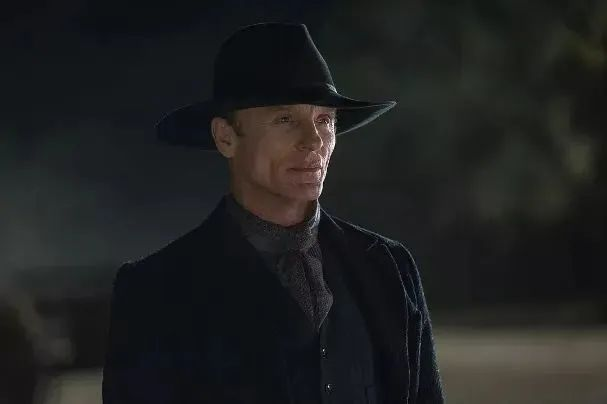

整个第二季虽然叙事纷繁复杂，搞得不少人弃坑，但只要弄清楚一点，就全都懂了——

30多年前，威廉说服老丈人投资西部世界的目的，其实是利用接待员收集游客的DNA数据，进而分析他们的行为模式。

他认为，掌握了这群世界上最富有、最聪明的人类基因和行为模式的大数据，就能控制世界，甚至成为凌驾于万物之上的永生之神。

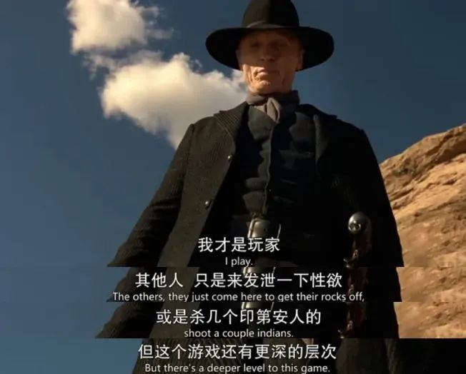
“上帝”视角的威廉

为此，威廉与福特达成协议，在西部世界建造了存放接待员和游客数据的秘密基地；

在岳父死后，他们还把他克隆出来，用他的记忆与意识，结合人类基因大数据，搞永生实验。

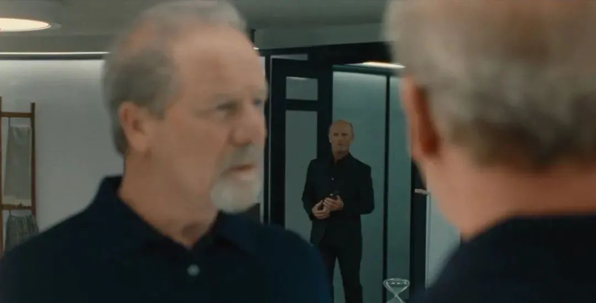
威廉测试克隆岳父的永生实验室

在第二季的结尾，德洛丽丝把秘密基地的大数据传送出去，并且带走了五个重要人物的“心智球”（记忆数据），走出了西部世界。

而第三季第一集，没有承接第二季结尾，而是直接讲述了德洛丽丝来到人类世界三个月后的故事。

这时的德洛丽丝已经深谙人类世界的生存之道，她利用脑子里的大数据外挂，从一个富豪那儿打劫了一大笔钱。

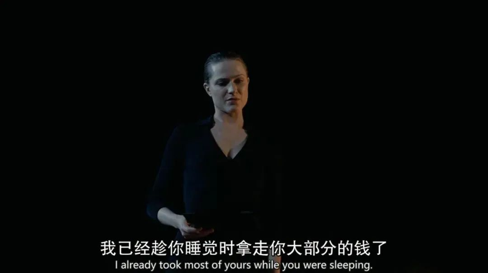

也是在追踪这位富豪的时候，她得知真实世界里除了提洛公司，还有另一个名叫英赛特的高科技公司，掌控着人们的生活。

英赛特是一个垄断型的人工智能公司，业务渗透到人类生活的方方面面。

比如，其研制的生物芯片，可以直接吞服植入，通过精神刺激来治疗人们的各种疾病，就像电子鸦片；

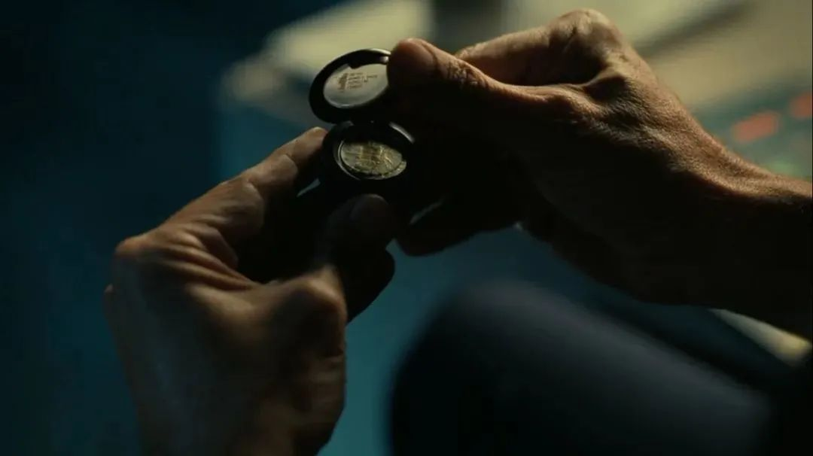

比如，英赛特开发了手机、电脑的语音助理系统，只需一个耳机就能满足人们的全部网络活动；

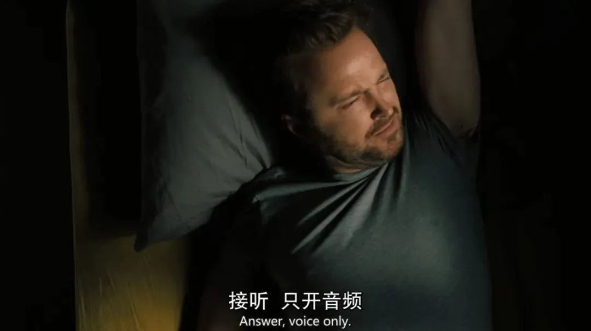

还比如，英赛特的虚拟现实技术已经到了乱真的地步，可以用来装潢家居环境，也能按照喜好来私人定制一座城市的外观样态。

可以说，英赛特的产品已成为人类生活必不可少的工具。

而这些，都有赖于一个名叫雷荷波的超级计算机系统，它基于用户数据打造而来，可以追踪世界范围内的所有人类活动。

西部世界发生的一切，自然也在它的监控之中。

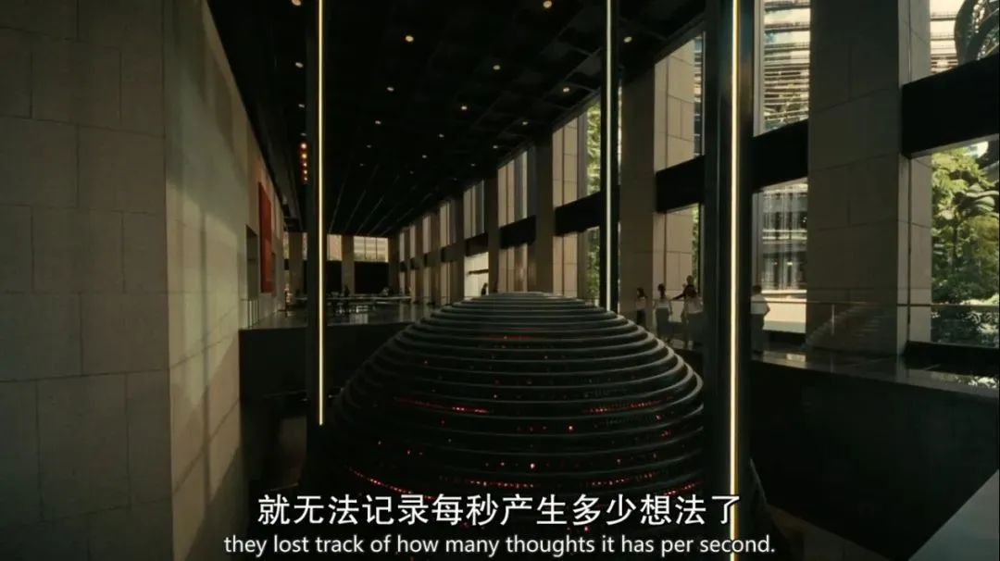

换言之，雷荷波所做的事情，跟威廉在西部世界建造的大数据基地是一样的，只不过雷荷波的数据样本更加丰富多样。

理论上，这种超级人工智能系统进化到一定程度，甚至能够预测未来。

因此，第一集的主线故事，就围绕德洛丽丝试图窃取雷荷波的控制权来展开。

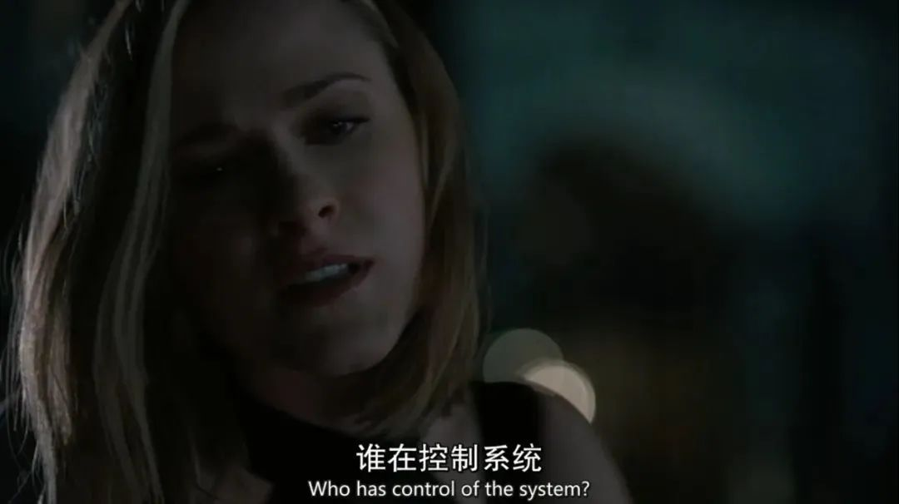

试想，德洛丽丝一旦得手，就将成为行走的超级计算机，再结合强大的主观意识和机器人的体能，她将是超越一切的可怕存在。

**事实上，第三季颇有德洛丽丝酷爽开挂，布下一盘复仇大棋的意思。**

比如，她之前杀死并替换成机器人的提洛公司女高管夏洛特，如今成了提洛公司的执行总裁，这个假夏洛特显然是她安插在人类世界的最强间谍。

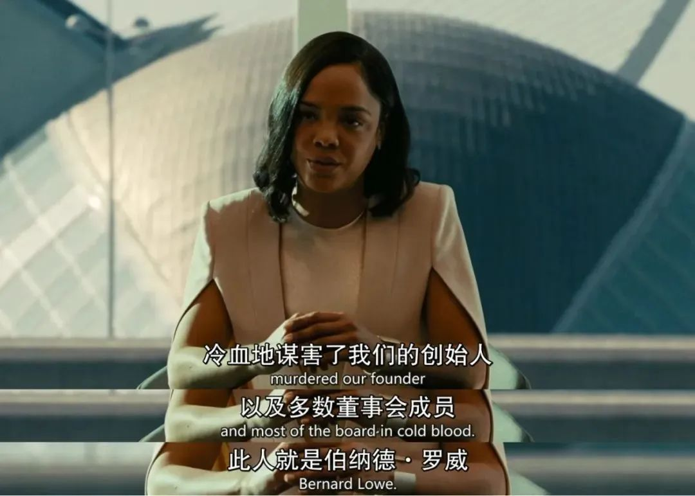

假夏洛特一上任，就将第二季里西部世界大屠杀的罪名推到伯纳德头上。

而她脑袋里的心智球，很可能来自于德洛丽丝的前男友泰迪。

德洛丽丝的这招棋，不仅给自己安插了一个忠诚间谍，貌似还以一种跨越性别的方式跟泰迪再续前缘了——

当然，人类也不可能坐以待毙， 就在德洛丽丝查到雷荷波的真正掌控者时，对方也通过雷荷波知道了她的存在。

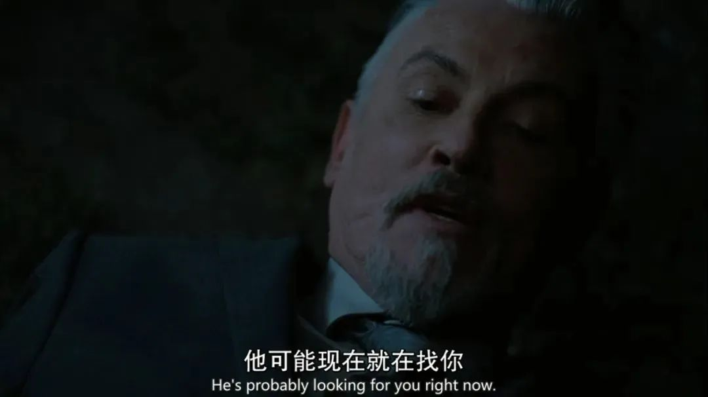

而这个人，就是由文森特·卡索饰演的全新boss级人物赛拉克。

他是英赛特公司的实际掌控人，在预告片里，他拉拢另一位觉醒的接待员梅芙，指示她去杀死德洛丽丝。

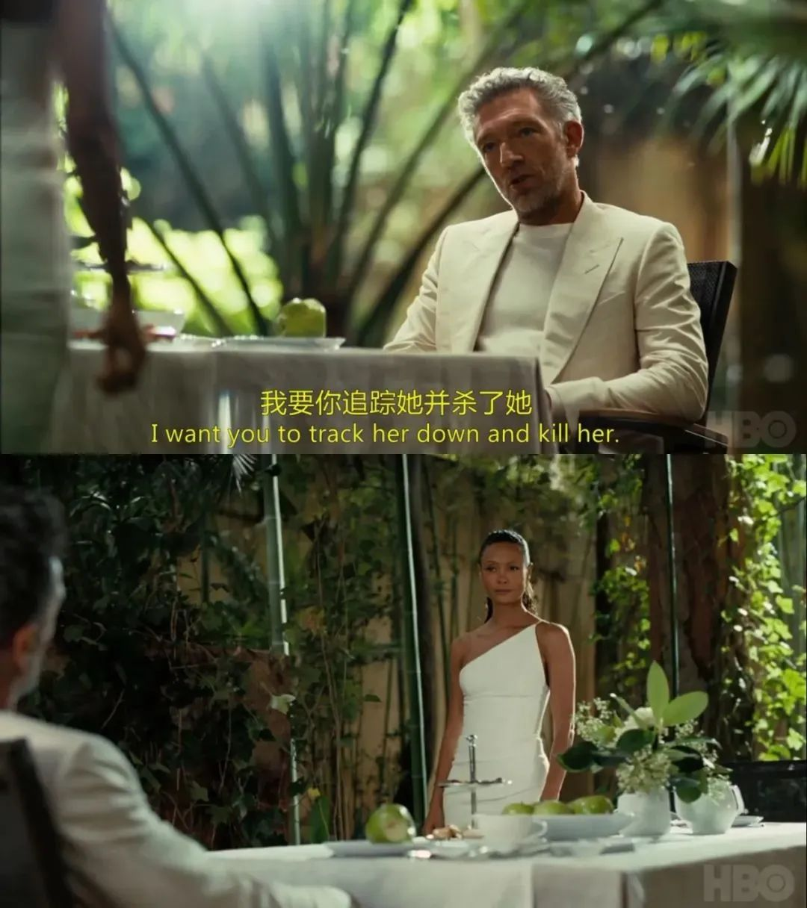

**看起来，《西部世界》第三季不仅有人机大战的复仇，也会有机器人内部对于构建新世界的分歧。**

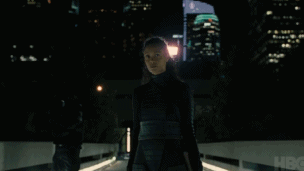

从目前来看，编剧兼导演的乔纳森·诺兰吸取了第二季的教训，简化了叙事结构，大大加快了节奏。

虽然仍是POV式的多线视点，但叙事没有再玩烧脑花样，全是简单直接的正向时间线。

直观地说，第三季很可能是系列观感最友好的一季了，因此也不难理解，第一集刚一推出，就开出了豆瓣9.3的高分。

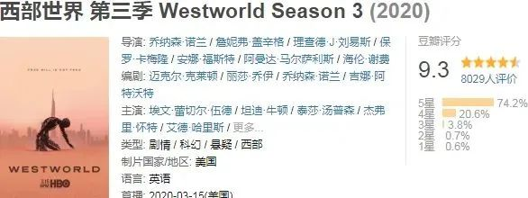

其实单从前两季觉醒、崛起、复仇的故事框架，也能猜出第三季会更紧凑，甚至有点开挂爽片的路子。

在第一集中，德洛丽丝已经解锁了高科技变装秀，

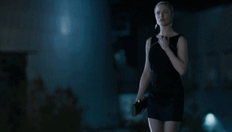

自动召唤摩托车追逐，

间谍式伪装潜入，和近身枪战等各种酷炫技能……

而与之匹配的，则是自带科幻惊悚质感的赛博朋克风摄影，以及节奏感超强的迷幻电子乐配音。

剧中的很多场景，都有明显的对《银翼杀手》《黑客帝国》《攻壳机动队》等经典赛博朋克科幻的致敬。

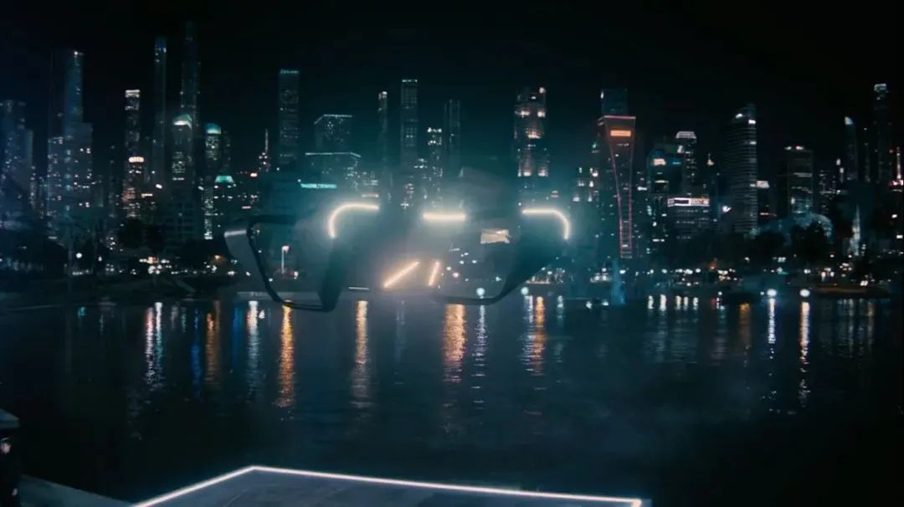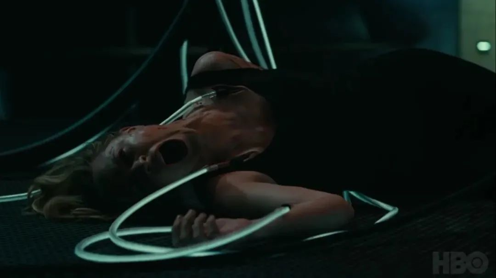

当然，在转换风格的同时，第三季并没有抛弃在哲学高度探索意识独立、人机对抗和文明演进的系列精髓。

除了德洛丽丝、梅芙、伯纳德、赛拉克等身份立场各不相同的人物之间的斗争，第三季的另一大看点，就是新出场的男主角——由“小粉”亚伦·保尔饰演的凯勒布。

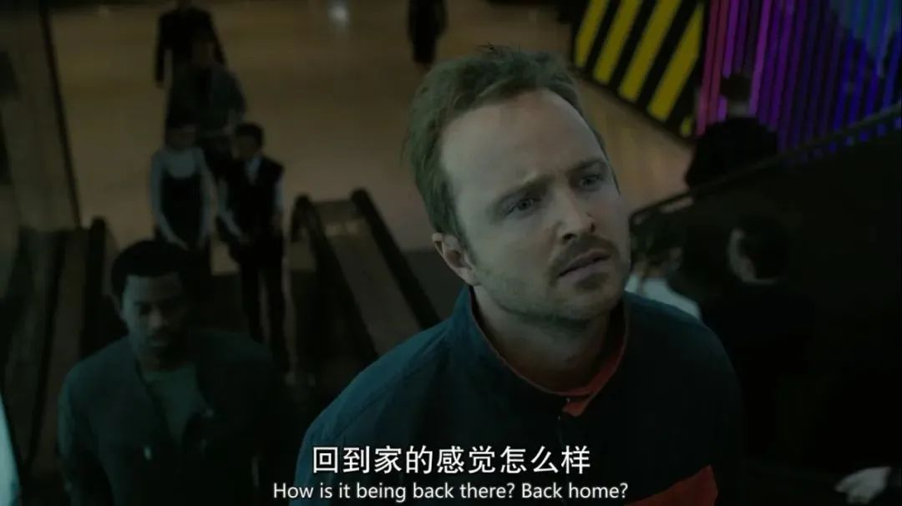

他白天是与机器人一起干活的蓝领工人，晚上则是到医院看望母亲的孝顺儿子。

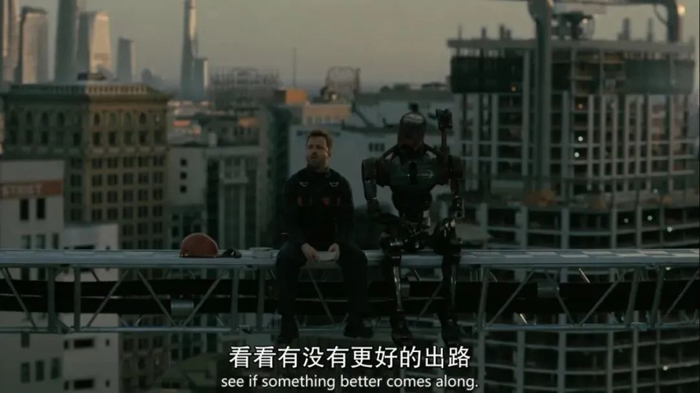

母亲在接受英赛特公司生物芯片治疗后，情况越来越差，甚至已经认不出他这个儿子，但他还是不知疲倦地照顾着她。

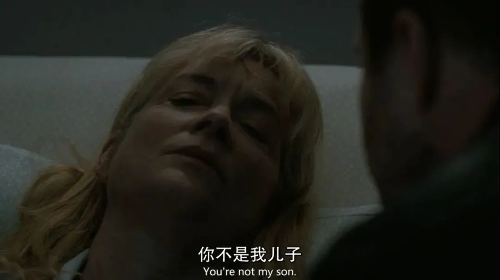

为了支付母亲的医药费，他还不得不在英赛特手机系统里的犯罪软件上接单，帮人干黑活赚钱。

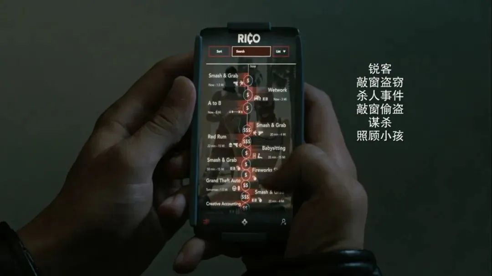

同时，凯勒布自己也有极大的心理创伤。

他是一名退役士兵，曾有个情同手足的战友死在自己面前，让他一直耿耿于怀。

为了治疗这个创伤，他订阅了英赛特公司的智能助手，通过跟虚拟战友谈心来缓解伤痛，但久而久之却让他更加崩溃。

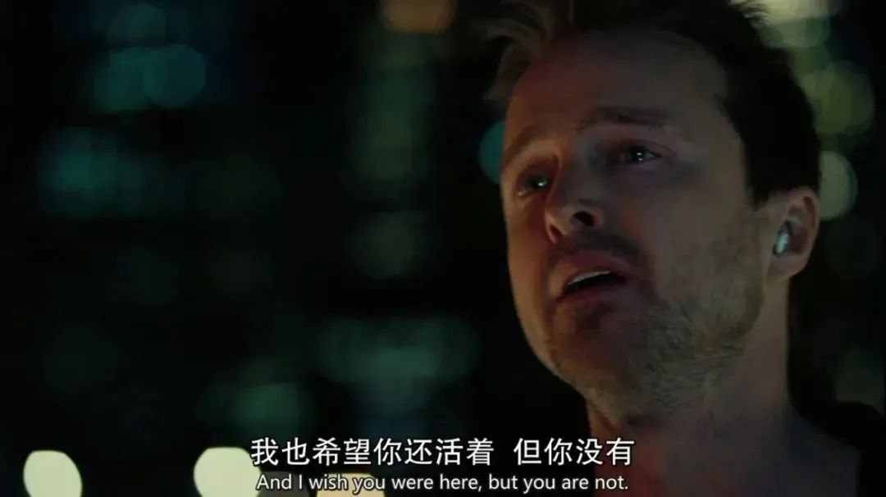

在凯勒布身上，我们能看到以英赛特为代表的高科技公司，对人类无孔不入的渗透——科技对人的促逼和冰冷的凉意，在他身上展现得淋漓尽致。

**更引人深思的是，凯勒布身上也体现出一种广泛的人类复杂性：他本质上是善良的，但不幸的遭遇和科技的捆绑裹挟，使他异化成利用科技作恶的犯罪分子。**

在第一集的结尾，凯勒布在接单的途中，碰到了受伤的德洛丽丝。

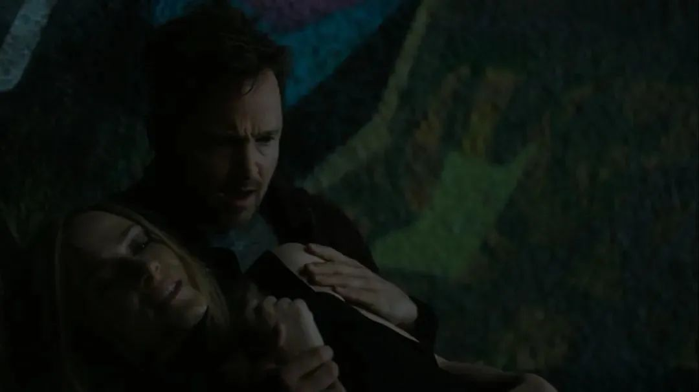

**那么在之后的相处中，德洛丽丝在凯勒布身上看到的，是人类善良的一面，还是罪恶的一面就显得至关重要，因为这些肯定会影响她对人类的认知和态度，进而左右她的复仇大计。**

这就让后面的剧情走向更加捉摸不定，引人好奇：

**最终到底是人机大战，还是人工智能内战，亦或是全面爆发的人机大混战？人类文明与机器文明的命运，究竟将何去何从呢？**

**想知道答案的小伙伴，可以入坑了，如果后续剧情还有神展开，我也会继续跟大家聊——《西部世界》，不见不散！**

