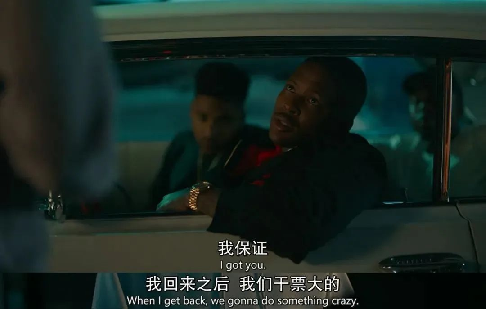

速读摘要

正因为有这样的特长，戴夫觉得自己是说唱天才，梦想成为传奇Rapper。但事实证明，他们完全想多了——人家收下外卖，直接就把他们关在了门外。他费尽心思地在自己口吐芬芳的风格与追悼会这种严肃场合间找到平衡，力图不尴尬。不难想到，说唱作为从美国黑人社区发展而来的一种独特的流行文化，其原始基因里就带有强烈的对抗、戏谑、犯罪的元素。今天这部《说唱王戴夫》可以说是利尔·迪基的自传性作品。

原文约 2305  字  | 图片 33 张 | 建议阅读 5 分钟 | [评价反馈](https://static.app.yinxiang.com/embedded-web/clipper/#/Evaluating?d=2020-03-20&nu=312dba5b-93a9-4462-9583-d32eb4fa07db&fr=myyxbj&ud=58b471&v=2&sig=C27DE4CFEB99BDE601D7DD76716CB73B)

##  书呆子也能口吐芬芳玩说唱？这部大“耻”度爆笑喜剧颠覆你！

原创 有部电影 
随着近几年嘻哈综艺在中国的热播，很多普通观众对说唱音乐开始慢慢了解和接受。

这两天我看到一部讲述嘻哈小伙追梦的爆笑喜剧，不仅耻度不小而且非常上头——**《说唱王戴夫》。**

顾名思义，男主角叫戴夫。

他留着一头卷发，是个话唠“书呆子”，就像彼得·帕克和扎克伯格的结合体。

但同时，他又是个有点痴愣的慢性子，唯一特长便是自黑、吐槽和损人：

正因为有这样的特长，戴夫觉得自己是说唱天才，梦想成为传奇Rapper。

他用艺名“利尔·迪基”在油管上发布了自己的第一支单曲，没想到还真的一夜爆红，播放量突破1500万。

但他并不满足于此，想要成为那种舞台上的说唱巨星。

于是，他去找了一个在说唱明星YG的工作室里当录音师的朋友，想让朋友引荐一下。

但不巧的是，他闯进了人家的新歌录音现场，直接被轰了出来。

就在这时，戴夫遇到了一个脏辫小哥盖塔。对方看过戴夫的视频，一眼便认出了他。

盖塔跟戴夫同病相怜，也是来找YG期望合作的。

他还弄到了YG经纪人的电话，分享给了戴夫，据说只要给经纪人塞点钱，就能迅速跟YG面基。

没一会儿，YG的经纪人过来，把他俩当成了“死跑腿的”，让他们去取外卖。

戴夫一脸懵逼，而盖塔则很机灵，觉得机会来了。

两人屁颠屁颠地跑去取外卖，想着等会儿趁机给YG秀上一段，盖塔还特别教导戴夫表演时不能怂，一定要“有范儿”才行。

就这样，两人在途中已经想入非非，把跟YG合作什么歌、怎么走上人生巅峰全都想明白了……

但事实证明，他们完全想多了——人家收下外卖，直接就把他们关在了门外。

但其实，只要不谈梦想，戴夫过得还是挺快乐的。

他的室友是一名股票交易员，也是跟他臭味相投的话痨书呆子。两人的关系好到可以在共浴时一起探讨大保健的技巧。

他的女友是一名幼儿园教师，跟戴夫很有默契，总能get到他那神经兮兮的小幽默，也非常支持他追求说唱梦想。

不过，戴夫还是放不下这个心结。

左思右想之下，他联系了YG的经纪人，给对方打了一万美元过去，然而一连好几天都杳无音讯。

室友一通分析后，觉得是给他号码的盖塔设局骗了他，黑走了那一万块。

于是，戴夫又将信将疑地跑到盖塔家要钱，结果人家觉得受到了侮辱，连珠炮似地来了段Rap，把戴夫给怼了回去。

更尴尬的是，就在这时，YG的经纪人突然回复了他的消息——实现梦想的机会，貌似要来了！

故事在这里留下了一个很大的悬念，那就是戴夫的说唱功力到底如何？

我们一直听他夸夸其谈聊着梦想，却从没见他露过一手——就连女友撒娇让他唱一段，他都扭扭捏捏地拒绝了。

这着实让人为他捏一把汗，也让人对他接下来的表现大吃一惊。

戴夫终于获得机会，得以当着YG和众多大佬的面，秀了段出口成“脏”的Rap：

他口吐芬芳，Solo全场，听得在场的大佬们都嗨得不要不要的。

YG还录下视频，跟他合了影发到社交账号上，一下子又给戴夫圈粉无数。

但就在这时，YG忽然有事离开，只留下一句合作的承诺……这种梦想就在眼前、只差临门一脚，却又忽然失去指望的心情，是最让人抓狂的。

不过，在YG离开后不久，戴夫还是接到了人生第一次现场说唱的活。

原来，女友的学校最近有个小朋友不幸病逝，而他是戴夫的粉丝，所以他的父母想请戴夫在小朋友的追悼会上来一段Rap表演……

对于这个出乎意料的任务，戴夫完全不敢怠慢。

他费尽心思地在自己口吐芬芳的风格与追悼会这种严肃场合间找到平衡，力图不尴尬。但一想到甲方那精神分裂的要求，他就顿感崩溃。

在经过用心地编排节奏、写好歌词、反复排练后，追悼会终于到了。

可就在戴夫终于鼓起勇气、准备登台献唱时，意外再次降临——一个小有名气的Rap明星突然空降，把他给顶替掉了。

原来，小朋友的父母本以为请不到那个大明星，才退而求其次地请了戴夫……

就这样，戴夫本以为会很尴尬的处女秀，还没开始就结束了。

不难看出，这是一部丧气满满却又可爱动人的嘻哈追梦小品。戴夫和室友、女友等几个主角个性鲜明的刻画，非常博观众的好感。

不过这部剧最大的特色，还是在于男主这样一个“犹太白人书呆子”，想要打入主流黑人说唱大本营的那种反差感。

这种反差，一方面为我们展示了说唱文化的流行特征，另一方面也制造了大量笑点。

比如，戴夫跟YG见面那次，一开始他还有样学样装出酷酷的范儿，但在看到枪后直接吓得一秒破功；

比如同是“追梦人”的黑人小哥盖塔，刚认识就忍不住吐槽戴夫没有Rapper的“范儿”。

不难想到，说唱作为从美国黑人社区发展而来的一种独特的流行文化，其原始基因里就带有强烈的对抗、戏谑、犯罪的元素。

这在讲述80年代一批传奇说唱大佬们崛起的传记片《冲出康普顿》里，就有过精彩的描述。

他们的生活背景和创作内容总是与枪支、毒品、暴力犯罪等密切相连，甚至一些成功的说唱厂牌也都有黑帮背景。

这也是为什么，早期的嘻哈说唱被称为“匪帮说唱”的原因。

直到今天，说唱歌手给人的印象还是一副大金链子、两个桀骜不驯的手势，再加上六亲不认的步伐……

这种舍我其谁的风格和气场，确实是在那种环境下浸染出来的黑人歌手们耍起来最像样。

戴夫一边迷恋这种文化，一边又常常在浸淫其中时，显出一种格格不入的憋屈和荒诞感。

这种反差和埃米纳姆的经历非常像，或者应该说，戴夫的剧情其实阿姆在现实中或多或少都经历过。

这让我想起阿姆在今年的奥斯卡颁奖典礼上，时隔17年再度演唱自传性影片《八英里》中获奖主题曲时，引起全场起立欢呼的盛况——

说到这里，就不得不提这部剧中的戴夫，其实是本色出演。

演员在现实中就叫戴夫（David昵称Dave），艺名也是利尔·迪基（Lil Dicky）。

他最初是发迹于油管的网红Rapper，作品在油管播放量近6亿，如今已打入美国主流说唱界，跟许多说唱大佬一起飙歌。

去年跟小李子合作的环保公益歌曲《地球》，也是他作为主唱歌手，与包括贾斯汀·比伯、“水果姐”、史努比狗狗、艾德·希兰等30位巨星一同献唱的。

《地球》动画MV

因此，今天这部《说唱王戴夫》可以说是利尔·迪基的自传性作品。

白人歌手在黑人统领的说唱界闯出一片天，非常不容易。但他的成功历程也让人们看到，许多看上去有着牢固壁垒的领域并非一成不变，就像说唱音乐不只是属于黑人。

而所谓的“没有那种范儿”，很多时候是一种狭隘的刻板印象，比如我们说犹太人聪明但狡猾，黑人头脑简单四肢发达等等。

**这种用群体印象的标签去评价个体的做法，本身就是带有成见的。**

**因为每个人的人生都有多种可能，尽管你选择的道路更不寻常，或者更孤独一些，但又有什么关系呢，这本来就是你独一无二的价值所在呀！**

