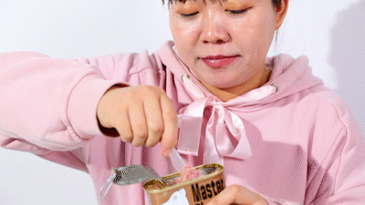

速读摘要

尤其在现在这种宅在家中的特殊时期，看到肉块塞进嘴巴，混着油脂的香气在口腔里横冲直撞，再配上正峰欧巴这一脸满足的表情，我的心就一下被击中了!我最近找到并爱上的这款午餐肉，和商场上那些满口淀粉味的午餐肉简直太不一样了!不同于市面上大部分午餐肉使用的冷冻肉或冷鲜肉，猪掌门的每一块肉都是鲜肉!猪掌门午餐肉特意减少了盐的加入量，低盐配方，像这样直接吃也没有问题哦。猪掌门罐头的设计也很人性化，每个罐子顶部都有开罐演示。

原文约 2327  字  | 图片 35 张 | 建议阅读 5 分钟 | [评价反馈](https://static.app.yinxiang.com/embedded-web/clipper/#/Evaluating?d=2020-03-20&nu=33a00629-7d77-4a40-95b5-e893f5730bd1&fr=myyxbj&ud=58b471&v=2&sig=00E95A137A64BE2A071EC9105C598181)

##  还记得《请回答1988》里的他么？

原创 有部电影 [有部电影]()**
提到韩剧，有一部不能绕过的神剧：**《请回答1988》。**

这部五年前播出的电视剧，直到今天，还占据了很多人心中的韩剧排名第一位。

**一条胡同：双门洞。**

.jpg)

五个最普通的家庭，几个一起长大的少年。

.jpg)

朴实而诚挚的感情，家长里短的琐碎生活，却让无数人跟着又哭又笑。

豆瓣9.7分的高评分，“第一韩剧”之位至今无人超越。

.jpg)

剧中不但捧红了狗焕、德善、阿泽这三个主角，回过头来看，每一个配角都演技在线，有着自己的独特闪光点。不夸张地说，每次重看，都能找到之前没注意到的小细节，常看常新。

我这次重温的时候，就被剧中一个我以前没注意过的镜头击中了。

就是这个镜头！

狗焕的哥哥正峰欧巴用勺子挖着一大块午餐肉放进嘴里。唇齿留香的满足感，把“真香”二字写在了脸上，馋得让人直流口水！

尤其在现在这种宅在家中的特殊时期，看到肉块塞进嘴巴，混着油脂的香气在口腔里横冲直撞，再配上正峰欧巴这一脸满足的表情，我的心就一下被击中了！

最近这段时间，宅在家中，不出门的寂寞倒是能忍住，但，嘴巴的寂寞简直忍不了！

.jpg)

特殊时期，外出吃饭就跟别想了，点外卖呢，心里总犯嘀咕是不是安全。

看到正峰欧巴吃午餐肉这个画面，我一下找到了最适合解馋、囤粮的好东西！

午餐肉味道好、易保存、开罐即食，而且还能做成各种不同的美食，这不就是最满足吃货和懒人的囤粮名单第一名么？

.jpg)

我知道，很多人对午餐肉都有一定的误解。

我也吃过这样的午餐肉，吃到嘴里根本没有肉的感觉，一入口都是淀粉味，根本没有肉的鲜味。
.jpg)
不过，我最近找到并爱上的这款午餐肉，和商场上那些满口淀粉味的午餐肉简直太不一样了！

**百分之九十以上猪肉含量的午餐肉**，饱满的肉感，每一口下去都是满满的肉的香气！

肉眼可见的火腿肉粒和火腿纤维，绝对解馋！

.jpg)

这个罐头猪肉含量≥90%，只选用猪后腿肉，100%鲜肉制作。和市面上那些淀粉多、冷冻肉做的妖艳货绝对不一样。

.jpg)
左：x汇 中：猪掌门 右：北x河

对比一下就能看出，其它品牌要么淀粉多，没什么肉的质感，要么是用的肉碎，没有大块的肉粒。

而这款**猪掌门午餐肉**，肉感十足，又非常Q弹，咸淡和干湿度都控制得恰到好处，肉香和油脂香配合默契、相得益彰。

最近猪肉涨价，猪掌门还能做到肉眼可见的大块肉粒、丝丝缕缕的瘦肉纤维，这么良心的午餐肉实在是太合我心了。

它还有原味，香辣、蒜香三种口味，用来配饭、炒菜、涮个火锅，怎么做都好吃，根本吃不腻。

这样的好东西，我自己也是各个口味都囤了不少。

现在这个时期，很多快递停运、工厂不开工。为了让你们都享受到美食的快乐，我特意找来供货商调了现货、保证72小时内发货，而且谈好了最优惠的价格。

**【猪掌门】午餐肉**
**专业做猪肉罐头60年**
**超90%含肉量 100%鲜肉**

**点击下面图片，即可购买**

[.jpg)](https://mp.weixin.qq.com/s?__biz=MzI3ODM3MDAzMQ==&mid=2247499359&idx=2&sn=610f59a59b4bbd1dd60ade0e1f56ae32&chksm=eb5abddfdc2d34c9664bda9c6e567f4a2ee395c10a8d105ae71d15d2ffe2c0de999dd2aecb4b&mpshare=1&scene=1&srcid=&sharer_sharetime=1584669667671&sharer_shareid=badd687b22e02cbea2bccedfd5f757de#rd)

午餐肉空口吃、配饭吃，都超下饭超好吃。《向往的生活》里，一向以抠门“著称”的魏大勋，都被黄老师套路着去帮弟弟妹妹们买午餐肉做配菜。

但你可别以为，午餐肉只能这么吃。

真要说起吃法来，所有火腿以及火腿肠做的菜，都能用它替换，而且整道菜的味道和口感提升了不是一点半点。

.jpg)

杭椒、午餐肉一起炒，就成了杭椒五花肉。辣椒的香辣味和午餐肉融合在一起，那真叫一个香啊！

.jpg)

午餐肉黄瓜丁，是我推荐给不吃辣小伙伴的NO.1快手菜。

.jpg)

午餐肉切成丁，做个蛋炒饭，绝对的色香味俱全。

.jpg)

对于加班狗来说，泡面可能最好的灵魂伴侣了。泡一碗面，配上纯猪肉的午餐肉，寒冬的深夜来一口，暖了胃也暖了心。

.jpg)

就算不搞那么多花样，随便煎一下，紧实的肉感带点焦香，咬一口多汁柔软，肉香和油脂香配合的天衣无缝，吃到停不下来。

.jpg)

线下超市含猪肉的午餐肉价格基本在25元/盒左右，同样含量的猪掌门午餐肉一盒却不到20元/盒！

.jpg)

也有稍微便宜一些的，大概在18元左右，但不清楚它们的猪肉含量，也不知道是不是鲜肉。

价格不贵又靠谱的，还是猪掌门啦！

.jpg)

**【猪掌门】午餐肉**
**专业做猪肉罐头60年**
**超90%含肉量 100%鲜肉**

**点击下面图片，即可购买**

[.jpg)](https://mp.weixin.qq.com/s?__biz=MzI3ODM3MDAzMQ==&mid=2247499359&idx=2&sn=610f59a59b4bbd1dd60ade0e1f56ae32&chksm=eb5abddfdc2d34c9664bda9c6e567f4a2ee395c10a8d105ae71d15d2ffe2c0de999dd2aecb4b&mpshare=1&scene=1&srcid=&sharer_sharetime=1584669667671&sharer_shareid=badd687b22e02cbea2bccedfd5f757de#rd)

要说起猪掌门，就必须先提一下**“蚌埠市凤阳东路76号”。**如果你是一位午餐肉爱好者，那请牢牢记住这个地址。

这个地址上有一家名叫宏业的肉类加工公司。这家肉厂1954年创建，可以说是专业做猪肉罐头60年。

.jpg)

不夸张的说，蚌埠宏业肉联厂这条生产线，创造了**近60年东亚地区的午餐肉最高标准。**

你们熟悉的长城、中粮梅林旗下的某些产品线，都是它出品的，同时还远销海外。

.jpg)

在长年累月的生产代工过程中，“凤阳东路76号”积累了关于用户饮食习惯和口味喜好的大量数据，越来越清楚什么样的午餐肉更能满足国人的口味需求。

如今不断升级，推出全新品牌“猪掌门”，是不是听着就有种睥睨其它午餐肉的感觉？

.jpg)

而实际上，猪掌门在实物上也确实拥有可以睥睨其它午餐肉的实力。

**它的猪肉含量≥90%，淀粉含量≤3.5%。**

不同于市面上大部分午餐肉使用的冷冻肉或冷鲜肉，猪掌门的每一块肉都是鲜肉！

.jpg)
猪掌门午餐肉vs一般午餐肉（营养成分对比）

在抛开对午餐肉的偏见之后，也去超市搜刮过其它的，但有些要么是用了鸡肉，要么就是含肉量很低的。

.jpg)

还有一些盐分过高，咸到只能配白米饭吃，非常不利于身体健康。

猪掌门午餐肉特意减少了盐的加入量，低盐配方，像这样直接吃也没有问题哦。

也因为猪掌门所用猪肉多、淀粉少，也使得所含蛋白质高、脂肪少、热量低，说它是午餐肉界的“健美先生”也不为过。

.jpg)

整体口感上，咸淡和干湿度都控制得恰到好处，肉香和油脂香配合默契、相得益彰。

总而言之就是一枚德智体美劳全面发展的“三好“罐头，让人爱不释口。

猪掌门罐头的设计也很人性化，每个罐子顶部都有开罐演示。

开罐时，先将拉环向上掰到180°，再将手指伸入拉环，一起发力，很轻松就能打开上盖。

.jpg)

满满一罐的午餐肉也很好取出，**只需要将罐头倒立悬空，轻轻拍两下底部，午餐肉就自动滑落到盘子里了。**

**PS:市面上一些加了许多淀粉的午餐肉，会和罐头粘连，用刀叉或者勺子都无法完整取出。**

它还有非常人性的盖子设计。以往这种罐头产品，吃到一半只好找保鲜膜封紧，现在有了盖子，一次吃不完的罐头盖上盖子放回冰箱，不知道有多方便。

猪掌门的每个罐头里面都配备了一个叉子，如果你爱挖着吃，也非常方便。

上面也说过了，这款午餐肉是低盐配方，空口吃也不会觉得咸，虽然香气四溢，但不会让人觉得腻。

**它还做到了0防腐剂，0色素。本身是来自大厂生产，罐头是高温无菌下制作的。完全达到了国家认证的“商业无菌”标准，无需任何防腐剂也可长期保存。**

**价格不贵又靠谱。想吃的，现在凌晨优选只需59元，3罐装带回家!**

**6罐装更优惠些，凌晨优选只要109元！**

**点击阅读原文，同样能下单！**

[阅读原文](https://mp.weixin.qq.com/s?__biz=MzI3ODM3MDAzMQ==&mid=2247499359&idx=2&sn=610f59a59b4bbd1dd60ade0e1f56ae32&chksm=eb5abddfdc2d34c9664bda9c6e567f4a2ee395c10a8d105ae71d15d2ffe2c0de999dd2aecb4b&mpshare=1&scene=1&srcid=&sharer_sharetime=1584669667671&sharer_shareid=badd687b22e02cbea2bccedfd5f757de##)

在看