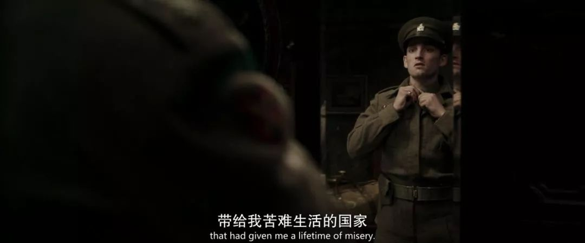

速读摘要

影片开场，罗伊通过老年人交友网站，认识了一个名叫贝蒂的老人。罗伊的身体硬朗得很，"腿脚不便"完全是为了住进贝蒂家装出来的。贝蒂并不是一个和罗伊一样行走江湖的女骗子，她之所以如此处心积虑地设局，是为了复仇。贝蒂其实不叫贝蒂，她的真名叫莉莉，她也是个德国人。《谎言大师》最特别的地方，还在于主角的老年人身份。

原文约 2158  字  | 图片 35 张 | 建议阅读 5 分钟 | [评价反馈](https://static.app.yinxiang.com/embedded-web/clipper/#/Evaluating?d=2020-03-20&nu=5f583311-7fb6-41d9-b7e7-780aa06df622&fr=myyxbj&ud=58b471&v=2&sig=6C0AD2DF536AC2621561A38597F64945)

##  当老骗子遇上富寡妇，这结局不敢想象

原创 有部电影 [有部电影]()**
好久没和大家聊过悬疑片了，今天就来讲一部氛围轻松的——**《谎言大师》。**

看海报就知道，影片由“甘道夫”伊恩·麦克莱恩和“女王”海伦·米伦主演，两位老戏骨在片中的对戏堪称火花四溅，剧情也同样是一波三折，高潮不断。

故事的男主名叫罗伊，是个耄耋之年的老人。

因为跟儿子关系紧张，自妻子去世后，他就一直独自生活。

影片开场，罗伊通过老年人交友网站，认识了一个名叫贝蒂的老人。

贝蒂在一年前失去了丈夫，儿子也在车祸中离世，所以她如今也独自一人，住在乡下的一栋大房子里。

这两人相谈甚欢，大有相见恨晚之感。

在贝蒂看来，罗伊绅士斯文又风趣幽默，是一个很有魅力的人。

所以，在见过几次面之后，她甚至不顾外孙斯蒂芬的反对，就让腿脚不便的罗伊搬来与自己同住。

看到这里，估计很多人要以为这是个讲述温馨夕阳恋的故事。但转念一想，如果只是这样，片名也不会是“谎言大师”了。

实际上，罗伊从未组建过家庭，他是一个诈骗高手，专门在网络上结识年老富有的寡妇，取得她们的信任之后就骗取钱财，最后再像一阵风一样消失。

而且，罗伊的身体硬朗得很，“腿脚不便”完全是为了住进贝蒂家装出来的。

他的身手好到干掉一个中年人也毫不费力：

然而对于这些，贝蒂完全没有察觉，与罗伊的关系也日渐亲密，完全放下了戒备。

但这并不代表罗伊的诈骗之路顺风顺水，因为贝蒂还有个外孙斯蒂芬。他目前在读博士，时不时就会回家过夜，对罗伊也充满敌意。

不仅如此，罗伊还发现，除了自己之外，似乎还有别人在盯着贝蒂。

他好几次发现，有一辆车鬼鬼祟祟地在贝蒂家附近转悠；

某天晚上，还有个人偷偷摸摸在贝蒂家门口徘徊。

显然，贝蒂也隐瞒了一些秘密。

但罗伊没有心思管这些，他只想加快速度把钱骗到手，然后走人了事。

于是，他又是策划出国旅行，一边讨贝蒂欢心，一边坑她的钱；又是找来同伙文森特，伪装成投资咨询师来掏空她的财产…….

说到这种诈骗题材的电影，我们已经见过太多。乍看之下，《谎言大师》的剧情也没什么特别的，比它更离奇、更烧脑的故事比比皆是。

但越往后看，越会发现《谎言大师》的看点有多到抢眼。

首先不得不提的，还是两位主演出神入化的演技，以及“针尖对麦芒”一般火花四溅的默契。

美国娱乐杂志《Variety》就这样评价《谎言大师》：观看海伦和伊恩在猫鼠二重奏中互相飙戏，绝对是这部《谎言大师》最大的享受，他俩之间的默契和角斗是一曲充满爱欲和欺骗的华尔兹。

但作为一部剧情吃重的悬疑片，光靠演员的演技撑，肯定是不成的。

《谎言大师》后期的剧情急转直下，开启了反转不断的神展开模式——

先是罗伊这边，眼看计划就要得逞时，他忽然发现，孤独了大半辈子的自己其实是发自内心的关心贝蒂。

而就在他犹豫不决的同时，斯蒂芬也调查出了他鲜为人知的过去。

原来，罗伊是个德国人，本名叫做汉斯。在二战时期，他曾为英国担任德语翻译，而真正的罗伊，是英国的陆军中尉。

年轻的汉斯（左）与罗伊（右），两人长相相似

在一次抓捕纳粹分子的行动中，罗伊中尉被枪击身亡，汉斯则活了下来。

为了摆脱自己的德国人身份，无父无母的他灵机一动，从此伪装成罗伊生活。

斯蒂芬认为，汉斯一定犯下过什么不为人知的罪行，不然为什么要大费周章地伪装成另一个人？

但在贝蒂看来，不管汉斯到底是谁，他都是这个世界上唯一让她感到不孤独的人。

因此，贝蒂对外孙的警告充耳不闻，在旅行结束后，还同意和汉斯建立一个共同账户。

在汉斯看来，这意味着贝蒂已经彻底接受了自己。于是他想也没想，就将自己的钱也转入了账户。

然而等他有天回家时，才发现迎接他的是空荡荡的房间，贝蒂正正襟危坐地等他归来。

原来早在一开始，贝蒂就知道汉斯的真实身份，也知道汉斯与她接近的目的。

她之所以一直不动声色，还配合演戏表现出信任的样子，完全是为了引汉斯入彀。

看到这儿，估计很多人又会想到那种“局中局”式的诈骗故事——原来片名中的“谎言大师”指的不是罗伊，而是藏得更深的贝蒂。

但事实上，事情还没这么简单。贝蒂并不是一个和罗伊一样行走江湖的女骗子，她之所以如此处心积虑地设局，是为了复仇。

这两人的恩怨，要从几十年前说起。

贝蒂其实不叫贝蒂，她的真名叫莉莉，她也是个德国人。

在二战时期，莉莉的父亲因为常年经商，在德国算是有头有脸的人物。

当时，汉斯是莉莉的英语家教。

在一次授课中，正处在青春期的汉斯没有抑制住冲动，将对他怀有好感的莉莉强奸了。

事情发生后，汉斯为了避免遭到莉莉父亲的报复，又抢先将他举报为叛国者。

于是，原本家境优渥的莉莉经历了家破人亡，最后只有她一个人活了下来。

而她活下去的动力，就是有朝一日能够复仇，为此她一直在调查追踪汉斯的犯罪史，直到找到了隐姓埋名多年的罗伊身上。

随后，她专门租了这栋房子设局，之前在家门口转悠的车，也是外孙专门保护她的。

更让汉斯没想到的是，他一直视为同伙的文森特，其实也早就投身莉莉的麾下了……

在影片结尾，众叛亲离的汉斯只能在养老院度过晚年。

整体而言，《谎言大师》的情节虽然不算脑洞大开，但几次反转看得人直呼过瘾，算得上是一部值得一看的悬疑电影。

而且，二战历史和性侵题材的运用，也为故事增添了一抹厚重感。

但这份厚重却并不沉重，反而让人感到一丝解气，因为它让人看到“坏人变老了也不会逃过报应”。

但我想，《谎言大师》最特别的地方，还在于主角的老年人身份。

一般来说，主角为老年人的电影虽然出过不少佳作，但几乎都是叫好不叫座的类型。毕竟电影观众以年轻人居多，老年题材常常无法引起他们的共鸣。

但这部《谎言大师》却让我们看到，其实老年人的故事并不像我们想象中那样枯燥无聊。

他们不一定都是温情脉脉地漫步在夕阳下，也可以上演如《天才瑞普利》一样紧张刺激、尔虞我诈又悬念丛生的猫鼠游戏。银发红唇和西装领带，也可以别有一番美艳和潇洒。

相比于剧情，影片对于两位老年人主角的丰富塑造更值得回味。它让人看到，**其实每个人背后都有一段未完待续的精彩故事。****如果我们能够走进他人的内心，终会发现每个人都像一座丰富多彩的宝藏。**

