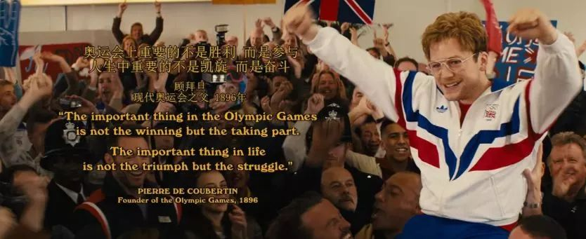

速读摘要

今天给大家打打鸡血，聊一部根据真人真事改编的运动传记片——《赛马女孩》。在赢得几次比赛后，她自认为已经"出师"，但在父亲看来，米歇尔还远远没有做好准备。也许是同病相怜、惺惺相惜，米歇尔试骑过后，认定要用"彭赞斯王子"参加比赛，她先后说服了"彭赞斯王子"的驯马师和几个马主，好不容易踏上了墨尔本杯的赛道。这次夺冠创造了一个纪录——在墨尔本杯155年历史中，第一次有女性骑师获得冠军。张伟丽的格斗生涯，跟今天聊的女骑师米歇尔有个共同之处，她们都是因为对运动的极度热爱，才两耳不闻质疑声，一路坚持到了现在。

原文约 2439  字  | 图片 32 张 | 建议阅读 5 分钟 | [评价反馈](https://static.app.yinxiang.com/embedded-web/clipper/#/Evaluating?d=2020-03-20&nu=2f865b52-4eb2-448c-9549-86aa36fcc4d6&fr=myyxbj&ud=58b471&v=2&sig=88A8299515DFE1D98AC72985B1E41555)

##  她用实际性动，打破了一百多年的潜规则

原创 有部电影 [有部电影]()**
今天给大家打打鸡血，聊一部根据真人真事改编的运动传记片——**《赛马女孩》。**

女主角的原型，是澳大利亚女骑师米歇尔·佩恩，她因夺得“赛马界圣杯”墨尔本杯闻名于世，影片的剧情就围绕她的夺冠之路展开。

其实像这样的夺冠故事，在传记片里已经屡见不鲜，比如之前我给大家聊过的《飞鹰艾迪》，讲述的是跳台滑雪运动员迈克尔·爱德华兹的励志故事。

再比如《灵魂冲浪人》，说的则是失去左臂、却依旧对冲浪运动无限热爱的贝瑟尼·汉密尔顿的真实经历。

虽然都是励志主题，但这类传记片的主角身上，其实都有着独一无二的闪光点，今天聊的这部《赛马女孩》也不例外。

米歇尔参加的墨尔本杯，被誉为“举国上下屏息凝视的比赛”，每年在公共假日举办，可以说是当地全民参与的嘉年华活动，具有极强的影响力。

同时，这个比赛也是赛马界公认的最高难度比赛之一，全程3.2公里，特别考验骑师的经验、技术和马匹的耐力。夺得这个比赛的冠军，是所有骑师的职业梦想。

但由于种种原因，这个诞生于1861年的赛事始终由男性主导，一直到1987年，才有女骑师出现在墨尔本杯的赛道上。

本片的女主米歇尔出生于单亲家庭，是家里最小的孩子。在她之前，几个哥哥姐姐相继在父亲的培养下成为了赛马骑师。

这样的家庭环境，让米歇尔从小就梦想赢得墨尔本杯。15岁时，她便开始接受系统的赛马训练。

在训练时，父亲总是给她强调，赛马看上去比的是速度，实际上考验的是骑师的耐心。

夺冠的终极秘籍，就是在比赛中耐心等待一个稍纵即逝的突破口，只要能抓住这个时机超越，就能最终赢得比赛。

米歇尔虽然记住了这个窍门，但并没有彻底领悟什么是“耐心”。

在赢得几次比赛后，她自认为已经“出师”，但在父亲看来，米歇尔还远远没有做好准备。

父女俩争执的最终结果，是米歇尔直接离家出走“单飞”。

她辗转于各个赛马场，向驯马师毛遂自荐，希望得到上赛道的机会。

但这个过程并不顺利，因为几乎没有哪个驯马师，会愿意让一个初出茅庐的女骑师拿自己的马匹练手。

米歇尔每次毛遂自荐，得到的回复不是无视和拒绝，就是歧视和骚扰。

在这种窘境之下，她大胆地找借口“偷”了一匹马上赛道。

好在，凭借扎实的基本功，她成功引起了驯马师的注意。

之后，为了能上赛道，米歇尔在经纪人的帮助下广撒网。

她从不挑马匹血统，有比赛机会就去；对于马主提出的体重要求，她也是各种来者不拒。

在很长一段时间里，米歇尔都处于开挂模式——

经常是上一场比赛刚结束，就匆匆开车赶去下个场地；马主要求不到一周时间减掉6斤，她也毫不含糊，用尽各种办法让自己掉肉。

靠着这种玩命般的工作方式，米歇尔慢慢积累了口碑和成绩，参加的比赛规格也越来越高。在赛道上，她永远都是最具好胜心的那个骑手。

然而，这样的高强度工作，让她逐渐忘记了父亲叮嘱的那句“耐心秘籍”。在一次比赛中，米歇尔出现失误坠马，导致头骨和大脑受伤严重，一度昏迷。

醒来后，米歇尔的记忆、认知能力、运动能力都严重下降，别说重回赛场，恢复正常人的状态都是个难题。

不过幸运的是，父亲在这时充当起她的坚强后盾，不顾家人的反对，帮助米歇尔进行复健训练。

实际上，当初父亲不想让米歇尔过早参加职业比赛，是因为她的姐姐就曾因为坠马丧生。父亲不希望再有孩子因为赛马出事，才固执地让她留在家中。

但这次米歇尔的受伤，让父亲意识到了她对赛马的狂热；而米歇尔也在复健过程中，体会到父亲的良苦用心。

实际上，在这次受伤后，米歇尔又经历了7次坠马、16次骨折，全身几乎没有一个好地方，但即便如此，她从来没有过放弃的念头。

一次偶然的机会，她遇见了职业生涯最好的搭档，一匹名叫“彭赞斯王子”的赛马，它和米歇尔一样，曾在比赛中多次受伤。

也许是同病相怜、惺惺相惜，米歇尔试骑过后，认定要用“彭赞斯王子”参加比赛，她先后说服了“彭赞斯王子”的驯马师和几个马主，好不容易踏上了墨尔本杯的赛道。

在那场比赛中，“彭赞斯王子”的赔率是1:100，没人看好米歇尔这个女孩能夺冠，连马主和驯马师都没报多少希望，只让她争取拿到前十名就行。

但让人没想到的是，米歇尔凭借技术和经验，充分发挥了马匹的优势。

她找准时机进行超越，在最后200米从外道脱颖而出，一路领先到了终点。

这次夺冠创造了一个纪录——**在墨尔本杯155年历史中，第一次有女性骑师获得冠军。**

影片结尾的彩蛋里，正是当年米歇尔赛后接受采访的画面，她自信地对着镜头坦言：**那些认为女性不够强的人都可以滚蛋了，我们打败了世界，证明了自己。**

从这个角度看，《赛马女孩》无疑是一部讲述当代女性突破传统束缚的励志片。

在创造历史之前，米歇尔·佩恩经历了各种“职场性别歧视”，这在片中也有表现。

小时候刚开始接触赛马时，米歇尔就亲眼目睹性别造成的不公——姐姐明明在一次比赛中夺得第一名，父亲却坚持把排名垫底的哥哥送去墨尔本训练，因为“女孩不能参加墨尔本杯”是当时的一种潜规则。

进入赛马圈后，米歇尔也曾因性别问题，屡次被马主和驯马师拒绝，一度找不到工作机会。好不容易参加一次比赛，也不受主办方重视，更衣室就是小卖部旁边的杂货间。

比赛训练间隙，她也没有女性专用的休息室，只能被迫和其他男性骑师共用一个泡澡池。

可以说，周遭的环境都在对米歇尔疯狂暗示：你是女人你不行。

但在米歇尔看来，赛马虽然需要一定的体力，但并非是“男人独占”的项目。

一个优秀的骑师需要懂自己的马匹，需要有掌控场地的技能，需要有耐心，而这些要素都跟性别没有直接关系。

说到这里，让我想到几个月前轰动全世界的综合格斗运动员——张伟丽。

在去年UFC格斗之夜深圳站上，这个90后女孩仅用42秒，便击倒了巴西世界冠军杰西卡·安德雷德，成为UFC新任女子草量级冠军，不仅创造了中国选手在UFC的历史新纪录，也是亚洲人的第一个UFC世界冠军。

张伟丽的格斗生涯，跟今天聊的女骑师米歇尔有个共同之处，**她们都是因为对运动的极度热爱，才两耳不闻质疑声，一路坚持到了现在。**

但略显讽刺的是，夺冠后的张伟丽在接受媒体采访时，面对的居然是各种让人哭笑不得的问题，比如“你的择偶标准是什么”，“你一个女孩子为什么要这么暴力”，“你结婚以后会不会家暴”……

这些问题一方面反映了国内媒体对综合格斗的误解，另一方面也直白暴露出当下的性别偏见和刻板印象。在某些人眼里，有些运动女性参加就是“不正常”、“不合规矩”。

而对于那些问题，张伟丽也给出了漂亮的回答——**女性不应该被定义，女性也可以有很多面。**

同样地，米歇尔在墨尔本杯的夺冠恰恰说明，没有什么运动只属于男性或女性，因为运动的最大魅力不是它的性别属性，而是可以让人们尽情释放自己的热情、挑战自己的极限，实现自己的价值。

**这样的励志故事也正告诉我们，一个人能够坚持自我，用一生做好一件事，总好过一辈子带着偏见一事无成。**

