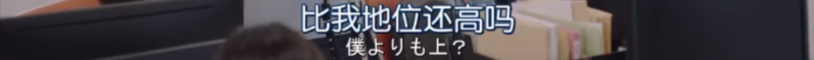

速读摘要

是《五十度灰》的套路，自然要上演"霸道总裁爱上我"的玛丽苏戏码。酒保在安慰她时，恰好聊到了男主在制药领域的牛叉事迹，听得女主当场吐槽——能改变世界又怎样，不还是救不回我的爱犬!比如看到男主来到自己楼下，她的态度也比之前缓和了很多，临走前还对男主说了句"生日快乐"。在追求女主的过程中，他虽然搞出各种浮夸羞耻、令人头痛的操作，但也不着声色地表现出了自己的很多长处。作为一部喜剧，本剧并没有深入探讨社会性与自我压制的企图。

原文约 2378  字  | 图片 51 张 | 建议阅读 5 分钟 | [评价反馈](https://static.app.yinxiang.com/embedded-web/clipper/#/Evaluating?d=2020-03-20&nu=3454d15e-1556-4a89-966c-6fc23ec2a2ff&fr=myyxbj&ud=58b471&v=2&sig=5B49EE03F0269CB5525225B036F12527)

##  霸道总裁做奴隶，岛国版《五十度灰》，羞耻又高能

原创 有部电影 [有部电影]()**
开门见山，今天和大家聊一部被网友称为“沙雕版《五十度灰》”的日剧，情节高能羞耻，却又分分钟让人笑到头掉——**《这个男人是我人生中最大的错误》。**

.jpg)

既然是《五十度灰》的套路，自然要上演“霸道总裁爱上我”的玛丽苏戏码。

这部剧里的“霸道总裁”，就是由速水直道饰演的男主天城恭一。

.jpg)

他是天城制药的社长，智力惊人，有过目不忘的本事。

公司里数万多的员工，他只要看过一次简历，就能记住所有人的信息。

.jpg)
.jpg)

而被他爱上的女主，是由松井爱莉饰演的公司社员佐藤唯。

她拥有一双攻气十足的大长腿，多年来一直单身，与爱犬相依为命。

.jpg)

在公司里，女主是个小透明一样的社畜，工作中同男主几乎没有交集，因为初来乍到，她甚至都没看清过男主的脸。

.jpg)

所以，如果不是发生点什么意外，她并不会吸引到男主的注意。

但巧的是，偏偏就在女主最伤心的时候，男主和她不期而遇。

.jpg)

这天，女主因为爱犬抱病离世，下班后来到酒吧买醉。

酒保在安慰她时，恰好聊到了男主在制药领域的牛叉事迹，听得女主当场吐槽——能改变世界又怎样，不还是救不回我的爱犬！

.jpg)

未曾想，这时男主也在酒吧里，刚好听到了这句吐槽。

女主话音刚落，他就突然出现在她面前，一脸冷漠地回怼不说，还让她有牢骚自己回家里发去。

.jpg)

女主本来就喝高了，听完更是暴怒。

她二话不说，直接伸腿将他绊倒：

.jpg)

随后还居高临下地当众对着男主一顿数落，一通发泄之后，才潇洒地离开了现场……

.jpg)

本来女主以为，男主不过是在酒吧遇到的陌生讨厌鬼，并没有把这当回事。

但她不知道的是，这个行为彻底为男主打开了新世界的大门，**抖M的灵魂已被解锁……**

.jpg)

女主刚到公司就被叫去了办公室。

当她发现昨晚被自己暴虐的男主居然是社长时，整个人要被吓傻了，心想工作肯定保不住了。

但没想到，男主扑通一声给她跪下，还说要做她的奴隶、当她的狗子，不给人一丝的防备……

.jpg)

这吓得女主更加不知所措，还以为男主在戏弄她。

几番请求离开而未果后，女主忍不住又对男主发了火，这直接惹得男主欲罢不能，彻底陷入了对女主的迷恋之中。

.jpg)

紧接着，男主为了表达爱意，先是当众惩罚了一个平时喜欢使唤女主做这做那的领导：

.jpg)
.jpg)
.jpg)

然后又当着公司研发团队的面给女主下跪，为没能研制出药物、救好女主的爱犬而道歉。

.jpg)

这一切都让女主意识到，男主真的是一个变态。

她想了各种办法摆脱他，但是男主正爱得要死要活，一天不被虐就浑身难受，根本不可能放过女主。

.jpg)

女主跑去跪求男主放过，男主就和她比谁的道歉姿势更真诚；

.jpg)
.jpg)

女主暴力反击，男主不仅不生气，反而整个人都变得更加兴奋起来……

.jpg)

最后，女主决定借坡下驴，以“主人”的姿态命令男主，以后不许靠近自己。

男主虽然听从了这个“命令”，但撩妹的操作却并没有停下。

在女主倍感孤独的生日晚上，他跑到楼下手捧鲜花，化身雨中痴汉，一站就是三个小时，连警察都被他惊动了。

.jpg)

女主和别人聚会吃饭，他也会尾随过去，远远地注视着她的一举一动。

.jpg)

正是因为这个跟踪狂行为，后来有一次，女主在外喝醉酒晕倒后，及时被男主发现并带回了家中。

他安顿好女主后，亲自给女主调解酒药，并再次表达了自己的心声。

.jpg)

可想而知，这么几个回合下来，女主虽然没有爱上男主，但心中已经渐渐涌现出了一丝自己尚未察觉的好感。

.jpg)

后来在男主的生日派对上，又发生了一件意外。

当时有个大客户调戏女主，男主看到后，忽然犹如抖S附体一般，在众目睽睽下给大客户来了个“红酒淋头”，帮女主摆脱骚扰。

.jpg)

女主看到这个场面，瞬间对男主的好感又多了一份，也忍不住帮他解围。

.jpg)

可以说，从这之后，女主已经开始进入“口嫌体正直”的纠结状态。

比如看着男主的名片，她明明想的是要甩了男主，却不由自主地拨了号码；

.jpg)

比如看到男主来到自己楼下，她的态度也比之前缓和了很多，临走前还对男主说了句“生日快乐”。

.jpg)

可见，随着剧情展开，男女主角将会在势均力敌的攻受互动中，上演更多高能羞耻中透着甜宠的浪漫情节。

.jpg)

总的来讲，这部剧根据同名漫画改编，与《五十度灰》相比并没有多么惊人的尺度，虽然设定令人虎躯一震，但本质上是一部轻松不费脑的浪漫喜剧。

剧集中的笑点，不仅体现在男女主角身份地位、言谈行为间的反差萌上，还集中表现在男主令人喷饭的羞耻行为中。

.jpg)

比如，女主摸过的东西、枕过的枕头、说过的一句话，都会让男主为之痴迷，露出让人忍俊不禁的痴汉表情：

.jpg)

比如，面对别人高冷酷炫，但在女主面前却完全不顾颜面，前一秒将骚浪贱发挥到极致，后一秒又像个中二少年一样害羞起来：

.jpg)

不过，男主的有趣之处在于，他并非只有抖M属性，霸道总裁的本色和高超的智商，才是他“捕获”女主芳心的核心技能。

.jpg)

在追求女主的过程中，他虽然搞出各种浮夸羞耻、令人头痛的操作，但也不着声色地表现出了自己的很多长处。

比如坦白直率，从不吝啬表达自己的心意；比如温柔又细心，惦记着女主的生日，总是能在女主最需要的时候出现等等。

.jpg)

虽然男主的追求攻势十分猛烈，但他也不曾勉强女主去做什么事。

可以说，男主虽然如同忠犬一般，但在“忠”的背后却不是“舔”，而是一种高手过招式的较量。

.jpg)

因此，这部剧虽然是“霸道总裁爱上我”的路数，但通过中二沙雕的欢脱表演和夸张搞笑的戏剧构建，消解了一般玛丽苏YY剧可能带来的不适和冒犯。

.jpg)

无论是男主的跟踪、越界还是恋物，这种种痴汉行为也在漫画式的浮夸演绎下，因为与现实的反差感而脱离了猥琐的味道，取而代之的是沙雕和逗趣感。

.jpg)

剧集的这种处理，从某种程度上说，是使观众在架空生活的情况下，实现了对冲破禁忌的渴望。

王晶曾在《圆桌派》中说过，**喜剧的大规律是攻击规范。**本剧之所以如此羞耻，却还能让人捧腹的原因之一，就在于它对现实规则的打破。

在剧中，女主曾因为男主带研发团队向她下跪道歉，瞬间有些感动，但当她告诉男主以后不要这样时，却被男主的回应搞得当场语塞：

.jpg)

可以想象，作为企业的社长，社会角色无疑会给男主带来巨大的无形压力。他在外人和员工面前的高冷强势，同时也是保护自身的一张面具。

而女主的出现，正好让他找到了一个宣泄的出口，摘掉身上的社会性枷锁，摆脱自我意志所带来的苦楚。

.jpg)

当然，作为一部喜剧，本剧并没有深入探讨社会性与自我压制的企图。

作为一部以抖M为主角人设的作品，本剧也没有像《穿裘皮的维纳斯》等名作那样，有着深入剖析两性权力对垒的野心。

.jpg)
《穿裘皮的维纳斯》

但不可否认的是，它的创作思路切合了人性中这些最本质的东西，也正因如此，才成功戳中观众的爽点，让每一个入坑的人追得欲罢不能。

豆瓣8.1的高分，正是观众对此的真实回应。

.jpg)

**所以，如果你现在也不得不每天在客厅-沙发-床之间来回游荡，不妨趁机入了这个坑。******

**它每集只有短短二十几分钟，却能贡献一天的笑点，收获满满的能量！**

