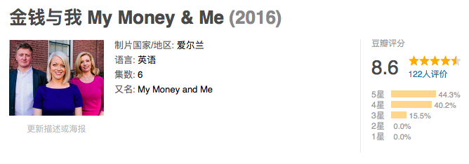

速读摘要

影片共分6集，每集的主角，都是一个遭遇金钱困境的个人或家庭。她不想改变目前的生活状态，但又希望在自己想退休的时候，不用为了糊口必须工作下去。就像片中几个主角说的，其实"省钱"最重要的并不是节衣缩食、能不花钱就不花钱，而是改善金钱思维，让每分钱都为自己创造最大的价值。而为了帮助更多人通过理财改变生活，水湄物语在2011年与先生一起创立了长投学堂，帮助0基础的普通人消除财富焦虑，轻松学习理财。学习方式为课程+微信群分享+班班和助教辅导陪伴。

原文约 2757  字  | 图片 31 张 | 建议阅读 6 分钟 | [评价反馈](https://static.app.yinxiang.com/embedded-web/clipper/#/Evaluating?d=2020-03-24&nu=9b50c446-3c7e-4231-be6e-755c91e9c347&fr=myyxbj&ud=58b471&v=2&sig=93D860F7A7C009688CFFC9C54B398152)

##  豆瓣8.6，只有100人看过，我敢说全世界所有人都在为它焦虑

原创 有部电影 [有部电影]()**
不知不觉，距离疫情爆发已经过去了两个多月。

虽然目前国内形势已经逐渐好转，但这场疫情确实产生了很多影响，大到行业，小到个人。

在这两个月内，有的人因此短暂停工，收入受损，开始节约开支过日子；也有人失去了工作，房租、还贷等生活压力瞬间接踵而至。

很多人意识到，只有在平时就从财务角度提前做准备，才能在意外发生时更好地做出应对。

这让我想到不久前在B站看到的一部纪录片，今天就拿来与小伙伴们分享——**《金钱与我》。**

.jpg)

这部纪录片很冷门，豆瓣上只有100多人标记看过，评分高达8.6：

影片共分6集，每集的主角，都是一个遭遇金钱困境的个人或家庭。

虽然主角们生活在爱尔兰，但其实他们的故事，和我们很多人的处境非常相似。

比如第一集的主角，是个花钱没规划的月光族。

她的日子过得还算舒适，但死活存不下钱。直到远在国外的女儿快结婚了，她才发现自己连度假的旅费都拿不出。

.jpg)

第二集的主角是一对夫妇，他们想买房，但不知怎样才能存够首付。

.jpg)

第六集的家庭，夫妻俩共同养育三个孩子。随着孩子一天天长大，两人开始为教育资金犯愁……

.jpg)

总之，就是一群形形色色为没钱而焦虑的人。

节目组会请到一名理财师和一名行为学家，针对他们各自的困境给出解决方案，帮助他们改变不自知的非理性消费，学会合理规划个人与家庭财务。

.jpg)

比如第三集的主角露易丝，是一名61岁的艺术家。

因为移民的身份和特殊的工作性质，她一直为养老金发愁。

.jpg)

事实上，露易丝的收入不错，但她花钱也大手大脚。

她不想改变目前的生活状态，但又希望在自己想退休的时候，不用为了糊口必须工作下去。

.jpg)

所以，她希望在不影响生活质量的同时，为自己存下退休金。

这个要求听起来有点矛盾，但节目组的理财师在分析过她的日常账单后，立马就找到了突破口。

.jpg)

首先，理财师发现露易丝花钱非常随性，会买很多完全不需要的东西；

.jpg)

其次，她为人慷慨，看见喜欢的东西，即使自己用不着也会买了送人，甚至动不动就给远在美国的亲戚航运礼物。

.jpg)

她的基本生活支出中，也有不少不必要消费。比如代步工具，完全可以租个税金更低的汽车。

.jpg)

针对这几个特点，理财师迅速为她制定了一个省钱计划。

首先，让她尝试将一周的支出控制在122欧元以内。因为如果她不能为自己存够养老金，这笔钱就是她将来可能领到的最低生活保障。

.jpg)

手头紧了起来后，露易丝在购物时不得不先考虑那些必须买的东西，提前体会到“悲催的晚年”，明白存钱的重要。

.jpg)

随后，理财师让她在日历上勾出那些对家人来说有特别意义的日子，提醒自己今后只需在这些日子给亲友寄礼物。

这样即便她管不了自己想送礼的手，也能省下一大笔邮费。

.jpg)

如果前两项计划都顺利执行，那么露易丝每个月都能获得一笔存款。

这笔钱可以拿来理财，比如投入有偿公债，虽然看似回报很小，但日积月累地坚持下去，到退休那天也会是一笔可观的收益。

.jpg)

总的来说，这部纪录片看似内容平实，其实干货满满。

通过理财师帮助每名主角制定财务规划的过程，我们能学到很多新姿势，避免现代社会中最常见的那些消费问题。

比如说盲目消费。

第一集的主角就莫名迷恋名牌，总觉得名牌产品质量更好。

于是节目组二话不说搞了几组盲测——**让她能分辨优劣的继续用名牌，分辨不出就换普通产品。**

.jpg)

还比如说过度消费，也就是俗称的“囤积癖”，以及不恰当借贷等等，对于如何摆脱这些不良习惯，影片都一一给出了解决方案。

.jpg)

其次，除了理财师大显神通，影片还请到了一名行为学家。

他每集都会通过一个实验，从行为学角度解析人们的消费心理，结合片中主角们的认知误区，帮助观众对金钱的使用方式做出更理性的判断。

.jpg)

**另外值得一提的，还有长期计划对于理财者的重要性。**

**片中的主角，无一例外都是先树立了一个明确的目标，譬如买房、还贷、存养老金，或是几年之内实现财务自由等等，才开始进行有计划的开源节流。**

.jpg)

正是因为有长期计划，所以他们才能积少成多、甚至以钱生钱，用自己现有的资源去实现更大的收益。

就像片中几个主角说的，**其实“省钱”最重要的并不是节衣缩食、能不花钱就不花钱，而是改善金钱思维，让每分钱都为自己创造最大的价值。**

.jpg)

这也是为什么，有些人明明拿着与你差不多的工资，却比你更早地过上了财务自由的生活。

不过，他们能做到的事，我们也一样能做到。

比如我的一个朋友，95后，才工作3年就攒下了50万。

大学刚毕业时，她也是拿着月薪5000的死工资，日子过得紧巴巴。可与同龄人不同的是，她每次都会把工资分为几部分，留出一部分用于理财，扩宽自己的收入来源。

无论再忙，她都会在工作之余抽出时间分析金融市场，时常在电话中对着她的证券经纪人，说着一大串金融术语。

结果3年过去，她靠理财挣到了靠工资不知道要攒多久才能拥有的财产。

.jpg)

有调查显示，“睡后收入”已经成为了90后除工资之外的最大收入来源。

但其实理财这件事，什么时候都不算晚。

**说到这里，不得不提一个我一直关注着的理财大V——水湄物语。**

.jpg)

30岁之前，她也是别人眼中的**“加班狗”**，每周加班也攒不下几个钱，直到她决心改变，开始学习理财。

如今，她是豆瓣**15万＋万粉丝理财大V**，也是**喜马拉雅/在行/分答资深理财专家**，**在40岁前实现了“财务自由”。**

有次和她聊工作聊投资时，她告诉我：

“说实话，我每年的投资理财收益，都是普通人十年的工资。之所以现在还是这么拼，是因为喜欢。”

听完前半句，我瞬间就get到了理财的重要……

.jpg)

而为了帮助更多人通过理财改变生活，水湄物语在2011年与先生一起创立了**长投学堂**，帮助0基础的普通人消除财富焦虑，轻松学习理财。

