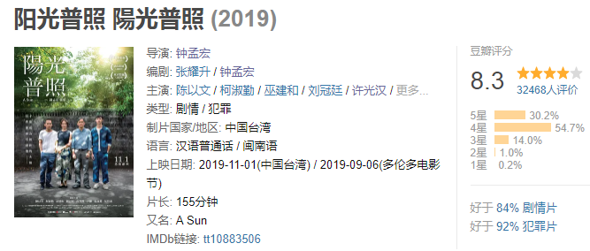

速读摘要

一辆摩托车载着菜头和阿和两个少年在雨中飞驰。但偏偏此时的配乐还是舒缓温暖的，与血腥肃杀的画面极不搭调，衬托得两少年好像只是吃了一顿家常便饭一样闲散。菜头虽然看穿了他的来意，却并未远离阿和，仍然动不动就会去找阿和做事。当这个秘密被阿文在阳光普照的山顶上说出来后，似乎一切都得到了救赎。当菜头刑满释放后，阿和对他避之不及，阿文也生怕他"带坏了小孩"，冲动之下开车将其撞死。

原文约 2398  字  | 图片 38 张 | 建议阅读 5 分钟 | [评价反馈](https://static.app.yinxiang.com/embedded-web/clipper/#/Evaluating?d=2020-03-20&nu=f25984f0-cf7f-46e4-93a1-091d456cf2cc&fr=myyxbj&ud=58b471&v=2&sig=9E01EAAF69F16E4CEA1C293D158111E6)

##  近期最好的华语片，有种不一样的感动

原创 有部电影 [有部电影]()**
最近，想必天天宅在家刷新闻的小伙伴，心情都像过山车一样忽上忽下。一会儿被感动得眼眶湿润，一会儿又被气得差点当场去世。

是时候来看一部华语新片，给心灵扫除阴霾了——**《阳光普照》。**

.jpg)

影片的开场就十分高能——

傍晚，一辆摩托车载着菜头和阿和两个少年在雨中飞驰。两人都身披黄色雨衣，稚气未脱的脸上，浮现着与年龄不符的狠劲。

.jpg)

不一会儿，摩托车在一处大排档门口停下。两个少年锁好车子，拿起砍刀，气势汹汹地冲进大排档。

然后，一刀砍下了一个男人的右手。

.jpg)

原本觥筹交错的大排档，瞬间炸开了锅，尖叫声和碗筷落地声此起彼伏，人们迅速作鸟兽散。

偌大的饭厅顷刻间空无一人，只剩倒在地上痛苦嚎叫的男人和孤零零漂浮在菜汤中的一只断手。

.jpg)

但偏偏此时的配乐还是舒缓温暖的，与血腥肃杀的画面极不搭调，衬托得两少年好像只是吃了一顿家常便饭一样闲散。

以上，便是这部电影的开头。

.jpg)

但千万别以为《阳光普照》是部阴暗暴力的犯罪片，在后面的剧情里，你再也看不到一丝血腥。

随着菜头和阿和的入狱，故事主角变成了阿和的父亲阿文。他是一个驾校教练，一直信奉着八字箴言：**把握时间，掌握方向。**

.jpg)

他相信，人生就像是一条路，只要握紧手中的方向盘，红灯就停，绿灯就慢慢起步，稳稳地开，就会平平安安。

.jpg)

但或许是造化弄人，因为阿和的缘故，阿文的人生路已经说不上顺遂。

他一共有两个儿子，但每次被驾校学员问起家里有几个孩子时，都会毫不犹豫地回答：只有一个。

.jpg)

他愿意承认的这个孩子，就是许光汉饰演的大儿子阿豪。

.jpg)

阿豪从小就品学兼优、极为懂事，人长得也高高帅帅，一直是父母心中的骄傲。

旁人都羡慕阿文，有一个这么有出息的儿子。而相比之下，阿和就像是阿豪的反面。

.jpg)

他顽劣不堪、好勇斗狠，在四岁的时候喜欢上了骑自行车。

当然，是母亲在前面骑，他在后面坐着。

.jpg)

有时候母亲骑了两三个小时的车，阿和都不肯下来。如果不让他坐车，那他晚上就不睡觉，吵闹一整晚。这种情形一直维持到上小学为止。

但别以为阿和长大了，就变得乖巧懂事。在上到中学以后，他又学会了打架斗殴，交上了一群混混朋友，其中就包括开头时和他一起去砍人的菜头。

.jpg)

因此，阿文向来不喜欢这个小儿子。当他因为犯事被关进了少管所之后，阿文甚至感觉如释重负，总是说着“希望他被关到老、关到死”。

.jpg)

在他心里，只有阿豪才是儿子。

但他万万不会想到，阿豪在某天夜里，一声不吭地从自家楼上跳了下去。

.jpg)

自此，影片开始带上了悬疑片的色彩。完美的阿豪究竟为何自杀？

这个谜底出乎意料，却又在情理之中——

同学说，阿豪对人很好，有时候会觉得，他好像把所有的好都给别人，忘了留一点给自己；

阿和说，哥哥很厉害，他厉害到这辈子只做错过一件事情，就是从那么高的地方跳下来；

.jpg)

而阿豪自己说，这个世界，最公平的是太阳。不论纬度高低，每个地方一整年中，白天与黑夜的时间都各占一半。

而他的生活似乎没有黑夜，只有白天，“24小时从不间断，明亮温暖，阳光普照”。

.jpg)

**说白了，是家人和外界对阿豪的期望，压垮了他。**

没有阴影能够躲藏的阿豪，最终在阳光暴晒下死亡。

而与他相反的阿和，则一直都生活在阴影下。在哥哥死后，阳光似乎终于肯洒在他身上了。

.jpg)

因为表现良好，阿和提前从少管所走了出来。为了重返社会，他决定洗心革面，努力工作。

他白天在洗车行洗车，晚上在便利店打工，跟父亲阿文的关系也缓和了许多。

.jpg)

眼看一切都在往好的方向发展，但没过多久，刑满释放的菜头却带着过去的阴影，前来找他了。

菜头一来，就问他借钱，还威胁他帮自己做坏事。

.jpg)

阿和避之不及，但也没有办法，只能不情不愿地跟他周旋。

但就在他不知道该怎么摆脱菜头的纠缠时，忽然有一天，菜头人间蒸发了，从此之后再也没来找过他的麻烦。

.jpg)

菜头去哪了呢？

这个谜团一直到片尾才得到解答——原来，自从阿和被释放后，父亲就一直在偷偷跟踪他。虽然嘴上对阿和恨铁不成钢，但他心里还是怕阿和重蹈覆辙，又走上歧路。

所以，当他看到菜头来找阿和后，就曾独自去找过菜头。

.jpg)

菜头虽然看穿了他的来意，却并未远离阿和，仍然动不动就会去找阿和做事。

因此，在一个雨夜，阿文趁菜头在郊外落单的时候，开车撞死了他。

.jpg)

世事就是这么魔幻——**阿豪是他心中的骄傲，他却从来没有真正了解过阿豪；****阿和被他弃如敝履，他却为阿和杀了人。**

**当这个秘密被阿文在阳光普照的山顶上说出来后，似乎一切都得到了救赎。**

.jpg)

总的来说，这是一部风格非常日式的家庭题材电影，其中既有暗流涌动的奇情谋杀，又不乏点滴细腻的温情救赎。

其人物之间的纠葛和羁绊，颇有杨德昌或是枝裕和的味道，想必不少人看完都能找到共鸣。

.jpg)
除了片尾的剧照，一家人从未同框过

在豆瓣上，《阳光普照》拿下了8.3的高分，是近期华语电影的最高分；

在第56届金马奖上，它也囊括了包括最佳剧情长片、最佳导演、最佳男主角、最佳男配角、最佳剪辑在内的五项大奖。

值得一提的是，在和金马奖同天颁奖的第32届中国电影金鸡奖上，凭借《地久天长》获得金鸡影帝的王景春，曾在获奖感言里说到——

**“希望中国电影阳光普照，愿所有的爱地久天长。****”**

.jpg)

不管这是刻意还是巧合，《阳光普照》与《地久天长》确实都是2019年华语家庭题材电影中，不可忽视的作品。

虽然两部影片都围绕着破碎的家庭展开故事，但气质上其实大相径庭：《地久天长》讲述个体在时代的洪流下身不由己的悲剧，其家庭破碎的原因，是被动的；

.jpg)

而《阳光普照》，则更贴近当下的“原生家庭”概念，讲述平凡家庭因每个人不同的抉择，变得支离破碎。

.jpg)

说到这里，我忽然觉得，出场不多的菜头也是很值得玩味的一个人物。

他虽然不是这个家庭的一份子，但这个家庭的残破却和他息息相关。

.jpg)

一开始，他之所以会去砍人的手，是因为阿和找他帮自己出口气。

菜头二话不说就去了，后来也一直都没后悔。

.jpg)

在法庭上，阿和把责任推得一干二净，导致菜头多坐了三年牢。

当时，菜头家拿不出赔偿的钱，家里被查封，相依为命的奶奶也被赶到养老院。

.jpg)

当菜头刑满释放后，阿和对他避之不及，阿文也生怕他“带坏了小孩”，冲动之下开车将其撞死。

但就是没人肯想想，阿和还有洗心革面的选择，菜头却连重新做人的权利都没有。

.jpg)

更讽刺的是，菜头最后之所以会被阿文撞死，是因为他怕在车里抽烟会害阿和被老板责骂，所以才选择下车抽烟。

.jpg)

**命运是如此不公，有些人只是活着就要拼尽全力——这句话放在当下语境，也同样适用。**

所幸，影片的结尾让我们看到了一些温暖的希望：从小就爱骑脚踏车的阿和，这次载着妈妈，飞驰在林荫大道上。

.jpg)

**头顶的阳光自树叶间的缝隙洒下，温暖如初。********这一家人都在努力使生活回到正轨，就像阿文所信奉的那样，好好地掌握时间、把握方向。******

**所以，哪怕是处在绝望的谷底，我们也要相信并期待着，度过眼前的阴霾后，阳光普照的那一天将会到来。**

也许是国内最认真的电影自媒体
长按扫描二维码关注

在看