##  一些日本人，总算开始反思战争了

原创 有部电影 
说起数学这门学科，相信很多小伙伴会感到头秃。但关于各种数学天才的传记片，却是大家喜闻乐见的电影题材。

比如“卷福”主演的二战片《模仿游戏》，讲的就是被称为“现代计算机之父”的英国数学家图灵，破解德军密码、扭转二战战局的故事。

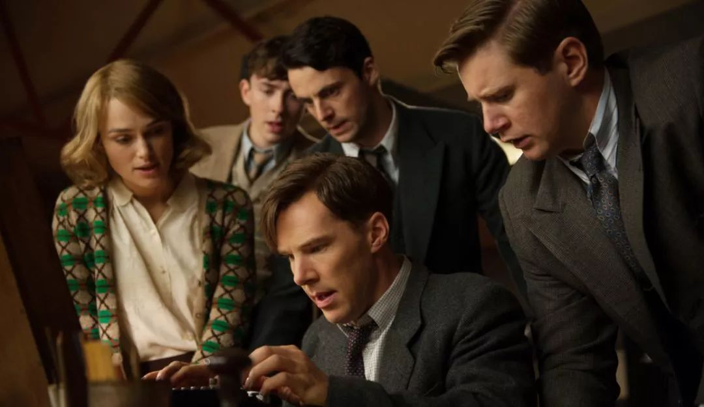

而今天要聊的这部日本漫改片，主角同样是一位天才数学家，故事也同样与二战相关。

它讲述了被世人称为“阿基米德再生”的男主，在二战前通过数学公式，揭穿日本军部开战阴谋的故事——**《阿基米德大战》。**

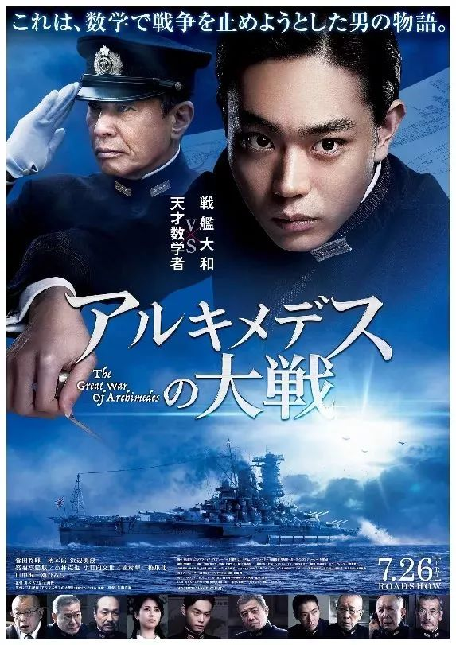

故事要从1933年说起，当时的日本海军为制霸太平洋战场，准备打造一艘全新大型战舰，并由此引发了内部的激烈争论。

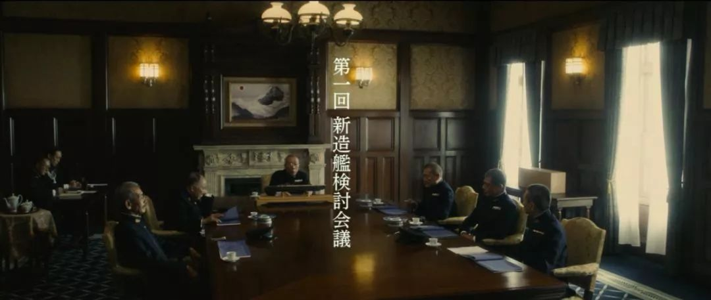

作为海军第一航空战队司令官的山本五十六，深知未来战争中飞机才是主力，提议打造能够搭载战机的新型航母，对又大又笨的战舰嗤之以鼻。

而以岛田繁太郎少将为代表的保守派，则认为从空中攻击是小人行为，他坚持要建造一艘象征海军威严的豪华旗舰，并以“大和号”为其命名。

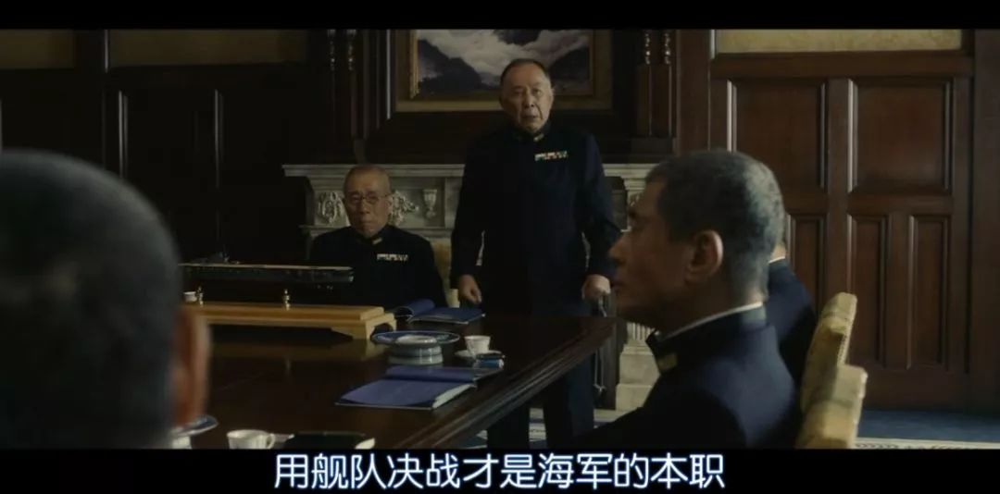

在研讨会以上，双方都拼命拉拢决策大臣，不惜当场撕逼，相互攻击。

但保守派老奸巨猾、棋高一着，不仅给出了更低的成本预算，还按照图纸造出精致的战舰模型，当场把决策大臣看得两眼放光。

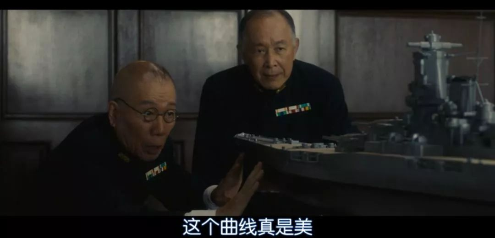

眼见对手占尽上风，山本这边赶紧中断会议，提出半个月后再做决策。

但问题是，如何在这段时间里扭转局势呢？谁也没有答案。

而就在这个时候，他们在艺伎馆里遇到了性格中二、痴迷数学的男主櫂直。

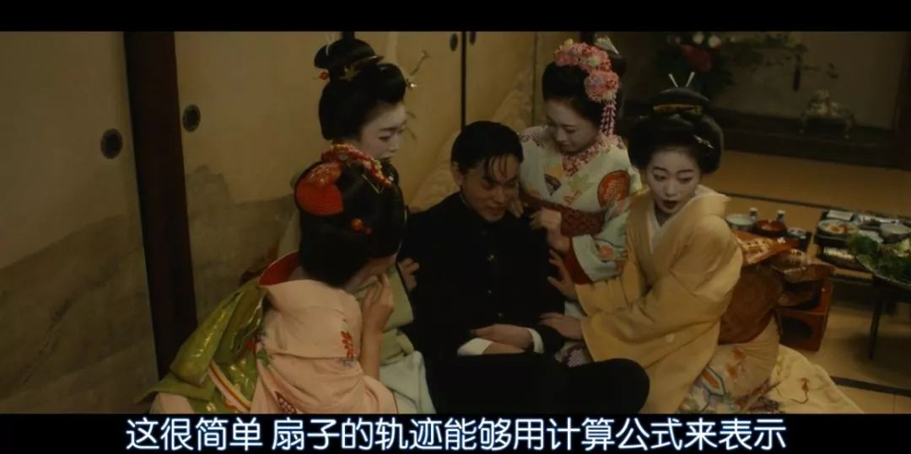

经过打听，原来男主曾是帝国大学的高材生、堪称“阿基米德再世”的数学天才，只因得罪了财阀尾崎留吉，才被学校赶了出来。

这位年轻人的出现，让山本瞬间获得了启发——“大和号”无论是排水量还是武器装备，都远超航母，根本无法以更低的预算造出来，保守派一定是故意瞒报了价格。

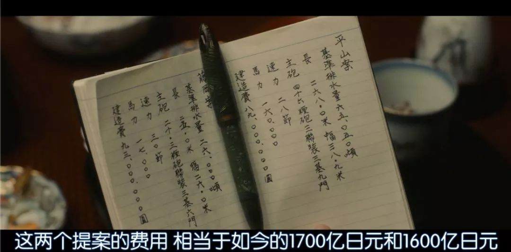

于是，他决定特招男主加入海军部，重新核算“大和号”的真实造价。

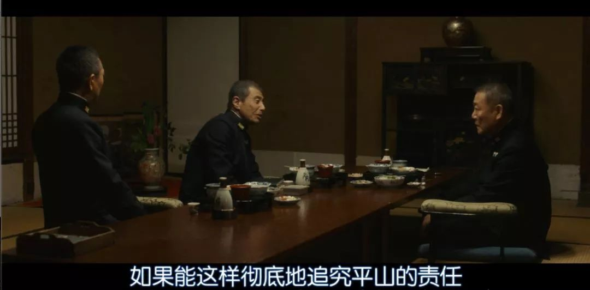

但他没想到的是，男主反对军国主义的穷兵黩武，而且即将赴美深造，根本不愿留下帮忙。

直到山本故意渲染局势，宣称巨舰一旦造出，必将对美宣战，只有揭穿其预算造假，才可遏止战争，这才成功说服了男主。

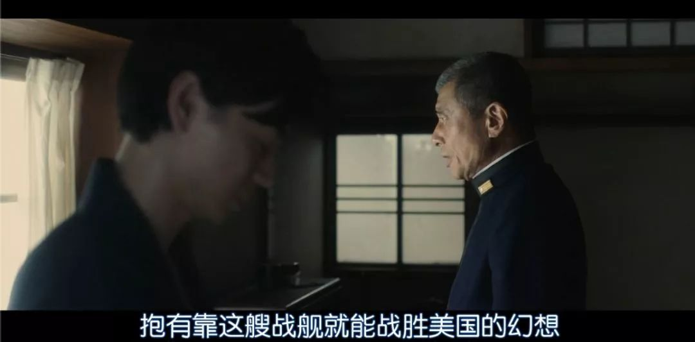

但是，由于新舰设计图属于军事机密，男主又无从知道装备报价以及人工费用，显然无法在两周内算出结果。

再加上保守派听到风声后，查出男主之所以被帝大开除，是因为跟财阀小姐有私情。于是他们便围绕此事大肆渲染，搞坏男主的名声，让他在军部内外孤立无援。

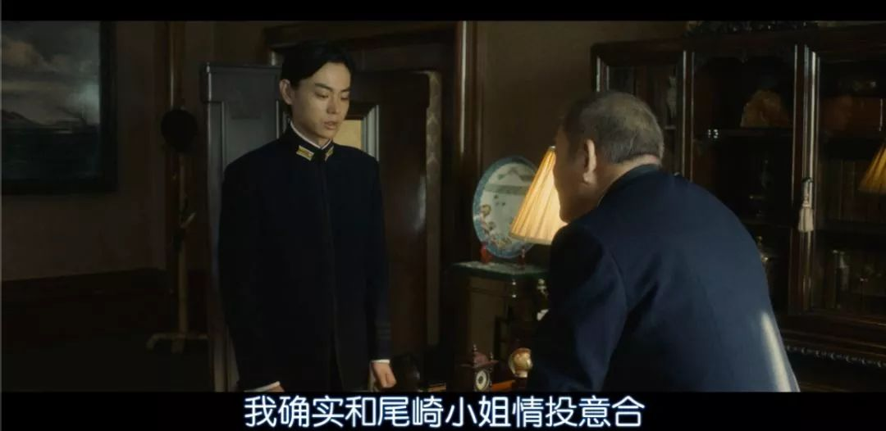

他们本以为这种尴尬的处境会劝退男主，但没想到，这反而激发了他的中二热血之魂。

通过山本的人脉关系，男主先是以参观之名登上另一艘战舰“长门号”，通过抄写设计图和手动测量，收集了不少相关数据；

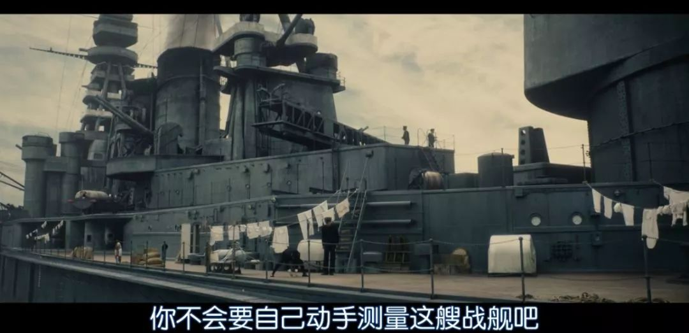

紧接着，他又连夜突击了造船工程学，在距离决策会议还有9天时，绘制出了“大和号”的完整图纸。

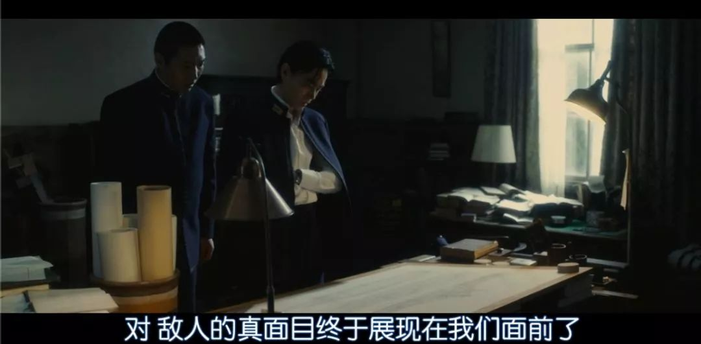

但光有设计图纸还不够，还得通过军部外包公司，拿到造舰的各项费用报价。

这时，他想起财阀家也涉足军需产业，于是便借助女票的引荐，找到了一位掌握内情又反对战争的造船社长。

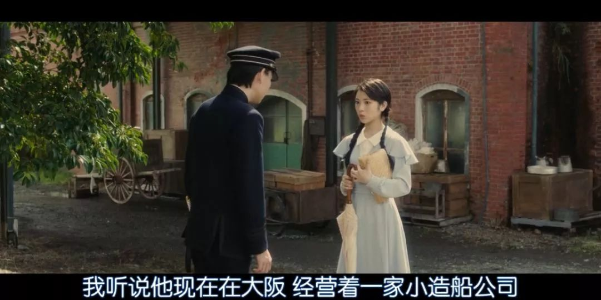

在讲清来龙去脉后，这名社长当场拿出外包底账，揭露了保守派的配售阴谋——

原来，他们跟外包公司达成协议，一边为争夺预算、压低“大和号”的报价；一边又以高价订造巡洋舰，填补亏损。

外包公司在稳赚不赔的同时，还能与军部成为亲密伙伴，从而订单不断，越捞越多。

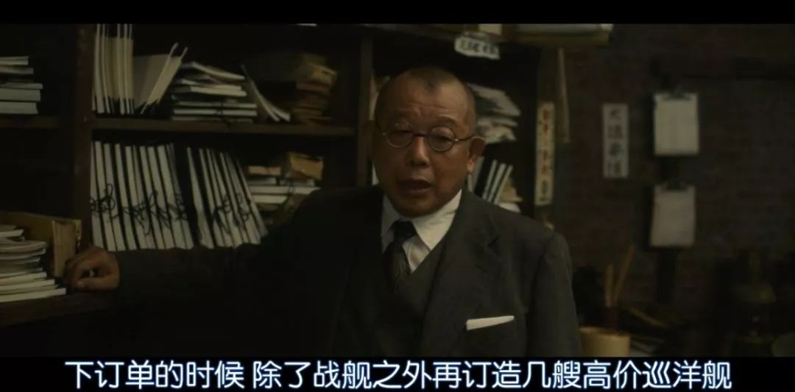

在这个故事的最后，男主成功推导出了“大和号”的真正报价，并在决策会议上拆穿保守派瞒报预算，以及与造船公司狼狈为奸的交易阴谋。

更开挂的是，他还指出“大和号”在设计上就存在严重缺陷，一旦遭遇巨浪，就有断裂沉没风险，彻底击垮了对手的方案。

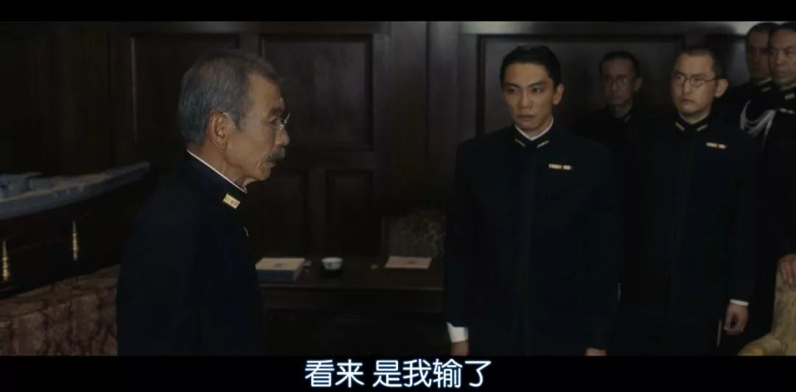

至此可以说，《阿基米德大战》作为一部二战题材的漫改片，在取材史实的基础上，也充满了漫画式的中二感。

男主角凭借数学公式揭穿军部腐败、阻止建造战舰的过程，也会让大多数观众看得热血沸腾。

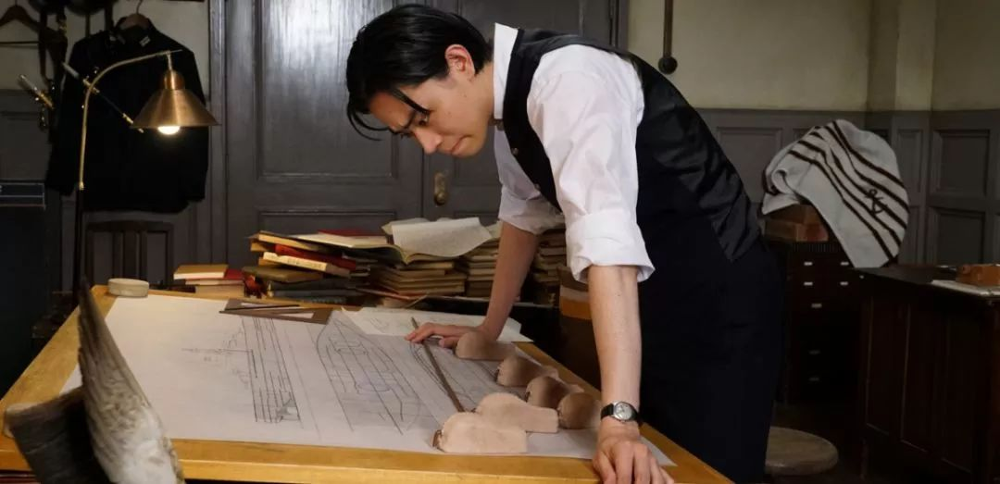

虽然影片中的数学天才其人纯属虚构，但大和号战舰却在历史上真实存在。

它是人类海军舰船史上最大的一级战列舰，却恰逢巨舰重炮被航母取代的时代，最终在冲绳岛战役中被美军击沉。

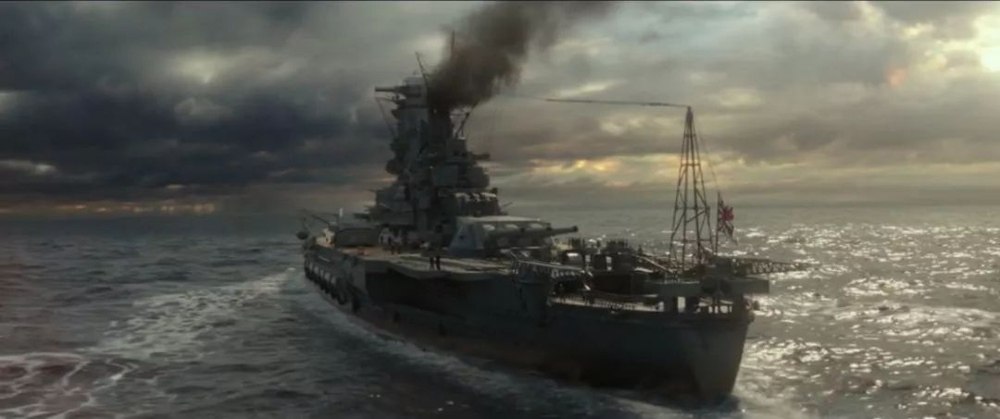

正因如此，日本至今仍有不少讲到“大和号”的影视作品，例如《战舰大和》《太平洋风暴》《男人们的大和》《联合舰队》等等。

但众所周知，日本反战片有许多都是“反战败”，这些影视作品也都是用浪漫主义的悲壮情怀，来粉饰大和号沉没背后的军国主义侵略野心。

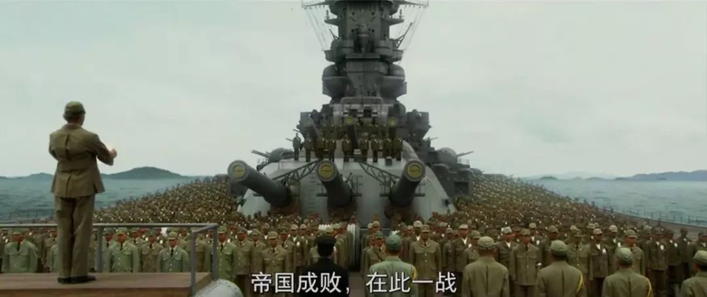
《男人们的大和》

而今天聊的这部《阿基米德大战》，却并非如此。

一方面，它揭露了日本在发动侵略战争的同时，军队内部官僚主义盛行、各派系勾结财阀明争暗斗，导致百姓积贫积弱民不聊生的情景，也为战败埋下了种子。

比如海归派利用男主击败保守派，其实也并非为了遏止战争、保护国民，而是要组建以航母为旗舰的机动部队，去偷袭珍珠港。

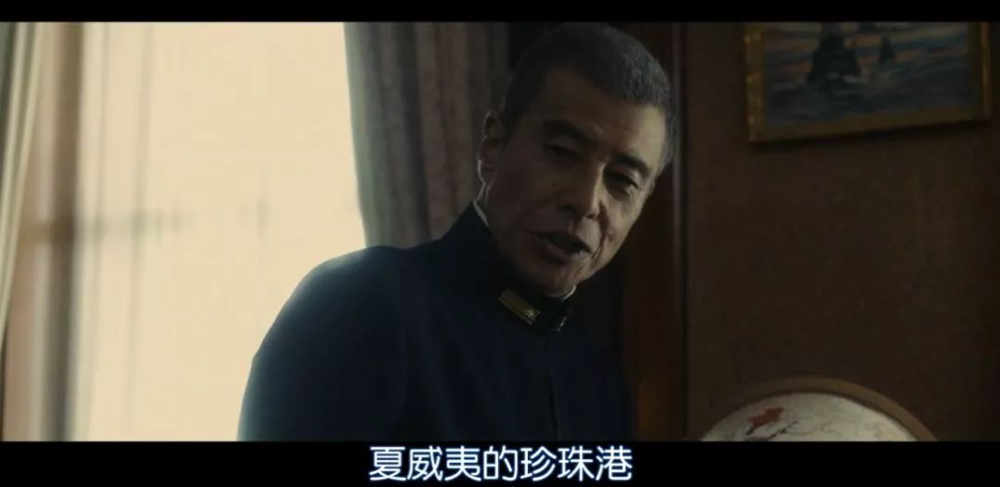

另一方面，这部影片又通过情节反转与人物对白，表达了纯粹的反战思想。

比如男主初见山本，就表现出厌恶反感，并认为“日本军队干的事一点都不美”；当他得知海军要继续建造“大和号”时，又悲愤地感慨，“这艘巨大而美丽的战舰，对国家而言就是一个诅咒”。

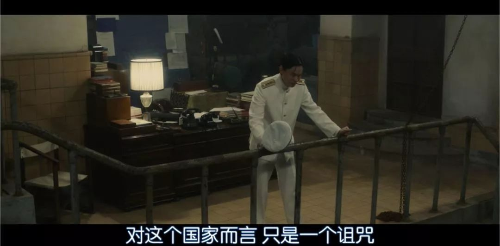

还比如影片最后的反转，负责设计“大和号”的平山忠道，向男主道出了一个真相——原来他早就明白，两国实力悬殊、日本开战必败，但“日本又是一个不懂得认输的民族，无论战况多么惨烈，都会坚持到最后一兵一卒”。

所以与其眼见国家走向灭忙，不如造出象征帝国形象的大和号战舰，然后用它在战场上的壮烈沉没，来唤醒膨胀好战的国民。

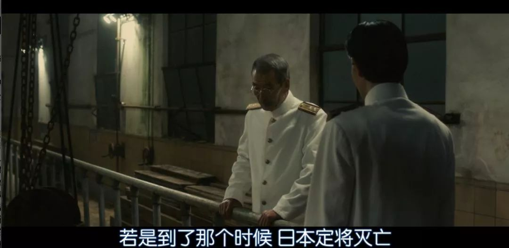

然而事实上，这一幕并没有他所描述的悲壮绝美。

影片开场就揭开了大和号的惨烈收场，三千多名船员在美军的炮火中，变成血肉横飞的残肢断臂，最终又与战舰一起坠入海底……

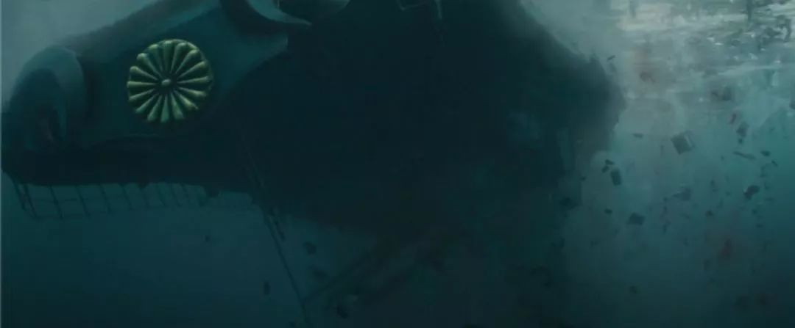

**这种殉道式的自杀看似有悖人性，却早已根植于日本文化，并在川端康成、三岛由纪夫等作家的文字渲染下，演变成对死亡美学的崇尚。**

这让我想到，美国人类学家鲁思·本尼迪克特在《菊与刀》中所写：**“日本人渲染自杀就像美国人渲染犯罪一样，而且是带着与美国人欣赏犯罪相同的共鸣情感来欣赏自杀的。**”

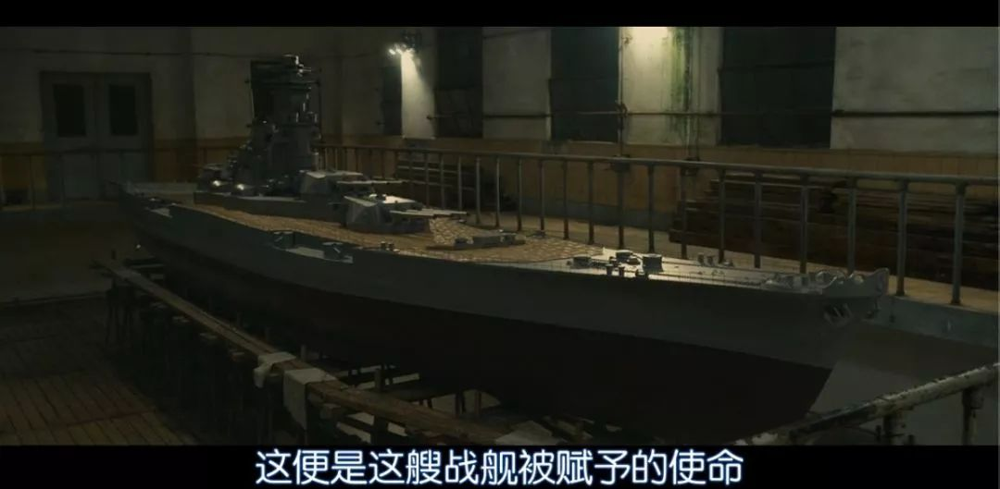

但事实上，这种自我戕害并不高尚，而是对绝望境遇的自暴自弃与屈服。

正如影片结尾时，男主目送大和号满载着士兵远航出征，却恍若看到战火中生灵涂炭的日本，忍不住流下了绝望的泪水。

而巨大战舰的悲剧覆灭，既不能洗清发动侵略战争的滔天罪行，也无法遏制军国主义的右翼思想。历史上，等待他们的仍是国破家亡、战败投降。

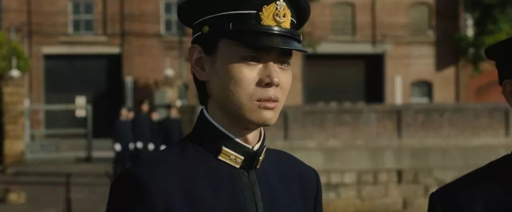

**原因正如我们常说的，任何为满足野心私欲发动战争的侵略者，都将迎来自取灭亡的下场。****每个国家要想告别罪恶的过去，并不能靠简单粗暴的粉饰或抹杀。**

**对于全人类而言也都是如此，我们都只有正视历史、从反思中吸取教训，才能真正做到直面未来，避免悲剧的重演。**

