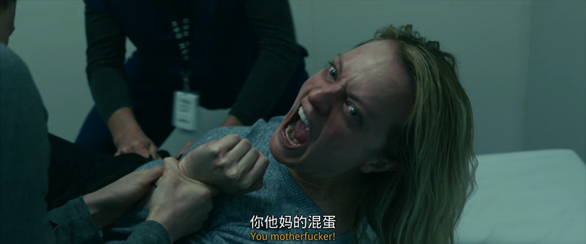

##  年度爆款PUA，最恐怖的前男友

原创 有部电影
今天跟大家说说最近热门的爆款恐怖片《**隐形人**》。

影片改编自英国作家赫伯特·乔治·威尔斯的同名小说。

导演兼编剧雷·沃纳尔，是温子仁的老搭档。两人合作编剧的《电锯惊魂》《潜伏》《死寂》等片都是恐怖片中的经典。

雷·沃纳尔在《电锯惊魂》中出演亚当

而他上一部自编自导的科幻惊悚片《升级》也口碑不俗，在豆瓣有8.1的高分。

可以说，雷·沃纳尔是个集演、编、导能力于一身的全才型影人。

而今天要说的这部《隐形人》，其实早已有过不少改编版本。

早在1933年，这个故事就已经被搬上了银幕。影片不仅忠实还原了原著的内容，隐形人的特效，在当时也惊艳了一批观众。

《隐形人》，1933年

不过我们最熟悉的版本，应该是2000年保罗·范霍文执导的《透明人》。

这部电影被拍成了尺度较大的cult片，是不少人的童年阴影。

而在雷·沃纳尔的笔下，新版《隐形人》又被玩出了新花样。

影片不再以隐形人的视角去讲故事——**饱受PUA男友控制折磨的女主，才是影片的主角。**

女主塞西莉亚的男友阿德里安控制欲极强，不仅控制她吃什么、穿什么、说什么，后来甚至发展到想要控制她思想的程度。

而一旦女主有一点违背的意思，男友就施以暴力，还将她囚禁在身边。

时间一长，女主甭管多爱男友都忍受不了了，决定从他身边逃离。

在影片开场，就是女主趁夜蹑手蹑脚逃离男友住处的场景——收拾行李、避开监控、解除警报、翻墙逃走……

从这段开头，我们就能看出阿德里安的控制欲之强，不仅屋内布满监控、屋外围墙高耸，就连宠物狗脖子上，都戴着电项圈。

而当他发觉女主逃走后也立刻追来，但还是晚了一步，眼睁睁看着女主被她妹妹接走。

在此之后，女主生怕男友跟踪妹妹，继而找到自己，便借住在了警察朋友家里。

虽然逃了出来，但女主留下了很深的心理阴影。

她整天疑神疑鬼，还患上广场恐惧症，出门取个信件都被跑步的人吓个半死。

直到有一天，妹妹带来一个让人惊讶万分的消息——阿德里安自杀身亡了。

他怎么会自杀呢？女主觉得不可思议，但新闻上刊载得明明白白，阿德里安确实死了。

而且，他还给女主留下了五百万美元的遗产，以每月十万美元分期四年到帐，前提是女主在此期间不能有犯罪和精神疾病记录。

这一下，女主不仅永远逃离了男友的掌控，还得到了一大笔钱，心情自然大好。

但她万万没想到，新一轮的噩梦又来了——

就是从这天开始，女主时不时感觉有一道目光在背后窥视自己，可转过头去，却又什么都看不到。

只要她视线离开一会儿，本来好好煎着的培根，就能自己冒起火来。

有一次，女主甚至在床单上看到了脚印的痕迹。

但只要叫来朋友，所有惊悚的反常迹象，又都消失了。

此外，女主的生活中也开始发生怪事——

她去面试，发现准备好的作品居然凭空消失了；

去找妹妹，妹妹却质问她为何要发邮件辱骂自己。

还有一次，她正跟人说着话，突然就晕过去了。

医院的检查结果把她吓出一身冷汗：晕倒是她安眠药吃太多了导致的。

可是，女主根本就没吃过安眠药，上一次使用这东西，还是在离开男友那天，用在了男友身上。

她清清楚楚地记得，当天逃跑时这瓶药掉在了男友的住处，可现在它却出现在她的洗手池边……

这一连串现象让女主确定，阿德里安并没有死，他一直隐藏在自己身边，继续控制折磨着自己。

再加上阿德里安本身是一个光学领域的科学家，女主认为他是找到了什么隐身的办法。

但显然，这个说辞是没法让他人认可的。

家人和朋友们都觉得女主心理阴影过重，出现了幻觉。

但就算没人相信她，女主也坚定地认为是阿德里安搞的鬼，并开始有计划地寻找证据。

她伺机去了一趟阿德里安的住宅，结果真的看到了一件隐形衣：

可她还没来得及把东西带走，阿德里安就回来了，女主只好在慌忙之中逃走。

虽然证据没到手，但事实已经了然于心。

女主慌忙地约了妹妹出来见面，想把消息告诉她，却没想到隐形人就在身边……他不仅当着女主的面杀死了妹妹，还成功嫁祸给了女主：

就这样，女主被关进了精神病院，根本没人信她说的话。

那么，现在连人身自由都受到控制，女主要怎么做才能绝地反击呢？

影片后面的剧情，就围绕着女主与隐形人斗智斗勇、孤身一人完成复仇而展开，情节不仅精彩刺激，结尾还有一个大快人心的反转，我在这里就不多做剧透了。

这部《隐形人》以700万美元的成本，在全球拿下了超过1.2亿美元的票房，堪称是以小博大的典型。

影片口碑也不俗，豆瓣和IMDb都在7分以上，烂番茄新鲜度达到91%。这对一部恐怖片来说，是相当不错的成绩。

能取得如此漂亮的成绩，首先有赖于雷·沃纳尔与时俱进的改编。

不难看出，影片其实通过隐形人的设定，将这个恐怖故事与“METOO”运动的精神做了结合，讲述的是亲密关系中的控制与暴力。

隐形就意味着威胁无处不在，即使近在身边，你也看不见它；而当你被它伤害时，没有人会相信你。

这种惶恐无助、令人窒息的感觉，几乎贯穿了全片。

导演一方面以此来隐喻PUA及家暴受害者承受的痛苦不被人看见；另一方面也表达出科技进步带来的人际关系异变。

与此同时，自身不俗的恐怖片导演功力，也让影片全程节奏飞快、气氛紧张，音效和镜头设计都给人留下深刻印象。

两相加成，《隐形人》口碑焉能不爆？

此外，饰演女主的伊丽莎白·莫斯也功不可没。

看过美剧《使女的故事》的小伙伴肯定对她不陌生，此前她已凭借此剧获得过金球奖和艾美奖的双料影后。

而在《隐形人》中，她依然靠精湛的演技将女主前期的“PUA男友PTSD”状态与后期孤身对抗隐形人的机智果敢，演绎得惟妙惟肖。

**最令人叫绝的是，女主在片中有好几场和隐形人的搏斗戏，都是难度极大的无实物表演，极其考验演员的演技：**

当然，影片并非十全十美，一些细节上的槽点也让人无法忽视。

比如，女主被隐形人嫁祸杀死了妹妹，怎么这个餐厅就恰好没有监控、没拍到是餐刀自己飞起来作案呢？

比如女主怀疑是隐形人骚扰自己，怎么也没想到在家里装个监控什么的，这样不就有证据了吗？

不过这些槽点可以算是瑕不掩瑜，并不影响故事的整体逻辑和主题的表达。影片对于女性在家庭中遭受到各种暴力，展现得也较为全面。

一般说来，因为家庭暴力的私密性，对家暴的举证也的确非常艰难，女性诉诸法律的信心在沉重的举证责任面前，会受到很大打击。

片中的女主面对隐形人的骚扰时，反复向周围的人提及却无人肯信，其实也是在隐喻女性举证的困难程度。

但即便如此，也不应该就此放弃发声。正如女主在发现自己必须与一个隐形人对抗时，她虽然万般无助却没有陷入绝望，而是动用自己全部的脑力与毅力，最终完成了以牙还牙的绝地反击。

**在各种悲剧、恶习面前，常听人说“一个人的力量也无法改变什么”，但实际上，当你有心时，你便是有力的，当你付诸行动时，这股力量就可以激励和影响他人。**

**如果每个受害者都拒绝沉默，这股力量将不容小觑。**

