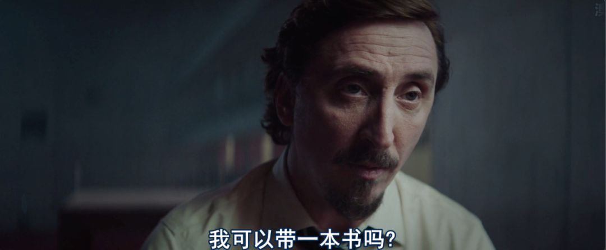
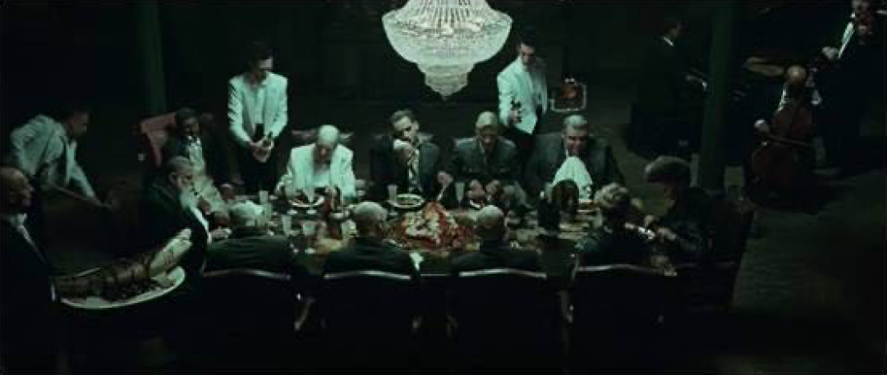
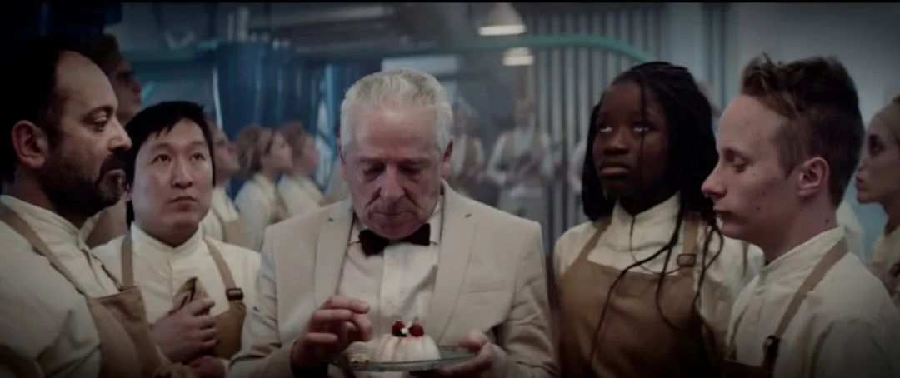

速读摘要

片中故事发生在未来世界，一个名叫"监狱坑"的地方。首先就是吃饭问题，由于楼上还有47层，所以饭菜到他这时，至少被94个人吃过。而说到阶级寓言，它又被很多人戏称为"垂直版《雪国列车》"，两者都以封闭空间来象征社会分层。片中的食物象征着财富、权力、技术、知识等社会资源，牢房层级则直接对应社会阶级，阶级越高就意味着享有更多、更优的资源。这个结局象征着，人们总是将改变社会的希望，乐观地寄托在下一代身上。

原文约 2631  字  | 图片 43 张 | 建议阅读 6 分钟 | [评价反馈](https://static.app.yinxiang.com/embedded-web/clipper/#/Evaluating?d=2020-03-28&nu=29067e77-b361-4e7e-9632-3082b1fc7ac3&fr=myyxbj&ud=58b471&v=2&sig=A4111269151F8D6580BE7ADCFC6FBDE5)

##  ​《雪国列车》垂直升级版，脑洞巨大，内涵深刻

原创 有部电影 [有部电影]()**
最近，西班牙出了一部小成本科幻片。

凭借细思极恐的高能设定和大尺度剧情，很快在社交网络走红——**《饥饿站台》。**

片中故事发生在未来世界，一个名叫“监狱坑”的地方。

所谓监狱坑，就是一座垂直密闭监狱，每层住俩人，总层数未知。

其中位居最高“零层”的是监狱厨房，每天由厨师团队为犯人准备食物，然后放在平台升降桌上，自上而下地依次传递。

别看这桌料理菜式丰盛、摆盘考究，但整个监狱一天只供应一桌，所以住得越高吃得越好，往下就只有别人吃剩的残羹冷炙，到了底层连骨头渣都不剩。

为了防止囤积食物，管理局规定只能在餐桌上就餐。

如果有犯人在餐桌下行时偷拿东西，这层牢房就会启动高温或冷冻模式，直到他将食物丢还到下面去。

此外，监狱内每隔30天释放一次麻醉气体，所有人会被随机调换层数。

也就是说，上个月你可能还位居高层、吃香喝辣，下个月就得打扫空盘，甚至靠吃同伴存活下去。

监狱中的犯人大多触犯了法律，也有人为了体验生活自愿加入，所有犯人在入狱前，都可以挑选一件物品带进来。

片中的男主格伦，就是为了强迫自己戒烟，以及看完《堂吉诃德》这本书，才向管理局申请服刑六个月。

但当他第一天在48层睁开眼时，才发现这里并非失去自由那么简单。

首先就是吃饭问题，由于楼上还有47层，所以饭菜到他这时，至少被94个人吃过。

楼上的人们不仅暴饮暴食，还会肆意践踏、吐口水，让传下去的食物变得令人作呕。

初来乍到的格伦，一开始根本下不了口。

直到饿得眼冒金星，他才不得不像狱友一样狼吞虎咽起来。

而这位名叫崔马格斯的狱友，是由于过失杀人被判入狱。

他在这里度过了整整一年，上至26层、下至132层换过六次牢房，生存经验已经极为丰富。

据他所说，餐桌到达132层时，就已经连食物残渣都不剩了。

那么，在那里住了一个月的崔马格斯是怎么活下来的呢？看着他随身携带的尖刀，男主不得不产生了阴暗联想。

这还不是最刺激的，没过多久，有位女犯人竟然搭乘餐桌一路下行。

据崔马格斯介绍，这个女人名叫米哈鲁，和孩子分配在不同牢房，所以每个月她都会自上而下、逐层寻找自己的孩子。

一路上，只要遇到阻挠或是打她歪主意的人，她就直接利刃伺候。

随着时间一天天过去，男主渐渐适应了监狱坑的生活。

他白天跟着狱友一起暴饮暴食，对着别人的食物吐口水；晚上时不时意淫起米哈鲁的身体，在幻想中自嗨一把。

但这种安稳日子没过上多久，轮换日就到了。

这回格伦一睁眼，发现自己竟被五花大绑在床板上，眼前是刻着“171”的墙壁，身边的崔马格斯手握尖刀……

原来，老头在提前醒来、看清楼层后，就做好了以男主为食的打算。

为了确保肉质不腐烂，他并没有一开始就杀死男主，而是准备定期割肉、吃满30天为止，甚至还打算与男主分而食之，好让对方在此期间维持存活。

但没想到，就在老头打算下刀之际，米哈鲁刚好乘桌而来。

她当场将老头割喉，救下了男主，还帮男主松开捆绑、包扎伤处，一块分食老头的尸体。

就这样，在米哈鲁的帮助下，男主活过了30天。

下一次轮换日到来时，他幸运地升到了33层，新狱友还是一名管理局的前员工。

从她口中，男主得知这栋监狱一共200层，如果每个犯人都考虑到他人、只吃自己所需要的分量，那么最底层也能拿到食物。

新狱友是因为患上绝症，即将不久于人世，所以决定来这里感化大家。

在每次餐桌下行时，她都会帮楼下犯人分配食物，并向下喊话，说服他们将这套流程延续下去，但根本没人鸟她。

随后，俩人被轮换到了202层，往下一看，仍然是一层层的深不见底。

女员工这才意识到，原来管理局骗了她，最终在绝望中自杀。

而男主为了生存，只好割食她的人肉。

就这样，男主再次撑过30天，一觉醒来，来到高高在上的第6层。

这回的狱友是个名叫巴哈拉特的黑人，他自带一套麻绳，想在楼上犯人的帮助下爬上顶层、逃出监狱。

结果第5层的犯人捉弄他，谎称拉他上去，结果却差点害他跌入深坑。

眼见巴哈拉特陷入绝望，男主想起了女员工的说法，决定与巴哈拉特联手改变这里。

第二天，他们将床架拆散作武器，并站上升降餐桌一路下行，企图用暴力威胁的方式，强行给每层分配食物，打破监狱坑里的人性困局。

毫无疑问，《饥饿站台》是一部寓意深远的电影。

它在极端环境下构建了一个道德沦丧、人吃人的反乌托邦社会，而男主则象征着堂吉诃德般的改革者。

与此同时，它还藉由垂直封闭结构和食物的分配方式，引申出对社会阶级和自上而下的资源分配机制的思考。

整体看下来，这部影片的设定里能发现不少经典作品的影子。

单就“进食”和“下坠”的意象而言，让人想到丹尼斯·维伦纽瓦的短片《下一层》，后者以有限篇幅对无节制掠夺资源、人性的贪婪堕落等多层议题都有所呈现。

从方形密闭监狱和人性拷问来看，它能让人联想到经典科幻惊悚片《心慌方》。

而说到阶级寓言，它又被很多人戏称为“垂直版《雪国列车》”，两者都以封闭空间来象征社会分层。

虽然跟以上作品相比，《饥饿站台》在制作上稍显粗糙，但在文本表达和主题层次上，它同样具有巨大的可解读空间。

首先，片中的食物象征着财富、权力、技术、知识等社会资源，牢房层级则直接对应社会阶级，阶级越高就意味着享有更多、更优的资源。

虽然监狱中的阶层每月都要轮换，但经历过底层筛选异化的人性，即使回到上层也只会加倍疯狂地掠夺侵占，根本起不到任何改变作用。

所以在温饱未保证的情况下，无论是暴力反抗（米哈鲁）、祈求上层让渡权利（巴哈拉特）、还是呼吁他人团结自律（女员工），都无法改变监狱坑的分配机制。

于是，为了向管理局传递“改革决心”，男主决定将一道意大利奶冻保留到最后，放在餐桌上传递回零层厨房。

但当他们逐层分配食物时，发现越向下走，越要见证可怖的暴力、死亡与黑暗人性。

到了200层以后，犯人们大多自相残杀消耗殆尽；此时的男主和巴哈拉特也已身负重伤，倒在了前往最底层的路上。

更耐人寻味的是，影片留下一个开放式结局，也堪称本片的点睛之笔——

当男主来到底层时，他看到了一个貌似米哈鲁的女童，于是将剩下的奶冻分给了她，并将她放在餐桌上送往零层……

**这个结局象征着，人们总是将改变社会的希望，乐观地寄托在下一代身上。**

但关于这个结局，还有另一种暗黑的解读——**那就是，底层女孩其实是男主临死前的幻觉，最后送上去的，只有那盘奶冻。**

这一方面是因为女员工曾说过，米哈鲁是独自入狱的，监狱坑里没有未成年孩子；

另一方面，是因为片中有一段插叙的厨房场景，主厨收到了一份带有发丝的奶冻，当场对员工们勃然大怒，这段剧情更像是影片真正的结尾。

正如男主随着餐桌一降到底时才知道，原来监狱共有333层；这个微型社会的顶层也根本无法想到，人们以身赴死将一份宝贵的食物送回，是在发出一个改革的信号。

**这个结局隐喻着不同阶层间的隔阂难以打破，顶层与底层相互无法理解；寄希望于下一代也终究只是幻想，因为阶级固化难以撼动。**

这样的结局令人毛骨悚然，但同样荒诞的剧情也正在现实中上演。

比如疫情期间，美国某副州长表示愿意牺牲老年人挽救经济；比如在很多欧美国家中，富人才能获得优先检测的机会。

**然而，正因为有如此现实存在，我们每个人对社会不公的坚持发声，才显得尤为重要。**

**就像片中男主对崔马格斯所说的，“要为你的行为负责的不是上层那些人，不是我们的处境，甚至不是管理局，而只是你自己。”**

