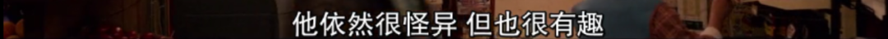
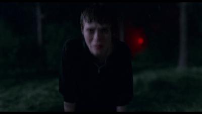
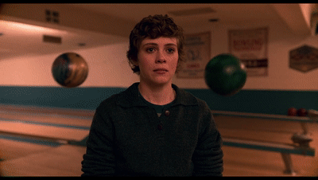
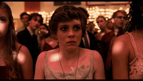
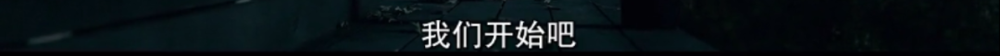

速读摘要

提到近年流行的丧颓系青春剧，《去他*的世界》是怎么也绕不过去的。为了弥补这种失落，也为了能够追上闺蜜的步伐，女主随后也接受了男主斯坦利的示好。爸爸因为自杀而去世，没有留下只言片语，打那以后，女主的情绪才开始变得不稳定，脾气也越来越容易爆发。爸爸未能战胜这种心理创伤，选择了自杀，而能力却遗传给了女儿。正如青春期的很多人一样，女主习惯把自己封闭起来。

原文约 2366  字  | 图片 56 张 | 建议阅读 5 分钟 | [评价反馈](https://static.app.yinxiang.com/embedded-web/clipper/#/Evaluating?d=2020-03-20&nu=83ff3990-db00-4faa-af4f-e65d80bad7c1&fr=myyxbj&ud=58b471&v=2&sig=8FB1937DF3A27ACF34EAC942E8F0E076)

##  超能力版《去他*的世界》，又丧又爽

原创 有部电影 [有部电影]()**
提到近年流行的丧颓系青春剧，《去他*的世界》是怎么也绕不过去的。

这部剧讲述古怪男孩James和叛逆女孩Alyssa离家出走的故事，目前播出了两季，都拥有豆瓣9+的高分。

.jpg)

最近，网飞又推出了一部青春剧，同样走的是丧中带甜、甜中带爽的路线——**《非我所愿》。**

.jpg)

这部剧与《去他*的世界》有着莫大的渊源。

它根据同名漫画改编，原著作者是发表过《去他*的世界》等作品的查尔斯·福斯曼；导演也正是执导了《去他*的世界》的乔纳森·恩特威斯尔。

.jpg)
右一：乔纳森·恩特威斯尔

因此可以想像，这两部剧不仅风格类似，服装道具同款，就连演员气质也十分接近。

女主由《小丑回魂》女星索菲娅·莉莉丝饰演。

.jpg)

而剧中的女主角小希，也活脱脱就是个男版的James。

.jpg)

一方面，她是个不起眼的中学生，总认为自己很糟糕，外界也很糟糕，对家人一肚子牢骚，对他人也是各种看不惯。

.jpg)

另一方面，她又有着异于常人的一面。

每当情绪有波动，比如愤怒、尴尬、害怕时，她就会出现超能力，可以用意念造成惊人的破坏力。

.jpg)

当然，这个能力她没有告诉任何人，只是写在了日记本上。

在生活中，女主只有一个朋友，那就是闺蜜迪娜。

只有和迪娜一起时，她才能敞开心扉，使负面情绪得到释放和舒缓。

.jpg)

然而最近，闺蜜突然告诉她自己正在谈恋爱。

这让女主非常失落，看到闺蜜男友令人讨厌的嘴脸时，她更是烦躁不堪。

一时间意念发作，搞得对方莫名流起鼻血来。

.jpg)

为了弥补这种失落，也为了能够追上闺蜜的步伐，女主随后也接受了男主斯坦利的示好。

.jpg)

两人的进展相当神速，在交往的第一天晚上，就情不自禁地为爱鼓起了掌。

.jpg)

但在女主心中，她真正渴望的并非男主，而是闺蜜。

在一个趴体上，得知闺蜜和男友吵架之后，她情不自禁地亲吻了闺蜜，表达了自己的爱意。

.jpg)

没想到，闺蜜打断了她，并用“我们喝多了”来婉转地表达了拒绝。

.jpg)

这让女主大受打击。

她强忍着激动的情绪，跑到外面的森林里，身体爆发出巨大的冲击波，连周围的树木被连根拔起……

巧的是，这一幕刚好被开车赶来参加趴体的男主撞见。

但他不仅没有一丝的慌张失措，反而表现出了异常的兴奋。他答应女主保守秘密，并提出今后和她一起研究这个超能力。

.jpg)

就这样，两人进行了一番推心置腹的对话。

在了解到情绪波动是诱因之后，男主还成功用激将法，让女主“召唤”出了能力。

只可惜，还没等女主实现对意念的控制，就发生了一件令让她痛苦的事——她撞到了闺蜜男友劈腿，导致了两人分手。

.jpg)

事后，闺蜜男友把这事怪罪在女主头上，跑来威胁她；

.jpg)

而男主也完全沉迷在了对超能力的研究里，把女主搞的心烦意乱。

.jpg)

在这一季的结尾，四个人都来到了返校节舞会上——

女主与闺蜜跳得很嗨，还告诉了男主自己喜欢闺蜜的事实；

.jpg)

但女主不会想到，为了报复，闺蜜男友偷了她的日记，还打算当着所有的人面，公布她的秘密……

.jpg)

这一下把女主给急疯了。就在闺蜜男友即将说出女主具有超能力时，她当场用意念把对方爆了头，一时血浆四溅：

最后，女主鲜血淋漓地离开了返校节，独自一人穿过街道，走入森林，去向了无人所知的地方。

.jpg)

这个结尾，很明显是对《魔女嘉莉》的致敬。

《魔女嘉莉》是史蒂芬·金的小说，被称为青春校园恐怖小说的鼻祖，曾经被多次搬上大小荧幕。今年，FX还将推出一部由它改编而来的剧集。

.jpg)

在《魔女嘉莉》的故事中，女主体内具有女巫血统。

她性格内向，在学校里饱受欺凌，在家里也受到因宗教崇拜而人格扭曲的母亲虐待。

.jpg)

故事的结尾同样发生在一场舞会上，女主被人设计，导致“猪血淋身”。

愤怒之下，她体内的女巫能力被激活，并向所有人展开了报复。

.jpg)

对比来看，这部《非我所愿》的整体架构，与《魔女嘉莉》不乏相似之处。

比如，女主同样天赋异禀，同样与外界有很大的隔阂；她的母亲尽管并不病态，但母女之间也心存芥蒂。

.jpg)

不过，有别于《魔女嘉莉》对宗教、母权和校园霸凌的极端映射，本剧所指向的，却是在生命里无法释怀的那些事情。

.jpg)

剧中有这样一条十分重要的线索，即女主爸爸的自杀。

一年前，爸爸因为自杀而去世，没有留下只言片语，打那以后，女主的情绪才开始变得不稳定，脾气也越来越容易爆发。

.jpg)

在她看来，爸爸的死与妈妈不无关系，所以对妈妈心存不满。

就像弟弟所说，女主似乎总在想法设法让妈妈生气，进一步验证妈妈的不好。

.jpg)

但事实上，爸爸的死另有隐情。

爸爸在婚后曾经参加过陆战队，在战役目睹了伙伴、平民的惨死，并成为了唯一的幸存者。

.jpg)

这种经历，使他产生了严重的战后心理综合症。

他变得多疑、易怒，一生气就不受控制，释放出超能力，进而伤及无辜。

.jpg)

最终，爸爸未能战胜这种心理创伤，选择了自杀，而能力却遗传给了女儿。

.jpg)

在得知这个真相后，女主本想着自己要战胜这种心理困扰，试图以热情、乐观的方式去对待生活和他人。

.jpg)

但这并不容易。

在舞会上，她被闺蜜男友的所作所为彻底激怒，激发出了巨大的能量，仿佛再也无法回头。

.jpg)

在最后一集的结尾处，女主来到森林深处，遇到了一个神秘之人。

他的“症状”也和女主一样，还邀请女主同他一起对抗超能力。

.jpg)

所以，对方到底是谁？超能力的来源究竟是什么？女主的爸爸会不会其实没死？……一切的迷惑，也只能等到第二季中揭开了。

当然，相比爸爸的PTSD，女主的心结除了爸爸之死，更多是来源于青春期所特有的迷茫与烦恼。

因此，本剧的基调虽然颓丧，但却并不沉重。

同《去他*的世界》类似，剧集也采用了轻快的叙事节奏，配以大量有趣而应景的音乐，并通过女主的独白，诠释人物敏感而又脆弱的内心。

.jpg)

正如青春期的很多人一样，女主习惯把自己封闭起来。

她会因为自己的普通而自卑，会因为别人的一句话而失望愤怒，会看不到妈妈的付出并为了一点小事闹脾气。

.jpg)

当闺蜜有了男朋友，她会觉得自己被抛弃了，暗自里数落对方的不好；可一见面了，又忍不住对闺蜜热情起来。

.jpg)

当身上长出青春痘，她会觉得恶心，就连挤痘痘的时候都会心烦意躁，忍不住要超能力暴走。

.jpg)

而当面对愿意和她交往的男主，她虽然嘴上说着没什么大不了，可脸上的笑容又灿烂得难以隐藏。

.jpg)

如此这些，都是人们在青春期里常有的反映，在那个“我即是世界”的时代，我们会放大自身的主观感受，任何看似不起眼的小事，都可能使我们苦恼而难过很久。

.jpg)

另外，除了“青春之痛”这个引人共鸣的主题以外，剧集中还有很多搞笑有趣的段落，对人物的刻画也非常生动。

无论是女主和闺蜜的情谊、女主同男主的甜腻，还是女主弟弟那副“小大人”的模样，都足以让人忍俊不禁。

.jpg)

或许相比《去他*的世界》，这部《非我所愿》少了些开先河的新鲜感，但它同样是部风格鲜明、质量上乘的青春剧，充满幻想又切中现实的要害，让人看到上头。

.jpg)

**经常有人感叹，成年人的世界没有“容易”二字。****跟着这部每集只有二十几分钟的短剧，重回那个无忧无虑却又处处苦恼的青春时代，也不失为一场美好的休憩！**

