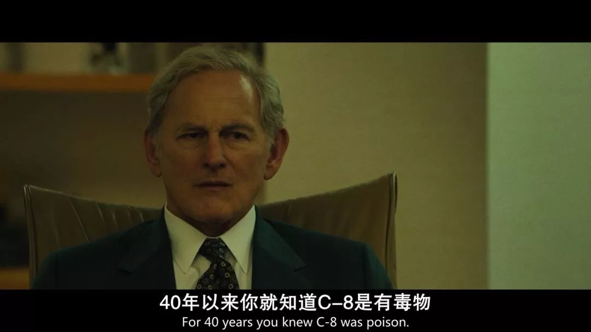

速读摘要

这届奥斯卡，最让人津津乐道的莫过于《寄生虫》斩获最佳影片、最佳导演、最佳国际影片、最佳原创剧本等四项大奖，创造韩国影史记录。一个名叫坦南特的农民，找到身为律师的罗伯特，说杜邦集团将化学物质排放到他家附近的垃圾场，污染了溪水，害死了他的牲畜，希望罗伯特能帮自己打官司。为了找出工人发病的原因，杜邦在其他工人的香烟里掺杂了特氟龙，很快几乎所有工人都住院了。更让人恐惧的是，PFOA不仅存在于特氟龙上，还存在于颜料、布料、雨衣、靴子等与我们的日常生活息息相关的物品上。

原文约 2436  字  | 图片 34 张 | 建议阅读 5 分钟 | [评价反馈](https://static.app.yinxiang.com/embedded-web/clipper/#/Evaluating?d=2020-03-20&nu=22581faf-6d09-46d8-8bea-432c96b40986&fr=myyxbj&ud=58b471&v=2&sig=BF5F7570721225117203B245FA120134)

##  一人对抗全世界，他让这家无良公司赔了几十亿

原创 有部电影 
不久前，第92届奥斯卡金像奖颁奖典礼圆满结束。

这届奥斯卡，最让人津津乐道的莫过于《寄生虫》斩获最佳影片、最佳导演、最佳国际影片、最佳原创剧本等四项大奖，创造韩国影史记录。

人生巅峰也不过如此吧

这个结果，或许会让很多人拍手称快，也会让很多人意难平。毕竟今年入围的影片实在太强了，许多高分佳作都颗粒无收。

但在我看来，今天要聊的这部现实题材佳作，才是这届奥斯卡最大的遗珠——**《黑水》。**

这是一部由《卡罗尔》的导演托德·海因斯执导，马克·鲁弗洛、安妮·海瑟薇、蒂姆·罗宾斯等众多大咖主演的传记片，从主创阵容上看是妥妥的奥斯卡配置。

豆瓣8.4的评分，也足以说明影片在国内观众心中的质量。

片中的故事改编自发表于《纽约时报》上的文章——《那个成为杜邦集团噩梦的律师》，讲的是律师罗伯特·比洛特，凭一己之力揭露杜邦集团化学污染的经历。

杜邦集团是全球数一数二的化工企业，旗下的产品从医疗保健到食品饮料，从工程塑料到电子材料，遍及生活相关的各个行业。

那么，一个小小的律师，要如何和这种巨型企业对抗呢？

故事还得从1998年开始说起。

当时，一个名叫坦南特的农民，找到身为律师的罗伯特，说杜邦集团将化学物质排放到他家附近的垃圾场，污染了溪水，害死了他的牲畜，希望罗伯特能帮自己打官司。

坦南特联系过杜邦公司、州政府和联邦政府，环保署的人也来看过，但后来都没了下文。走投无路之下，他才想到找律师状告杜邦。

一开始，罗伯特感到很为难，因为他是专为化学公司辩护的企业辩护律师，更与杜邦集团关系友好。

但在坦南特的请求之下，罗伯特最终答应抽空去他家看看。

此时的罗伯特万万不会想到，就是这一看，彻底改变了他和无数人此后的人生。

等罗伯特到了坦南特家后，瞬间被眼前的一切惊呆了——

溪边的石头已被化学物质漂白，常年饮用溪水的牲畜不是死气沉沉就是疯疯癫癫，死去的牛都被坦南特埋了起来，一座座坟包触目惊心……

就在他停留期间，还有一头牛当场发病，直接怒气冲冲地朝人冲过来，坦南特不得不再次开枪杀死自己的牲畜……

至此，事情的严重性改变了罗伯特的想法。

他回到公司后向老板报告，说自己想要接下这个案子，向杜邦集团发起控诉。

所幸，罗伯特的老板也是一个有良知的人，他同意让罗伯特放手去干。

但即便如此，以一己之力对抗一家企业巨头，无异于以卵击石。

在查看了杜邦公司的有害废料报告后，罗伯特发现了一种名叫PFOA的物质。

这种物质不仅网上查不到，而且自己和做了多年环境律师的同行们，也都没听说过。

这里必须先提一下，美国是在1976年开始实行《有毒物质控制法》的。当时的环境保护署，只能根据已经被证明有毒的化学物质进行检测，但什么物质被证明有毒，却是化工巨头们说了算。

所以说，杜邦公司即便发现了某种有毒污染物，也完全可以隐瞒真相，绕过环保机构的调查而随意排污。

想到这里，罗伯特向法院要求杜邦公司提供所有关于PFOA的文件。

而杜邦也相当“赏脸”，直接就浩浩荡荡寄来几车文件，摆明了给罗伯特的调查使绊。

但罗伯特并没有被这看似不可能的任务吓倒，而是用几个月的时间，耐心整理着物证。

片中这段他独自一人坐在档案室里翻阅资料的画面，从视觉上就给人带来深深的震撼：

功夫不负有心人，罗伯特最终发现了玄机。

在一名化学专家的帮助下，他得知PFOA是一种可以防水的人造化学物质，一开始被用来制作坦克防水涂料。

后来，杜邦把PFOA重命名为C-8，并开始用它来制造特氟龙平底锅，也就是不粘锅。

正是特氟龙产品的问世，使得杜邦公司声名大噪。

然而没过多久，制造特氟龙的工人，就一个个开始呕吐、发烧。

为了找出工人发病的原因，杜邦在其他工人的香烟里掺杂了特氟龙，很快几乎所有工人都住院了。

而制造特氟龙时排出的灰尘和污泥，又让住在附近区域的民众，大量患上癌症；负责清洗装C-8液体大桶的女工，生下的孩子面部畸形。

很显然，杜邦集团对于特氟龙有毒这件事非常清楚，但他们对内部员工没有任何解释，对外也没有任何警示与声明，因为特氟龙给他们带来的收益每年都有十亿……

四十多年来，杜邦集团每年持续将上百万磅的C-8散入空气，倒入河流。

更让人恐惧的是，PFOA不仅存在于特氟龙上，还存在于颜料、布料、雨衣、靴子等与我们的日常生活息息相关的物品上。

直到今天，PFOA被认为存在于地球上所有生物的血液中。

人体不能分解PFOA，它会永远留在我们体内，传给下一代。

那么，现在已经掌握C-8害人的证据了，可以名正言顺地起诉杜邦了吧？

事情远没那么简单。

杜邦集团有钱有权，几乎所有知情的政府机构、科学家，都为他们办事。

而那些敢于发声控诉杜邦的老百姓，几乎全都遭到了“原因不明”的报复，不是房子被烧，就是被直升机骚扰。

面对这样的困境，罗伯特只能想尽一切办法，孤军奋战。

看到这里，不难发现《黑水》的剧情很容易让人想起同样是马克·鲁弗洛主演的《聚焦》。

那部影片同样是改编自真实社会事件，讲述几名记者克服重重困难，调查天主教性侵丑闻的故事。

但与《黑水》不同的是，《聚焦》是群戏电影，剥开宗教系统腐朽内里的，并非一人之功；而《黑水》中揭开杜邦集团的“黑色水域”，几乎只靠罗伯特一人之力。

罗伯特用他职业生涯的20年来调查杜邦集团，这20年里，他从一开始刚升任律所合伙人的意气风发，到后来面临四次降薪，工资只有原来的三分之一；

从别人眼中的模范丈夫，到后来因为一心扑在案子上，妻子只能“丧偶式育儿”；甚至还因为工作压力过大，年纪轻轻就患上了中风……

那么，罗伯特又在这几十年里得到了什么呢？除了“行业毒瘤”的称号，他什么也没有得到。

但即便如此，他仍然不曾想过停止战斗。

影片主演马克·鲁弗洛与真实的罗伯特·比洛特

在影片的最后，罗伯特顶着巨大压力，花7年时间完成了对小镇7万居民的血液检测，成功验证了PFOA的毒性。

按照协议，杜邦集团必须为每个居民承担终身医疗监护，病人可以获得赔偿。

但谁也没想到，当天晚上，杜邦就撕毁了协议，拒绝承担责任。

那些患病的居民想要获得赔偿，必须一个一个地来打官司……

整体而言，《黑水》是一部非常工整的传记片，剧情完整还原了事件经过，传递给观众的情感与力量也真挚而动人。

当时间已经来到2015年，距罗伯特最初接下此案，已过去了17年。

在起诉杜邦集团的法庭上，法官看着罗伯特有些惊讶地问道：“啊，你还在这里？”

罗伯特则坚定地回答道：**“我还在这里。****”**

我相信看到这一幕的人都会热泪盈眶，为那些被杜邦毒害的人们终于能够找回公道而欣慰，也为罗伯特十几年如一日的坚持而感动。

**杜邦集团最终赔偿3535例案件，累计6亿7070万美元。**

**这过程中，罗伯特不是没有过挫败感，也不是没想过放弃，但他选择了继续抗争，选择了一条少有人走的路，虽千万人吾往矣。**

**所以说，哪有什么胜利可言，但永不妥协就意味着一切。**

