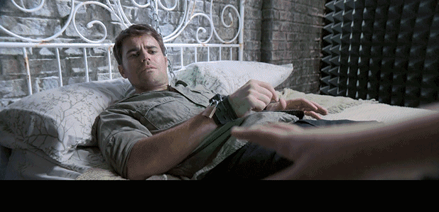

速读摘要

电影人们却总是热衷于解读童话中的阴暗面，拍出一部又一部"毁童年"的黑暗童话。以艾什莉为中心的这部分情节，灵感就来源于《美女与野兽》，只不过在这个故事里，美女与野兽都是她自己。但麦蒂并不知道，这个奥利维亚其实此刻正被塔克用锁链囚禁在地下室里!他到底会不会和制造汽车炸弹谋害艾什莉的凶手有关联呢?总的来说，这部《黑色童话》确实把我们耳熟能详的童话，以非常别致的方式呈现了出来，不仅风格更惊悚暗黑，而且时时有悬念、处处有反转，各种神展开让人看得欲罢不能。

原文约 2302  字  | 图片 32 张 | 建议阅读 5 分钟 | [评价反馈](https://static.app.yinxiang.com/embedded-web/clipper/#/Evaluating?d=2020-03-20&nu=4167f748-0ad3-4b0c-a555-c8de18e1549c&fr=myyxbj&ud=58b471&v=2&sig=079C8B60FEAD9F9629C53C7003EBACEE)

##  少儿不宜的黑色童话，成年人也要父母陪同观看

原创 有部电影 [有部电影]()**
一直以来，童话故事都是人们成长过程中不可或缺的一部分。

但电影人们却总是热衷于解读童话中的阴暗面，拍出一部又一部“毁童年”的黑暗童话。

.jpg)

今天就给你们安利一部口碑不错的剧集，它将经典童话改编成颠覆性的现代成人寓言，看完令人耳目一新——**《黑色童话》。**

.jpg)

这是一部系列剧，由CBS电视台出品，目前已经出到第二季。

每季主打三个童话，比如第一季讲的是《三只小猪》《糖果屋》和《小红帽》的故事：

.jpg)

而今天要聊的第二季，改编的则是我们更为熟悉的《灰姑娘》《睡美人》和《美女与野兽》。

故事要从一个明星家族讲起，女主角艾什莉是一位当红歌手，妈妈瑞贝卡是她的经纪人。

.jpg)

她还有哥哥和姐姐，姐姐麦蒂是事业有成的律师，刚跟男友订婚不久；

.jpg)

哥哥杰克逊是她的吉他手，也是个不折不扣的渣男，不仅酗酒成瘾，还喜欢勾搭有夫之妇，经常为此打架闹事被拘留。

故事一开场，展现的就是律师姐姐把渣男哥哥从局子里捞出来的情景。

.jpg)

虽然经常会发生这样的小插曲，但总体而言，艾什莉一家仍是光鲜亮丽的明星家庭。

他们是社会名流，一直过着童话般的奢华生活。直到有一天，艾什莉在自己的专辑发布会现场，被汽车炸弹烧伤毁容。

.jpg)

这起事件一度成为公众关注的焦点。

在毁容后，艾什莉不得不戴上面具，等待皮肤移植和整容手术。由于声带受损，她可能也无法继续唱歌……这种恐惧渐渐将她推向了崩溃的边缘。

.jpg)

而那个放炸弹的凶手，还一直没有找到。

于是，妈妈给她雇了个保镖。很长一段时间，艾什莉都在保镖的严密保护下足不出户，如同一个被囚禁的公主。

.jpg)

没错，以艾什莉为中心的这部分情节，灵感就来源于《美女与野兽》，只不过在这个故事里，美女与野兽都是她自己。

.jpg)

原本才华横溢、歌喉美妙的她，不仅无法面对毁容的自己，更被内心的恐惧和自卑牢牢禁锢。

而随着剧情的展开，“灰姑娘”和“睡美人”也渐渐浮出了水面。

首先，是杰克逊交往的新女友西蒙妮。

.jpg)

这个女孩自幼丧母，作为酒庄老板的父亲娶了一个继母，还给她生了两个弟弟。

继母对她非常刻薄，两个弟弟也总跟她过不去……很显然，西蒙妮是灰姑娘，她势必将与邪恶继母展开对抗。

.jpg)

最近，西蒙妮正值壮年的父亲，突然意外去世。

匪夷所思的是，父亲在遗嘱中把所有家族财产全都留给了继母和两个弟弟，好像把她这个亲女儿给忘了。

.jpg)

这顿时就让她嗅到了一丝阴谋的味道，不由得怀疑父亲是被继母害死的。

为了证实这个猜测，她必须找到有力的证据。为此她还找到两个帮手，一个是男友杰克逊，另一个就是她的教母。

.jpg)

而在神队友教母的帮助下，西蒙妮果然很快发现了继母曾经出轨的端倪，并准备顺藤摸瓜，展开她的反击……

.jpg)

看到这里，我们不难发现，这部剧其实是对经典童话进行解构，以相似的设定和主题框架讲述不同的故事。

在这一季中，每个故事虽然都与艾什莉一家有所关联，但彼此之间也保持相对独立，由此分出三条叙事线。

.jpg)

而相比前两个故事，第三个关于“睡美人”的故事，则改动更大，剧情也更加黑暗惊悚。

这个故事跟姐姐麦蒂有关，不过“睡美人”指的并不是麦蒂，而是她的未婚夫塔克。

因此也可以说，这是一个“睡美男”的故事。

.jpg)

塔克是个小有名气的作家，原本跟麦蒂非常恩爱，但最近却有些不对劲。他整日整夜地睡不着觉，经常把自己关在房间写小说，对麦蒂也异常冷淡。

一天，麦蒂在塔克家里发现了一个名叫奥利维亚的女人的电话，怀疑他出轨了。

.jpg)

但麦蒂并不知道，这个奥利维亚其实此刻正被塔克用锁链囚禁在地下室里！

塔克还一直把她唤作“安娜”：

.jpg)

看到这里，估计有人会猜测塔克是个SM死变态，或是和“安娜”在玩什么禁室培欲游戏。

但事实上，真相比这个更诡异——

原来，塔克小时候有一个双胞胎姐姐，就叫安娜。安娜从小和他心灵相通，形影不离。塔克必须要睡在安娜身边，才能安然入眠。

然而在他9岁时，安娜不幸掉进湖里淹死。

从那以后，塔克再也没有睡过一个好觉，还经常做梦梦到安娜。

这种长期的煎熬和对姐姐的病态迷恋，渐渐使塔克的心灵扭曲，所以他绑架囚禁了奥利维亚，每晚把她迷晕后，就将她想象成安娜，睡在她的身边……

.jpg)

与此同时，他还把观察奥利维亚被囚禁的状态，作为自己的创作灵感，写进小说里。

更令人细思极恐的是，在奥利维亚之前，塔克已经囚禁并杀害了两名女子…..

.jpg)

除了这些黑暗扭曲、充满猎奇元素的情节之外，这部剧还利用层层铺垫的悬念，制造出各种反转给观众带来惊喜。

比如有个疯狂粉丝，喜欢一边听艾什莉的歌曲一边自残，以得到某种变态快感，后来他甚至试图绑架艾什莉。

.jpg)

那么，他到底会不会和制造汽车炸弹谋害艾什莉的凶手有关联呢？

比如，在西蒙妮和继母较量的过程中，热心帮助她的教母，一度也显得非常可疑。

她不仅知道西蒙妮父亲最私密的保险柜密码，连继母出轨的照片资料，也是她故意透露给西蒙妮的。

.jpg)

那么她到底是如假包换的“神仙教母”，还是背后另有什么黑暗阴谋呢？

还比如，囚禁并残害少女的“睡美男”塔克，没能一直称心如意。因为奥利维亚也是个深藏不露的狠角色，那么她有没有可能成功逃脱密室、甚至对塔克施加报复呢？

.jpg)

总的来说，这部《黑色童话》确实把我们耳熟能详的童话，以非常别致的方式呈现了出来，不仅风格更惊悚暗黑，而且时时有悬念、处处有反转，各种神展开让人看得欲罢不能。

而这种串烧式童话改编，也让我想到一部奥斯卡提名的高分动画短片《反叛的童谣》，之前我给大家详细聊过。

.jpg)

这部动画在短短50多分钟里，串起了《格林童话》里白雪公主、小矮人、小红帽、大灰狼和三只小猪的故事。

其剧情新奇大胆、形式别具一格，而且片中的所有台词都押韵、所有情节都反套路，结局又在“毁童年”的暗黑气质下，埋藏了意料之外的温暖与美好，给人很大的惊喜。

.jpg)

而今天这部《黑色童话》同样如此，它在复仇、谋杀、囚禁等看似扭曲阴暗的主题中，凸显的是现代人在人际关系、秘密隐私和物质欲望之间，苦苦挣扎的焦虑与煎熬。

.jpg)

虽然具体情节已被改头换面，但剧中的几个故事与我们熟知的经典童话，所传达的思想内核却是高度一致的。

不论是囚禁别人却被腹黑少女缠上的“睡美男”、努力调查父亲去世真相的“灰姑娘”，还是试图走出爆炸事件阴影的野兽美女，每一个故事都在从反面警示我们——对童话的憧憬、对美好生活的向往，绝不能建立在伤害别人的基础之上。

**现实生活中，每个人都有难以诉说的秘密和令人伤痛的记忆。****但人生的意义，从来不是禁锢在过去中顾影自怜，更不是用伤害别人的方式来给自己疗伤。****我想，明白了这一点才不枉为成年人，才算是真正看懂了童话。**

也许是国内最认真的电影自媒体
长按扫描二维码关注

在看