## 这部现代版《1984》，暗喻与讽刺无处不在，只有500人标记

原创 有部电影 有部电影 *今天*

最近发现一部冷门老片，豆瓣上只有500来人标记看过，但却打出8.2的高分，还有网友评价它说是“现代版《1984》”。

  

今天就给大家聊聊——**《盲者之国》。**

  

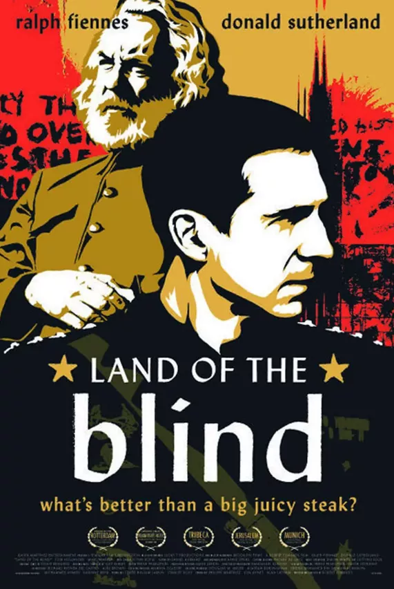

  

影片的故事与乔治·奥威尔的《1984》一样，发生在一个极权国家，统治者麦西米伦二世刚刚继承父亲的衣钵。

  

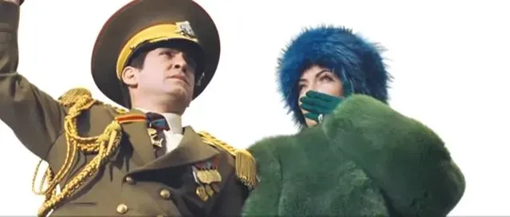

  

但他对统治国家毫无兴趣，而是一心扑在电影圈，每隔一段时间就会拍出一部烂片，并且仰仗统治者的权力，强行操控电影的剪辑权。

  

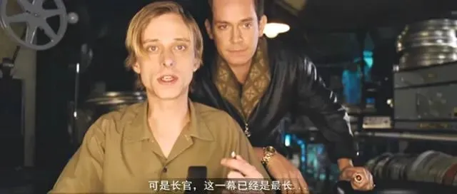

  

至于国事，麦西米伦二世要么全权交给两个二流的顾问，要么直接让三流演员出身的妻子算卦定夺。

  

总之，治国理念就是“逆我者亡”，用暴力镇压平息一切。

  

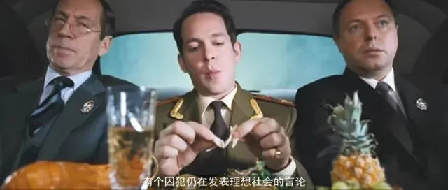

  

在这种高压之下，民间诞生了反抗组织，首领是一个叫索隆的长者。

  

他原本是个编剧，因为写了个批判国家的剧本，被麦西米伦二世打入大牢，每天惨遭酷刑折磨。

  

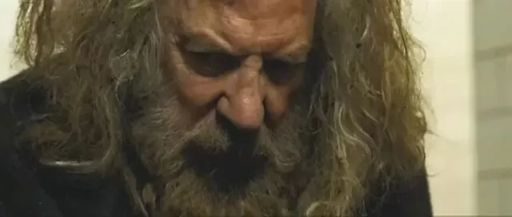

  

即便如此，索隆依旧暗中策划各种民间暴动，是反抗组织不可动摇的精神支柱。

  

拉尔夫·费因斯饰演的男主乔，便是夹在统治者和恐怖分子之间的狱警，专门负责看管索隆。

  

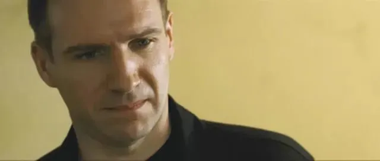

  

他与《1984》中的温斯顿一样，是个身处极权社会，却具有独立思考能力的清醒之人。

  

一方面，他在服从命令的同时，看到了麦西米伦二世的残暴与无能，国家日渐一蹶不振；

  

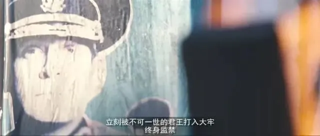

  

另一方面，在与索隆的接触中，他也认清了反抗组织的恐怖主义本质。

  

但在不知不觉中，乔被索隆的人格魅力征服，开始质疑当权者的统治。

  

很多时候，他总是夹在中间犹豫不决，既不肯对虚弱的索隆施加酷刑，也不认同索隆指挥的暴动就是正义。

  

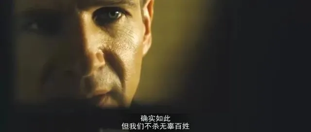

  

之后的几年里，反抗军与政府之间的冲突越发升级，索隆的势力渐渐渗透到了财阀高层，得到了一笔竞选资助，“释放索隆”的呼声越来越高。

  

麦西米伦二世对此无心应对，草草接受了顾问的建议，把索隆放了出来，觉得只要他再搞暴动，就能趁机抓住把柄，一举捣毁反抗军。

  

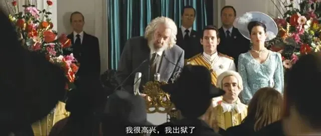

  

然而他们都没有想到，麦西米伦身边，已经有了乔这个“叛徒”。

  

  

此时的乔已经晋升为总统护卫。

  

在过去几年里，他加入了秘密反恐部队，专门剿灭反抗军，同时也暗中与索隆保持着书信来往。

  

当他亲眼看见麦西米伦恼羞成怒、杀死身边的顾问时，便认定自己深爱的国家，已经岌岌可危。

  

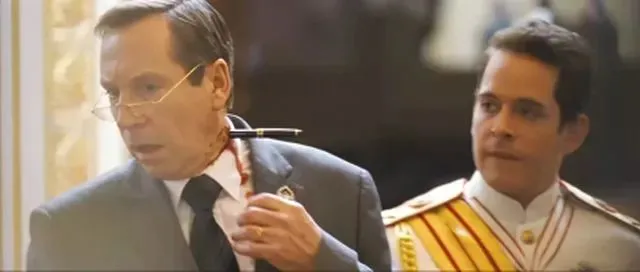

  

于是某天晚上，乔带着索隆的部队闯入了麦西米伦二世的房间，当场抓包他与妻子玩羞耻play。

  

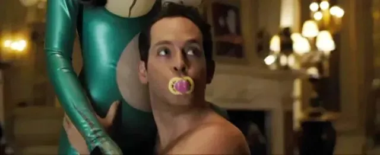

  

索隆和部下们对夫妻俩进行了冠冕堂皇的审讯，将他们就地枪决。

  

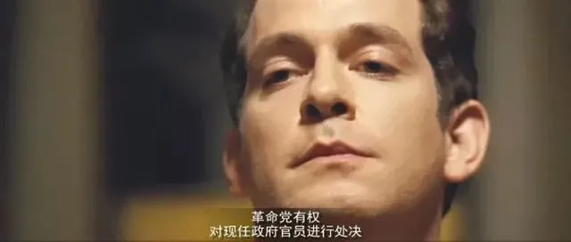

  

之后，反抗军掌控了国家政权，索隆成为了新统治者。

  

**但让乔没有想到的是，国家并没有因为新政权上台而变得更好，反而遭受了更严酷的统治。**

  

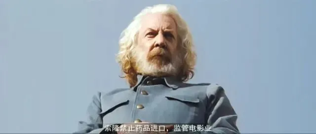

  

索隆规定，民众一律戒掉荤食，食物由国家统一分配；

  

女性在公开场合必须穿长袍，儿童出生后即要与父母分离；

  

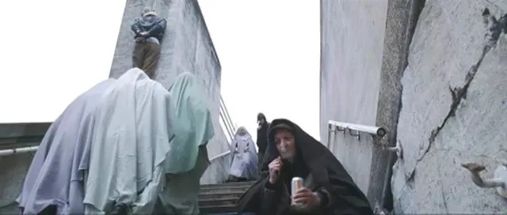

  

医院被撤销，大学被取缔，凡是戴眼镜的人，都会被当成知识分子送去洗脑再教育；

  

至于实在顽固不化的人，就直接抹除他们存在过的痕迹……

  

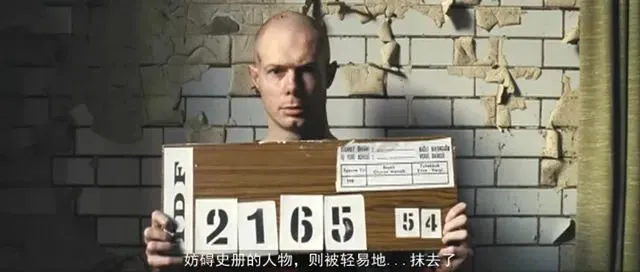

  

最让乔无法接受的是，索隆之前把国家沦陷的根源，算在麦西米伦二世的头上，但如今他自己也变成了暴君，甚至企图通过延期大选的手段，保住自己的统治地位。

  

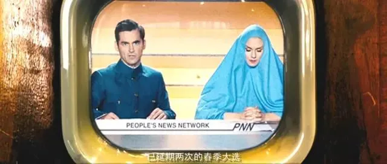

  

看到这里就会明白，为什么会有人认为这部电影是现代版的《1984》了。

  

片中有许多细节，与奥威尔构建的反乌托邦社会高度相似。

  

比如片中提到的精神洗脑，就与小说里那句**“谁控制过去就控制未来，谁控制现在就控制过去”** 的思想不谋而合——

  

“面包干比‘什么都没有 ’强，‘什么都没有’比牛排强，所以面包干比牛排强。我们是人，不准吃肉……”

  

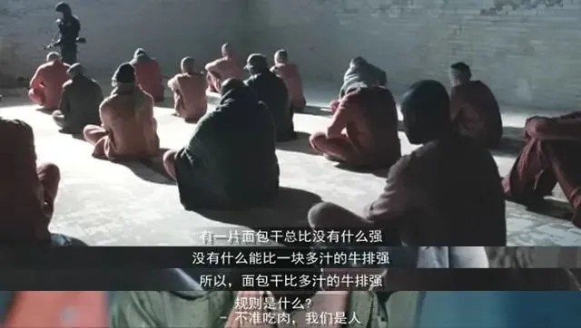

  

比如索隆统治下的国家，和《1984》里描绘的一样，推崇子女举报父母，并以此为荣。

  

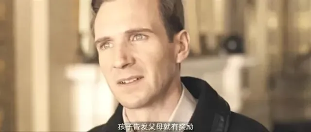

  

男主也和小说的主角一样，在看透索隆的极权统治后，准备把一切如实记录下来。

  

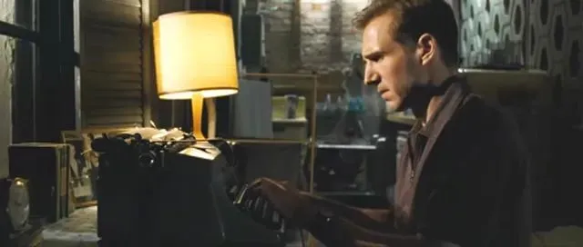

  

不过，比起《1984》当年带给世人那种预言般的震撼，今天说的这部《盲者之国》，更多的是直指现实。

  

片中索隆实施的极权镇压，有些正在世界范围内上演。

  

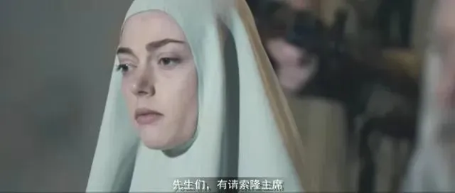

  

男主乔就是带领观众，认清极权本质的一个关键人物。

  

通过他的视角，索隆身上的双面性，也被完整地刻画了出来。

  

在乔还是狱警的时候，他曾与坐牢的索隆讨论过暴力手段的问题。

  

当时，索隆坚称自己的行为是出于无奈而起的反抗，本质上与警察执法时需要动用武力，没有任何区别。

  

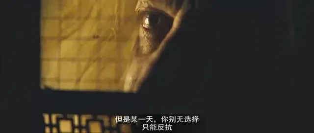

  

出狱后，索隆一再拉拢乔，话术十分具有煽动性：**什么是人道主义？是发动战争让百万人民当炮灰，还是干掉极个别人、用极小的代价换取自由？**

  

这种简单粗暴美化暴力的说辞，一下说服了犹豫不决的乔。

  

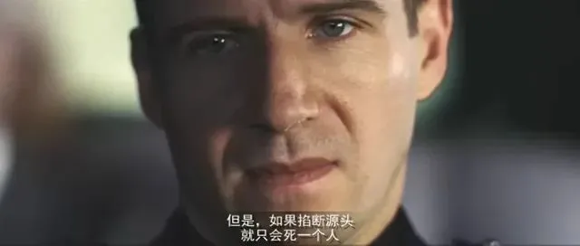

  

然而真的成为统治者后，索隆却摇身一变成为了独裁者，冠冕堂皇地为自己开脱，说一切政策都没有超过道德底线……

  

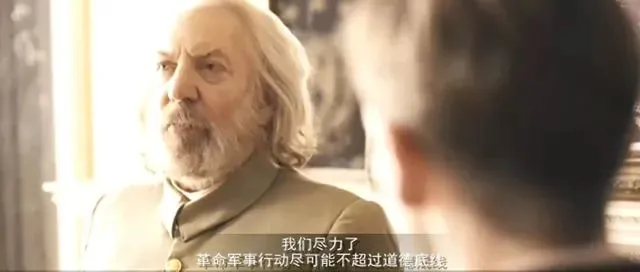

  

电影的片名Land of the Blind，取自一句谚语**In the land of the blind, the one-eyed man is King（盲人之国，独眼称王）**，说的正是片中那个命途多舛的国家，到处都是盲者，所以才一次次被独裁者控制。

  

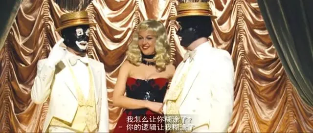

  

**另一方面，“盲者”也指代盲人摸象的典故。**

  

片中不时就会出现大象的镜头，**暗指这个国家的百姓如同摸象的盲人一样，感受到、理解到的，仅仅是极权统治的一小部分。**

  

因为被象牙刺伤，就去拥抱柔软无害的象鼻子，但本质上依旧活在大象的阴影之下。

  

  

而盲者之国里唯一的明眼人，就是男主角乔。

  

他希望能够说服索隆，停止那些不必要的镇压，没想到却被索隆要求签“效忠协议”。

  

乔断然拒绝，因此被送进监狱接受“改造”。

  

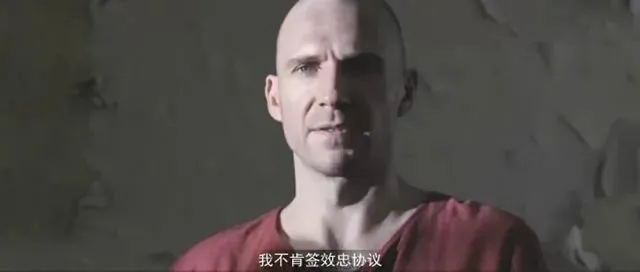

  

这个情节也是整部电影里最大的一处讽刺：**昔日的革命者成为独裁者，而曾经的“革命英雄”变成了阶下囚。**

  

乔进入监狱后，等待他的是一次“记忆清除”。

  

他必须承认，索隆刺杀麦西米伦二世的事压根不存在，他也从未加入过秘密反恐部队，更没有晋升为总统护卫，而是正常退伍，之后结婚生子又离婚，因为与政府对抗而被捕，与索隆并不认识……

  

否则，迎接他的将是一顿毒打与暗无天日的禁闭。

  

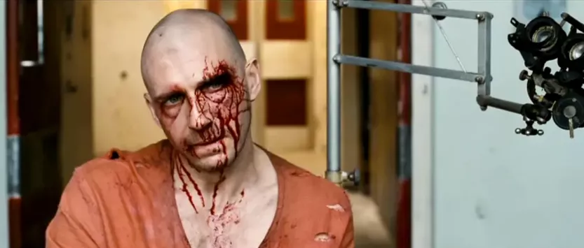

  

不过，就在他被审讯期间，国家又迎来一次翻天覆地的剧变——

  

索隆遭到暗杀身亡，麦西米伦二世的家族成员卷土重来，选出新的总统夺回了政权，之前的反抗军立刻被剿灭。

  

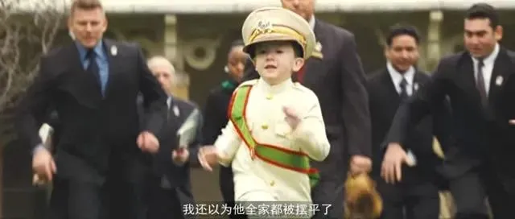

  

乔虽然不再被索隆的势力控制，但他因为刺杀麦西米伦二世，成为了监狱里唯一的犯人。

  

影片结尾，乔继续用打字机记录着他记忆中的一切……

  

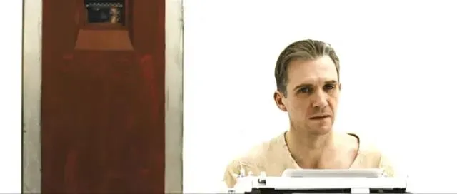

  

这个结局虽然不如小说《1984》那样令人不寒而栗，但影片还是在有限的篇幅内，刻画了一个国家经历的几次政权交替，并通过男主角的视角去反思现实中的自由、民主与正义。

  

尽管反乌托邦作品中，那种极端黑暗的极权社会都是出自构想，但我想，这些作品存在的意义，就在于通过描绘未来社会的可能性，对现下的人们发出一记警示。

  

**因为很多时候，极权的阴影从未彻底离去，它就根植于人性的阴霾之中。**

  

**只有当大多数人都能像主角那样谨记历史、时刻保持清醒的头脑，我们才不至于陷入“乌托邦社会”的陷阱、在历史的轮回中不断重蹈覆辙。**

  

也许是国内最认真的电影自媒体

长按扫描二维码关注 

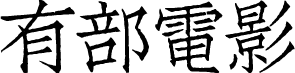

  

  

**点个在看呗**  

微信扫一扫  
关注该公众号