速读摘要

除了精彩刺激的比赛场面，超级碗最让人津津乐道的，就是被誉为"美国春晚"的中场秀。《神奇女侠1984》是2017年《神奇女侠》的续集，定档北美6月5日上映。照明动画通过小黄人电影开创了贱萌这一独有的动画类型，赚得盆满钵满，随后的《欢乐好声音》和《爱宠大机密》都延续了贱萌风格。看完30秒预告，已经提前锁定为我的年度必看动画了。不过很多人最期待的，是金·凯瑞饰演的反派弹头博士。

原文约 3276  字  | 图片 64 张 | 建议阅读 7 分钟 | [评价反馈](https://static.app.yinxiang.com/embedded-web/clipper/#/Evaluating?d=2020-03-20&nu=698b22e7-1f69-4b65-bb96-c945580b79e2&fr=myyxbj&ud=58b471&v=2&sig=9D38418237FD7E0401E16C786733A2E3)

##  坐稳了，前方一大波热辣猛片来袭！

原创 有部电影 [有部电影]()**
昨天一大早，“超级碗”登上了微博热搜。

超级碗是美国一年一度的职业橄榄球冠军赛，其火爆程度相当于美国“世界杯”。

不过除了精彩刺激的比赛场面，超级碗最让人津津乐道的，就是被誉为“美国春晚”的中场秀。

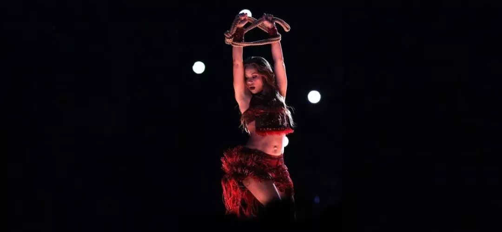

今年的中场秀，夏奇拉和詹妮弗·洛佩兹两位拉丁天后的同台热舞，堪称顶级视觉盛宴，嗨翻全场。

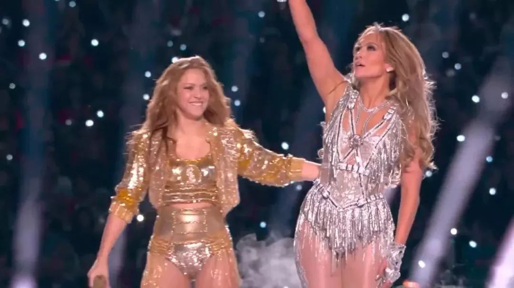

不过，影迷们更关注的，是另一场不容错过的视觉盛宴——**2020年热门电影预告片。**

没错，每年的超级碗，好莱坞各大厂商都会斥巨资买下黄金广告时间，祭出旗下重磅电影的最新预告。

所以今天，我们不妨就带着看中场秀的心情，一块来看看2020年超级碗上亮相的10部好莱坞大片吧！

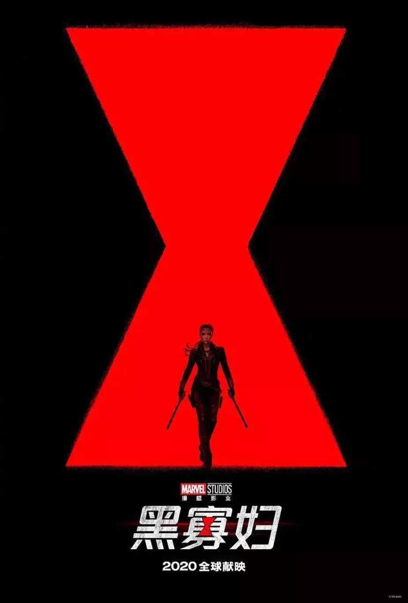

作为漫威宇宙第四阶段的开启之作，《黑寡妇》从立项之初就备受关注。

但对绝大多数观众来说，这部影片最大的情怀，在斯嘉丽·约翰逊和黑寡妇这个角色身上。

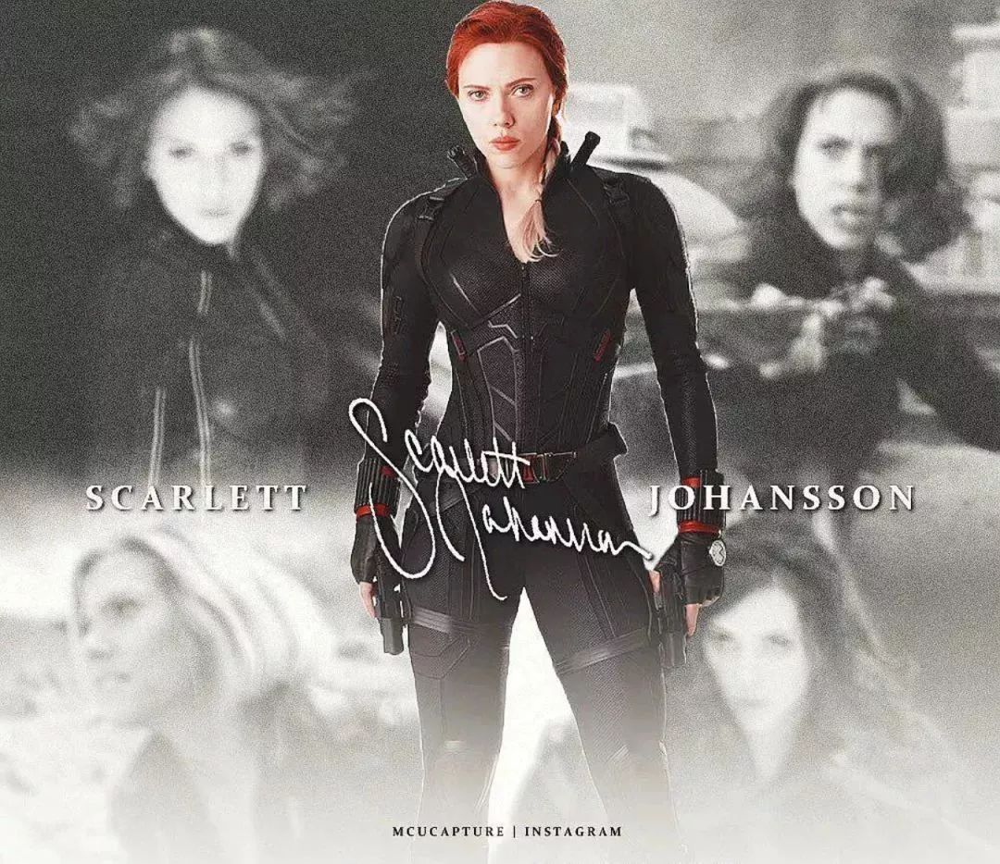

2010年，斯嘉丽在《钢铁侠2》中首次出场，由此加入漫威宇宙。

当时她26岁，如今36岁，“黑寡妇”这个角色，不知不觉就演了10年。

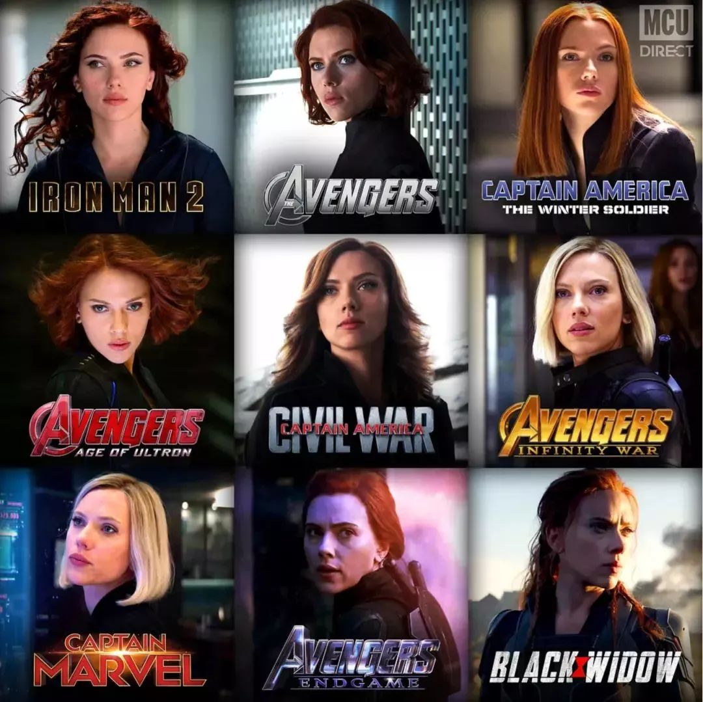

可以说，斯嘉丽把一个女演员最好的时光都献给了漫威，在主线故事中牺牲后，终于迎来了单人电影，让人感慨万千。

《黑寡妇》的时间线设定在《美队3》之后，《复联3》之前，故事聚焦于寡姐遭受苏联间谍组织“红房子”的追杀与逃亡。

红房子是克格勃下属的秘密组织，专门把孤儿女孩训练成特工，这些女特工的代号就叫黑寡妇。

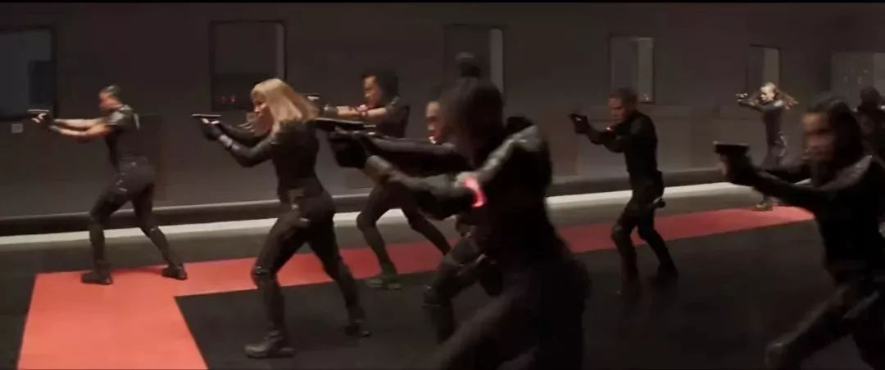

寡姐在成为复仇者之前，便是红房子组织的一员。在那期间，她遭受了严酷的精神洗脑和身体压迫，甚至被剥夺了生育权。

因此在这部影片中，寡姐将直面自己最黑暗的记忆，向我们呈现她成为黑寡妇的心路历程。

从预告来看，这是一部充满情绪爆点和大场面动作戏的间谍惊悚片，剧情涉及《复联》系列多次提起的布达佩斯往事。

目前，影片定档5月1日北美上映，期待寡姐的“重生”归来！

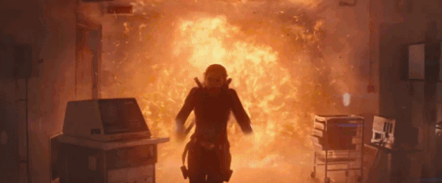

有漫威，自然少不了DC。

《神奇女侠1984》是2017年《神奇女侠》的续集，定档北美6月5日上映。

曾几何时，作为正联三巨头之一的神奇女侠，是救活DC宇宙的大功臣。如今，在DC宇宙规划混乱，《海王》《小丑》接连大爆的势头下，《神奇女侠1984》再次被寄予厚望。

顾名思义，影片设定在冷战晚期的1984年，故事承接第一部中那句催人泪下的台词，“我拯救今天，你拯救世界”。

今天也许只有一次，但拯救世界却是神奇女侠永远的职责。

预告片中首次亮相的金鹰战甲，变身方式非常酷炫，还大大加强了女侠的战斗力，让人非常期待成片的动作戏效果。

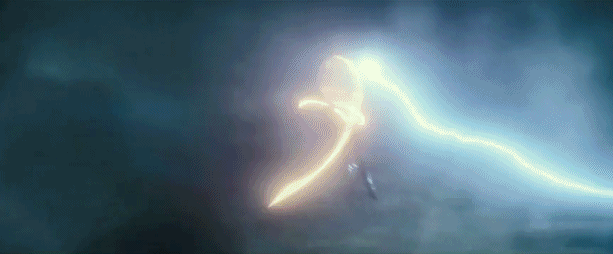
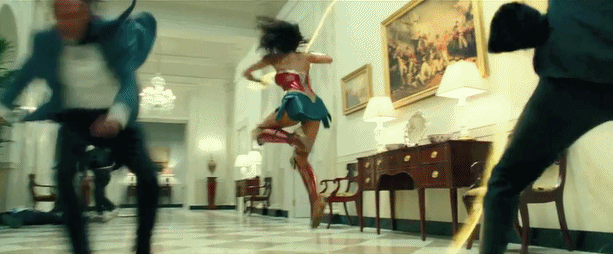

除此之外，影片的另一个看点是男主角史蒂夫的回归。

在预告中，他不仅成功复活，与戴安娜再续前缘，还继续和戴安娜并肩作战。

虽然CP粉是嗑到了，但话说回来，毕竟上一部的救世宣言和悲壮牺牲已经赚足了眼泪，如果回归方式没有合理解释，很难令人信服。

希望《神奇女侠1984》不会辜负大家的期望吧。

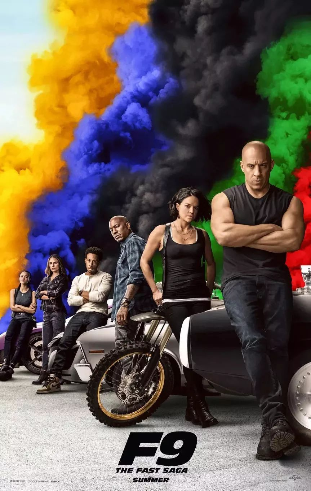

海报有点一言难尽，但这丝毫不影响《速激9》的排面，它可以说是当今好莱坞大片的代名词了。

这个系列的制作理念，跟奥运会的口号是一样的：更快、更高、更强！

而在预告片中，这次飞车家族也是真的飞上天了：

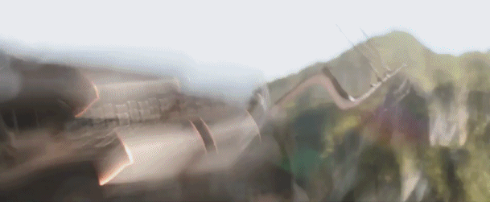

作为顶级爽片的标杆，《速激9》的动作戏、视听特效和追车场面从来不用担心，上天下海没有他们做不到的。

只是在情节设计和情感塑造方面，可能会有些老套，让人略感疲劳。

比如，这次又冒出一个新角色——约翰·塞纳饰演的唐老大的弟弟，本片的剧情就围绕着兄弟间的多年恩怨展开。

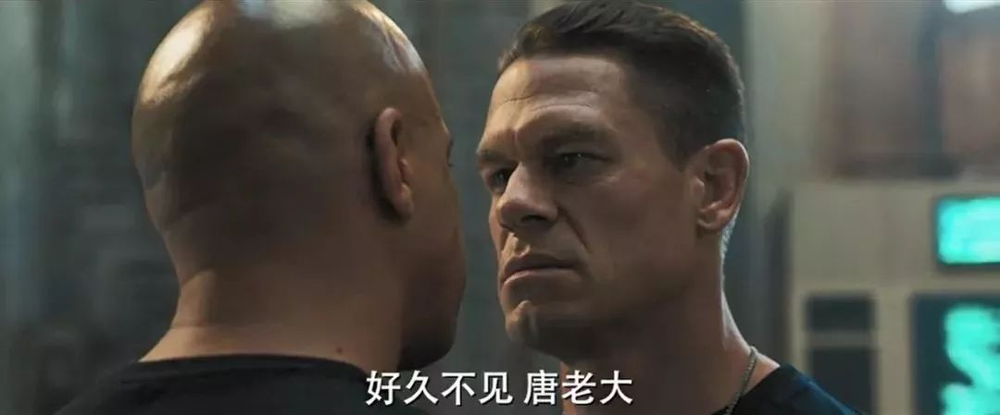

而此次超级碗预告最大的惊喜（吓），则是人气角色韩的复活&回归！

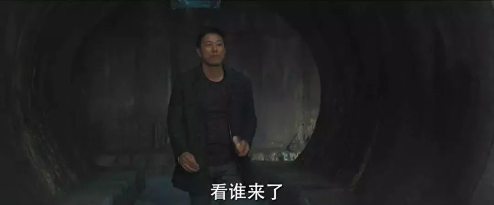

盖尔·加朵的男友都有复活技能？？？

同样是死亡角色复活，想必还得给观众一个合理交代。

不过，看《速激》不能对剧情要求太多，爽就完事儿了！

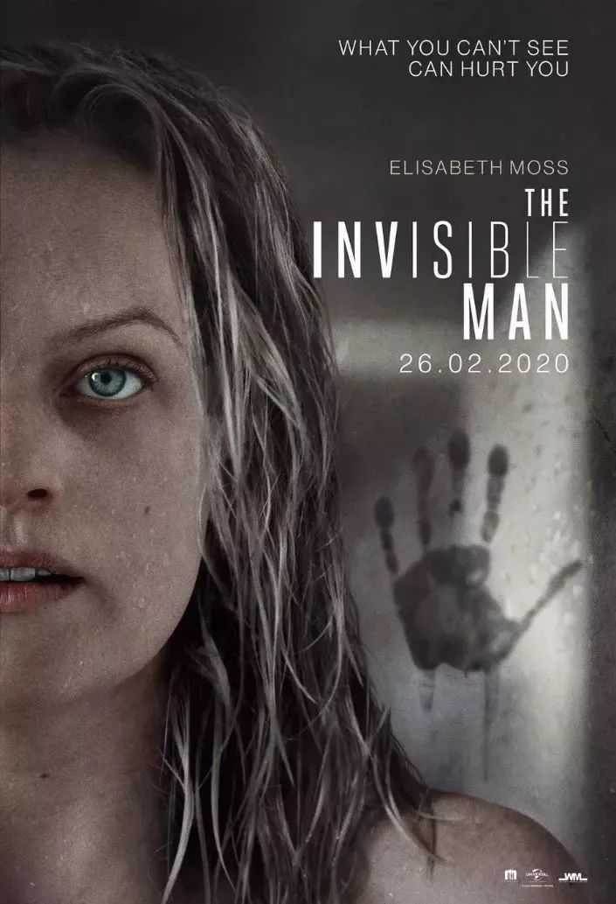

隐形人是一个经典的恐怖片IP，其形象出自英国科幻小说家赫伯特·威尔斯的同名小说，自1933年的第一部起，至今翻拍了十几次。

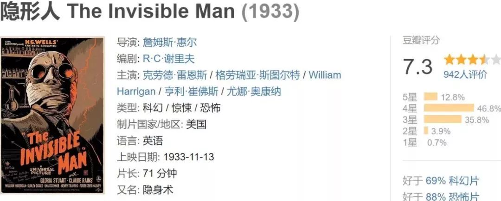

而今年这部《隐形人》，也是大有来头。

2017年，环球影业抄漫威和DC的作业，搞出了一个“环球黑暗宇宙”的概念，把木乃伊、德古拉、范海辛、狼人、隐形人、变身博士、科学怪人等经典恐怖片角色拉到一个世界观里，打造成一个黑暗惊悚的电影宇宙。

计划之初非常吸引人，由阿汤哥主演《木乃伊》，德普主演《隐形人》，罗素·克劳主演《化身博士》，哈维尔·巴登主演《科学怪人》……可谓大牌云集。

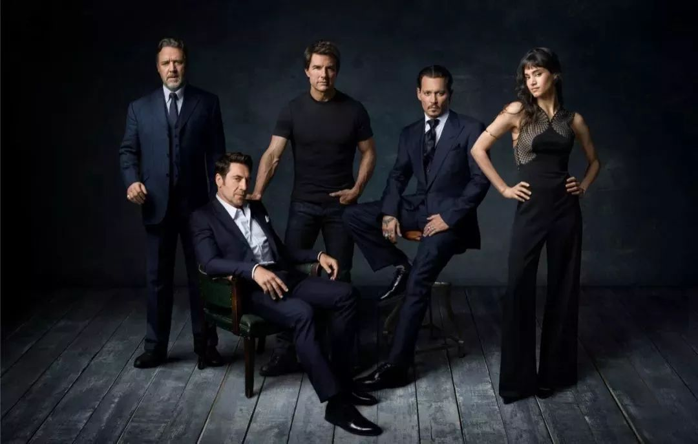

然而结果大家都知道，阿汤哥打头阵的《新木乃伊》扑得亲妈不认，环球见“坏”就收，搁置了黑暗宇宙计划。

现在看来，环球并没有完全放弃，而是转向走小成本精品路线。

这部《隐形人》即是战略转型的第一部，原定主演的德普退出，由《使女的故事》女主伊丽莎白·莫斯担纲主演。

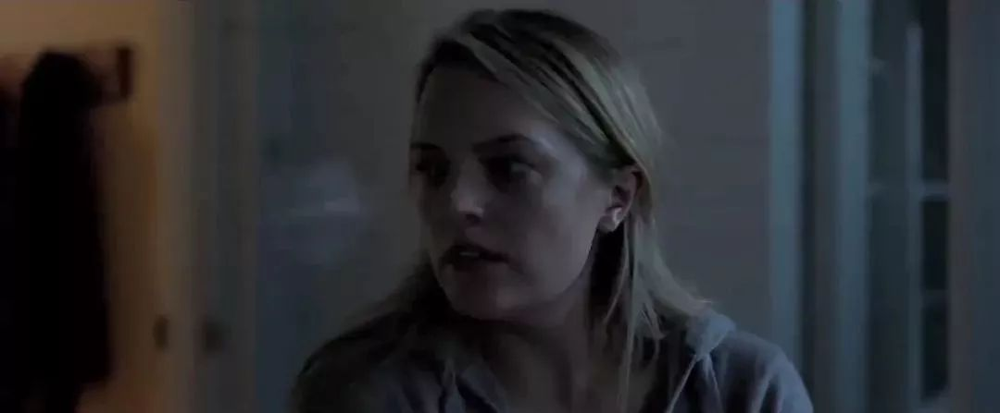

故事脱胎于原著小说，只是以女主的视角来展现隐形人。

女主的男友是个虐待狂科学家，她几经艰辛才逃脱魔掌，后来得知男友自杀身亡，但怪事却接连来袭，经常上演“鬼上身”现场……

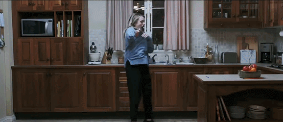

从预告片来看，恐怖、压抑的氛围塑造非常到位，让人毛骨悚然。

好消息是这部影片北美定档2月28日，我们也很快就能一探究竟了。

**
**

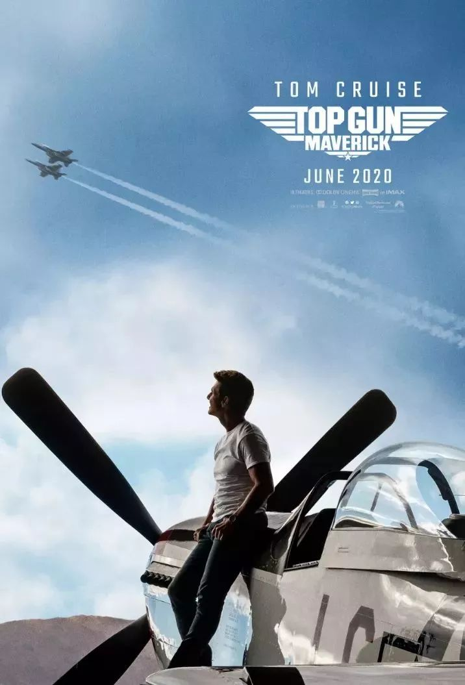

又一部年度必看之作！

1986年，23岁的阿汤哥靠《壮志凌云》里英姿勃发的飞行员一炮而红。

他用独行侠这个角色点燃了美国年轻人的飞行员梦想，影片不仅大卖3.57亿美元，还是迄今为止最牛的征兵广告。

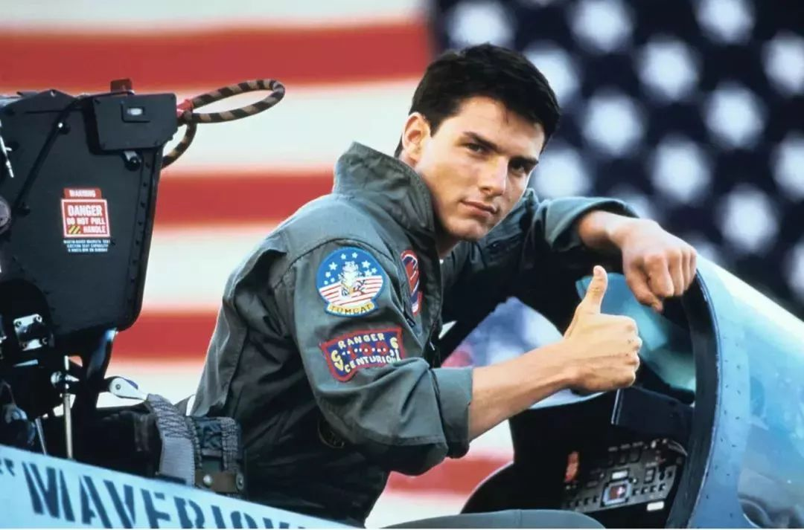

据说当年影片上映时，出现了美国空军和海军在影院门口抢人的盛况，不少年轻人前脚走出电影院，后脚就应征入伍了。

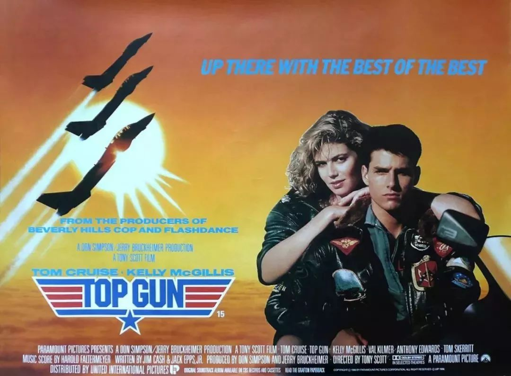

如今，58岁的阿汤哥再次搏命出演，光是情怀都可以打上满分。

在片中，此时的独行侠已经退役，成为一名试飞员，因为任务需要，受命训练一群精英毕业生。

在任务过程中，他将遇到老对手“冰人”和已故挚友“笨鹅”之子，还将面对新型无人机的挑战……在高科技的冲击下，他必须向世人证明飞行员的价值。

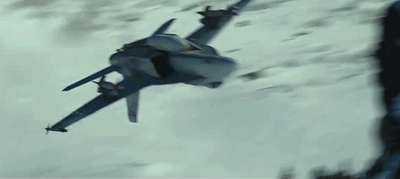

从预告来看，阿汤哥还是那么英气勃勃，空战场面依然振奋人心。

影片定档6月26日，我们拭目以待吧。

这是第25部007电影，也是现任邦德丹尼尔·克雷格的告别之作，对这个系列的影迷来说具有特别的意义。

因此，本片阵容空前强大，除了丹叔，上任邦女郎蕾雅·赛杜、新任M拉尔夫·费因斯、军需官Q本·卫肖、钱班霓娜奥米·哈里斯，系列反派幽灵党党魁克里斯托弗·沃尔兹都将回归。

此外，还有好莱坞新晋女神安娜·德·阿玛斯出演新任邦女郎，奥斯卡影帝拉米·马雷克加盟饰演大反派。

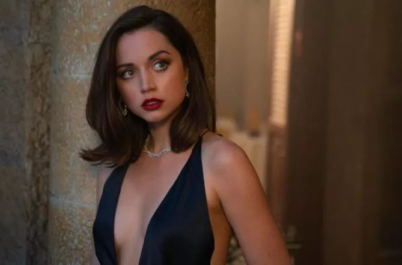

据悉，影片开场时邦德已经退休，在牙买加过上平静生活，但当一位老友——CIA特工菲利克斯找上门后，他不得不重新出山，再次拯救世界。

从预告片来看，动作戏场面高燃炸裂，跳崖潜入、飙车追逐、水下搏斗，还有御用座驾阿斯顿·马丁等经典元素都悉数出现。

间谍斗智的情节设计也颇有系列精髓，希望这部007能一扫《幽灵党》的阴霾，重现特工鼻祖的风采。

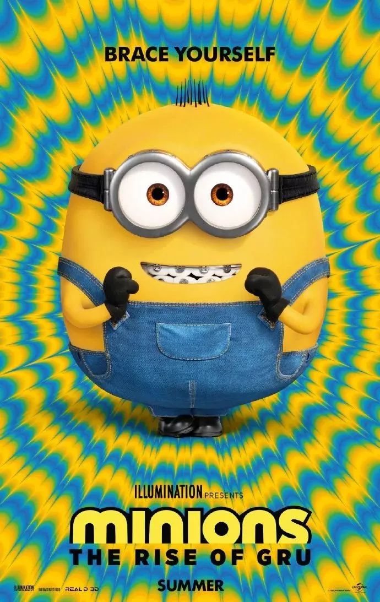

《小黄人》是环球旗下照明动画的代表作《神偷奶爸》的衍生系列。

照明动画通过小黄人电影开创了贱萌这一独有的动画类型，赚得盆满钵满，随后的《欢乐好声音》和《爱宠大机密》都延续了贱萌风格。

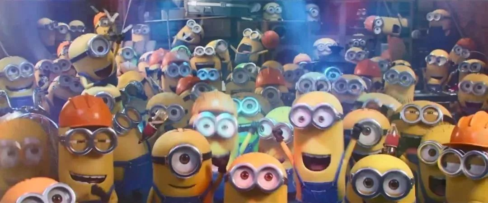

《小黄人大眼萌2》讲的是小黄人遇到主人格鲁之前，服务于其他主人的故事。

此时，还是小盆友的格鲁就已经暴露了天才技术宅的属性，与小黄人初次邂逅就制造了爆炸性的大骚乱……

总之，依然是熟悉的画风，熟悉的味道。

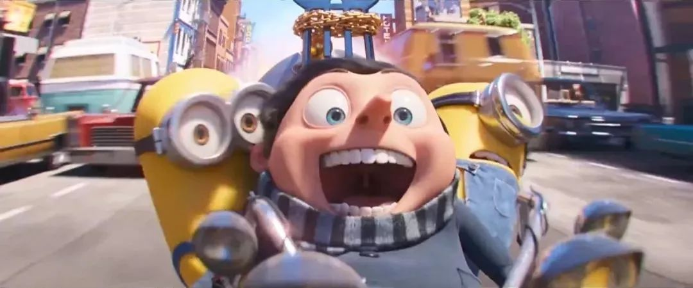

看完30秒预告，已经提前锁定为我的年度必看动画了。

我想，应该没人能拒绝这群贱死人不偿命的小萌物吧？

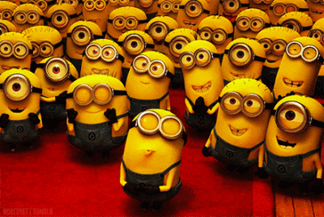

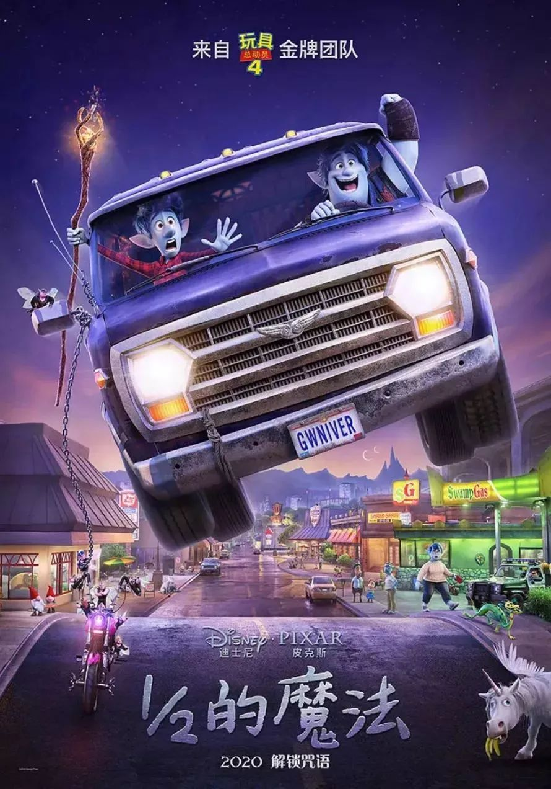

相比一招鲜吃遍天的小黄人，一向以原创著称的皮克斯，这次带来了《1/2的魔法》。

影片讲述的是一对兄弟进入魔法世界，寻找他们已故父亲的故事。主角兄弟的配音演员，分别是“星爵”克里斯·帕拉特和“荷兰弟”汤姆·赫兰德。

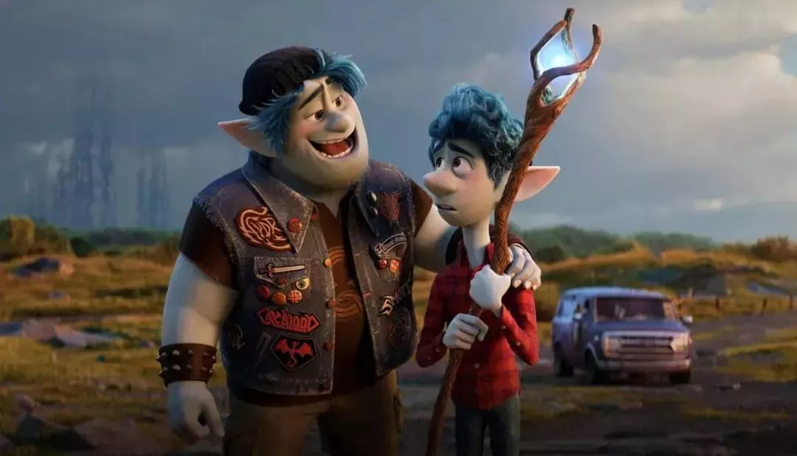

虽说故事乍看有点像《寻梦环游记》，但冲着化腐朽为神奇的皮克斯，依然值得期待。

影片北美定档3月6日，很快就会跟观众见面。

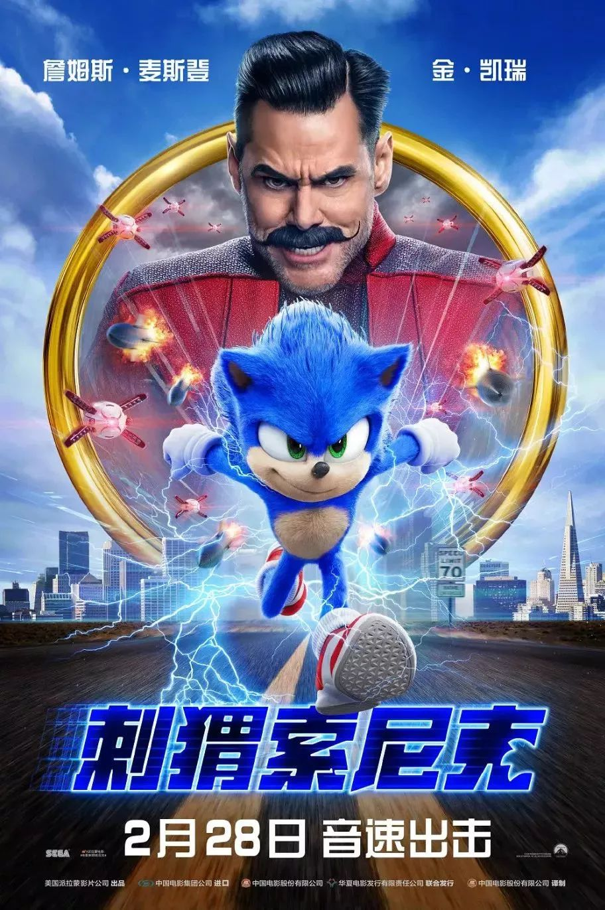

跟前两部动画大佬不同，这部真人动画由老牌厂商派拉蒙出品，改编自风靡全球的同名游戏。

去年，这部影片因为刺猬索尼克的形象设计过于死板上了热搜，片方吸取建议做了修改后，才获得了一波“真香”好评。

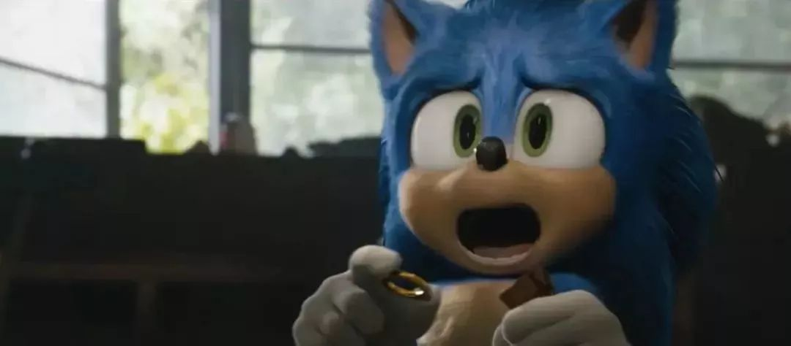

本片讲述具有音速奔跑能力的刺猬索尼克，与人类朋友汤姆一起阻止邪恶的弹头博士，联手保护地球的故事。

预告片充满了妙趣横生的笑点，索尼克看起来也学到了小黄人的贱萌范儿：

不过很多人最期待的，是金·凯瑞饰演的反派弹头博士。这是金·凯瑞在经历抑郁症折磨后，重新以喜剧形象回归大银幕的第一部作品。

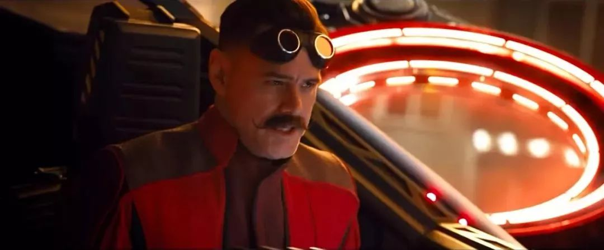

目前影片定档北美2月14日，希望它能给大家带来欢笑吧！

老实说，把《花木兰》留在最后，是我的私心。

相信很多观众跟我一样，都对这部大片充满了期待——这不只是对一部电影的期待，也是对好莱坞如何呈现我们中国的传统故事与英雄形象的关心。

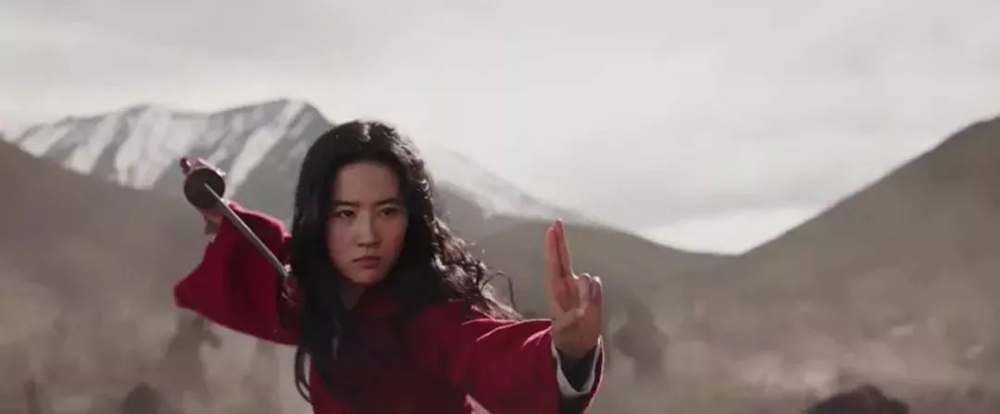

值得一提的是，《花木兰》是唯一一款在超级碗放出两分钟长预告的影片，足见迪士尼对本片的重视和信心。

而看完这款终极预告后，也让我悬着的心放下了一大半。

片中，李连杰饰演的皇帝、巩俐饰演的反派女巫、甄子丹饰演的将军一一亮相。

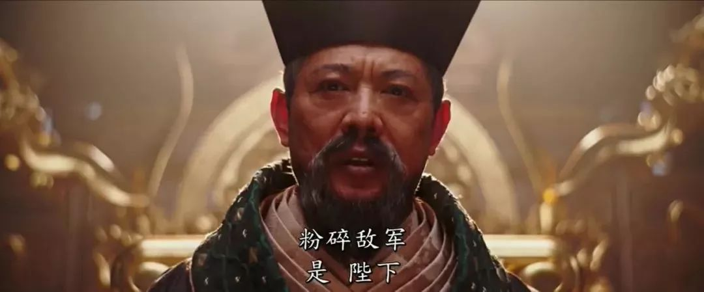

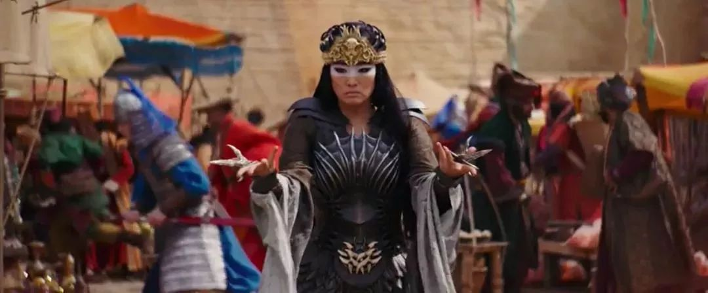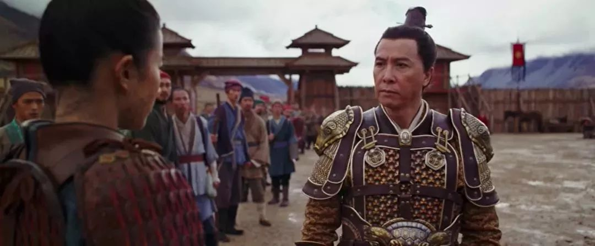

木兰也喊出了完美诠释这位巾帼英雄的“忠勇真”誓言……

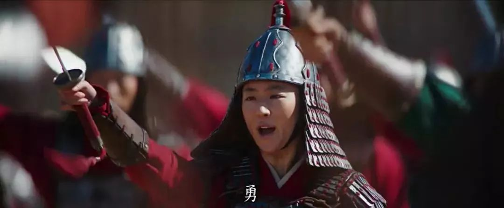

说来有趣，《花木兰》可能是中国观众最有发言权的一部好莱坞大片，某种程度上，它的好坏与否，真的是只有我们说了才算！

目前，本片暂定3月27日中美同步公映，希望到那时，我们可以抱着“女儿出嫁，考察女婿”的心情“检阅”《花木兰》，想想都令人激动！

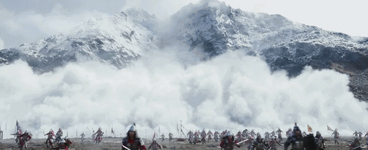

好了，以上便是昨天超级碗上放出预告的几部电影，不出意外，它们也将是今年最热门的好莱坞大片。

**那么，你最期待哪一部呢？**

