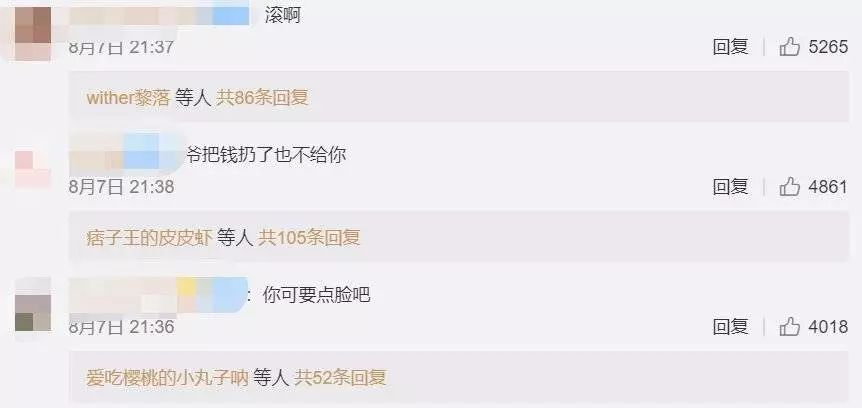
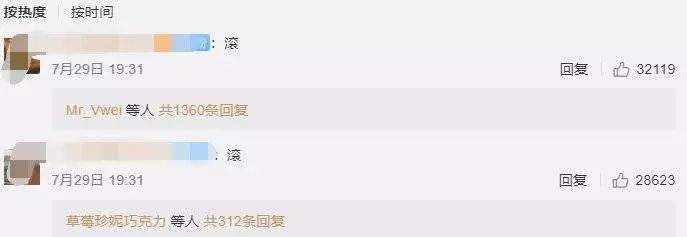

##  8岁才学写字？TVB“人妻女神”梁芷佩认同芬兰放养教育观，择校标准竟是零功课！

原创： 小拔萝卜 [香港拔萃教育hkoe]()**

大家都知道，不同的教育环境会给孩子造成不一样的影响！
有的家长崇尚**传统严谨的教育方式**，有的家长则更倾向于**“放养”给孩子独立思考和实践的空间。**不可否认，两种教育方式各有千秋。
今天小拔给大家介绍的是素来有**“人妻女神”**之称，**TVB新面孔梁芷佩**的独特教育方式！

图片来源见水印，侵权联系删除

梁芷佩因为拍摄节目，走访超过20个国家，了解了不同国家不同的生活和学习环境。

她曾与芬兰当地的家长聊过教育的问题，发现芬兰人普遍认为，学习文字是人的天性，不需要过早让孩子学习。

因此，芬兰的学生都是8岁才开始在学校学写字，但是不出几月就能快速学会很多字，读整本的故事书。

图片源于网络，侵权联系删除

还有，芬兰很多学校设置的课程都主张探索，以数学课为例，学生经常去街市和超市数生果学习。

图片源于网络，侵权联系删除

这种轻松有趣又能真正启发孩子主动学习的教育模式让梁芷佩深受启发。

她认为**「芬兰真正实践到愉快教学，令学生热爱返学，18岁一样上到大学，英语还非常流利。」**

总之，这段走访的经历让她在自己孩子择校方面有了一个基本的方向把握！

**那我们就来看看女神梁芷佩为她的孩子们都选择了什么学校？**

长子现就读沙头角的**沙田角****国际学校（International College Hong Kong）。**
**
**

图片源于网络，侵权联系删除

本来是在乡下的一所国际学校，但更令人意外的是这所名不见经传的国际学校**2017年被剑桥大学评为全球100所最具创意学校之一，要知道香港仅此一所！**
**
**

**ICHK国际学校与三间国际学校（小学）康乐园国际学校、日本国际学校、京斯顿国际学校紧密合作，提供学生由幼稚园至中学课程。**
**课程主要是英式（Year7-9），GCSE（Year10-11）和IB（Year12-13）。**

这所学校为什么独得女神青睐？我们来看看别人家学校趣味横生的课程就懂了！

因为传统课程未能真正满足教育的需要，多年来，沙头角国际学校设计了一系列**创新的学科及教学模式：**

课程里加入一个极创新的学习模式，命名为《深入学习》，沙头角国际学校的老师会带学生到校外学习，帮助他们了解在学校学到的知识是如何在社会上运用的，以及对不同课题作深入探究。

图片源于网络，侵权联系删除

有时老师会**让学生一整天自己搭公车，学懂独立**；

有时老师会**带学生到附近的红树林沼泽作实地研究**，学生能从中学到一些科学、地理学、数学知识，人际方面也能加强团队合作；

为更真切了解香港文化及历史，有时老师会**带他们参观荒废的客家村落，让他们体会社会变迁带来的影响**，学生们能够有更高的格局和眼界看待弱势人士的境况并积极参与义工工作帮助露宿者。

图片源于网络，侵权联系删除

图片源于网络，侵权联系删除

这种学习模式其实是有很大风险的，有父母可能会说：**“我的天啊，你这4天做了什么？我不想我的孩子没有正规上课。”**

但是对于崇尚芬兰教育的梁芷佩来说，这种学习模式是很符合孩子多远独立发展的！

讲完长子，**梁芷佩的次子和小女儿都是入读荃湾的****小型国际学校玫瑰蕾小学。**

图片源于网络，侵权联系删除

5岁小女儿刚完成幼稚园课程，新学年也读小学了，**梁芷佩明言当年选择幼稚园，第一件事就是问校长有没有功课！**保证孩子不必承担繁重的学业负担，才确认择校的！

是不是也有心疼孩子每天做不完的功课，想让孩子更快乐有趣地学习的家长呢？我们来仔细了解一下这所国际学校！

**玫瑰蕾小学位于荃湾海傍，是一间汇聚多元文化的私立国际小学。**

**学生来自十八个不同国家，如中、美、英、德、澳、菲、日、韩等。**

**此外，学校的教师也来自多个国家，校长Rustem Sultanov表示这种国际化组合，对营造多元化的融洽校园气氛有****很大益处。**

图片源于网络，侵权联系删除

虽然是一所多元化的国际学校，但是也非常注重汉语的教学。在英文教学的基础上安排了**每周四次的普通话教授。**

另外**小班教学的模式**深得家长们的喜爱。梁芷佩就很赞同小班教学，一位老师对十多位学生，可以贴身照顾，次子在这种环境下成绩也是突飞猛进！

图片源于网络，侵权联系删除

以上就是对人气女神梁芷佩对孩子教育看法啦！不知道有没有家长的教育观和女神不谋而合呢？欢迎留言小拔~

香港拔萃教育是一家专注于服务港籍家庭的教育机构，10万港宝家庭申请香港学校首选香港拔萃教育。

香港中学申请时间规划+学校选择+笔试面试+语言培训，全套代办方案送孩子轻松直达香港名校。申请费用行业超低价！立即咨询，获取平价&高端方案。

联系人：黄老师
**电话或微信：18826523005**

长按并识别二维码添加微信

**这里有你感兴趣的...**
[阅读原文](https://mp.weixin.qq.com/s?__biz=MzA4NDI2Mzg1Mw==&mid=2651379198&idx=1&sn=4d652f3d7204c9e50f589988db518a58&chksm=8415a33cb3622a2aa50afe01daab14683ee58e6c784ce9c8358ab4a996070ba82ca91221f821&mpshare=1&scene=1&srcid=0824CEcrvcDgF4eASOac7XZG&sharer_sharetime=1566608921390&sharer_shareid=badd687b22e02cbea2bccedfd5f757de##)

在看