文地址:http://www.douban.com/note/355435939/

因为加拿大驻华大使馆宣布自2014年2月6日起，多次往返临时居民访问签证费将会由150加元减至100加元。单次往返签证收费标准将被取消，申请人会被默认为申请多次往返签证。符合条件的访问者持多次往返签证可在加拿大每次最多停留六个月，最长达10年内无需每次重新申请。

所以燃起了kokomi申请这个签证的欲望。
另外持加拿大签证过境菲律宾7天内不需要申请菲律宾签证，一个菲律宾签证大概是200人民币，所以一举两得。

ps:在这里不讨论曾经拿到过美国签证，符合便捷申请材料的流程。
***

### 在申请之前，你需要符合或者准备以下材料：

1.预定可以免费取消的机票，酒店（英文）。在签证下来之后取消。
预定机票上携程英文版，预定酒店上booking英文版。
2.自制行程单（英文）
3.每人向银行存5万人民币，开存款证明（20元）银行提供中英文版，签证下来以后解冻。
4.在单位开推荐信（中英文），也可以叫收入证明，在职证明（主要包括职务，年薪，姓名，护照号码，生日，旅行时间等）可以参考携程的模板 http://vacations.ctrip.com/notes/212.html
5.护照（有盖章的每一页拍照）
6.电子相片（按照大使馆尺寸要求截图）
7.银行工资卡流水单，信用卡流水单六个月（拍照+翻译）有工资打入的部分用红色笔圈出来
8.房产证，车证（整本拍照+翻译）
9.结婚证（如有）整本拍照+翻译
10.教育及就业信息表，中英文（没有表格代码）
11.家属信息表（IMM5645E）英文
12.签证申请表（IMM5257E）英文。这个表格最后有一个validate按钮，全部填完后按一下，会出现几个条形码，一定要把带条形码的表格传上去
13.代表家属网申表（只有在至少2名家庭成员一起申请时用）（IMM5713E）
网上下载表格地址：http://www.cic.gc.ca/english/information/applications/visa.asp
14.公司营业执照复印件盖章（拍照+翻译）

### 收费：
网申每人100加元（准备好信用卡）在线支付。另外，寄护照的时候，加拿大签证申请中心将收取每名申请人在线申请服务费161元。如您需要快递返还申请资料，则需额外支付47.50元，如果有两个人，每个人都要交47.50（很黑吧）（可以在网银上自己汇，不需要手续费，账号和地址在下面提供的网址上有）。

### 时间：
准备材料1周，材料上传2天，等待通知把护照寄到签证中心3天，等签证中心寄回护照一周，一共大约3周。要做好加拿大网站很烂，有时候一整天都打不开，或者上传材料很慢的心理准备。

### 签证有效期：
理论有效期是十年，但是护照会过期，所以实际有效期到护照过期之前一天。

### 备注:
1. 网申不需要户口本和身份证
2..网申不需要面试，不需要跑大使馆或签证中心，所有材料网上提交+邮寄护照
3.如果英文程度不是很好，不推荐网申，因为需要翻译的东西很多，网站又是全英文的。建议请签证中心代为办理。
4.所有上传的文件必须用英文命名，大小不能超过4M.
5.如果上传的一个文件包括若干材料，必须合并，压缩再上传。另外，网站只认JPEG,word,pdf几种格式，要提前转换。
6.电子表格不需要签名，全部传完以后，系统会让你输一个电子签名到系统里。
推荐在线转换，压缩，合并软件 http://merge.smallpdf.com/

***

加拿大签证官网地址：http://www.cic.gc.ca/english/my_application/apply_online.asp?s=1
加拿大签证申请中心：http://www.vfsglobal.ca/Canada/china/

按照左边的提示，通过一个在线测试，验证你是否符合网申。
里面会问很多问题，这里不赘述，如果看不懂问题，有人写过，自行google。
在通过测试以后，会给你一个代码以及check list（下图），用这个代码，在右侧登陆框登陆，创建mycic account。check list会告诉你所有的申请步骤。
创建账号时要设置4个机密问题，千万要记住那些问题和答案，如果丢失，只能通过打电话去加拿大解锁，非常麻烦。

注册通过这个按钮登陆账号

关于家属同行：
如果申请者不止一名，可以选其中一人作为主申请人，在回答在线测试的时候，选择有家属同行，最后出现的签证申请费用会是100加元x n人。
主申请人需要提交12项材料，家属每人提交5项材料。

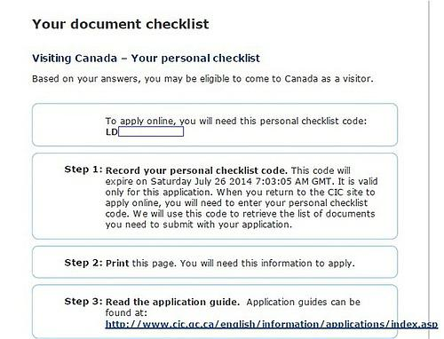

在网上提交材料的时候，每个人对材料的要求解读不同。
我建议点开每项后面的问号，看官方解释。
以下是部分比较重要的材料解释。仔细揣摩签证官的要求吧。

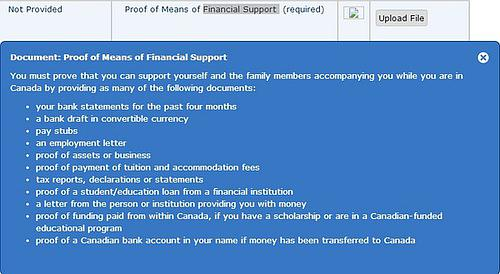

财务证明

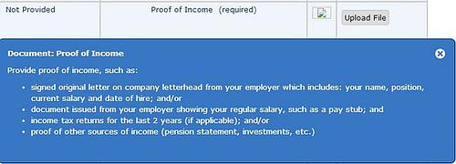

收入证明

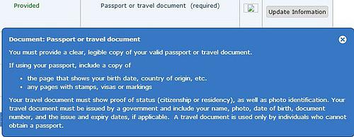

护照（整本）

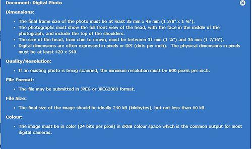

照片要求

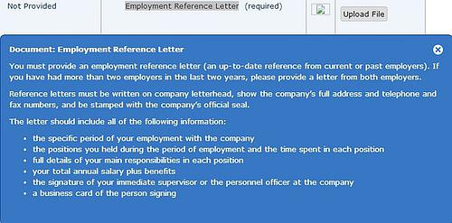

推荐信

机票，酒店，行程单

我自己做了一个旅游路线图，然后根据这个做行程单，分配每个地方玩的时间。切记你做的行程单一定要符合时间逻辑和地理逻辑

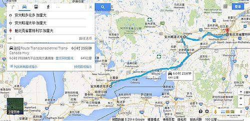

行程单--地图

在你提交了所有材料以后，你会被分配一个application number.
每次工作人员看过你的材料，或者通知你补材料，寄护照的时候，都会发一封站内信给你。

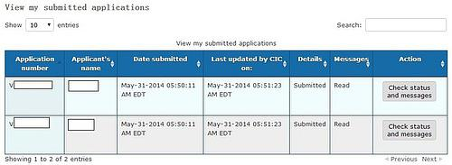

副申请人提交的所有材料。

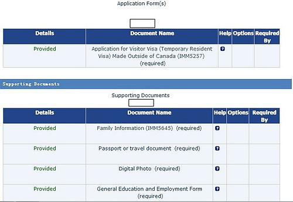

主申请人提交的所有材料。

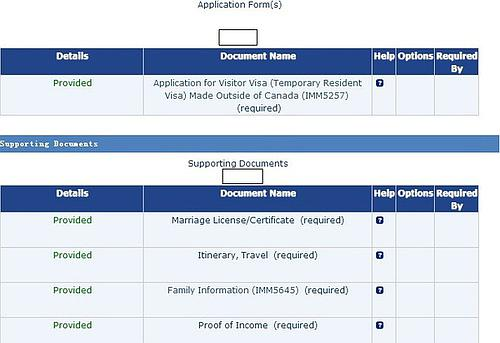

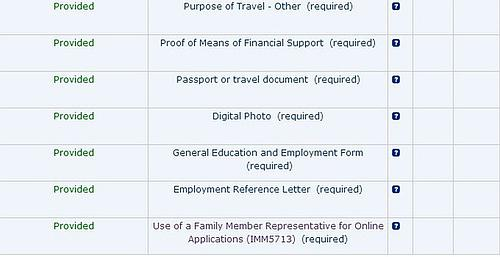

网申材料全部上传以后，在线支付签证费。

大使馆审核你的材料后，会通知你把护照，带条形码的信（下图）和汇款凭证（递交护照费+回邮费）寄到签证中心。你在快递里，把自己的名字，电话，邮箱，回邮地址附上去。

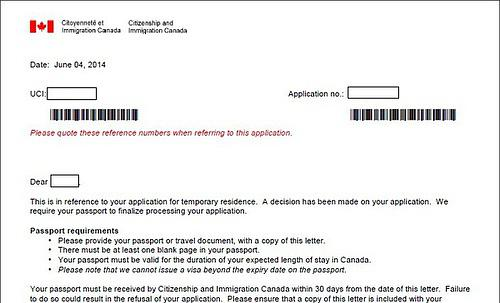

签证中心收到以后，会通过邮件发一个 tracking number给你。

同时你要时刻关注加拿大官网，签证批准以后，会第一时间在上面显示approved。然后你才会收到签证中心寄回来的护照。

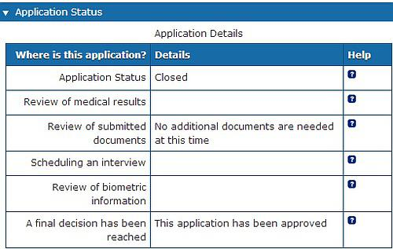

