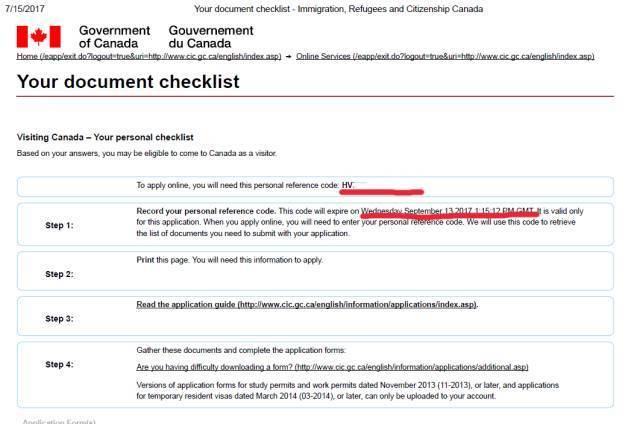

想要说走就走的旅行，就必须先把签证办好。去年办了美签十年，今年加拿大签证继续走起。
加拿大签证给到护照过期日的前一天，如果护照将在一年内过期的，也不能申请加拿大签证。
整个签证过一遍后，感觉加拿大签证比美签稍微繁琐了一些，但是填表的过程没有美签那么抠细节，而且不用预约就可以递签，在心理上比较轻松。
总的来说只要懂一点英文，完全按照官网的指引，签证是十分简单的，繁琐的只是步骤有点多，顺序理不清的话会觉得非常乱而已。
准备申请前你需要知道的二三事
申请加拿大签证有三种方法：
1.递签，自己去签证申请中心办理（无须预约和面试）
2.在线申请，即大家说的网签，所有资料均通过网上上传，贴签通知下来后再去签证中心贴签
3.邮寄提交（签证中心仅接受合法居住在中国境内的申请人的邮寄申请和汇款，签证申请中心不接受来自国外邮寄的签证申请）
纵观全网，貌似用邮寄提交方法的人不多，大家都偏向递签或网签。对于有美签的人来说，网签相对简易及保险，毕竟我看过有些帖子说有美签的人亲自去中心递签，还要求他们上交官网没有要求过的资料（虽然可能只是个例）。
加拿大签证中心全国有四个，工作时间为周一至周五08:00-16:00
- 北京：北京市东城区东直门南大街11号中汇广场A座12层。
- 上海：海市黄浦区四川中路213号久事商务大厦2层。
- 广州：广州市天河区体育西路189号城建大厦3楼351室。
- 重庆：重庆市渝中区民生路235号海航保利国际中心33楼33-D。

***
整个申请步骤，大致如下：
1.在官网上回答问卷问题，确定你是否满足简化申请签证的条件，拿到personal reference code及个人审核清单checklist（这一步也可以等到账号创建后再进行，但我是先回答问题的。这前后顺序不影响申请步骤，就看个人喜好。）
2.到官网注册GC KEY 账号
3.创建账号并登入（输入personal code后，步骤1生成的个人审核清单便再次出现，需要提交的东西都在审核清单里）
4.下载表格
5.填表并上传必须的文件以及optional文件（我是连optional的文件都传上去的，但由于这不是必选项，所以还是看你自己意愿）
6.在线电子签名
7.在线缴费（只接受visa或master信用卡）
8.等邮件通知贴签（Original Passport Request）
9.下载提交护照通知信（点击Original Passport Request那条信息就下载了）
10.下载服务同意书（有些签证中心不收，有些收，去贴签的时候带着还是保险一点）
11.复印要贴签证页的护照的信息页
12.亲自/邮寄到签证中心交资料贴签
13.自取/EMS回邮拿到护照
完成以上13个步骤，签证妥妥到你手上啦，那么现在我们来逐一实操各个步骤吧
LET'S GET STARTED!
首先简单交代一下背景：有美签并去过美国，还在工作尚未退休，打算独自前往加拿大旅游。网申过程中，因个人/家庭的情况不同，遇到的表格和问题也不一样，本攻略只适合差不多背景的人参考，有疑难杂症的，欢迎一起讨论。
时间线：2017.7.18号提交所有资料---7.27收到OPR---7.31号去广州签证处贴签，选择EMS邮寄回来。
Step 1 在线问卷
首先去官网回答问题，回答之前最好知道你将要访问加拿大的城市属于哪个省份：
http://www.cic.gc.ca/ctc-vac/getting-started.asp
step by step的步骤，请点击http://bbs.qyer.com/thread-2665561-1.html，写的已经很清楚了，我再根据我自己遇到的情况补充几点：
回答完一部分内容后，会看到如下页面，表示你有资格申请加拿大签证，单击continue继续问卷回答

之后的问题可能会问到：
1.是否有家人一同前往加拿大，独自前往就选NO
2.你和此次同行的家人，是否均持有有效美国签证或者在10年间曾前往过美国
（如果独自前往，继续选NO，如果有家人一同前往，家人没有美签但你有，或者反过来的情况，都不能走美签简化流程。只有所有申请人都符合美签简化的条件才可以一起申简化版）
注意：根据每一个回答的不同，大家遇到的问题会不一样，导致需要提交的资料也不一样。所以如果看到你遇到的问题跟攻略不一样，不要慌张。
到最后，会遇到你是否需要别人access你的申请表，如果不是委托第三方申请话，都是填NO。具体是哪些第三方机构，点击问题旁边的问号，会有详细的解答。一般自己申请签证的都是填NO。

它还问到你是否可以用扫描仪/相机提供相关所需文件的数码版本，是否能在线用信用卡支付，都是选YES
回答完问题后，会有一个审核答案的页面，请仔细审。
审核完按continue，出现个人审核清单。记住你的reference code（有两个英文字母以及一串数字组成）。这个checklist只三个月内有效，checklist的下面就是你所需要提交的资料（根据你的回答生成出）

Step 2&3. 注册GC KEY 账号并登入
再一次，step by step的步骤请看http://bbs.qyer.com/thread-2665561-1.html，跟着步骤一步一步来便好。
大致步骤为：
注册GCKey---完成后官网自动跳到immigration页面，点击我的申请---登录账户---create an account（自己真实姓名的账户）---创建安全问题---申请访问签证---审核答案。
在这一步骤需要注意的是：
1.起username和设置password时，请按照官网要求。为了安全保障，username不能用自己真实的名字，各种证件号码，邮箱地址，家庭住址等显而易见的内容
2.创建一个密保/恢复问题，并牢记
3.创建四个属于你自己的安全问题并牢记，以后登录官网操作，这四个问题会随机出现，回答了才能进行下一步。
4.如果你的名字是三个字，在create an account的时候，名的那一栏全大写自己的名，中间无空格，在接下来申请中所有需要填名的地方（不管是自己还是别人的），也是这个格式。姓也全大写。
Step 4&5 填表及其他资料的提交
根据我的问题回答，总共我必须交的有2个表+护照、相片、旅游历史，optional的有一个表格和解释信。
遇到的表格：IMM5257，IMM5707E，Schedule 1
这是我已经上传完的界面图，表格只需要点击文件名就可以下载了。很多人遇到过IMM5257无法打开，需要下最新一版的adobe acrobat。但是我下载到最新一版仍然打不开，最好的办法是，下载最新版后，点击右键另存为到本地，就可以打开了（适用于windows用户，mac可能会有不同）。

IMM5257的填写
这个是主表了，如实填写，没有什么难点，注意以下即可：
1.表中会问到将要访问的加拿大机构/个人，旅游的话，可填N/A
2.工作经历逆序填写，几份不同工作间不要留下时间间隔。如果你从毕业后就一直在这个公司工作，那么to的那个年份，写未来的年份，来表达至今仍在这个公司工作。
3.最后表格的签名处，网申的同学在所有表格需要签名处留空，只填写申请日期就可以了
4. available fund to Canada：一天200-300加币大概，加上机票住宿等写个总价格，少于5000的写5000。根据机票和住宿，玩7天我写了6000加币仅供参考。如果玩的天数多的，自行计算，但是得符合你的收入水平。
5.UCI那一栏不填，留空

travel history 从某种程度上可以说和passport所要上交的东西一模一样。我首先是在开头列出过去十年去过的国家（把具体时间也写出来，也指出这个history是旧护照上的）。再把每一个签证与盖章跟据从近到远的时间顺序排好。
6.最后一个勾选YES
7.全部填写完成后，点击“Validate”进行确认
8.确认完成后，最后一页会出现好多个码，把确认好的这份表格传上去。
IMM5707E的填写---5707E是家庭信息表。
SECTION A：注意所有的名字用英语和中文填写，即便你的家人不与你一同前往加拿大，也需要提供信息。
填写示例：
ZHANG SAN 张三
WANG DAHUA 王大花
**在勾选是否陪同前往加拿大时，独自前往的申请人在申请人那一栏勾YES，其他家人栏勾NO
如果你没有配偶，在SECTION A最下面填日期，签名处留空。如果你有配偶，不用签名也不用填日期。
SECTION B：填写子女的，包括所有亲生的，领养的，还有继子女。
姓名格式当然也跟上一页一样，勾选是否陪同，也如实填写。
SECTION B最下面也有签名处，注意是如果你没有任何子女才签名和填日期，如果有子女，则留空。
SECTION C是所有人（不管有没有结婚，有没有子女）需要填写日期的，签名栏依然是留空。
护照
官网对护照的要求：

如果你有有效期一年以上的护照，必须提供护照上所有有字的页面（包括护照信息页，老护照还需提供签名页，所有盖章的页面，所有有签证的页面。空白页无需上传）。如果你有新护照和旧护照，也是根据以上要求都传上。
如果新护照是白本，签证都在旧护照上，就只用传新护照的信息页和旧护照的所有有字页面，用word排版生成pdf，不超过4M上传上去。（所有文件大小都不能超过4M，文件名得是英文，中文的文件名无法上传成功）
Travel History

因为新护照是白本，所以我travel history就只传了旧护照所有签证页及盖章+旧护照信息页及签名页。
如果你有在国外工作或学习的经历，也要把相关的东西交上去。包括签证以及毕业证书，留学证明之类的。
登机牌如果有可以放上去，但这个真的不强求。
解释信
关于optional的解释信，虽然美签在手，但是也不敢放松。信中就写了为什么去加拿大，会按时回来之类的，也就两三百字，不用写的太谦卑，有礼貌，简单解释清楚便行。在解释信的文件中，还附上了在职证明和行程。我个人认为行程挺重要的。怎么说也得给签证官一个我是认真在计划这次旅行的印象。
SCHEDULE 1---IMM5257B-1
填完之后也是按“Validate”才上传，如果不在政府机构也没有什么需要填的。
最后的旅行经历，把最近5年的旅行经历写进去就可以了。
Step6-8 交钱及等待
所有文件上传完毕后，就可以交钱啦。目前是一个申请人100加币。只支持如下信用卡

交完钱后会出来一个窗口说24小时之内他们会收到钱，我是过了一个小时后收到确认的邮件，说申请开始受理了。
这里划重点---如果没有交钱，只是把资料传上网，是没有交到大使馆的，交了钱才代表你的申请开始受理。就是说在交钱之前，你的表格、资料可以随时更改。而且网站也有时间限制，过了大概三十分钟就会自动退出，除非手动延迟。所以大家把表填完，资料编辑完后再打开官网比较高效。
大概过了十天，收到OPR，就可以准备去贴签啦

Finally 贴签
贴签需要带如下文件，在官网可以查询：
http://www.vfsglobal.ca/Canada/china/how_to_apply.html#temporary_documents
偷懒的人，可以看以我自己为例(有新旧护照)，带去的资料（可能会有变化，一切以官网为准）：
1.打印OPR letter （点击Original Passport Request那条信息就下载了）
2.服务同意书打印并签名、写地址
3.新护照原件+新护照信息页复印件（复印件自留，但是他们会看，并且如果你是选择邮递回来，他们会在复印件上订着你EMS的快递单和你的缴费凭证）
4.旧护照原件
5.个人资料（在A4纸上写你的姓名、电子邮箱、电话、回邮地址）
6.现金 167元+45.2元（邮费）
可以选择邮寄到签证中心，或者自己亲自去。
如果你住在签证中心周边城市，来去方便，建议还是自己亲自去较好，然后选择EMS邮递回来。
如果选择邮递的小伙伴，记得查询官网价格打钱到指定账户，因为不知道什么时候又涨价了，如果钱交的不够，那边是不会受理的。如果你打的是广州的银行账户，那么就去广州的签证中心贴签，如果打的是北京的账户，就去北京，不要随意去哟。邮寄的所要提交的东西跟亲自去贴签的略有不同，一切以官网为准。
到了签证中心，告诉工作人员你是来贴签的，然后拿号等叫号，最后交钱，一切就完成啦。

呼啦啦的写了一大堆，希望对大家有帮助，欢迎大家反馈啊，把你们的经验分享出来，笔芯。
Q&A
Q：5257E或其他表格无法正常打开
A：1.确定你已经把Adobe acrobat升级到最高版本
2.升级完后还无法打开，直接按右键另存为本地，在本地打开并填写
Q：在表格中填不了中文，怎么办？
A：如果没有安装adobe的字体插件（类似这类的具体是啥我忘了），是无法把中文打上去的。打中文的时候它会跳出一个框让你安装插件，安装完后就可以填中文了。
Q：我住在北京，刚收到OPR，但刚好要到广州出差一段时间，我可以在广州贴签吗？还是一定要在北京贴？
A：加拿大贴签中心没有地域限制，所以在哪一个签证中心贴签都可以。但是如果你是选择邮寄贴签，就要去你打的银行账户的那个地方贴。
Q：美签在手，材料好少，随便弄弄就能过吧？
A：美签的确会简化材料，但也看到有美签的网友被拒绝的案例。就是说有美签并不是保证百分百签过，还是要认真准备材料呐
Q：听你这么说，就算我有美签，那我也上传财产证明求个心安吧。这样过签率会增加吧？
A：一般有美签的都不用提供财产证明，除非你的财产是你的加分项，否则适得其反
Q：填表的时候是要首字母大写，还是全部都得大写填啊？
A：都可以，我是全部大写填的。
Q：行程和在职证明都放在哪？
A：行程和在职证明可以放在解释信的后面，在解释信里面写上你还准备了啥啥啥资料就可以了。一切的补充材料都可以放在解释信里。
Q：合并好文件，说上传错误？
A：1.注意你的文件不要超过4M
2.注意你的文件名是英文
Q：Travel Histroy里面要放旅游的照片吗？
A：我觉得放签证以及盖章页就可以证明你已经去过那个国家了。而且官网也没有要求放旅游照片进去，一切按官网来吧。若是可以按照从近到远的顺序排列你去过的国家，方便签证官看，是很好的。
Q：那所有表格的签名处都不签名，我到底要在哪里签名？怎么签名？
A：所有资料上传完毕后按continue就是签名的页面。拉到最后写上你的姓名，勾选“我同意”，再输入之前create account时候创建的四个安全问题其中之一的答案，就签名完成啦。然后就进入付款页面。
小礼物走一走，

作者：艾梨西娅
链接：https://www.jianshu.com/p/4e6c4d95b4fa
來源：简书
简书著作权归作者所有，任何形式的转载都请联系作者获得授权并注明出处。