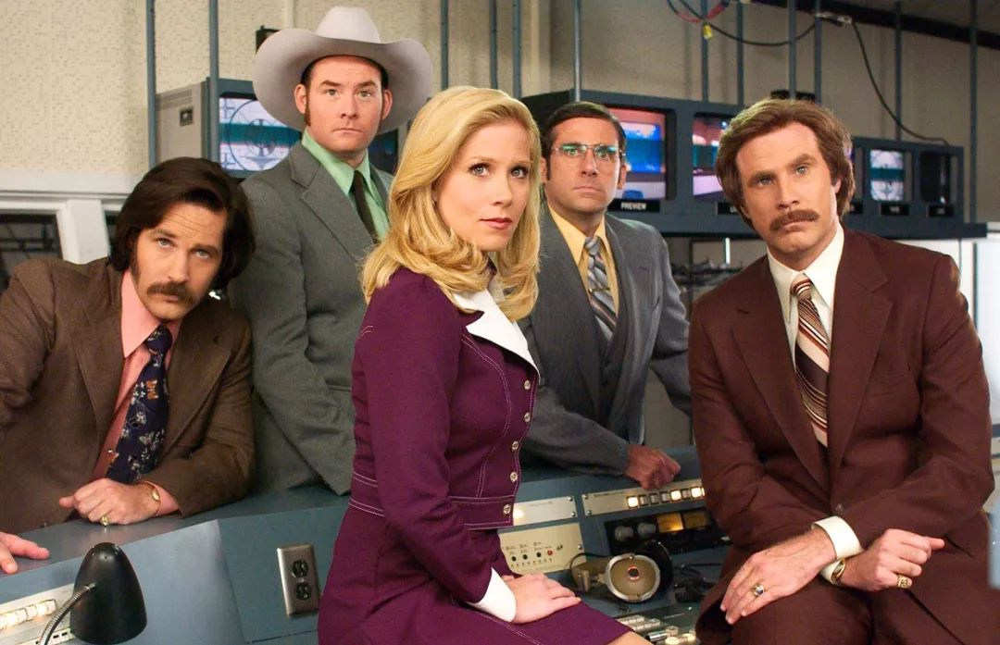

##  【对比】都是北美大国，加拿大在哪些方面要优于美国？

hezhongsz [深圳和中移民]()**

移民北美，选美国还是加拿大？

对于移民者和公民来说到底哪个国家好，又好在哪里？

其实，许多人在直观感受上会觉得美国远胜于加拿大。

的确，美国有很多亮眼的标签，比如“世界第一大国”、“世界金融中心”、“前沿产业集中地”。这也是为什么许多人宁愿排队五六年，甚至到十年也要移民美国的原因。

但是今天，我们要反其道而行之，我们来反向盘点盘点，加拿大有哪些方面优于美国。

要说加拿大为何优于美国，肯定得说说生活成本了。

首先食物方面：

**美国**

或许你看过很多关于美国物价低的文章。但是实际上是，虽然美国的肉类，尤其是像汉堡和炸鸡所用的肉类制品（多是激素催生的速成肉类）非常便宜，几美刀就能吃到一大份。但是绿植蔬菜、水果等食品价格着实不低。甚至穷人根本就买不起。

之前爆出一个新闻说美国的零售业大亨为了能让穷人买得起水果，专门搞了一个“过期食品超市”销售，而且销售的成绩还不错，甚至被媒体鼓吹为人道。

试问在国内把一些濒临坏掉的水果低价卖给你，你会觉得人道吗？

美国超市水果按片售卖
这也是为什么美国肥胖问题很难得到解决，不少300-400斤的美国胖子，实在是因为他们的食物组成都是高热量的肉类。

**加拿大**

其实相对而言食物等费用就便宜很多。以加拿大的华盛超市来说，简单的报几项：2.90加元的12个白皮鸡蛋，4升的塑料桶装的牛奶标签价格为5.20加元，火龙果，0.99加元一磅，西瓜，2.99加元一个。

唯一的遗憾就是你的标价不一定是你最终买到的价格，因为要交税。

至于肉类，加拿大和美国差不多。有大量的养殖场撑着，价格并不算贵。

大温地区本周超市商品价目表
说完食物，相信大家一定不会忽视一个重头戏：医疗

**美国**

美国全球最贵医疗可不是说着玩的，相信不少人都听说过在美国受伤后，第一反应就是让身边的人不要叫救护车。

稍微查了一下波士顿的数据：波士顿紧急救护局局长胡利（Jim Hooley）表示，在波士顿市区内，救护车运输的费用在1200美元至1900美元之间。他说，“我们只想照顾伤者，不想给他们造成压力。我们只希望确保，他们不会因付不起钱而导致不好的事发生。”

1200-1900美元。那可就是8000以上的人民币。怎么可能人人都负担得起？所以只要不是重大的疾病，基本都不敢叫救护车。

至于医疗手术价格也着实不低。

**加拿大**

加拿大的医疗就好很多了，是真正的做到了免费医疗。

我们需要知道的是，加拿大的医疗卫生体系是一个全国性的系统，其医疗机构拥有先进的医疗设备，医护人员都受到严格的专业训练，所有公民享受平等的医疗机会。但各省各地区仍保留较大的自主权，可根据自身情况及需求来自行制定政策，因而存在着不小的省际差异。比如卑诗省的医疗保险需要每月缴纳一定的费用，如果是低收入家庭则在一年后退还，魁省的医疗保险则是完全免费的。

教育：

**美国**

不可否认美国是教育超级大国，全球TOP100遍地都是。麻省、哈佛等名校不知道培养出来了多少牛哄哄的学生，但是问题在于，美国的高校教育资源较为集中在私立学校。

常青藤虽然足够优质，但是对学生的申请要求也非常高。往往要求参加各种社会活动，有各方面特别亮眼的履历。说白了，顶着公立学校的名字却卡着贫寒学生上升的道路，就是美国公立高校的现状。

而麻省、哈佛这些私立学校更加恶劣。校友会都成了一个圈子，加上推荐信制度，只要有校友的推荐信，即使学生成绩没有达标都能被破格录取。同时还非常歧视少数族裔，降分和克扣名额非常常见。

所以说美国的教育资源分配上倾向性非常严重，基本百分之八十以上的教育资源用在了精英大学的上面，剩下的零头分摊到了那些可有可无的公立高中和社区大学。这还仅仅是大学。

高中教育的私立和公立差异更是大到明显。

公立高中基本都是黑人和少数族裔，大部分学生逃课还兼任帮会成员。而私立高中完全是另外一幅光景，光鲜的建筑，有专门的清洁人员打扫，一线教师图书馆等。可惜高昂的教育费用叫贫寒家庭望而却步。

**加拿大**

加拿大相对而言就好很多。教育倾向性没那么严重，加上目前自由党执政，正在进一步的抹除教育资源分配的差异性，加码公立教育。

此外在男女教育均等这样的西方老大难问题上特鲁多也进行了表态。

公立教育目前来看还是非常好的。

政策上来看，加拿大推行的是全国十二年免费义务教育，公民或永久居民及其子女从小学到中学全部免费教育。

同时，加拿大是世界上教育经费最高的国家之一，每年在教育方面的投入占国内生产总值（GDP）的7%左右。政府对高等教育也有很高的津贴。家庭经济状况不佳的大学生, 政府有无息贷款资助。目前，加拿大高等教育普及率已达到45%，居世界前列。

这种教育制度，尤其是在孩子的学前教育和初高中阶段，不会形成日本美国那种公私立学校冰火两重天的情况。同时，加拿大最近还被US News评为“全球教育质量最佳国家”。

说了加拿大这么多好的，还是必须要提一提美国，因为美国的确有很多加拿大无法企及的优势。

比如：机会

说实话美国对比加拿大最大的优势就是美国真的拥有非常多的机会，现在不少的美国华人在硅谷成为投资人，成为谷歌等一线科技公司的高管。

但是在加拿大，华人就很少能拥有这么多的机会。

大部分的华人初到加拿大很难进入科技等领域。而数据也很明显的显示，加拿大那些比较靠前的行业，如AI、电动汽车等领域也很少有华人能真正做到高管的位置。

说完这些，最后如果要移民的话，我们该选择哪个国家呢？

用一个加拿大的朋友的话来说吧：在美国你可能会很富，超级富，比加拿大大多数人都富，但是你也可能很穷，穷到吃不起饭那种。就像《当幸福来敲门》的主角的前半生和后半生一样。但是这种情况在加拿大并不会存在，至少在加拿大即使你活得并不好，但是你的生活水平不会低于平均线多少。

**免责声明：**本平台所转载的文/图/音视频等，凡未注明“原创”等字样的均来源于网络善意转载整理，版权归原作者所有！如有侵权，请联系删除。

**如果您对移民或者本文话题感兴趣******
****可以扫一扫以下二维码添加深圳和中客服********

****聊移民 谈留学 讲投资 说政策

[【教育】十年寒窗为金榜，不抵一纸国籍“小欢喜”](http://mp.weixin.qq.com/s?__biz=MjM5MTIxMDMyMg==&mid=2650174008&idx=3&sn=4c7e9e5a8060945f15a724bd9db17e00&chksm=bebbdc0589cc551392f9abafb29b4f15c593c6a1c3be90d0c1801344346b043fcb55852d614e&scene=21#wechat_redirect)

[【干货】加拿大联邦自雇移民攻略，掌握这些要点就能让你移路稳赢不输！](http://mp.weixin.qq.com/s?__biz=MjM5MTIxMDMyMg==&mid=2650173989&idx=1&sn=8d33c530e8d786801805e3dea856d630&chksm=bebbdc1889cc550e7a2340cbea76fdce566d2ebc44088a1a42149e3b3296113b476ca9c511fc&scene=21#wechat_redirect)

[【案例】和中加拿大项目成果“枫”硕！一周内又有三组客户获得成功！](http://mp.weixin.qq.com/s?__biz=MjM5MTIxMDMyMg==&mid=2650173930&idx=1&sn=a575b08a6cc27f551da8ac80c354943f&chksm=bebbdfd789cc56c1ca6380423c0b22ff4cf143a53ccd13a1f75611c7596aedd5c20d127618d6&scene=21#wechat_redirect)

[【投资】在中国炒房，此路不通了！](http://mp.weixin.qq.com/s?__biz=MjM5MTIxMDMyMg==&mid=2650173915&idx=3&sn=6ebfe4538b24a84aa8478d448f384558&chksm=bebbdfe689cc56f0f836d407c80f165f3e27f030afbcc4ecd5e4dfcbdadf7874c9f08c2420ca&scene=21#wechat_redirect)

[阅读原文](https://mp.weixin.qq.com/s?__biz=MjM5MTIxMDMyMg==&mid=2650174046&idx=1&sn=2891ea603e532a0eda6c69bc92a8d11b&chksm=bebbdc6389cc5575dbaa6768bb5999bbc2286b07a2bc78ed9cce9802968d917a03e29552f131&mpshare=1&scene=1&srcid=&sharer_sharetime=1567856078598&sharer_shareid=badd687b22e02cbea2bccedfd5f757de##)

在看