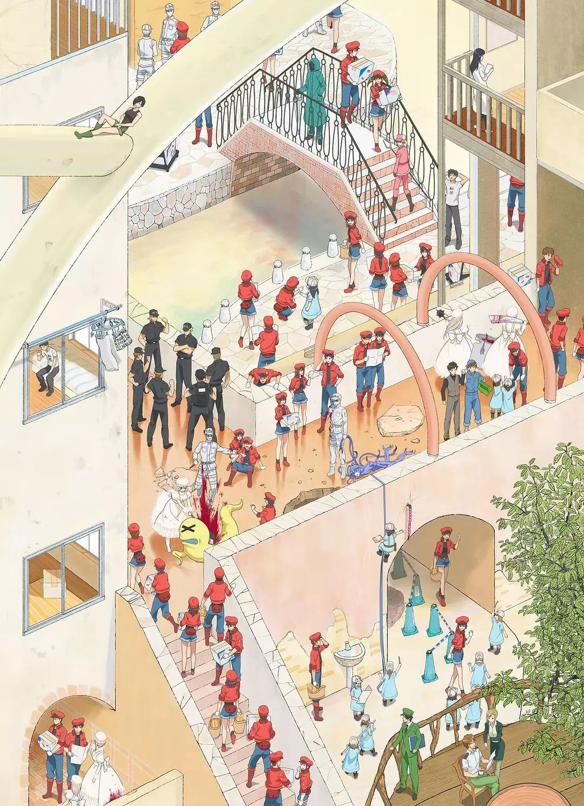

##  尔湾自住房首选 总价$70万起，尔湾“大公园”旁，紧邻尔湾联合学区

[和中海外置业]()**

每天为您送上最新鲜的海外投资置业资讯

**尔湾(Irvine)世界宜居城市之王**

尔湾地处洛杉矶东南部，上世纪60年代面积 180.5平方公里，全市20万人口，近40%为亚裔。尔湾是全美最活跃的经济区域之一，教育、休闲、娱乐等配套设施完善，近年来成为华人移民最理想目的地之一。尔湾紧邻世界级三大海滩  Lagunabeach、Newport beach、Huntingto beach。

尔湾所树立的丰碑数不胜数，将全美乃至全世界的精英汇聚于此，安家立业。然而它距1971年建市还不满50年。

最近十年来，尔湾的华人居住人口剧增，相应的华人超市、书局、各种面向华人子弟的才艺学校如中文、舞蹈、音乐、绘画等都在尔湾市安家，给华人创造了更加良好的居住环境。

这里拥有众多高等学府，包括美国加州大学尔湾分校、康科迪亚大学、尔湾谷学院、南加州大学橙县分校、布兰德曼大学、拉文大学和佩拍代因大学等。

尔湾市大部分地区位于尔湾联合学区内，该学区内有四所高中，分別是：大学高中、尔湾市高中 、诺斯伍德高中(Northwood)和伍德布里奇高中(Woodbridge)。其中，大学高中在2011年位列全美最好高中排行榜第八位，全美最好公立高中排行榜第二位。小学更是优秀，十八所小学被评为加州前100名小学。

这座城市的视野与格局，使得随后的每一次规划都兑现为成功的典范。说到最近的一次大规模规划，就不得不提到尔湾橘郡大公园。

**Great Park**

橙县大公园所在地曾经是海军陆战队空军基地，现改造成约1,300 英亩/ 526 公顷的绿色空间，公园不仅面积广阔，而且风景优美，目前仍然有200多英亩土地正在开发，688英亩的土地正在规划和设计中。

作为世界上最现代化的都会公园之一，这座精心设计的公园为后来者确立了更高的标准，橙县大公园的建设不仅仅是向这个空军基地的传奇历史致敬，同时也为当地居民带来了无与伦比的游玩体验，尔湾优质的生活环境本就吸引不少居民定居于此，大公园的建设更是为此锦上添花。

美三大建商的莱纳公司，在大公园附近拥有众多房产项目，目前在售的项目包括尔湾大公园四期的凯蒂恩斯花园（Cadence Park）和邻近大公园的门禁社区奥德庄园（Altair Irvine）。

公园的总体规划由享有盛誉的纽约景观规划师Ken Smith领导的团队，花费三年时间打造建成。由于设计出色，该规划赢得了十几个加州及全美大奖。而这座公园之所以被称为橘郡大公园，就是因为一个字：「大」。

尔湾大公园由一个又一个小公园连接在一起，占地近1500公顷，相当于2座纽约市中央公园，3.5座北京市颐和园，是21世纪全球最大的城市公园。它的主体包括：

*占地175英亩的大型体育公园（Sports Park)*
*占地188英亩的高尔夫球场和俱乐部*
*占地40英亩遍植多种花木、可供散步野餐观察野生动物的广阔林地（Bosque）*
*占地178英亩的景色随四季不断变换的野生动物走廊（Wildlife Corridor）*

*占地36英亩的Upper Bee步道和开放空间*

*社交休闲以及文化中心（Cultural Terrace) *

*集观赏性和教育性于一身的植物园（Botanical Garden）*

生活在这里，除了欣赏自然景观，平时还可以和家人，以及小孩子们乘坐可以升至122米的高空热气球，以及旋转木马。

每年秋季，橙县城市公园的热气球都会套上笑脸南瓜灯的外罩，迎接秋天以及万圣节的来临．这已成为当地的传统。

周四至周日的时候，公园的 Visitors Center 会免费提供球类飞盘等各种运动器材供游人在园内使用。Palm Court Art ComPIex 画廊也会不定期举办各种艺术展览。

每周日上午，公园的农夫市场会非常的热闹，一家人可以到这里选购新鲜的当地食材。

公园里还常常举办各种学习班、讲座、音乐会、露天电影和各种文化艺术节。园内还有游泳池、水疗中心、儿童游乐区、冰球馆、网球、篮球、排球、足球等设施。

此外，US News全美最佳医疗中心“希望之城”也计划在尔湾大公园区域建设一个价值2亿美元的顶级癌症中心，打造大尔湾地区最顶级的医疗保健和健康服务，致力于提升橙县居民的生活质量。

**尔湾全新社区CADENCE PARK亮相，14个楼盘闪亮登场！**

CADENCE PARK 共计由14个子小区构成房屋类型涵盖了联排 CONDO 、独栋 CONDO 以及独栋别墅，各式各样，多种选择。

CADENCE PARK大社区参与建设的开发商有：LENNAR、RICHMOND AMERICAN HOMES、K.HOVNANIAN HOMES、TRI POINT HOMES、TAYLOR MORRISON , PULTE HOMES和KB HOMES共计7家全美最顶级的住宅建筑商。

在这 14 个子小区中，有 8 个是由 LENNAR莱纳公司建造，而另外 6家建筑商各仅建造 1 个子小区。

*这些子小区预售价格从＄70 万一 180 万美金起不等。*

**CADENCE PARK SITE MAP**

Cadence Park 共计由 14 个子小区构成房屋类型涵盖了联体 Condo 、独立 Condo 以及独立屋。

**14 个子小区分别是 **

DECO , CHORUS , MUSE , LYRIC , PRADO , CABALETTA . ADAGIO , DUET , ENCORE , CANTATA , MARCATO , SERENDE , CAPELLA CRESCENDO。

**社区学校**

CADENCE PARK SCHOOL ( K 一 8 )
GRAND OPENING
PORTOLA HIGH SCHOOL (9-12)

**项目信息：**

总价：$70万起

房间数：2-5室

使用面积：153.6-426m²

户型外观：

**项目位置**

好地段！好学区！好价格！项目位于尔湾中心区域，临近播子郡大公园和尔湾联合学区，属于整体规划型高端社区，社区集豪华，休闲于一体，完美融合新旧风格，建筑以加利福尼亚休闲生活风情为灵感，风格独特，社区配有一整套优质生活设施，营造了私人的生活空间，高端大气，别具一格。此外，全美规模最大、最受欢迎的建筑商和房地产公司之一莱纳集团专为多代同堂家庭设计了“房中房”户型，提供创新的空间设计，在保证了独立的出入口和生活空间的同时，不影响居住的舒适度。

**尔湾联合学区**

IRVINE UNIFIED SCHOOL DISTRICT

全美最优秀的学区，享誉世界的K12教育

学区内教育设施最先进的小学：Beacon Park School ，巨资打造， 2016 年建校的新校。

尔湾最好的初中：Jeffery Trail Middle School、Great School ，评分10 分。

尔湾未来最优质的的高中，政府投资 3 亿美元：Portola High School。

**莱纳公司与尔湾大公园合作**

根据与尔湾市政府达成的开发协议，Lennar被授予有限的开发权来建设大公园周边居民区，但是需要将基地总面积的 28.8 % ，也就是 1,347 英亩（5.45平方公里），用于建设公园，并且为公寓提供2亿美元的开发资金，大公园居民区业主通过缴纳Mello Roos为公园的开发贡献另外2亿美元。

2013年，尔湾市议会通过提议，由Lennar旗下的子公司 FivePoint Communities 负责建设大公园内688英亩（在2017年增加的713英亩）、总值超过 2 亿美元的公共设施，并追加 1 千万美元改造进入大公园的主路 Marine Way 。作为回报，FivePoint Communities 得到在大公园旁边新建4,606栋新房的授权。

**近期精彩内容**↓↓↓****
**点击查看**

[日本，黄金十年！](http://mp.weixin.qq.com/s?__biz=MzA3MDczOTAxOA==&mid=2678986984&idx=1&sn=af744589ad25bf353b09ae13aa3377d0&chksm=85628dcdb21504db3358ed5bc1726614933266d644ffd6ec5619b4f0434a61fde507761ea3a5&scene=21#wechat_redirect)

[泰国永居政策出台！或将影响房产市场](http://mp.weixin.qq.com/s?__biz=MzA3MDczOTAxOA==&mid=2678986984&idx=2&sn=ec726cf9815f6eb642d8ddfc18b87e71&chksm=85628dcdb21504db118d5090a24d1e3e643bd7f07ca12d6be35c67a6a55571541b4a572b83a7&scene=21#wechat_redirect)

[2019，投资该去哪儿](http://mp.weixin.qq.com/s?__biz=MzA3MDczOTAxOA==&mid=2678986958&idx=2&sn=95349a9b13e315a870d597e5377137a8&chksm=85628debb21504fd4ba66c18353918b3d9c010d841179e3ce56bc87468b8f01d55067b40fad7&scene=21#wechat_redirect)

[硅谷山景城Radius社区，靠近斯坦福](http://mp.weixin.qq.com/s?__biz=MzA3MDczOTAxOA==&mid=2678986939&idx=1&sn=bffd76eaf475721c75bebfaae2c82d47&chksm=85628d9eb21504880e366b4742490af3c7e46914a21f4a88c91c9873473558064ae89f66e857&scene=21#wechat_redirect)

[日本有钱人为什么都住公寓？](http://mp.weixin.qq.com/s?__biz=MzA3MDczOTAxOA==&mid=2678986923&idx=1&sn=f83a32b150bcf916c41f1c7d77069ab8&chksm=85628d8eb215049889d60e05c85922b41d5c9726f30113ea2a670e7d1cd2c606bbf247684476&scene=21#wechat_redirect)

[不同季节，在美国买房真的有影响！](http://mp.weixin.qq.com/s?__biz=MzA3MDczOTAxOA==&mid=2678986898&idx=1&sn=57e03346d30e82c5a2be17c06c93c036&chksm=85628db7b21504a1ca7b9b4e50c582f8b99e9c50e5711416f3c98510a9a24c7d69036e3a8081&scene=21#wechat_redirect)

[蒙特利尔“中心公寓”耀世登场！CBD商圈核心](http://mp.weixin.qq.com/s?__biz=MzA3MDczOTAxOA==&mid=2678986775&idx=1&sn=ad4ff9e4860c322b7c8b80be2edc61bb&chksm=85628d32b215042459899f45f4e56f8eb765167b0f2dcbecef88c62be3ed51de285db4d172d3&scene=21#wechat_redirect)

[吉隆坡云顶1号 | 全球令人向往的高原避暑度假胜地](http://mp.weixin.qq.com/s?__biz=MzA3MDczOTAxOA==&mid=2678986839&idx=1&sn=1e6cf36aff41f0c7d8b770d5cc7923b5&chksm=85628d72b2150464119b3ec33244a71d282706a43c6786b6ca674c3aea75c96b6f65c4b37c2a&scene=21#wechat_redirect)

[总价39万英镑起，伦敦东三区Wellington Quarte](http://mp.weixin.qq.com/s?__biz=MzA3MDczOTAxOA==&mid=2678986788&idx=2&sn=825ddfa61bbcd0707cb4e427a7c41df6&chksm=85628d01b215041713808888b4ba2134c5b29cbc23f1c42dbbbbb5ec2481fb07ce35ee953937&scene=21#wechat_redirect)

[墨尔本CBD坐标建筑，闹中取静，坐拥繁华！](http://mp.weixin.qq.com/s?__biz=MzA3MDczOTAxOA==&mid=2678985536&idx=1&sn=727f9d5ffc11a6bf7240c100e7e68351&chksm=85628665b2150f731d3acfbff4de58e23e41d44c232de3916c6fef49ffbaa4fb924cae4eee16&scene=21#wechat_redirect)

免责声明：本平台所转载的文/图/音视频等，如无特别说明，均来自网络，版权归属于原作者及原版权所有者。如原作者及原版权所有者不愿意在本平台刊登内容，请及时通知本平台予以删除，谢谢。

本项目资料和效果图均由房产开发商提供，和中海外置业提示您上述信息仅供参考，关于项目的所有信息均应以最终签署的合同为准。谢谢。

**和中海外置业**
全球同一房源 同一报价
**> 我们的服务**
**> 投资顾问**
> - 投资目的国房地产政策的解读
> - 专业的财务、税费情况解析
> - 房地产价格走势分析
> - 新房源信息及特色介绍

**> 购房指南**
> - 海外房产考察计划安排
> - 出国考察服务/陪同(项目考察、国家/城市考察、学校/社区考察)
> - 房产交易、过户服务
> - 资金出境、贷款服务

**> 房产管理**
> - 专业的物业管理
> - 房产出租、租赁管理
> - 房产收益、升值市场资讯服务
> - 海外生活(教育、福利)指南

**> 置业热线**
**> 400-890-9300**
**> 18500717638**

了解项目新信息 请关注
**和中海外置业**
每天为您送上新鲜的海外投资置业资讯

**点击"阅读原文"，提交海外置业需求，获取专业指导！**

在看