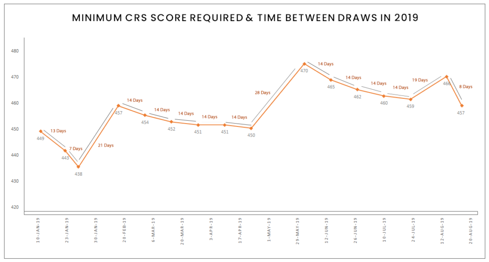

##  【政策】移民要趁早！加拿大联邦EE移民最新一轮抽签结束，分值小幅回落！

[深圳和中移民]()**

[文章转载自公众号和中移民， 作者 welltrend](https://mp.weixin.qq.com/s?__biz=MjM5MTIxMDMyMg==&mid=2650173983&idx=1&sn=790242f1e6fac4b89e559b3276c4fbb3&chksm=bebbdc2289cc55344168a6fe1002049cfa0b936ea6fc38ef311baf5c752fd419536ad6520e1b&mpshare=1&scene=1&srcid=&sharer_sharetime=1566535533407&sharer_shareid=badd687b22e02cbea2bccedfd5f757de##)

▼
更多精彩推荐，请关注我们

▼

把移民难题交给和中

加拿大时间8月20日，联邦快速通道技术移民项目发出了第124次邀请，**分数为****457****分，共邀请****3600****人。**这是本月第二次邀请，距离上次（8月12日）抽签仅相隔8天，此次EE抽签分数比上次466分降了9分。

在这次EE抽签中，加拿大移民难民和公民部（IRCC）采用了平局规则：候选人必须在2019年3月24日15:32:42之前提交他们的个人资料。这意味着所有CRS（综合排名系统）分数高于457的候选人，以及在此日期和时间之前在快速入境池中输入其个人资料的457分的人都会收到ITA（加拿大永久居留申请，下同）。

历年获邀人数数据分析图

从图三可以看出，自7月10日以来，加拿大移民难民和公民部（IRCC）一直在发行3,600个ITA邀请。在今年1月30日至6月26日期间，IRCC每次快速通道抽签发放了3,350个ITA邀请，这意味着过去四次抽签已经产生了250多个ITA邀请，而在此次抽签中发布的3,600个ITA使2019年发出的邀请总数达到56,200。这些大规模抽签规模可以帮助IRCC超过去年设定的89,800份邀请函的单年ITA记录。

历年分数数据分析图

从历年分数数据分析图我们可以看出，较2017、2018年，2019年EE的分数基本处于一个“高分”的趋势，但邀请人数较前两年多（看图三）。截止8月初，EE池子里分数分布情况如下：441－450分数段人数为8084人（8月2日为7821人），450－600分的人数达到7038人（8月2日为6821人），600分以上人127，相比上次的600分以上474人明显下降，说明拿到省提名后加600分走EE的人在这个时间段有所减少。虽然此次邀请分数降低了，但池子里高分段的人数，仍然在增加。按照正常每两周的邀请频率，短期之内邀请分数仍然会保持在460分左右。

众所周知，加拿大联邦快速通道系统是加拿大吸引外国技术工人的主要来源。各国符合条件的候选人进入快速入境池中后，系统会根据其年龄，教育程度，熟练工作经验以及英语或法语水平以及其他因素获得CRS分数。排名最高的候选人将在池中定期抽签获得加拿大永久居留申请（ITA）。

**和中专家提醒申请人：在池中，想要获邀没有捷径可走，唯有在自己最大能力范围内，努力刷雅思提高英语成绩，然后尽快入池等待时机。**

加拿大是最为看中人才国度，正如日前世界经合组织（OECD）报告评价加拿大：加拿大吸引技术移民方面做得很好，被其他国家广泛视为“基准”（"benchmark"），其他移民国家有必要参考加拿大！放眼过去的几十年，加拿大无论是哪个政党的政府，无论各任政府在政纲上有多少差异，但他们对移民的态度始终大同小异：欢迎移民来到加拿大，尤其是技术移民，任何政党都没有对技术移民有过任何的限制。

加拿大未来还会大力吸引新移民，在如此良好的形势下，如果您语言、学历条件够好，又有职业经验与学习经历相匹配，那么欢迎加入省财的技术移民队伍；如果您英语水平短期内无法提升到一个较高的分值，但具备一定的管理经验，适合您的是加拿大企业家移民，首选直通加拿大永居的快速通道队伍——NB省企业家移民项目；还有就是加拿大性价比高的项目——BC省省提名企业家移民区域试点项目，俗称BC省10万加币项目。这个项目所涉及的几十个社区离华人较爱的城市——温哥华较近，投资额仅需10万加币起，实属“物美价廉”的项目了。

看完以上这些，还在担心移民求助无门？其实，条条大路通加国！

**免责声明：**本平台所转载的文/图/音视频等，凡未注明“原创”等字样的均来源于网络善意转载整理，版权归原作者所有！如有侵权，请联系删除。

**如果您对移民或者本文话题感兴趣，**可在后台直接留言或点击左下角“阅读原文”，提交您的移民需求，******我们将及时安排专业的顾问老师为您一对一服务解答哦！**

[【分享】“轻移民”正当时，这些国家可以做到移民不移居！](http://mp.weixin.qq.com/s?__biz=MjM5MTIxMDMyMg==&mid=2650173937&idx=1&sn=4563bf26f24f5280ac7e5874a374203e&chksm=bebbdfcc89cc56daf27ced5939339a2e6a518b414b20b173787c2058bed3442855f14ac8454a&scene=21#wechat_redirect)

[【干货】第二本护照怎么选？看这篇就对了！](http://mp.weixin.qq.com/s?__biz=MjM5MTIxMDMyMg==&mid=2650173937&idx=2&sn=ddc80c34cfdf58e7c7976bbe3fc2302a&chksm=bebbdfcc89cc56da1cb9b2a4dc85220aa202fe14c9ba5fc0550b575c07ff546164ad55962bcb&scene=21#wechat_redirect)

[【案例】和中加拿大项目成果“枫”硕！一周内又有三组客户获得成功！](http://mp.weixin.qq.com/s?__biz=MjM5MTIxMDMyMg==&mid=2650173930&idx=1&sn=a575b08a6cc27f551da8ac80c354943f&chksm=bebbdfd789cc56c1ca6380423c0b22ff4cf143a53ccd13a1f75611c7596aedd5c20d127618d6&scene=21#wechat_redirect)

[【干货】拿到香港永居就不是内地人了？想保留双重身份你可以这么做](http://mp.weixin.qq.com/s?__biz=MjM5MTIxMDMyMg==&mid=2650173922&idx=1&sn=1ad1949adaea65c70a442bc707bf8686&chksm=bebbdfdf89cc56c9163c72c6a7b480c6860a87dd7e6f7a1897c4afb802ac815d694faa8bda39&scene=21#wechat_redirect)

[【投资】在中国炒房，此路不通了！](http://mp.weixin.qq.com/s?__biz=MjM5MTIxMDMyMg==&mid=2650173915&idx=3&sn=6ebfe4538b24a84aa8478d448f384558&chksm=bebbdfe689cc56f0f836d407c80f165f3e27f030afbcc4ecd5e4dfcbdadf7874c9f08c2420ca&scene=21#wechat_redirect)

[【护照】一本免签150多个国家的英联邦护照，一家四口只需10万美元！](http://mp.weixin.qq.com/s?__biz=MjM5MTIxMDMyMg==&mid=2650173902&idx=2&sn=ca3fcd65613d2adcf8fcd82582bc35d2&chksm=bebbdff389cc56e550b3cfbeabeacceb5213cb211d9a1f309f13bf86b593e21d5cbbff989eab&scene=21#wechat_redirect)

[阅读原文](https://mp.weixin.qq.com/s?__biz=MjM5MTIxMDMyMg==&mid=2650173983&idx=1&sn=790242f1e6fac4b89e559b3276c4fbb3&chksm=bebbdc2289cc55344168a6fe1002049cfa0b936ea6fc38ef311baf5c752fd419536ad6520e1b&mpshare=1&scene=1&srcid=&sharer_sharetime=1566535533407&sharer_shareid=badd687b22e02cbea2bccedfd5f757de##)

在看