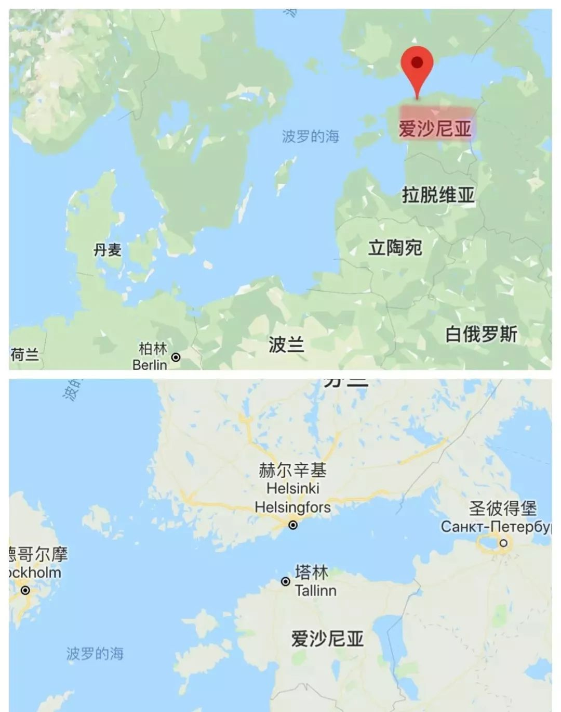
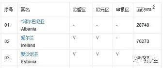
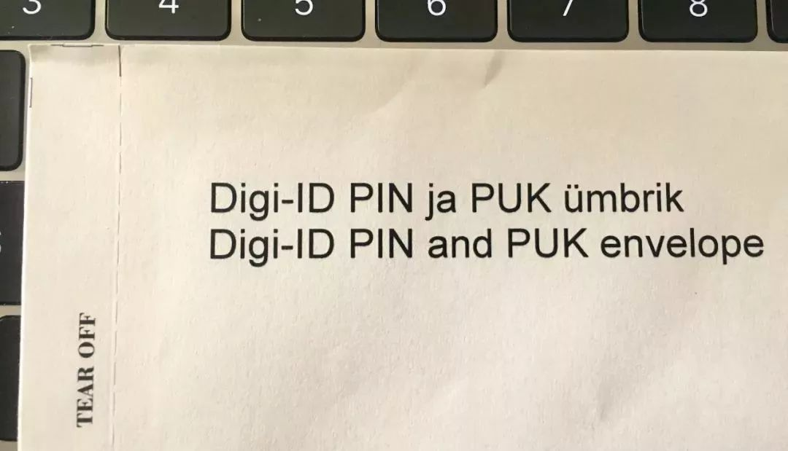
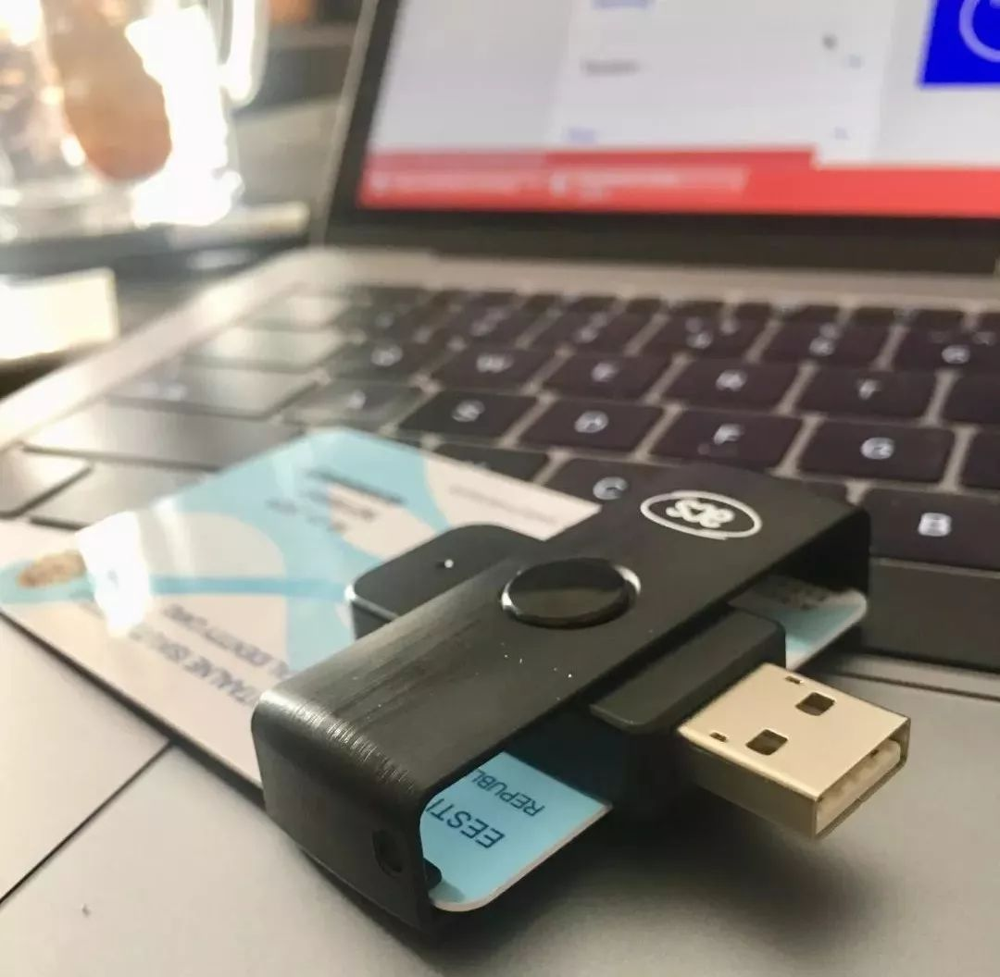
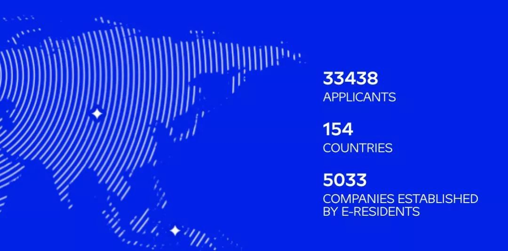
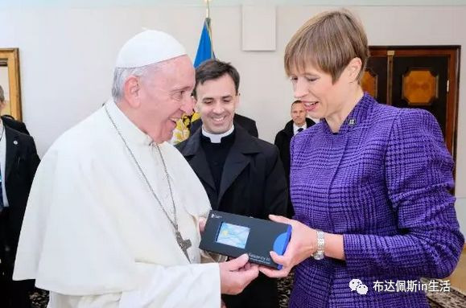
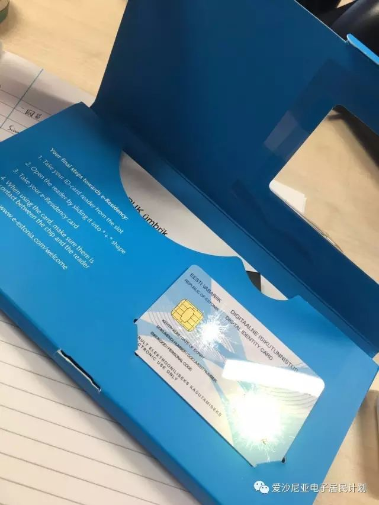
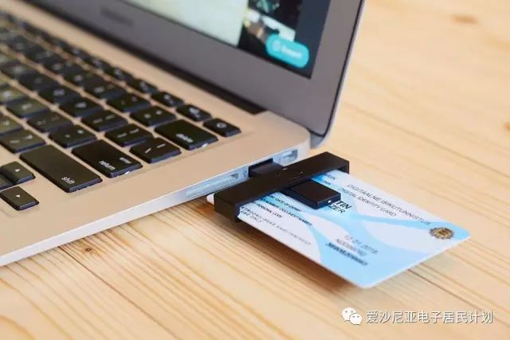
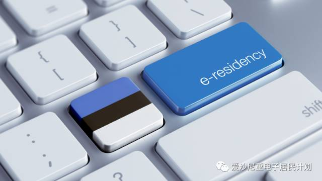
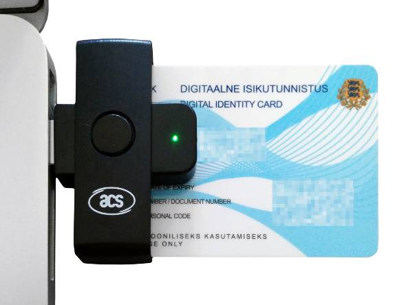

# 爱沙尼亚电子公民项目：你可能需要一张成为世界公民的通行证

2019-05-16 15:36

**~声明~**

~本项目可由我司直接对接**在爱沙尼亚政府机构办理**~

有任何问题敬请联系alex.gao@yisingcapital.cn

**爱沙尼亚电子公民项目：你可能需要一张成为世界公民的通行证**

《圣经·旧约·创世纪》第十一章：

人类曾尝试合作建造通往天堂的巴别塔，但是因为上帝赋予人类不同的语言，导致人类没有办法进行沟通合作，于是巴别塔项目失败了，从此人类踏上了长长的相互理解之路。

**自由**，一定是每个人都逃不掉的梦想。比如，财富自由，时间自由，足迹踩遍全世界，还顺带赚点用不完的钱。

像一个**世界公民**，走到任何一个地方，都像当地人一样生活，和当地人交朋友，和他们讨论文化、教育、经济、娱乐以及生活的一切，还可以合作做生意。

如果说，过去的10年，互联网给了我们一个新世界，让我们的衣食住行、学习生活发生了彻底改变，新科技像自己长出了生命一样会自己持续生长，说明了什么呢？

**未来的生活方式，会和现在彻底不同。**

随着基础交通工具、通讯设备升级，新型科技应用发展落地，我们与世界上任何一个城市的人们沟通、交易起来会有突破想象的便利，一个普通人就能很轻松地以世界为家，更容易成为也必须成为具有**国际化视野**的人。

在这个世界的不同角落里，已经有那么一群人过着我想要的或者还想象不到的有意思的生活方式，这一切已经充分勾起了我的好奇心。

如果你已经在海外留学、工作、生活了多年，或者因工作原因会在各个国家、城市做空中飞人，你一定已经有了更好的基础条件或更好的工具去与世界打交道。

我找到一种工具，应该更符合那种没有海外生活经历，常年固定在某个地方生活，又希望在不需要大动干戈搬迁城市的情况，还仍想要把自己的事业做到世界各处去的人。

这里有一张成为世界公民的通行证：**爱沙尼亚的“电子公民 ”项目**。

爱沙尼亚政府为发展经济，吸引外国人去那里开公司、做生意，为非本国公民提供“电子公民数字身份证明”，获得爱沙尼亚的电子公民身份。

拥有该身份的人，可以在线使用爱沙尼亚的政府系统，在线注册公司，利用数字签名签署文件和合同，远程管理公司，还可以开设该国银行账户管理资金，在线进行公司纳税申报等。

但这不是国籍证明，不具有爱沙尼亚或欧盟的居民身份，没有入境权和居留权，与个人出境旅游、移民没有关系，仅供商业活动使用。

爱沙尼亚在哪儿？

她是一个北欧小国，北边与芬兰隔海相望，东边与俄罗斯接壤，南边是一个叫拉脱维亚的国家。

她的首都叫塔林，与芬兰的首都赫尔辛基正好隔海相望。重庆有直飞赫尔辛基的航班，到达后坐2小时海船就能去到海对岸的塔林吃吃喝喝，是一条很好的旅行路线。听说塔林物价便宜，赫尔辛基人也爱在周末节假日跨海搞点采购，吃喝玩乐啥的。

话说回来，赫尔辛基人可以去买打折货，但爱沙尼亚又跟我们中国人有啥关系？到底领一个他们家的电子身份证明有何用？

我发现了三个好处！

> **(1) 通过互联网快速申领一张合法有效的境外银行卡**
> 
> **(2) 简便开设一家不受地域限制的低成本的国际公司**
> 
> **(3) 这个国家的调性很符合趋势，一个无国界的数字共和国，一片很适合区块链应用生长的土壤**

第一，获得境外银行账户

过去，我没有在国外生活、学习过，也没有需要与境外资金往来的交易需求，即使海淘或境外购物，也是刷信用卡再用人民币还款，一直没觉得有什么问题。

但是，从今年开始，深刻意识到没有一张境外银行卡是一件多么痛苦的事情。要不像招商银行需要500万的高门槛，要不像民生银行只能在北上深少部分城市才能办理，要不就只有去香港的银行现场办理，对于我来说，是极其不方便的。比如美股交易，比如……（详看第三点，趋势的土壤）

如果可以足不出户，仅仅通过互联网就能领到一个境外银行账户，未来一定会在很多地方起作用，这个需要去探索和尝试。这对于还没有且不方便办理境外卡的人来说，很有吸引力。

第二，开始低成本的国际公司

如果你想在世界的任意角落与世界上任意角落的人进行商业合作，还能便捷办理工商、税务或资金往来业务，这个电子身份和它的配套远程管理服务就很有用。

爱沙尼亚是集**欧盟区、欧元区、申根区**为一体的国家，也就是说，我作为一个在中国工作生活的中国人，可以远程开设和管理一家欧盟区、欧元区、申根区的创业公司，这其中一定还有更多可以发挥的空间。

图片来自百度搜索

第三，趋势的土壤

整个**e-Resident**项目就是建立在区块链技术基础上，爱沙尼亚的电子公民在世界任何角落都能在区块链上做文件公证。

这个国家也将以政府名义推出名为**estcoin**的数字加密货币，通过国家央行进行发币众筹，estcoin 也会是电子公民们的官方货币。

这真是一个有趣的世界。

目前，在国内只能去北京的爱沙尼亚大使馆领取，你会拿到下面这种蓝盒子，里面有三个东西：**卡片、读卡器、密码纸。**

👇👇👇👇👇

这预示着一种新经济体已经开始蓬勃发展。

无论你在世界各地，无论是在国际一线城市或者第三世界国家的偏远山区，无论你说着哪种语言，也无论你手握哪国护照，在这个经济体里都是拥有同一种身份实名认证的 e-Resident ，使用高新科技用智慧换取财富。

截至目前，全球已经有**154**个国家的**33438**位申请者，和**5033**家建立在 e-Resident 生态上的公司。包括弗朗西斯教皇、德国总理默克尔、爱沙尼亚总统克斯缇、法国总统马克龙、天使投资人Tim Draper等精英人士，整个华语区（包括香港，台湾，新加坡）的成员目前已经超过1800名并且正在快速增长中，预计2020年底，中国社区将增长到22500人。

马云爸爸说，阿里巴巴**让天下没有难做的生意。**

在阿里巴巴上，中国的、世界的小微型企业能够展示自己的商品，更便利地链接全球生意伙伴。类比回来，爱沙尼亚e-Resident 项目就是一个**升级版的“让天下没有难做的生意”。**

它的不同在于：

> **1.能买卖更多种类的商品：**这不仅是区块链版的阿里巴巴，还是区块链版的 Facebook、Linkedin，更多的数字信息、服务被定义为商品进行买卖；
> 
> **2.能更容易注册一家公司：**还是一家欧盟公司，还不受地域限制进行远程操作，只要有互联网就能够链接一切；
> 
> **3.更便利的远程交易配套服务：**享受集欧盟区、欧元区、申根区为一体的经贸政策，更便捷的金融、税务等第三方服务，让生意人免去不必要的麻烦、专注于经营；
> 
> **4.力量无穷的社群经济：**成为 e-Resident 需要实名认证、收集生物信息并支付费用，在全世界范围内筛选出一群有共同价值观、好奇新世界并渴望勤劳致富的人，跟这样一群人打交道更简单有趣。

这个发展趋势已经不可逆转，这种新型经济体正在茁壮成长，正如开头视频中分享者郝杰说的那样，人类一直走在一条长长远远的相互理解之路，而最有效的相互理解就是商务沟通，我们正在见证并可以参与建设这条新的巴别塔之路。

**电子居民计划**

**爱沙尼亚电子居民身份有什么用，有什么好处？**

**可以开设海外银行账户：**

你可以在全世界网络最安全，银行金融业最高度电子化的国家开设银行账户，这样你就拥有了自己的海外银行账户。在当今中国人民币持续贬值，外汇政策不断缩紧的情况下，拥有海外账户不仅让你能够有效做到资产避险，还是完成资产海外配置的捷径——简单来说，你以后如果想在国外买房、投资，避免人民币资产贬值，拥有一个海外账户会方便很多，不会出现没有个人海外账户或者办理账户无路的焦急情况。

**注册开设欧盟公司：**

这对于创业的你来说，是一个不可多得的进入欧盟的好机会。你的公司可以在海外以欧盟公司的名义开展各种商业活动，将业务覆盖至欧盟全境。除此之外，拿爱沙尼亚电子居民身份并开设欧盟公司是有效避税的捷径——不仅欧盟内部商品流通等等都是全部免税，而且营收如果不用来分红就不需要收税，中国早就和爱沙尼亚签署过免双重收税条约。

**安全：**

爱沙尼亚是北约网络安全防御中心所在地，爱沙尼亚电子居民身份能够让你利用数字签名签署文件和合同，验证他人发来的具有数字签名的文件的真实可靠性

**省事省时：**

最快的速度完成申请电子居民卡和注册公司，所有公司相关事务都可以在线操作，不需要本人实际落地，方便快捷

**爱沙尼亚电子居民身份有时间上的限制吗？**

您的电子身份证是有有效期的，电子居民身份是不受时间限制的，只要您无犯罪记录，身份证有效期到期后，更新身份证卡片就可以了。

**海外账户安全吗？**

爱沙尼亚属于欧盟， 爱沙尼亚银行系统直接受到欧洲中央银行体系监管。 爱沙尼亚也是北约网络安全防御中心所在地。

**适合国内哪类人？**

从事：国际贸易人士， 电子商务人士，金融业者，创业家，经常出国旅游的人，计划海外移民或出国接受教育的人士。

**最后，提醒大家注意用卡安全。**

