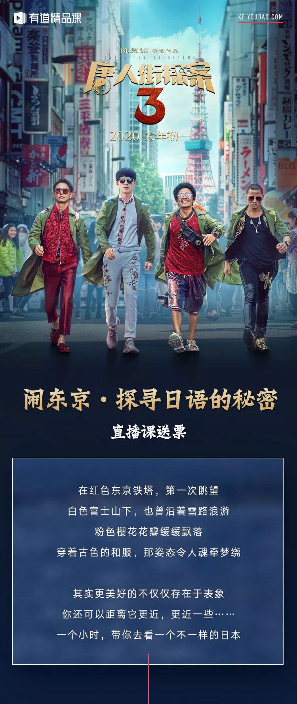
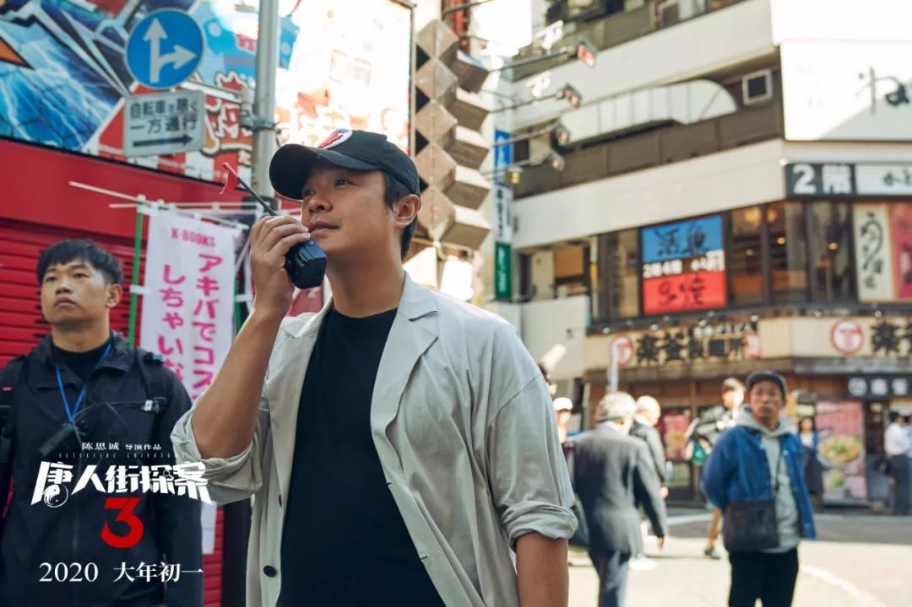
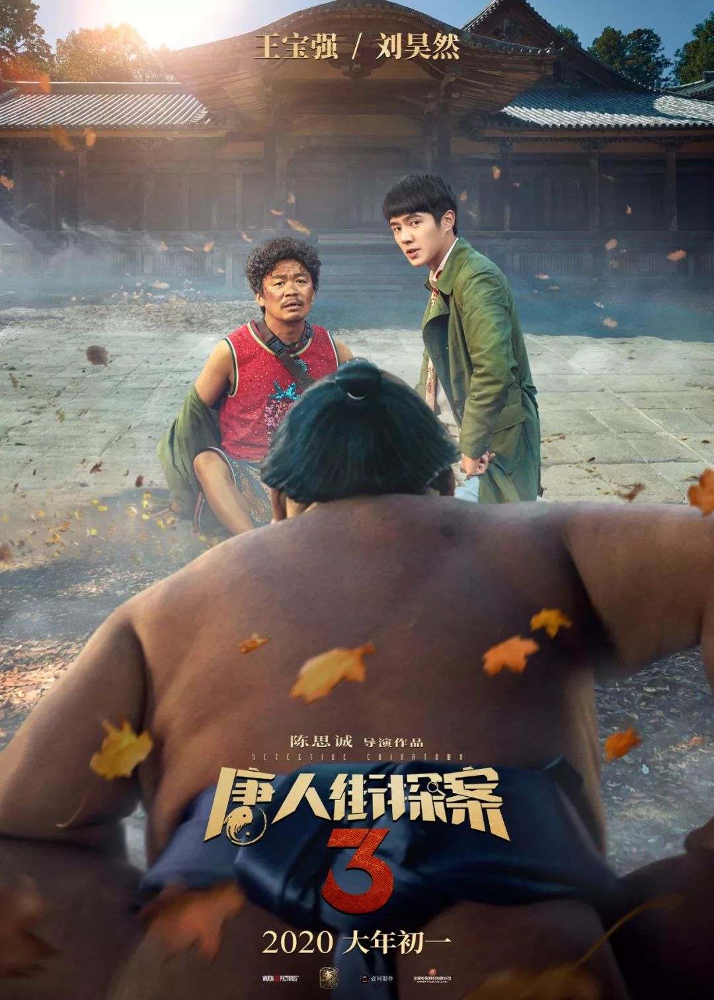
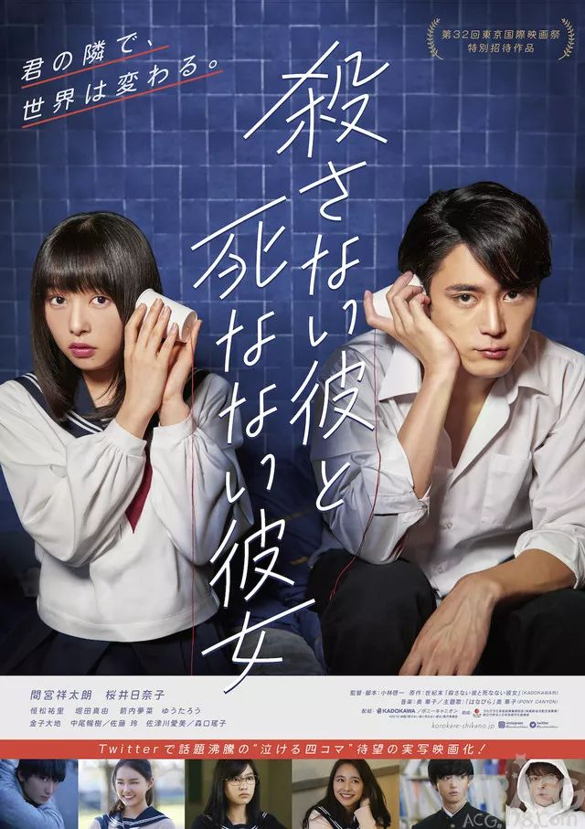
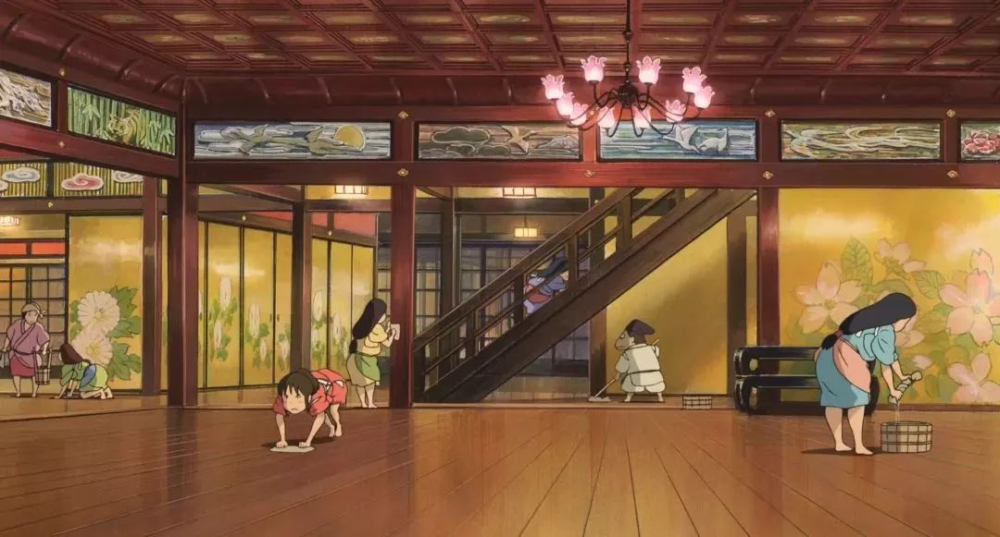

##  看完日本幼儿园上课，才明白我们的孩子太应该习武了！

[创业最前线]()**
****

### “教育是最廉价的国防” ——这句话深深地影响了战后的日本。别说日本变态，他们教育幼儿确实有一手。

**一起看看吧**：看完日本这个幼儿园的身体素质课，大家都震惊了！都说孩子是祖国的未来，身体素质是孩子成长阶段最重要的环节。

当我们的孩子20年后成为这个国家和民族的中流砥柱的时候，能否对抗得住这群正在嗷嗷叫着成长的小狼？

建议WI-FI环境下观看！

**人生百年，立于幼学！**
**民族复兴，立于幼学！**

日本幼儿教育牛在哪里？这里有20个细节：
### 01、简朴的环境
幼儿园不论是公立的还是私立的，他们的课室都极为简朴，看不到一点“豪华”和“现代化”的影子，除了一架钢琴、一台电视机和一台手提式的收录机，是显得稍微“高级”一点，其硬件均比起国内要求的“五机一幕”相差较远。

至于幼儿的玩具，则是一些硬纸皮、大小各异的包装箱、报纸、尼龙绳、木或竹制筷子、还有大量的图书，**任由孩子堆砌、涂鸦、剪贴、玩弄，只见幼儿乐在其中。**

殊不知，这正是日本教育者的英明：**体现以人为本、以孩子为中心的教育理念，人要发挥自己的潜能，不能变为“成品”的奴隶**。进步，使人们形成更大的生存压力，营造“适者生存”的氛围，合理的充分利用周围的资源。

通过环境进行教育，从而**培养孩子的创新精神**。

### 02、条理性：所有包，自己整理

办理入园手续的第一天，幼儿园就要妈妈准备若干个大大小小的包。

书包、装毛毯的包、装餐具的包、餐具盒、装衣服的包、装备换衣服的包、装换下来衣服的包、装鞋子的包等等，而且对于包的大小也有规定，有的幼儿园甚至要求所有的包都要妈妈一针一线地缝制出来。

孩子们要把自己的个人用品分门别类地整理好并放在统一的地方，常此以往从小开始锻炼做事的条理性。

**日本人对垃圾分类极为严苛，精细分类处理而不觉其烦这也从小的教育方式是息息相关的。**

### 03、小孩拿包，大人空手

日本家长在接孩子下幼儿园的时候，手里一律空着，各种包都是由小孩子拿着。

日本家长认为培养孩子**“自己的事情自己做”**要从一点一滴做起，**从而锻炼孩子的责任感和吃苦能力。**

日本皇室接送小公主上幼儿园，即使下雨天也是孩子自己拿包包。

### 04、脱穿衣服，锻炼独立生活能力

幼儿园是统一服装，春秋换装，全年登园时最外边都要穿幼儿园的套头衫，穿短裤，戴蓓蕾帽（夏天戴草帽），穿自己的鞋子。

到了幼儿园，就要把套头衫脱下来，换一种玩耍时的罩衣，鞋子脱下来，换白色的芭蕾鞋，到操场玩的时候，自然再换自己的鞋子。

每天早上，都要重复一套换衣程序，**日本的妈妈们都是站在一旁看着孩子，从不伸手帮忙**。

**日本幼儿园就是通过这个每天的穿衣换衣，让孩子练习独立生活的能力的**。通过每天到校后，换衣服、放联系手册，自己帖当日的sticker，挂手绢等从2、3岁开始的训练，孩子们养成有条不紊做事的习惯。

### 05、冬天穿短裤锻炼毅力

日本幼儿园的孩子，冬天无论多么冷的天，都穿非常短的短裤上学。

父母从小就不让孩子多穿，目的是让孩子有健康的体魄，顽强的意志。半裸上身的小朋友，即使在冬天也很有活力地在玩。

久而久之，孩子们都锻炼出了抗寒的能力，很少再有发烧感冒的情况出现。

### 06、教孩子学会“笑”和“感谢”

日本幼儿园的孩子们没有课本，只有每月一册的绘本。学校的教学计划中，完全没有数学、假名、绘画、音乐这些项目，更别说英语、奥数了。

学习的重点居然是：**教孩子们学会笑眯眯和说谢谢**！

虽然没有多少知识性教育，但是孩子通过综合的教育方式，往往能在音乐、美术、阅读等方面有更大的进步，这的确很令人出乎意料。

### 07、重视“食育”**
在中国，幼儿园的老师会鼓励孩子吃饭动作快一点。日本更重视“食育”，提倡细嚼慢咽。

在“食育”中，“丰富的心灵”是重要的一环，它包括“快乐的进食过程”、“感谢的心”和“参与意识”，**不仅教孩子正确地吃，还要从吃中体会出感恩、环保和节俭的内涵来。**

快乐又充满想象力的童年，从充满爱的便当开始，吃了还想吃，也不愿意浪费。吃饭之前日本人都会说一句“我开动了”，吃完饭之后，会说“谢谢款待”。这样的习惯，有助于培养孩子感恩的心态。

### 08、了解生命的由来

孩子生日前，老师预先与他的父母联系，询问名字的由来，还借来孩子自出生以来的照片在班上展览，并请孩子的母亲写信谈谈孩子出生时的情况，并在班里读给孩子们听。

与我们有些家长给孩子操办的大吃大喝大买礼物的生日会不同，**这一系列生日活动的目的是让孩子了解生命的由来，懂得诞生与成长的艰辛，喜悦和感恩**。

日本人坚信，孩子从小知道尊重生命，长大后就很少会做出越轨的行为。而在幼儿期，通过为孩子们过生日、教他们培育动植物等活动，都可以让他们在朴素的惊奇和感动中了解生命，是培养生命尊重的绝佳机会。

### 09、从幼儿开始的礼仪教育

孩子在幼儿园毕业时也会经历一次像大学毕业一样庄重的仪式，园长、老师、家长以及孩子们都会穿戴正式且一丝不苟地完成整个仪式，而且各种仪式会随着孩子的成长一直相伴到终生。

可见从小开始对孩子进行礼仪的灌输，对孩子的修养的打造起到了多么重要的作用，“礼仪之邦”的确名副其实。

### 10、宝宝0岁就参加运动会

0岁的宝宝就要参加幼儿园的一切大型活动，比方运动会、演出发表会等。

从小就锻炼孩子参与到集体生活中，培养集体荣誉感，长大了之后也会有坚强的体魄和坚韧的精神。

### 11、女孩子踢足球

日本幼儿园到了年中组，开始上每周一次的jumping课，相当于中国的体育和形体课;到了年长组，就有了足球大会，孩子们成天不是练习打鼓，就是练习足球，而且不停有幼儿园之间的比赛，女孩子的身上青一块、紫一块的，但是**体力和勇气都练出来了。**

### 12、一年到头数不清的活动

一年到头不知道爬多少次山，看多少次湖，观察多少次动物和植物，除此之外，捡橡子了，打年糕了，开运动会了，为社区演出了，宿泊了，过园节了，开发表会了，去拜寺庙了，作品展了，反正是名堂多多。

**日本的幼儿园生命在于活动。**

### 13、节日特别多

日本幼儿园过一切他们自己的传统节日，女孩节，男孩节，纳凉节，除此之外，中国的正月初七的七草节、二月的节分、七七乞巧节都认真地过上一遍，并且要自己制作手工艺品，让孩子牢记自己国家的民族传统文化，培养自豪感。

### 14、完全混龄教育

在早上9：30之前，下午3：30以后，全园的孩子都在一起玩，而且在院子里，大孩子抱小孩子，小孩子追大孩子，玩得很疯狂。孩子们真正能体会到哥哥姐姐、弟弟妹妹的感觉，成长感特别明显。

### 15、大便习惯，从幼儿抓起

日本幼儿园里有“大便教室”，老师扮成“大便先生”到各个学校登门授课，告诉孩子们大便与人体健康的关系，还带着孩子们用粘土做各种形状的“大便”，告诉他们：哪种大便健康，哪种不太健康，应该在饮食上注意什么，等等。

**在1岁半就开始进行使用便器的训练**。在孩子专用的厕所，放着一大排冲水便器，孩子一入托就通过保育员人盯人的训练，学习正确使用厕所和清洁身体的方法。

### 16、遵守交通规则，讲究秩序

遵守交通规则，日本小孩从小就被灌输这种理念，而上面这个视频中的日本小女孩的行为在日本已然是稀疏平常。

**日本学生放学时，并无老师带队，都是自行列队有秩序地走在人行道上**，一路红灯停、绿灯行，走到自家附近或者需要等车回家的汽车站时自动离队。

所以大家会发现日本人过马路真的很少能看到闯红灯的现象。当行人过马路时，所有车辆也会自觉停住，严格遵守秩序和规则。

### 17、强调团队合作

**运动会，只有团体赛，没有个人单项比赛，最终只有胜利的团队，没有胜利的个人**。强调参与，不鼓励相互对比。

网络上的这段视频迅速走红，日本幼儿园的一名小男孩挑战比自己还高的跳箱，却怎么都跳不过去，旁边的同学以及老师一直替他加油打气，最后小朋友小宇宙爆发！网友纷纷感叹，友情和鼓励的力量真的好强大！

### 18、户外游戏多

幼儿在幼儿园的生活是自户外游戏开始的。幼儿园场地有的较大，有的虽不很宽敞，但利用较充分。活动场地四周设置了多种玩具、器械、运动设施。

例如，跳马、秋千 、摇船、拔梯、弓形爬梯、单杠、爬高的绳或杆、推车、脚踏车等。幼儿园通常都有一种联合运动器械，用原木制作，包括攀爬架、悬桥、滑梯、平衡木、爬网等。

户外活动并不是硬性由教师安排的，而是由幼儿自己自主选择的，玩什么，怎么玩，他们自己做决定。教师也与班上孩子们一起玩。如教师与孩子们一起挖沙地，往里面倒水……或是做泥饽饽等，共同游戏，尽情享受游戏欢乐。

### 19、佛教的影响

日本寺院非常多，寺院的周围通常建有幼儿园，寺院的主持又兼任幼儿园的园长，这在日本各地都是非常常见的。

幼儿园每个月都要到寺庙里受一次教诲，园里最重要的节日一定要拜佛，佛诞日、涅磐日都有活动。日本人相信，从小对孩子进行佛教思想的浸透，会使孩子拥有一颗懂得感恩的心。

### 20、老师的能量

一个班，少到10个人，多到30个人，老师都只有一位。**全班孩子的所有活动、技能、知识都是一个老师教。**

包全班孩子的生日、作品的大型发表会、运动会，全是这一位老师操办，有条不紊，像模像样。

日本的整个社会对教师非常的尊重和认可，家长从不会因孩子在幼儿园运动受伤而责备老师，反而因自己的孩子给老师添麻烦而道歉…

免责说明：这篇好文章找不到来源，版权归原作者，向原作者致敬！如涉及侵权等问题，请联系我们删除，谢谢。

—End—

[阅读原文](https://mp.weixin.qq.com/s?__biz=MjM5ODAxMTA5MA==&mid=2649899299&idx=1&sn=88b5f46501d030e523480a141c6d4013&chksm=bed7a89e89a021886c8882b9c6197e830ad2e003175ecfd7516009aac99be8901f578799079b&mpshare=1&scene=1&srcid=0812wMEIxZ6CzpF9sHv0cZpn##)