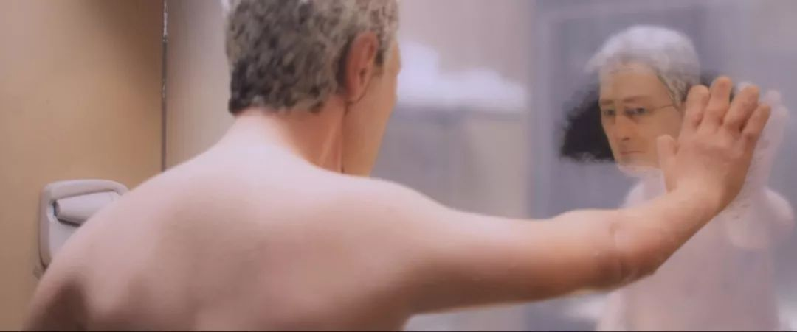
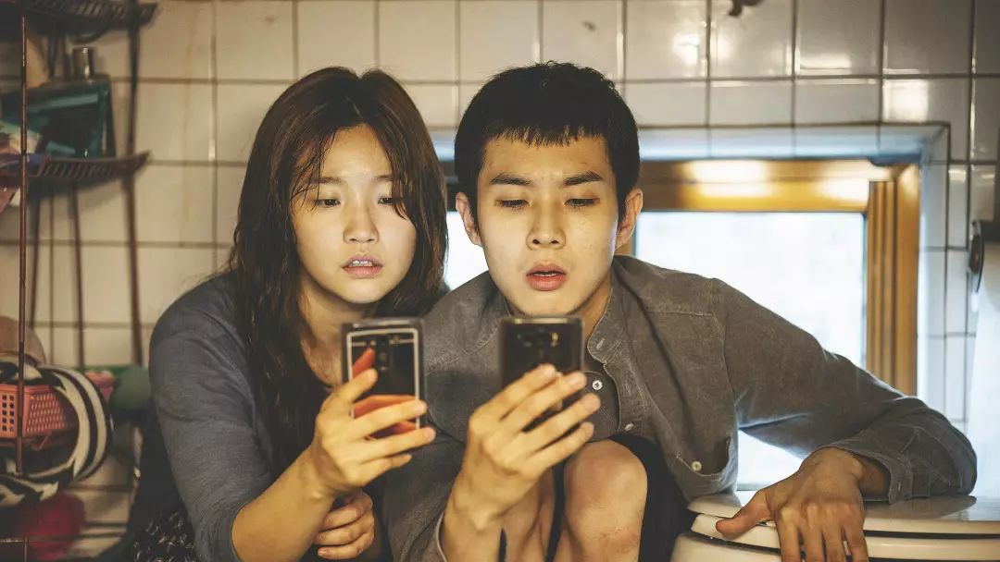
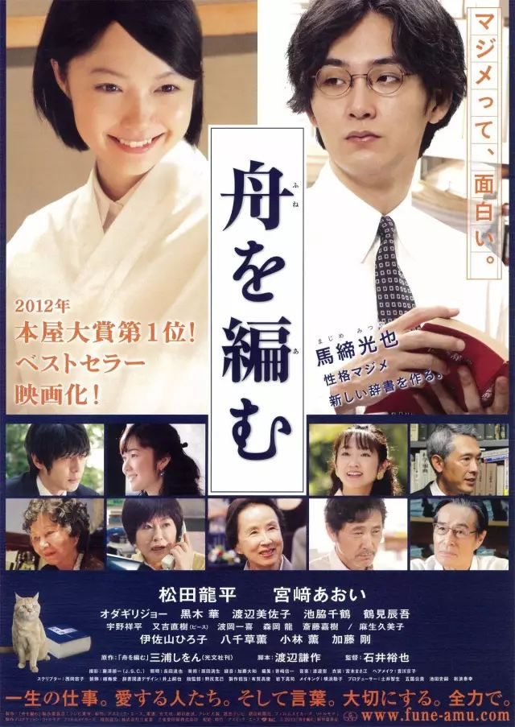

##  耶鲁校长开学演讲：比起正确答案，我更愿意听到学生说“我错了”

[北美学霸君]()

> 人们印象中好学生的标准，是他们似乎天生就知道正确答案是怎样的，很少会犯错，然而，在今年的耶鲁开学典礼上，耶鲁校长苏必得的演讲却颠覆了这一观念，他说，比起得出正确答案，更重要的是提出问题，承认“或许我错了”…此番演讲为这些从小就拔尖儿的学生们上了醍醐灌顶的第一课，快来跟学霸君一起看看吧！

> 接下来学霸君还会更加努力给大家带来考试干货、学霸技能、和备考经验的！快来点击标题下方的**> 北美学霸君**> 关注我，么么哒！
****
文｜张凌锋
From 外滩教育
微信号：TBEducation

美国时间2019年8月24日，耶鲁校长苏必德为2023届耶鲁新生发表了开学演讲。在演讲中，**苏必德强调了耶鲁注重对“好奇文化”的培养，并结合自身经历以敦促新生：只有对未知心存敬畏、保持好奇、不断提问，才能进行自我的提升，而这，也是耶鲁之所以为耶鲁的原因**。

* * *

早上好！向所有Eli Whitney项目的学生，所有的交换生，国际访问学生以及我们新一届的耶鲁新生致敬，欢迎你们来到耶鲁！

在这里，我谨代表学校里的同事，对今天来参加活动的家庭致以诚挚的问候。请诸位尽情享受与家人共度大学第一段生涯的美好时光。

耶鲁校长苏必德发表演讲

通常来说，在开学演讲中，校长都会告诉学生：你们是从世界上万千的精英高中生里选拔出来的，都是能独挡一面的个体。

当然，这是事实，不过这并非我今天想要表达的观点。

相比之下，我更鼓励你们：

- 不要因为自己的独特而怡然自得；

- 学生们应当多接触我们的校园；

- 相比答案，能更多地提出自己的问题；

- 能承认自己处于迷茫或困惑的状态；

- 愿意表达：“虽然我不太了解... ... 但我会去寻找答案。”

并且，最重要的是，**我们的学生要勇于承认：“或许我错了，或许其他人的观点是正确的。”**

这是新生们从老师与同学处最能学到的东西。并且，这也是我们聚集于此的原因。**我们来耶鲁是为了提出问题，提出关于彼此；关于我们所处世界的问题。**

耶鲁校园

**1**

**在耶鲁，我们着重对好奇文化的培养。**

在刚刚度过的夏天里，我阅读了一个有关于伊西多·艾萨克·拉比（Isidor Isaac Rabi）的故事。

作为一个婴儿，拉比于1898年诞生在美国。在这之后，他开始注重对粒子束的研究，他的相关研究让MRI（核磁共振）以及诸多学科获得了提升。1944年，拉比还因为自身的成就获得了诺贝尔物理学奖。

拉比的父母在布鲁克林经营着一家小杂货店。他的母亲没有受过正规教育。不过，拉比记得母亲曾问过他一个重要的问题，正是这个问题，成就了自己璀璨的人生。

拉比是美国最杰出的科学家之一，
他也是核磁共振仪的发明者。

普通的家长，每天下午都会向孩子提问：“你今天在学校里学到了什么？”拉比表示，自己的母亲与其他家长不同。“她只会问我一件事：**你今天有提出一个优质的问题么？”**

拉比认为，正是母亲的这一举动，让他养成了不断提出优秀问题的习惯，为迈向杰出科学家的道路埋下了伏笔。

所以，我建议在场的所有家长，当你们给孩子打电话的时候，在关注他们的同学、室友与就餐情况之外，请记得问问孩子，看他们近期提出过怎样的问题。

从牛顿的万有引力到量力科学的重大突破，这些或来自耶鲁或来自其他顶尖高校的伟大发现，其实都是基于提问所产生的。

当音乐家开始采用一段新的旋律；当社会学家开始观察一段社交行为时，他们都会问“为什么？”，“如果这样/那样的话，会发生什么事情呢？”正是他们的好奇心，点燃了人们心中的火苗，并且引领世界往全新的方向前进。

对自我的发掘与提升，同样来自于提问。举例来说，当我们质疑一件事并表示“为什么我要相信它？”，“为什么我要这么做？”的时候，我们其实已经学会了反思，并获得了成长。

演讲会场

我想起了诗人比利·柯林斯（Billy Collins）的话语：**“诗歌存在的问题，就是在鼓励更多诗歌的出现。”**

我觉得这一言论同样适用于提问。**诗歌和提问，都是通过一个点，去点亮另一个点；通过一扇门，去打开更多的门。**

有些时候，我们问题会把我们引向一条死胡同。这个问题或许并不能带来正确的解答，一扇知识的大门也因此无法打开。

但请你们牢记，沿途中的那些收获，能帮助我们在将来提出更优秀的问题。

比利·柯林斯，美国著名诗人

电影“粉红豹”（The Pink Panther）中有这么一个著名的场景：“乌龙探长”克鲁索(Clouseau）在一家德国酒店检查，他在酒店大堂看到了一只腊肠犬，所以向酒店老板询问：

“你的狗咬人么？”

“我的狗不会咬人，先生。”

得到答复的克鲁索便放开戒备逗狗，没想到自己的手却被深深地咬了一口。他开始与老板对峙：

“我记得你告诉过我，你的小狗不咬人。”

“那只腊肠犬并不是我的狗，先生。”

很多年前，我曾参与组织了一场本科研讨会。这个课程讨论的其中一个问题是——你曾为哪一件重要的事情改变过自己的想法？

令我感到惊奇的是，有少部分学生从来没有为任何一件事而改变自身最初的想法！最终，我们决定，这门课只接收那些改变过想法的学生。

所以，**我们的学生应当乐于转变自身的观念；勇于提问并且拥抱耶鲁的“好奇文化”；对不同的观点与经验持开放的态度，并将其视为一种学习的契机，即使有时会因此受到一些伤害**（像克鲁索一样被腊肠犬咬）。

与会的学生及其家人

**2**

我是一名社会心理学家。作为从耶鲁毕业的一员，我的好奇心是在情绪相关的研究中迸发的。

当然，我的好奇心也受到了本科顾问的启发，他曾问过我“必德，你觉得人类为什么会有情感？情感对我们产生了怎样的作用？” 从那时起，我与团队的课题之一，就是情商研究。

在早期的工作中，我们将情商视为一种技能——通过系统性的学习，人们可以掌握情商这项能力，并借此解析人们情感中所包含的那些“数据”。

多年的相关研究后，我和同事们意识到：我们并没有找到那个正确的提问。我们需要确保情商能在日常生活中展现出来——能组建朋友圈、能在学校成功学习、能融入团队工作等，诸如此类的能力。

问题来了：我们如何进行情商能力的评级？

就此，团队进行了内部提问，“通常而言，心理学家如何进行个人特征的测量？”答案是他们经常让人们给自己打分，即一份称之为“自我评估”的报告。

然而，这一答案使得我们更为沮丧，人们怎么样才能知道自己是一个善于识别、理解、管理并且运用情绪的人呢？我们有没有想过，或许自己以为的高情感张力，对他人而言却是情商缺乏的表现呢？

演讲会场

我们（将情商视为可量化的技能这一）错误的提问，使得真理之门无法打开。

为此，团队提出了一个新的问题：如果我们想要了解一个人是否具备优秀的棒球运动员的能力（比如：击球、投掷、接球、高效地跑垒等），那么，此时的“自我评估”有多少的可信度呢？

显然，可信度不高，因为所有的球员都认为自己是下一位A-Rod。我小时候和哥哥在家中后院玩耍时，还自认为是下一位卡尔·雅泽姆斯基（Carl·Yastrzemski，美国职棒大联盟成员，是棒球名人堂成员之一 ）。

还好，我从未因为自己的这种骄傲而被排挤。

A-Rod，棒球运动员，纽约洋基队的先发三垒手。

为什么情商（技能）的评级与棒球不同呢？如果我们想要知道某人是否具备高情商，我们就需要将这些技能视为能力。那怎样的标准可以用来衡量情商能力呢？

自我反思上述这些问题，有助于我们更加接近正确的答案。（目前，耶鲁基于能力形成的情商测试，已经被应用于数百项科学研究之中。）

**承认我们并未寻得所有的答案，并采取一个好学的、好奇的态度，这有助于我们去创造或发现全新的事物。**

所以，身为学生的你们将会提出什么样的问题呢？你们将来的好奇心又会因何而启发呢？

**3**

不久前，我收到了封来自一位耶鲁家长的电子邮件。这位家长在邮件中十分骄傲的跟我分享：自己的儿子在耶鲁的第一年，就已经听完了77位不同演讲者的讲座。

77位！他从这些政治领域的思想家和领导者那里学到了很多，并且还参加了由各种社团举行的活动。这是怎样的一种度过第一学年的方法呀！在场的诸位，你们能坚持这样的举动一年，并且不改初心么？

事实证明，这位学生还十分擅于提问。他在过去的一年中采访了数十人，这其中，有来自不同领域的学者、活动家、记者以及企业家。

**在耶鲁，这位同学就像许多学生与教职工一样，培养自身的一种好奇文化。**

欢迎2023届耶鲁新生

往届的耶鲁人已经提出了许多的问题。比如，那些提出男女同校的先驱们。

五十年前，在1969年，588名妇女来到耶鲁大学学习。她们进入了一个长期以来一直被男性占领领地，并且她们提出了从未被提及的问题（即男女同校）。

今年，在女性入读耶鲁艺术学院150周年之际，我们也将纪念这一具有里程碑意义的事件

我还想起1971届的玛格丽特·华纳（Margaret·Warner），她是一位屡获殊荣的记者，知道如何提出那些精彩的问题。她从事战区报道数十年，亲眼目睹了历史并试图借此了解我们世界的真实模样。

我也想起1971届的爱丽丝·杨（Alice·Young），她曾环顾整个校园，并疑惑为什么没有更多来自公立学校的学生入学。后来，她成为了耶鲁大使并回到家乡夏威夷州进行宣传。她还是亚裔美国学生联盟的创始人之一，今年，是该联盟成立的50周年。

耶鲁校长苏必德（右）、研究生院院长（左）与新生合影

我们还记得其他重要的纪念日，以及参与这些变化的，那些好奇的学生。

1969年，由于学生的努力，被称为“The House”的美国黑人文化中心开业，这一中心现在正在创建非裔美国人研究系。

同年，学生们建立了MEChA的耶鲁分会（Movimiento Estudiantil Chicano de Aztlán，是一个致力于促进高等教育、文化和历史交流的学生组织）。

**我相信，我们应该感谢所有勇敢的开拓者。纵观整个耶鲁的历史，他们是今天耶鲁之所以能成为耶鲁的主要原因。**

我再次回到刚才的提问：**你将会提出什么样的问题呢？你的问题又会如何改变耶鲁与我们的世界呢？**

你们在耶鲁度过的这些时光，是与众多人、众多思想以及众多经验进行互动的最佳时光。在这里，你能与诸多领域中世界知名的专家进行交谈。你们将有机会通过严谨的研究去创造出知识，并且参加那些能挑战自我、激发灵感的艺术、文学或体育活动类项目。在耶鲁大学，你们将会度过一段，与同龄人完全不同的生活！

耶鲁新生

**勇敢走出舒适与安全区，并借此培养自己的好奇心。**那样的你们该如何耀眼？我很难去想象。

走出安全区，意味着你们能在耶鲁大学实验室或某一展览中进行研究；意味着你能接触到来自世界不同地区，不同政治领域的同学。

当然，走出安全区，也意味着你们要去参加那些不太了解的主题讨论；意味着讨论中还会出现一些与你们意见相悖的人。

当你做这些事情时，当你利用这些耶鲁带来的机会时，你会提出怎样的问题呢？

耶鲁校长苏必德（中）与老师们

世界上存在着太多的未知，因此，我们需要为自身的谦逊而庆贺——我们愿意承认目前存在许多我们尚未能发现的事物。毕竟，**如果你知道所有的答案，你就不需要耶鲁。如果人类知道所有的答案，世界就不需要耶鲁。**

所以，今天我们的学生会提出什么样的问题呢？明天呢？后天呢？

耶鲁的新生们，（我希望）在毕业典礼我与你握手之后的几天、几个月、或者几年之内，你能告诉我，那些你所提出来的、切实地改变了你生活的问题。

2023届的耶鲁新生们，祝你们好运！

> 本文系授权发布， From 外滩教育> ，微信号：TBEducation，外滩教育（ID：TBEducation）中国K12国际教育领先媒体，并系列化提供面向中小学生的核心素养优质在线课程。**> 未经许可不得转载> ，**> 北美学霸君诚意推荐。

**推荐阅读**

回复［太拼］查看：美帝的熊孩子你们这么拼，中国的出国党还能混吗 ？

回复［110］查看： 托福上110 分的英语水平是怎样的？在国外能正常生活吗？

回复［书库］查看：适合出国党的19个在线英文书库, 从此阅读就是分分钟的事

还没有关注北美学霸君？搜索微信号gpamaster或长按并识别下方图片中的二维码即可1秒变身学霸！

点击左下方［**阅读原文 / Read More**］也可以关注北美学霸君，领取各种考试福利哦！

[阅读原文](https://mp.weixin.qq.com/s?__biz=MzI3ODAxMTU3MA==&mid=2651309665&idx=2&sn=d3aaed1f5be4898d200ebd4f4db7aa18&chksm=f0aeedbcc7d964aa5e6789f15dc7a345dd7059f7731b280c244f638a2c2b26bf9201303d7ffb&mpshare=1&scene=1&srcid=&sharer_sharetime=1567207970443&sharer_shareid=badd687b22e02cbea2bccedfd5f757de##)

在看