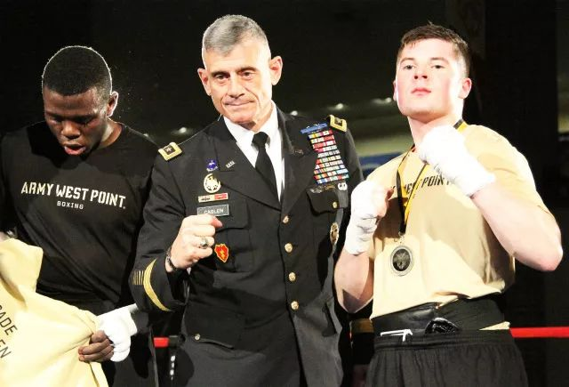
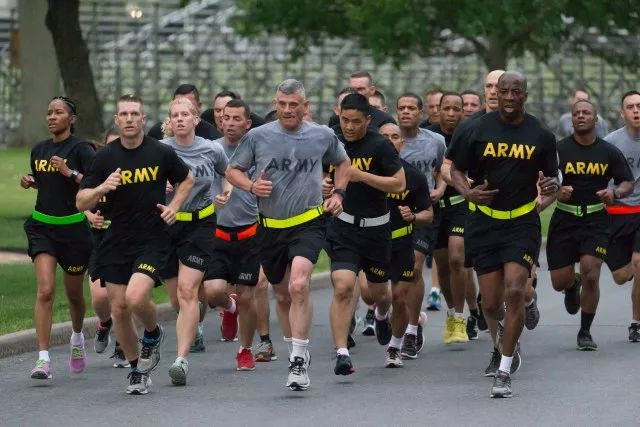

##  西点校长，火车头一样的存在

原创： 杜莫 [趣文刷图美军]()**
点击上方“趣文刷图美军”可以订阅哦

给力的机车头
提要

俗话说，火车跑得快全靠车头带。今天我们把西点的领导们拉出来遛一遛，看看他们这车头的性能到底怎么样。这是西点系列的第4弹，前3期分别讲述了西点草创、工程起家、名将发家的动人故事，需要补课的同学到文后报到。

**给校长正个名**

这已经是我们西点系列的第4弹了，我们一直称呼西点老大为“校长”，严格说，这是错误的用法，因为西本名“美国军事学院”，因此我们应称呼西点老大为“院长”而不是“校长”，但鉴于普通话圈子里几乎不出现西点本名，一般都叫“西点军校”，自然叫“校长”就很顺口，我们就将错就错吧，院长也好、校长也罢，对西点来说并无多大分别。

西点拳击赛场中的校长卡斯伦中将

西点名为“美国军事学院”，听上去似乎是全军的院校，其实西点还是陆军的，直至归陆军参谋长领导。有没有同学表示疑惑，都第4期了，“陆军司令”就没出现过，一直是参谋长出面，怎么回事？其实，因为三军司令是总统，所以陆军并没有司令一职，从1903年开始，参谋长就是陆军最大的军官。西点是陆军的直接汇报单位，校长军衔是中将，直接向陆军军官老大汇报工作，西点校长地位还是很高的。

卡斯伦校长和陆军参谋长米莱上将在西点赛场

近几十年来，西点校长的任期一般是5年，现任校长是小罗伯特·卡斯伦中将，是第59任校长，他是2013年当校长的，今年就要到站下车了。二战后，出身工程兵的校长很少了，卡斯伦也不是工程兵出身，而是步兵，主要在作战领域工作，但他也握有工科硕士学位，同时也是工商管理硕士。911时，他是五角大楼的一个副处长，伊拉克战争、阿富汗战争他都参加过。卡斯伦当过西点学员队司令，他是第4位当过学员队司令的校长。

卡斯伦在伊拉克时，迎接时任参联会主席马伦上将视察

西点并没有任何副校长，还有两位“校领导”，一位主持学术委员会，负责学术方面，称为教务长，有点像教导主任；另一位是负责学员队和军事，可以称为学员大队大队长，但为了避免让人误以为比由学员担任的学员旅长还小，本号君经常使用“学员队司令”的叫法，严格说还是“学员大队长”要更准确点。这两位校领导都比校长低两级，是准将。

西点三位校领导出席“部队碗”橄榄球赛前新闻发布会

校长还有类似部队的参谋机构，教务长领导着13个系，学员大队长领导着3个系，还有若干中心，校长的参谋长、系和中心的主任一般都是上校，西点文武教职员工总共也就500多，是学员人数的八分之一左右，教员占了大部分，行政管理人员并不多。西点的组织架构和美国一般大学有些相似，再加以军事化，也有监事会，主要起监督作用，成员由国会、总统任命。

卡斯伦校长带着他的参谋教教职员工晨练

早期的西点主要干工程，校长也是工程兵出身，是内行领导内行。那现在的校长是作战部队的，就是外行领导内行吗？非也！因为西点“四项基本大纲”，三项没人敢说他是外行，军事方面看过他的经历恐怕没人敢质疑，荣誉方面能升到中将也没人干随便说不，体育方面他也不在话下，他在西点学员时期是校橄榄球队中锋，只有学术他可能钻研不深，3:1胜，他还是要算内行。

卡斯伦校长作为东道主欢迎参加校长年会的其他校长

即使放在普通大学，卡斯伦也不算外行，美军将领退役后当普通大学校长的不少，当过西点校长，当一般美国大学校长没什么问题。美国的大学校长职责定位和我们的不太一样，并不以学术带头人的方式领导全校，更多体现在领导、管理方面，具体点就是和学员在一起，给他们作榜样，给他们鼓劲加油，怎么研究学术那就是学员自己的事了，名副其实的车头。

卡斯伦校长在球赛开场时带领队伍出场

**  在学员身边的校长  **

我上了几年大学，除了全校大会，校长那么高高在上，怎么见得到。但西点校长基本每天都在学员眼前晃，他的住宅就在校大楼旁边的路边，另两位校领导也一样，学员大队长和教务长就住校长隔壁。

学员们在广场操练，后面就是校长住宅

校长住宅内部
卡斯伦校长邀请客人到家中小坐

学员拉练路过学员大队长住宅

拉练回家终点就是校长住宅，门口已经要被挤爆了

**  火车头要开动了  **

不少同学看过HBO的《兄弟连》，剧中有一任连长每天躲在散兵坑中，连队官兵都嘲笑他“散兵坑诺曼”，这样的人没人觉得他是好领导。卡斯伦中将出生于1953年，今年已经快65岁了，大家别以为都这把年纪了，贵为中将，又马上退休了，每天养尊处优就行了。如果卡斯伦中将自己也是这么想，就别当校长了，也当不了，实际上他样样都不落下，哪怕是是艰苦的20公里全装拉练，他也同等待遇参加，大马力的车头。

新生第一次全装20公里拉练
卡斯伦校长带着他的参谋们同样参加

完成20公里越野跑回的校长和拉练出发的学员们击掌
别以为校长短袖就是偷懒，越野跑回和拉练出发是同时的

校长已经在终点等你们了

军士长们来合练，校长怎能认怂
看校长表情，对比年轻人的，就知道校长是狠角色

有这样的校长，谁还好意思偷懒认怂啊，人家65的人了都还在拼，18岁的你还偷懒，脸往哪搁。这样的校长就是榜样，用身教告诉西点学员，当你下了连队，是要当“散兵坑诺曼”，还是要像校长一样身先士卒、从不认怂。全校的种类活动，卡斯伦中将都出场给学员们鼓励打气，胜利了为他们欢呼，勤奋的车头。

卡斯伦校长带领西点人纽约5公里跑

西点和海军爱国者比赛中，卡斯伦校长到场互动

西点女子篮球队比赛，卡斯伦校长带领观众加油

平衡能力比啦啦队还好的校长，让啦啦队怎么混

怎么样，小伙，不服吗？
赛前，卡斯伦校长和众人互动俯卧撑

西点在”部队碗“赛事获胜，卡斯伦校长与队员拥抱庆祝

西点集体活动，不仅仅是校长，另两位校领导也不落下，虽然他们分工不同，但全校活动经常都参加，并不严格遵循分工，可能因为都是校领导，难道这也是西点传统？

别以为教务长只管学术，赛场上女准将照做俯卧撑

教务长在西点欢迎学员20公里全装拉练归来
虽然军事归学员大队长管，但教务长也积极参与

学员大队长忘情庆祝

**  礼仪场合的校长  **

荣誉是西点一大教育内容，自然少不了各种奖项鼓励先进，礼仪活动也很多，再加上比赛开场队列式，各类礼仪仪式也是繁多，作为校长，又没有副校长代劳，而且有的奖就是以校长名义颁授的，并不适合由其他校领导代劳，礼仪场合经常是校长亲自出马。

卡斯伦校长为优秀教员、教练们颁奖

卡斯伦校长、教务长、学员大队长一起颁发”校长奖“

卡斯伦校长参加学员晚会

卡斯伦校长陪同布什总统检阅西点学员

卡斯伦校长教务长与国防部、陆军等领导为学员颁发毕业状

结语

能拿诺贝尔奖固然好，但西点最需要的是优秀的军官，去领导各层级各领域的陆军部队，西点的培养目标就是这么明确，西点的校长也是按这个目标选配的，不要求精深的学术造诣，而要榜样的力量，身体力行告诉学员，该如何领导部队，是要当“散兵坑诺曼”？还是要身先士卒、从不认怂？当然，历史造就美国人平民化的一面，也造就了美国人直白夸张表达感情的性格特点，不能移植，但这种领导方式值得沉思细品。

快上车，校长带你飞

[  点击    西点系列第一弹    草创西点、校园风光](http://mp.weixin.qq.com/s?__biz=MzUxOTU3MjMwOA==&mid=2247484063&idx=1&sn=52dd2cacfacfd623bee925649fedb68a&scene=21#wechat_redirect)

[  点击    西点系列第二弹    工程起家、发家致富](http://mp.weixin.qq.com/s?__biz=MzUxOTU3MjMwOA==&mid=2247484082&idx=1&sn=c75a5dc845b534a713bca5e5a15d8f2a&scene=21#wechat_redirect)

[  点击    西点系列第三弹    开挂名将，扬名世界](https://mp.weixin.qq.com/s?__biz=MzUxOTU3MjMwOA==&mid=2247484117&idx=1&sn=53e98a567e1391b25b14d522556396d4&scene=21#wechat_redirect)

我们下期再见！
西点的前生后世
美图趣文

请长按二维码关注我们

在看